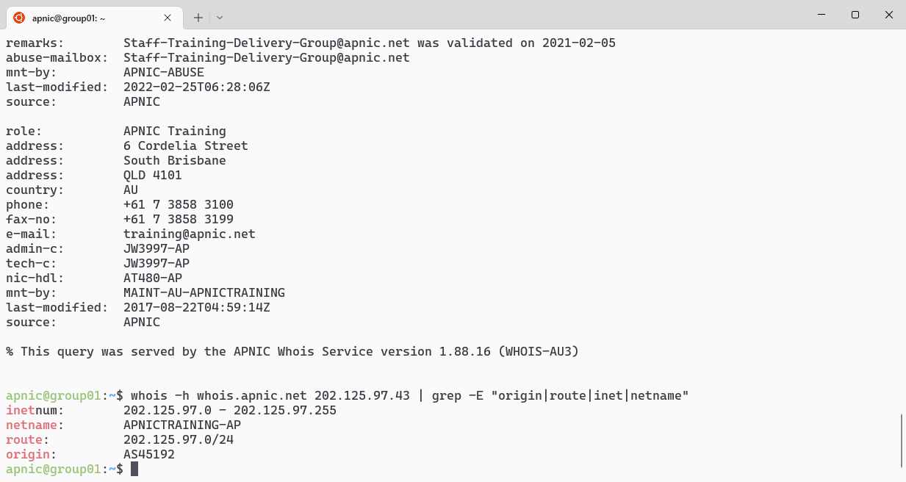

# LAB: BGPalerter

##Part-1: Installing BGPalerter  
BGPalerter is a BGP monitoring tool, developed by Massimo Candela of NTT. It can analyse streams of BGP data from various sources. It is pre-configured for real-time detection of visibility loss, RPKI invalid announcements, hijacks, and more.

BGPalerter allows monitoring of real-time routing conditions such as:

* any monitored prefixes loses visibility;
* any monitored prefixes is hijacked;

For more information refer to [https://github.com/nttgin/BGPalerter]()

The steps to complete this section are:

* SSH to the server
* Update software
* Install required software
* Download BGPalerter
* Configure BGPalerter
* Start BGPalerter

**Login Details**
 
* Username `apnic` and password `training`.

**Lab Setup**

For this lab, we will use [BGPalerter](https://github.com/nttgin/BGPalerter).

1. Login to the server (SSH using the username and password given above), where **X** is your group number:

		ssh apnic@192.168.30.X
	
	NOTE: Type `yes` if asked about wanting to continue connecting

    Password = `training`
		
2. Update the repository

		sudo apt update && sudo apt -y dist-upgrade
		
	
	
3. Install the dependencies:

			sudo apt-get install -y wget whois

	
	
4. Confirm prefix and ASN to monitor

		whois -h whois.apnic.net 202.125.97.43
		whois -h whois.apnic.net AS45192
		whois -h whois.apnic.net 202.125.97.43 | grep -E "origin|route|inet|netname"
		
	

5. Use team Cymru's feed

		whois -h whois.cymru.com 202.125.97.43
		whois -h whois.cymru.com as45192	
		
	To change the output format
	
		whois -h whois.cymru.com " -p 202.125.97.43"
		whois -h whois.cymru.com " -v as45192"

	

6. Create a Non-Privileged User for BGPalerter

		sudo adduser --disabled-password bgpalerter
		
	
		
	Make a directory to store the files
	
		sudo mkdir -p /opt/bgpalerter
		sudo chown bgpalerter:bgpalerter /opt/bgpalerter
		
	Change user context to bgpalerter
		
		sudo su bgpalerter
		cd /opt/bgpalerter
		
	
			

7. Download BGPalerter and sample config files 
		
		wget -O bgpalerter \\ 
		https://github.com/nttgin/BGPalerter/releases/latest/download/bgpalerter-linux-x64
		
	
		
		wget -O config.yml \\
		https://raw.githubusercontent.com/nttgin/BGPalerter/main/config.yml.example
		chmod 700 bgpalerter
		
	
	

8. Review the settings in the configuration file.

		cat config.yml
		
	To view the main section headings
	
		grep -in "##" -A 2 config.yml

	
	
	To view enabled features in the config file
	
		grep -in -v "^#" -A 2 config.yml
		
	To remove blank lines
	
		grep -in -Ev "^#|^$" config.yml
		
			

9. Start BGPalerter

		ls -lash
		./bgpalerter -h
		./bgpalerter -v
		
	
		
	To test bgpalerter is configured correctly
	
		./bgpalerter -t

	Answer the configuration wizard questions similar to:
	
	The file prefixes.yml cannot be loaded. Do you want to auto-configure BGPalerter? **Yes**  
	Which Autonomous System(s) you want to monitor? (comma-separated, e.g., 2914,3333) **45192**  
	Do you want to be notified when your AS is announcing a new prefix? **Yes**  
	Do you want to be notified when a new upstream AS appears in a BGP path? **Yes**  
	Do you want to be notified when a new downstream AS appears in a BGP path? **Yes**  

	
	
	**NOTE**: Press `ctrl+c` to quit bgpalerter

10. View the created prefix file.

		ls -lash
		less prefixes.yml

	

	**NOTE**: Press `q` to quit the output

11. View the created log files 

		ls logs/
		cat logs/report*
		wc -l logs/reports*
		
	To trim the log report
	
		cut -d " " -f 3,5,6,7,8 logs/reports-*.log | wc -l
		cut -d " " -f 3,5,6,7,8 logs/reports-*.log | sort | uniq
		
	
				
	
12. Delete test files 

		rm -R logs/
		rm pre*
		rm *.pid

13. Generate prefix file (Use your own if you know them)

		./bgpalerter generate -h
		
	
		
	Create the file for one prefix
	
		./bgpalerter generate -m -p 202.125.97.0/24 -o prefixes.yml
		cat prefixes.yml
		
	
		
	Create the file for an Autonomous System Number (ASN)
	
		./bgpalerter generate -a 45192 -o prefixes.yml
		cat prefixes.yml

	
	
	**Note:** Refer to this video for more details [https://youtu.be/ajJifg_SVBQ?t=31]()

	
14. **OPTIONAL** Find an ASN that may be hijacked and build prefixes.yml. Open a browser and view [https://bgpstream.crosswork.cisco.com]()

	

	**NOTE:** If the event ID is known, you can use BGPplay to replay the event. For example for event 297179 browse to [https://bgpstream.crosswork.cisco.com/event/297179]()
    
15. Start bgpalerter in the background and No Hangup if terminal closes.

		nohup ./bgpalerter &

	To stop the process
	
		jobs -l
		kill -9 <pid>
    

For more detail refer to:

* To run as a service and autostart - [https://github.com/nttgin/BGPalerter/blob/main/docs/linux-service.md]()
* For details about alerts -  [https://www.digitalocean.com/community/tutorials/how-to-monitor-bgp-announcements-and-routes-using-bgpalerter-on-ubuntu-18-04#step-4-interpreting-bgpalerter-alerts]()
* [https://www.namex.it/bgpalerter-a-tool-for-monitoring-your-bgp/]()

---
**End of Lab**

---