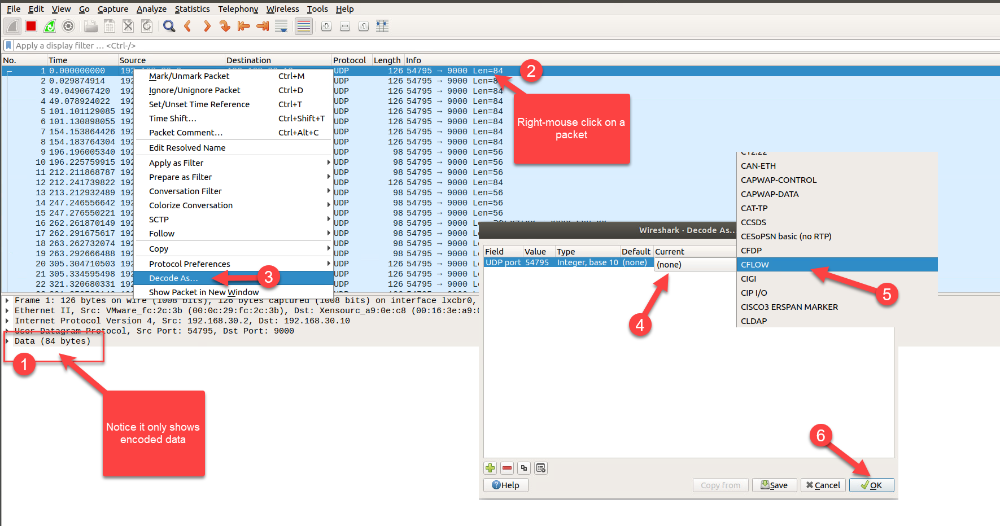

###**Install Akvorado**

Akvorado is a software tool designed for collecting, enriching, and visualizing network flows. It functions by receiving network flows from routers using protocols like NetFlow v9, IPFIX, or sFlow. Once these flows are received, Akvorado enriches them with additional information such as GeoIP and interface names. These enriched flows are then exported to Apache Kafka, a distributed queue system, and subsequently stored in ClickHouse, a column-oriented database. Akvorado also features a web frontend that allows users to run queries and analyze the collected data.

For more detailed information, you can refer to the Akvorado GitHub repository [https://github.com/akvorado/akvorado](https://github.com/akvorado/akvorado) and Vincent Bernat's blog [https://vincent.bernat.ch/en/blog/2022-akvorado-flow-collector](https://vincent.bernat.ch/en/blog/2022-akvorado-flow-collector). 

In this step, we will install the required software to use Akvorado which is a tool to generate per-AS (Autnomous System) traffic graphs from NetFlow/sFlow records. 

The steps to complete this section are:
* Update software
* Install required software
* Installing Java and Zookeeper
* Setting up Kafka
* Installing ClickHouse: Used for storing network flow data.
* Installing Akvorado: Downloading and configuring Akvorado itself.
* Configure BGP on a Cisco device
* Configuring SNMP on Network Devices: Necessary for Akvorado to receive network flow data.
* Enable flows on router
* Generate traffic

- OPTIONAL - If not already connected to Group30 server, open a terminal window by pressing **ctrl+alt+t** and ssh to the server that will be used to install Akvorado.

    ```
    ssh apnic@192.168.30.10
    ```

    NOTE: Type `yes` if asked about wanting to continue connecting

    Password = `training`

- Update the software repository for Ubuntu

    ```
    sudo apt-get update && sudo apt-get -y dist-upgrade
    ```

    Password = `training`

- Install required software

    ```
    sudo apt install -y wget nano git default-jre apt-transport-https ca-certificates dirmngr
    ```

- Download and extract Kafka.

    ```
    wget https://dlcdn.apache.org/kafka/3.6.1/kafka_2.13-3.6.1.tgz
    ```

    NOTE: For the latest version refer to [https://kafka.apache.org/quickstart](https://kafka.apache.org/quickstart)

    ```
    tar -xzf kafka_2.13-3.6.1.tgz
    cd kafka_2.13-3.6.1
    ```

- Configure Kafka with ZooKeeper and create a topic to store the events.

    Start the ZooKeeper service
    
    ```
    /home/apnic/kafka_2.13-3.6.1/bin/zookeeper-server-start.sh /home/apnic/kafka_2.13-3.6.1/config/zookeeper.properties
    ```

    Open another terminal window by pressing **ctrl+alt+t** and ssh to the server that will be used to install Akvorado.

    ```
    ssh apnic@192.168.30.10
    ```

    Password = `training`

    Start the Kafka broker service
    
    ```
    /home/apnic/kafka_2.13-3.6.1/bin/kafka-server-start.sh /home/apnic/kafka_2.13-3.6.1/config/server.properties
    ```

    Open another terminal window by pressing **ctrl+alt+t** and ssh to the server that will be used to install Akvorado.

    ```
    ssh apnic@192.168.30.10
    ```

    Password = `training`

    Create a Kafka topic
    
    ```
    /home/apnic/kafka_2.13-3.6.1/bin/kafka-topics.sh --create --topic quickstart-events --bootstrap-server localhost:9092
    ```

    Describe a Kafka topic
    
    ```
    /home/apnic/kafka_2.13-3.6.1/bin/kafka-topics.sh --describe --topic quickstart-events --bootstrap-server localhost:9092
    ```

    Type in `exit` to disconnect from the akvorado server. 
    
    Type in `exit` to close this terminal window.

    Return to the terminal window with the Kafka broker service running.

    Press `ctrl+c` to close the service.

    Type in `exit` to disconnect from the akvorado server. 
    
    Type in `exit` to close this terminal window.

    Return to the terminal window with the Zookeeper service running.

    Press `ctrl+c` to close the service.

- Create a user to run the Kafka service

    ```
    sudo useradd -r -s /sbin/nologin kafka
    ```

- Move the Kafka folder to a different location that the home folder of the current user called apnic

    ```
    cd ~
    sudo mv kafka_*/ /usr/local/kafka
    ```

- Create folders to store the data directory and log files

    ```
    sudo mkdir -p /usr/local/kafka/tmp/zookeeper
    sudo mkdir -p /usr/local/kafka/kafka-logs
    ```
    Change the owner of the kafka folder to the kafka user
  
    ```
    sudo chown kafka:kafka -R /usr/local/kafka
    ```

- Update the dataDir variable in the zookeeper.properties file to the new folder location.

    ```
    sudo sed -i 's/^dataDir=.*$/dataDir=\/usr\/local\/kafka\/tmp\/zookeeper/' /usr/local/kafka/config/zookeeper.properties
    ```

- Update the dataDir variable in the server.properties file to the new folder location.

    ```
    sudo sed -i 's|^log.dirs=.*$|log.dirs=/usr/local/kafka/kafka-logs|' /usr/local/kafka/config/server.properties
    ```

- Setup the Zookeeper and Kafka services to run on start using systemd services.

    >[!Warning] The paste function in this environment has issues with latency and may skip or add characters. To avoid this issue, the config files can be downloaded from github.

    Download the systemd file for Zookeeper service to restart and move to the systemd directory.

    ```
    wget -O ~/zookeeper.service https://raw.githubusercontent.com/githubapnic/labs/main/akvorado/configs/zookeeper.service
    sudo mv ~/zookeeper.service /etc/systemd/system/zookeeper.service
    ```

    Below is the example systemd file for Zookeeper service to restart. 

    ```Powershell-nocode
    [Unit]
    Description=Bootstrapped Zookeeper
    After=syslog.target network.target

    [Service]
    Type=simple
    User=kafka
    Group=kafka
    ExecStart=/usr/local/kafka/bin/zookeeper-server-start.sh /usr/local/kafka/config/zookeeper.properties
    ExecStop=/usr/local/kafka/bin/zookeeper-server-stop.sh

    [Install]
    WantedBy=multi-user.target
    ```

    Download the systemd file for Kafka service to restart and move to the systemd directory.

    ```
    wget -O ~/kafka.service https://raw.githubusercontent.com/githubapnic/labs/main/akvorado/configs/kafka.service
    sudo mv ~/kafka.service /etc/systemd/system/kafka.service
    ```

    Below is the example systemd file for Kafka service to restart. 

    ```Powershell-nocode
    [Unit]
    Description=Apache Kafka
    Requires=zookeeper.service
    After=zookeeper.service

    [Service]
    Type=simple
    User=kafka
    Group=kafka
    ExecStart=/usr/local/kafka/bin/kafka-server-start.sh /usr/local/kafka/config/server.properties
    ExecStop=/usr/local/kafka/bin/kafka-server-stop.sh

    [Install]
    WantedBy=multi-user.target
    ```

- Enable the Zookeeper and Kafka services and start the services.

    ```
    sudo systemctl daemon-reload
    sudo systemctl enable zookeeper.service
    sudo systemctl enable kafka.service
    sudo systemctl start zookeeper.service
    sudo systemctl start kafka.service
    ```

    Check the Zookeeper status
    
    ```
    sudo systemctl status zookeeper
    ```

    Note: press `q` to quit

    Check the Kafka status

    ```
    sudo systemctl status kafka
    ```

    Note: press `q` to quit

- Install clickhouse software

    Setup the GPG keys
    
    ```
    GNUPGHOME=$(mktemp -d)
    sudo GNUPGHOME="$GNUPGHOME" gpg --no-default-keyring --keyring /usr/share/keyrings/clickhouse-keyring.gpg --keyserver hkp://keyserver.ubuntu.com:80 --recv-keys 8919F6BD2B48D754
    sudo rm -r "$GNUPGHOME"
    sudo chmod +r /usr/share/keyrings/clickhouse-keyring.gpg
    ```

    Add the download details to the apt source list and update the software repository

    ```
    echo "deb [signed-by=/usr/share/keyrings/clickhouse-keyring.gpg] https://packages.clickhouse.com/deb stable main" | sudo tee /etc/apt/sources.list.d/clickhouse.list
    sudo apt-get update
    ```

    Install Clickhouse without being prompted for the password

    ```
    sudo DEBIAN_FRONTEND=noninteractive apt-get install -y clickhouse-server clickhouse-client
    ```

    Update the blank password to `training`

    ```
    sudo sed -i 's|<password></password>|<password>training</password>|g' /etc/clickhouse-server/users.xml
    ```

    >[!Hint] Find out more details about user roles [https://clickhouse.com/docs/en/operations/settings/settings-users](https://clickhouse.com/docs/en/operations/settings/settings-users)

- Start the service and test a connection to it.

    ```
    sudo service clickhouse-server start
    clickhouse-client --password training
    ```

    Note: Type `exit` to close the client connection

- Download the Akvorado. To find the latest version refer to [https://github.com/akvorado/akvorado/releases](https://github.com/akvorado/akvorado/releases)

    ```
    wget https://github.com/akvorado/akvorado/releases/download/v1.9.3/akvorado
    ```

    Make it executable
    ```
    chmod +x akvorado
    ```

    Move it into a different directory than the current users home folder.

    ```
    sudo mv akvorado /usr/local/bin/akvorado
    ```

- Create a user to run Akvorado

    ```
    sudo useradd -r -s /sbin/nologin akvorado
    ```

- Create the akvorado.yaml file that holds some configuration options.

    >[!Warning] The paste function in this environment has issues with latency and may skip or add characters. To avoid this issue, the config files can be downloaded from github.

    Download the akvorado configuration yaml files and move to the correct directory.

    ```
    wget -O ~/akvorado.yaml https://raw.githubusercontent.com/githubapnic/labs/main/akvorado/configs/akvorado.yaml
    sudo mkdir /etc/akvorado
    sudo mv ~/akvorado.yaml /etc/akvorado/akvorado.yaml
    ```

    Below is the example configuration for the akvorado.yaml file. 


```Powershell-nocode
---
reporting:
  logging: {}
  metrics: {}
http:
  listen: 0.0.0.0:8081
  profiler: false
clickhouse:
  servers:
    - 127.0.0.1:9000
  database: default
  password: training
  kafka:
    topic: flows
    brokers:
      - 127.0.0.1:9092
    version: 3.6.1
    consumers: 1
  resolutions:
    - interval: 0s
      ttl: 360h0m0s
    - interval: 1m0s
      ttl: 168h0m0s
    - interval: 5m0s
      ttl: 2160h0m0s
    - interval: 1h0m0s
      ttl: 8640h0m0s
  max-partitions: 50
  asns: { 135536: R3 Corporation }
  networks: null
  orchestrator-url: ""
kafka:
  topic: flows
  brokers:
    - 127.0.0.1:9092
  version: 3.6.1
  topic-configuration:
    num-partitions: 1
    replication-factor: 1
    config-entries: {}
inlet: !include "inlet.yaml"
console: !include "console.yaml"
#demoexporter: []
```

>[!Knowledge] For more detail on the yaml configuration refer to:
* [https://demo.akvorado.net/docs/configuration](https://demo.akvorado.net/docs/configuration)
* [https://github.com/akvorado/akvorado/tree/main/config](https://github.com/akvorado/akvorado/tree/main/config)

Download the inlet.yaml file that holds the inlet configuration options and move to the correct directory.

```
wget -O ~/inlet.yaml https://raw.githubusercontent.com/githubapnic/labs/main/akvorado/configs/inlet.yaml
sudo mv ~/inlet.yaml /etc/akvorado/inlet.yaml
```

Below is the example configuration for the inlet.yaml file. 


```Powershell-nocode
---
# inlet:
  - reporting:
      logging: {}
      metrics: {}
    http:
      listen: 0.0.0.0:8082
      profiler: false
    flow:
      inputs:
        - decoder: netflow
          listen: 0.0.0.0:2055
          type: udp
          workers: 6
        - decoder: sflow
          listen: 0.0.0.0:6343
          type: udp
          workers: 6
      rate-limit: 0
    snmp:
      cache-duration: 30m0s
      cache-refresh: 1h0m0s
      cache-check-interval: 2m0s
      cache-persist-file: /var/lib/akvorado/snmp_cache
      poller-retries: 1
      poller-timeout: 1s
      poller-coalesce: 10
      workers: 10
      communities:
        192.168.30.0/24: training
      security-parameters: {}
    geoip:
      asn-database: /usr/share/GeoIP/GeoLite2-ASN.mmdb
      geo-database: /usr/share/GeoIP/GeoLite2-Country.mmdb
      optional: true
    kafka:
      topic: flows
      brokers:
        - 127.0.0.1:9092
      version: 3.6.1
      flush-interval: 10s
      flush-bytes: 104857599
      max-message-bytes: 1000000
      compression-codec: none
      queue-size: 32
    core:
      workers: 6
      exporter-classifiers:
        - ClassifySiteRegex(Exporter.Name, "^([^-]+)-", "$1")
        - ClassifyRegion("Australia")
        - ClassifyTenant("APNIC")
        - ClassifyRole("training")
      interface-classifiers:
        - |
          # ClassifyConnectivityRegex(Interface.Description, "^(?i)(transit|pni|ppni|ix):? ", "$1") &&
          # ClassifyProviderRegex(Interface.Description, "^\\S+?\\s(\\S+)", "$1") &&
          ClassifyExternal()
        - ClassifyConnectivityRegex(Interface.Description,"^(?i)(ge|Gigabit):? ", "$1") &&
          ClassifyInternal()
      classifier-cache-size: 1000
      default-sampling-rate: {}
      override-sampling-rate: 10
      asn-providers:
        - flow
        - geoip
```
   
Download the console.yaml file that holds the console configuration options and move to the correct directory.

```
wget -O ~/console.yaml https://raw.githubusercontent.com/githubapnic/labs/main/akvorado/configs/console.yaml
sudo mv ~/console.yaml /etc/akvorado/console.yaml
```

Below is the example configuration for the inlet.yaml file. 

```Powershell-nocode
---
# console:
  - reporting:
      logging: {}
      metrics: {}
    http:
      listen: 0.0.0.0:8083
      profiler: false
    default-visualize-options:
      start: 6 hours ago
      end: now
      filter: InIfBoundary = external
      dimensions:
        - SrcAS
    homepage-top-widgets:
      - src-as
      - src-port
      - protocol
      - src-country
      - etype
      - exporter
    clickhouse:
      servers:
        - 127.0.0.1:9000
      database: default
      password: training
    database:
      driver: sqlite
      dsn: /var/lib/akvorado/console.sqlite
```


Set the file ownership to akvorado user account

```
sudo chown -R akvorado:akvorado /etc/akvorado
```

Check if the yaml file is formatted correctly

```
akvorado orchestrator /etc/akvorado/akvorado.yaml --dump --check
```

>[!Warning] If there is an error, read the message as it will indicate how to fix the problem. If there is no issue, it will output the above configuration ending with **demoexporter: []**

- Create the directories and folders that are referenced in the akvorado.yaml file

    ```
    sudo mkdir /var/lib/akvorado
    sudo mkdir /usr/share/GeoIP
    sudo touch /var/lib/akvorado/console.sqlite
    sudo touch /var/lib/akvorado/snmp_cache
    sudo chown -R akvorado:akvorado /var/lib/akvorado
    ```

- Setup the Orchestrator, Inlet and Console services to run on start using systemd services.

    Enable Orchestrator service to restart

    ```
    sudo tee /etc/systemd/system/akvorado-orch.service << 'EOF'
    [Unit]
    Description=Akvorado Orchestrator
    After=snap.lxd.daemon.service
    
    [Service]
    Type=simple
    Restart=on-failure
    RestartSec=15
    User=akvorado
    ExecStart=akvorado orchestrator /etc/akvorado/akvorado.yaml
    
    [Install]
    WantedBy=multi-user.target
    EOF
    ```

    Enable Inlet service to restart

    ```
    sudo tee /etc/systemd/system/akvorado-inlet.service << 'EOF'
    [Unit]
    Description=Akvorado Inlet
    After=akvorado-orch.service
    Requires=akvorado-orch.service
    
    [Service]
    Type=simple
    Restart=on-failure
    RestartSec=15
    User=akvorado
    ExecStart=akvorado inlet http://127.0.0.1:8081

    [Install]
    WantedBy=multi-user.target
    EOF
    ```

    Enable Console service to restart

    ```
    sudo tee /etc/systemd/system/akvorado-console.service << 'EOF'
    [Unit]
    Description=Akvorado Console
    After=akvorado-orch.service
    Requires=akvorado-orch.service
    
    [Service]
    Type=simple
    Restart=on-failure
    RestartSec=15
    User=akvorado
    ExecStart=akvorado console http://127.0.0.1:8081
    
    [Install]
    WantedBy=multi-user.target
    EOF
    ```

- Enable the Orchestrator, Inlet and Console services and start the services.

    ```
    sudo systemctl daemon-reload
    sudo systemctl enable akvorado-orch.service
    sudo systemctl enable akvorado-inlet.service
    sudo systemctl enable akvorado-console.service
    sudo systemctl start akvorado-orch
    sudo systemctl start akvorado-inlet
    sudo systemctl start akvorado-console
    ```

    Check the Orchestrator status
    
    ```
    sudo systemctl status akvorado-orch
    ```

    Note: press `q` to quit

    Check the Inlet status
    
    ```
    sudo systemctl status akvorado-inlet
    ```

    Note: press `q` to quit

    >[!Warning] This will not start until the GeoIP files have been downloaded.

    Check the Console status
    
    ```
    sudo systemctl status akvorado-console
    ```

    Note: press `q` to quit

- Setup GeoIP by downloading **GeoLite2-ASN.mmdb** and **GeoLite2-Country.mmdb**

    Download the ASN file

    ```
    wget https://share.walrustech.org/GeoLite2-ASN.mmdb
    ```

    Download the Country file

    ```
    wget https://share.walrustech.org/GeoLite2-Country.mmdb
    ```

    >[!Hint] To download the latest versions, refer to [https://dev.maxmind.com/geoip/geolite2-free-geolocation-data?lang=en](https://dev.maxmind.com/geoip/geolite2-free-geolocation-data?lang=en)

    Move the files to the correct location and assign akvorado as the owner.

    ```
    sudo mkdir -p /usr/share/GeoIP/
    sudo mv GeoLite2-ASN.mmdb /usr/share/GeoIP/GeoLite2-ASN.mmdb
    sudo mv GeoLite2-Country.mmdb /usr/share/GeoIP/GeoLite2-Country.mmdb
    sudo chown -R akvorado:akvorado /usr/share/GeoIP/
    ```

 - Check the Orchestrator status
    
    ```
    sudo systemctl status akvorado-orch
    ```

    Password = `training`

    Note: press `q` to quit

 - Check the Inlet status
    
    ```
    sudo systemctl status akvorado-inlet
    ```

    Note: press `q` to quit

 - Check the Console status
    
    ```
    sudo systemctl status akvorado-console
    ```

    Note: press `q` to quit

- Optional - Confirm the udp listening ports

    ```
    sudo ss -planu
    ```

- Optional - View the **syslog** for errors

    ```
    sudo tail -f /var/log/syslog
    ```

    Note: press **ctrl+c** to stop the log output.

##**Configure a Cisco device** 

Requirements :

* Configure the flows (netflow/sflow/ipfix) that will be sent to the collector. Refer to the documentation for configuration example: [https://demo.akvorado.net/docs/operations#router-configuration](https://demo.akvorado.net/docs/operations#router-configuration)
* The routers that send flow should be allowed to be snmp polled by the collector. (snmpwalk from the collector should be enough to validate that )

###**Step 1 - Interface and BGP Configuration for R1**

- Select @lab.VirtualMachine(IOS-R1).SelectLink from the Resources tab.

- Log into R1 and enter the Privileged EXEC mode. 

    To enter Privileged EXEC mode type the following

    ```
    enable
    ```


- OPTIONAL - Configure the R1 interfaces. Skip this if already configured in a previous section.

    ```
    enable
    conf t
      int gi1
        description link to Remote syslog
        ip address 192.168.30.1 255.255.255.0
        no shutdown
      int gi2
        description link to R2
        ip address 172.16.0.1 255.255.255.252
        no shutdown
      int gi3
        description link to R3
        ip address 172.16.0.5 255.255.255.252
        no shutdown
      int Loopback 0
        ip address 61.45.249.1 255.255.255.255
      exit
    exit
    ```

- Configure eBGP with R2.

    ```
    conf t
    router bgp 135534
      neighbor 172.16.0.2 remote-as 135535
      neighbor 172.16.0.2 description peer with R2
      neighbor 172.16.0.2 activate
    exit
    exit
    ```

- Configure eBGP with R3.

    ```
    conf t
    router bgp 135534
      neighbor 172.16.0.6 remote-as 135536
      neighbor 172.16.0.6 description peer with R3
      neighbor 172.16.0.6 activate
    exit
    exit
    ```

- Advertise a public IP block from R1. 

    ```
    conf t
    router bgp 135534
      address-family ipv4 unicast
      network 61.45.249.0 mask 255.255.255.0
    exit
    ! ip route 61.45.249.0 255.255.255.0 null0
    end
    ```

- Generate some traffic from R1:

    Ping the AKVORADO server

    ```
    ping 192.168.30.10 repeat 3
    ```

    Ping R2
    
    ```
    ping 172.16.0.2 size 18000 repeat 1000
    ```

- Select @lab.VirtualMachine(IOS-R2).SelectLink from the Resources tab.

- Log into R2 and enter the Privileged EXEC mode. 

    To enter Privileged EXEC mode type the following

    ```
    enable
    ```

- OPTIONAL - Configure the router interfaces for R2. Skip this if already configured in a previous section.

    ```
    enable
    conf t
      int gi1
        description link to Remote syslog
        ip address 192.168.30.2 255.255.255.0
        no shutdown
      int gi2
        description link to R1
        ip address 172.16.0.2 255.255.255.252
        no shutdown
      int gi3
        description link to R3
        ip address 172.16.0.9 255.255.255.252
        no shutdown
      int Loopback 0
        ip address 61.45.250.1 255.255.255.255
        no shutdown
    end
    ```

- To enable SNMP type the following commands: 

    ```
    enable
    conf t
      access-list 99 permit 192.168.30.0 0.255.255.255
      snmp-server community training ro 99
    end
    wr
    ```

-  Configure eBGP with R1. 

    ```
    conf t
    router bgp 135535
      neighbor 172.16.0.1 remote-as 135534
      neighbor 172.16.0.1 description peer with R1
      neighbor 172.16.0.1 activate
    exit
    exit
    ```

- Configure eBGP with R3.

    ```
    conf t
    router bgp 135535
      neighbor 172.16.0.6 remote-as 135536
      neighbor 172.16.0.6 description peer with R3
      neighbor 172.16.0.6 activate
    exit
    exit
    ```

- Advertise a valid IP prefix from R2.

    ```
    conf t
    router bgp 135535
      address-family ipv4 unicast
      network 61.45.250.0 mask 255.255.255.0
    exit
    ! ip route 61.45.250.0 255.255.255.0 null0
    exit
    ```

- To update the router configuration to export flows, type the following commands: 

    ```
    enable
    config t
    !
    flow exporter AKVORADO
      destination 192.168.30.10
      source GigabitEthernet1
      transport udp 2055
    !
    flow monitor IPV4-AKVORADO
      exporter AKVORADO
      record netflow ipv4 original-input
      cache timeout active 300
      cache entries 16384
    !
    flow monitor IPV6-AKVORADO
      exporter AKVORADO
      record netflow ipv6 original-input
      cache timeout active 300
      cache entries 16384
    !    
    sampler AKVORADO-SM
        mode random 1 out-of 10000
    !
    interface GigabitEthernet2
      ip flow monitor IPV4-AKVORADO input
      ip flow monitor IPV6-AKVORADO input
    !
    end
    wr
    show running-config | section flow
    ```

    


- Confirm flow exporter is enabled:

    ```
    show flow exporter
    ```

    

- Confirm flow monitor is enabled:

    ```
    show flow monitor
    ```

    

- Display the flow record information for IPv4:

    ```
    show flow record netflow ipv4 original-input
    ```

- Display the flow record information for IPv6:

    ```
    show flow record netflow ipv6 original-input
    ```

- Confirm which interface the flow monitor has been applied to:

    ```
    show flow interface
    ```

- Generate some traffic from R2:

    Ping the logging server to confirm connectivity

    ```
    ping 192.168.30.10 repeat 3
    ```

    Ping R1
    
    ```
    ping 172.16.0.1 size 18000 repeat 1000
    ```

- Check flow exporter statistics:

    ```
    show flow exporter statistics
    ```

    >[!Hint] Or to view stats for the named AKVORADO exporter `show flow exporter AKVORADO statistics`

- Check flow monitor statistics:

    ```
    show flow monitor IPV4-AKVORADO statistics
    ```

- View the flow monitor cache:

    ```
    show flow monitor IPV4-AKVORADO cache
    ```

- Confirm which AS is shared with the flow monitor cache:

    ```
    show flow monitor IPV4-AKVORADO cache | inc AS
    ```

   
For more detail about netflow refer to [https://youtu.be/aqTpUmUibB8](https://youtu.be/aqTpUmUibB8)

##**Configure a Juniper device** 

- Select @lab.VirtualMachine(Junos-R3).SelectLink from the Resources tab. 

- Log into R3

    User = `apnic`
    Password = `Tr@ining`

- Configure the router interfaces for R3. 

    ```
    configure
    top edit interfaces

    set ge-0/0/0 unit 0 description "Link to AKVORADO server"
    set ge-0/0/0 unit 0 family inet address 192.168.30.3/24
    
    set ge-0/0/1 unit 0 description "Link to R1"
    set ge-0/0/1 unit 0 family inet address 172.16.0.6/30
    
    set ge-0/0/2 unit 0 description "Link to R2"
    set ge-0/0/2 unit 0 family inet address 172.16.0.10/30
    commit and-quit
    ```

- Confirm the interface IP addresses:

    ```
    show interface terse
    ```

- To enable SNMP type the following commands: 

    ```
    configure
    set snmp community training clients 192.168.30.0/24
    set snmp community training authorization read-only
    commit and-quit
    ```

    confirm the SNMP ifIndex for the interface connected to R2

    ```
    show interfaces ge-0/0/2 | match "SNMP ifIndex:"
    ```

-  Configure eBGP with R1. 

    ```
    configure
    top set routing-options autonomous-system 135536
    top edit protocols bgp group EBGP-AS135534-IPV4
    set type external
    set peer-as 135534
    set family inet unicast
    set neighbor 172.16.0.5 
    set description "Link to R1"
    commit and-quit
    ```

-  Configure eBGP with R2. 

    ```
    configure
    top edit routing-options autonomous-system 135536
    top edit protocols bgp group EBGP-AS135535-IPV4
    set type external
    set peer-as 135535
    set family inet unicast
    set neighbor 172.16.0.9 
    set description "Link to R2"
    commit and-quit
    ```

- Advertise a valid IP prefix from R3.

    ```
    configure
    set routing-options static route 61.45.251.0/24 discard

    set policy-options policy-statement ADVERTISE-STATIC-EBGP term 2 from protocol static
    set policy-options policy-statement ADVERTISE-STATIC-EBGP term 2 then accept

    top edit protocols bgp group EBGP-AS135534-IPV4
    set export ADVERTISE-STATIC-EBGP

    top edit protocols bgp group EBGP-AS135535-IPV4
    set export ADVERTISE-STATIC-EBGP

    commit and-quit
    ```

- Verify that the peering is up. You should see two neighbors (R1 & R2).

    ```
    show bgp summary
    ```

    Show neighbor details

    ```
    show bgp neighbor
    ```


- Test connectivity from R3 to the AKVORADO Server:

    ```
    ping 192.168.30.10 count 2
    ```

- Configure NetFlow collector details.


    ```
    configure
    # set system ntp server 192.168.30.254
    set services flow-monitoring version9 template NETFLOWV9-AKVORADO option-refresh-rate seconds 25
    set services flow-monitoring version9 template NETFLOWV9-AKVORADO template-refresh-rate seconds 15
    set services flow-monitoring version9 template NETFLOWV9-AKVORADO ipv4-template
    set forwarding-options sampling instance AKVORADO input rate 1 run-length 0
    set forwarding-options sampling instance AKVORADO input max-packets-per-second 4096
    set forwarding-options sampling instance AKVORADO family inet output flow-active-timeout 60
    set forwarding-options sampling instance AKVORADO family inet output flow-server 192.168.30.10 port 2055
    set forwarding-options sampling instance AKVORADO family inet output flow-server 192.168.30.10 autonomous-system-type origin
    # set forwarding-options sampling instance AKVORADO family inet output flow-server 192.168.30.10 aggregation autonomous-system
    set forwarding-options sampling instance AKVORADO family inet output flow-server 192.168.30.10 port 2055
    set forwarding-options sampling instance AKVORADO family inet output flow-server 192.168.30.10 source-address 192.168.30.3
    set forwarding-options sampling instance AKVORADO family inet output flow-server 192.168.30.10 version9 template NETFLOWV9-AKVORADO
    set forwarding-options sampling instance AKVORADO family inet output inline-jflow source-address 192.168.30.3
    set interfaces ge-0/0/2 unit 0 family inet sampling input
    set interfaces ge-0/0/2 unit 0 family inet sampling output
    commit and-quit
    ```

- Test connectivity from R3 to the R2:

    ```
    ping 172.16.0.9 count 10
    ```

- Select @lab.VirtualMachine(ubuntu-vm).SelectLink from the Resources tab.       


- Open a new terminal window by pressing **ctrl+alt+t**. Install required software

    ```
    sudo apt update && sudo apt-get install -y snmp snmp-mibs-downloader
    ```

- By default the Management Information Base (MIBs) are not downloaded To configure the SNMP  to download the mibs, the `/etc/snmp/snmp.conf` needs to be updated. Add a hash (#) in front of <strong>"mibs :"</strong> to comment it out. Or delete everything in the file.

    ```
    sudo cp /etc/snmp/snmp.conf /etc/snmp/snmp.conf.bak
    echo "" | sudo tee /etc/snmp/snmp.conf
    ```

- Use snmpwalk command to test SNMP on R2. Retrieve the interface names from the R2 (Cisco) 192.168.30.2 with community string of <strong>training</strong>.

    ```
    snmpwalk -c training -v2c 192.168.30.2 1.3.6.1.2.1.31.1.1.1.1
    ```

    To return the ifDescr for all interfaces.

    ```
    snmpwalk -c training -v2c 192.168.30.3 IF-MIB::ifDescr
    ```

- Use snmpwalk command to test SNMP on R3. Retrieve the interface names from the R3 (Juniper) 192.168.30.3 with community string of <strong>training</strong>.

    ```
    snmpwalk -c training -v2c 192.168.30.3 1.3.6.1.2.1.31.1.1.1.1
    ```

    To return the ifIndex of 512 result only.

    ```
    snmpwalk -c training -v2c 192.168.30.3 IF-MIB::ifDescr | grep 512
    ```


- Start Wireshark to listen for traffic on port **2055**. Open a new terminal window by pressing **ctrl+alt+t**.

    ```
    wireshark -i group30 -k -f "port 2055"
    ```

    Once some packets appear in the wireshark window, you can view the netflow data, by using the decode as feature. Refer to [https://youtu.be/DPKQBsL7nYk](https://youtu.be/DPKQBsL7nYk)

- Right mouse click on a packet, and select **decode as**. 

    

    

- Use Firefox and browse to the Akvorado HTTP server `http://group30-server.apnictraining.net:8083`. The page should show some graphs have been generated. 

    >[!Alert] May need to wait a few minutes to get enough flow data to generate the graphs. 


<br>
You have reached the end of this lab. 
