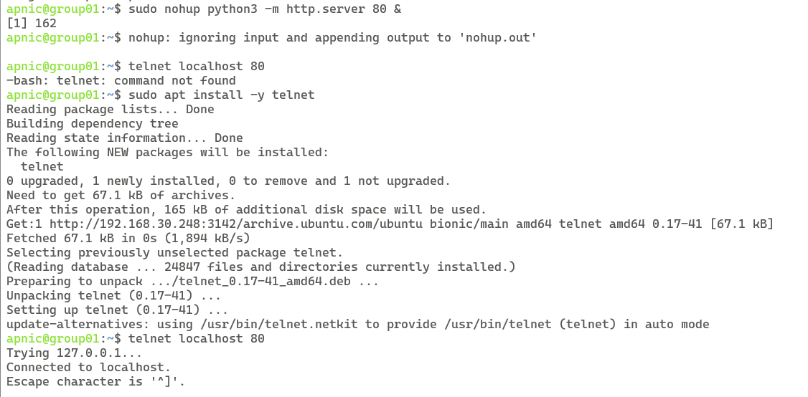
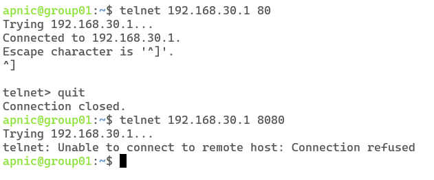
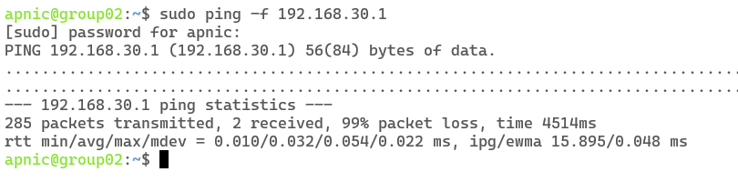
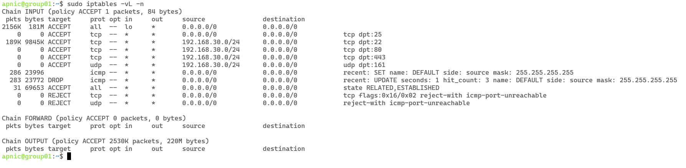

# LAB : Firewall exercises using IPTables

**Lab Overview** <br>
In this lab you will be utilising iptables to create complex rules and explore some of the options. You can access the lab environment during the tutorial.

**Prerequisites** <br> 
Knowledge of Ubuntu, linux commands, and network protocols.

## Lab Tasks
Step 1: Update or install iptables software<br>
Step 2: Review filter policy <br>
Step 3: Build packet filtering rules to restrict access to certain applications depending on the target audience <br>
Step 4: Confirm the rules are working <br>
Step 5: Learn how to permanently save the iptables rules <br>
Step 6: Learn about the Uncomplicated Firewall (UFW)

**Login Details**
 
* Username `apnic` and password `training`.

Login to the server (SSH using the username and password given above), where **XX** is the group number:

	ssh apnic@192.168.30.XX
	
NOTE: Type `yes` if asked about wanting to continue connecting

Password = `training`

## Part 1: Installation (We do not have to do this step)
You can check if iptables is installed in your system by doing:

```bash
sudo iptables -V
```
If it is not installed:
```bash
sudo apt-get install iptables
```

## Filtering policy
- Host must be able to access all of its own applications (localhost)
- Host must allow SMTP connections from anywhere
- Host must allow SSH access only from the campus network
- Host must allow access to the web server only from the local network
- Host must allow access to SNMP only from the local network
- All incoming TCP/UDP traffic must be blocked, except for established connections
- ICMP must be rate-limited to 3 packets per second

For that, we are going to create a text file, which will help us build the ruleset more easily. Make sure to replace “X” with your group number when necessary:
```bash
nano /home/apnic/iptables.sh
```
Type the following information into the text editor:

```bash
# Flush any existing rules
iptables -F

# Permit any incoming packet on the loopback interface
iptables -A INPUT -i lo -j ACCEPT 

# SMTP must be open so that we can accept mail from the world
iptables -A INPUT -p tcp --dport 25 -j ACCEPT

# SSH restricted to the campus network
iptables -A INPUT -s 192.168.30.0/24 -p tcp --dport 22 -j ACCEPT

# HTTP and HTTPS restricted to the local network only
iptables -A INPUT -s 192.168.30.0/24 -p tcp --dport 80 -j ACCEPT 
iptables -A INPUT -s 192.168.30.0/24 -p tcp --dport 443 -j ACCEPT 

# SNMP restricted to the local network only
iptables -A INPUT -s 192.168.30.0/24 -p udp --dport 161 -j ACCEPT 

# Rate-limit ICMP traffic to 3 packets per second
iptables -A INPUT -p icmp -m recent --set
iptables -A INPUT -p icmp -m recent --update --seconds 1 --hitcount 3 -j DROP

# Then, permit all traffic initiated from this machine to come back
iptables -A INPUT -m state --state RELATED,ESTABLISHED -j ACCEPT 

# And finally, block all incoming TCP traffic
iptables -A INPUT -s 0/0 -p tcp --tcp-flags SYN,RST,ACK SYN -j REJECT

# and all UDP traffic
iptables -A INPUT -s 0/0 -p udp -j REJECT 
```
Save this file and exit. Now, let's apply those rules:
```bash
sudo sh /home/apnic/iptables.sh
```
And verify that the rules are there:
```bash
sudo iptables -L
```
You should see the rules you have created. If you'd rather see numeric output, do the following:
```bash
sudo iptables -L -n
```
Start a simple web server to listen for connections on port 80
```bash
sudo nohup python3 -m http.server 80 &
```

| Component     | Explanation                                                                                         |
|---------------|-----------------------------------------------------------------------------------------------------|
| `sudo`        | Runs the following command with superuser privileges.                                               |
| `nohup`       | Allows the process to keep running even after the terminal is closed.                               |
| `python3 -m http.server 80` | The command to start the HTTP server on port 80.                                         |
| `&`           | Indicates to the shell that the command should be run in the background.                            |

Install the telnet application to test the rules
```bash
sudo apt install -y telnet
```

Let's test to make sure that the rules are working. Check that you can connect to services on localhost:
```bash
telnet localhost 80
```
You should see something like this:



To exit, type 'Ctrl-]', press enter and then type 'quit'

Test connectivity against your web server:
```plaintext
telnet 192.168.30.XX 80
```
It should be able to connect. Now, try to connect to a port that is not allowed such as port `8080`:
```plaintext
telnet 192.168.30.XX 8080
```
(If they are able to connect, then you did something wrong. Go back to your file, fix the rules, and run the sh command again).



Stop the HTTP server that is running in the background:
```bash
pgrep -f "python3 -m http.server" | sudo xargs kill -9
```

| Component     | Explanation                                                                                         |
|---------------|-----------------------------------------------------------------------------------------------------|
| `pgrep -f "python3 -m http.server"` | Finds and prints the PID of the process running the command `python3 -m http.server`. |
| `|`           | The pipe operator sends the output of the previous command (the PID) to the next command.            |
| `sudo xargs kill -9` | `xargs` reads the PID from the output of `pgrep` and passes it as an argument to the `kill` command, which stops the process. `sudo` is used to run the command with superuser privileges, and `-9` is the signal for a forceful termination. |


Now, test the ICMP rate limiting. Ask one of your neighbours to do a ping attack against your IP address.
```bash
sudo ping -f 192.168.30.XX
```
What is that `-f`? It stands for “flood”, it will try to send as many ICMP echo request packets as possible. Ask your neighbour to run that for about 5 seconds, and then stop with Ctrl-C. Then, ask them to check the statistics. There should be a high “packet loss” value, and the number of packets received should not be greater than 3 per second (15 packets total if they ran it for 5 secs)



Check the packet count that has matched the iptables rules:
```bash
 sudo iptables -vL -n
```



| Switch | Explanation                                                   |
|--------|---------------------------------------------------------------|
| `-v`   | Verbose output. Provides additional details.                  |
| `-L`   | List rules. Displays all current rules in the selected chain. |
| `-n`   | Numeric output. Shows IP addresses and port numbers numerically, instead of resolving to hostnames and service names. |


If all the tests look good, you could save those rules in order to have Linux re-apply them when it reboots:
Install the software for saving iptables
```bash
sudo apt-get install -y iptables-persistent netfilter-persistent
```

Save the existing rules to a file and then reload the file.
```bash
sudo netfilter-persistent save
sudo netfilter-persistent reload
```

To view the files that store the iptables rules
```bash
ls /etc/iptables
```

View the contents of the **rules.v4** file
```bash
sudo cat /etc/iptables/rules.v4
```

Issue the following command to remove all rules for the next exercise

```bash
sudo iptables -F
```

For further information refer to:

* [https://gist.github.com/jirutka/3742890](https://gist.github.com/jirutka/3742890)

## Part 2: Uncomplicated Firewall (ufw)

Most Linux system comes with iptables – sophisticated software firewall – which is somewhat difficult to configure. Luckily, Ubuntu, as user-friendly community, decided to simplify this task, and so ufw was born.

UFW, or Uncomplicated Firewall, is a user-friendly front-end for managing iptables firewall rules on Ubuntu systems. Its main goal is to make managing iptables easier for users while maintaining the flexibility of iptables.

### Key Features of UFW:
- **User-Friendly Interface**: UFW provides a straightforward CLI (Command Line Interface) that simplifies the process of managing firewall rules.
- **Pre-configured Rules**: UFW comes with a set of pre-configured rules which can be used to quickly set up common firewall configurations.
- **Application Profiles**: Users can create profiles for different applications, making it easy to manage firewall rules for specific applications.
- **Logging**: UFW provides built-in logging to monitor and analyze traffic, which is a feature that can be customized to meet the user's needs.

To work with ufw, you need to have administrative permissions. So, we append word sudo – stands for super user do(es) – so that command like `ufw status` turns into `sudo ufw status`. If you don’t do this, you’ll get the message **ERROR: You need to be root to run this script**. <br>

### Basic Commands:
- **Installing UFW**:
  ```bash
  sudo apt install -y ufw
  ```
  
- **Enabling/Disabling Firewall**:
  ```bash
  sudo ufw enable
  sudo ufw disable
  ```
- **Allowing/Denying Traffic**:
  ```bash
  sudo ufw allow 80/tcp
  sudo ufw deny 80/tcp
  ```
- **Checking Firewall Status**:
  ```bash
  sudo ufw status
  ```
- **Checking help information**:
  ```bash
  sudo ufw -help
  ```

### Service commands
| Command       | Description                                    |
|---------------|------------------------------------------------|
| `sudo ufw status` | Displays status of Uncomplicated Firewall.  |
| `sudo ufw enable` | Turns firewall on.                           |
| `sudo ufw disable`| Turns firewall off.                          |
| `sudo ufw reload` | Applies rules to firewall.                   |  

### Comparison with iptables:
- **Ease of Use**: UFW is designed to be much easier to use than iptables, especially for those who are not familiar with firewall configurations. The syntax is simpler, and common tasks require fewer commands.
- **Abstraction**: UFW abstracts the complexity of iptables rules, providing a more user-friendly interface. However, this abstraction can be a limitation if very fine-grained control over firewall rules is required.
- **Pre-configured Rules**: UFW provides pre-configured rules for common use-cases, which can save time and reduce the likelihood of configuration errors.
- **Application Profiles**: The application profile feature of UFW can be a significant advantage when managing firewall rules for specific applications.


### Syntax
Syntax for ufw rules is as follows: ufw allow|deny|reject|limit in|out port/protocol


| Keyword | Description |
|---------|-------------|
| Allow   | Accepts packets |
| Deny    | Drops packets |
| Reject  | Refuses packets |
| Limit   | Moderates packets |
| In      | Sets direction to incoming packets |
| Out     | Sets direction to outgoing packets |
| Port    | Defines target port. It can be: <br> - Numeric as 80 or Service name as http (see Services file) <br> - List as 80,110 (separated by comma, no space allowed) <br> - Range 8000:8080 (all ports from 8000 to 8080) <br> Note! If you define a list of ports, you can define a maximum of 15 items per rule. A range is considered as 2 items. |
| Protocol | Can be any, tcp, or udp, depending on what you’re planning to filter. |


### Advanced syntax
There is also an advanced syntax, which allows you to define interface, manage entries in rule set, configure logging or define custom behavior for specific applications. For example: 

| Command                                       | Description                                                           |
|-----------------------------------------------|-----------------------------------------------------------------------|
| `sudo ufw deny in on eth0`                    | Drop all incoming packets on eth0 interface.                          |
| `sudo ufw allow out on eth0 to any port 25 proto tcp` | Allow all outgoing traffic on eth0 interface, to any address, at port 25 with protocol tcp. <br> **NOTE**: To define protocol in complex rule, you should append the word `proto` and space. <br> So, instead of **25/tcp**, you should write **25 proto tcp**. |
| `sudo ufw insert 1 allow 80`                  | Places “allow all traffic on port 80” rule at the first place in rule set. |
| `sudo ufw delete 1`                           | Removes rule number 1 from rules list.                                |
| `sudo ufw show user-rules`                    | Displays user-defined rule set. <br> ***User-defined rule set***<br> raw – for displaying of all sets<br> builtins – for internal rule set<br> before-rules – for rules appended before main rule set<br> user-rules – for rules defined by user <br> after-rules – for rules appended after main rule set <br> logging-rules – for rules with logging enabled <br> listening – for displaying listening TCP and open UDP ports |
| `sudo ufw delete deny out 8080`               | Removes rule “deny all outbound traffic on port 8080” from the rule set |
| `sudo ufw allow log 80/tcp`                   | Allows all traffic on TCP port 80, logging new connections only        |
| `sudo ufw allow log-all 80/tcp`               | Allows all traffic on TCP port 80, logging all connections <br> **NOTE**: Always place log command between allowance mode and port. |
| `sudo ufw logging off`                        | Turns off logging. Can also be low, medium, high, and full. Defaults to low. <br> **NOTE**: Higher logging modes generate more logging information, which can overload your disk with time (especially on busy or overloaded system). |
| `sudo ufw app list`                           | Display application profiles list                                      |
| `sudo ufw app info CUPS`                      | Display detailed profile for program named CUPS                        |
| `sudo ufw allow 631 app CUPS`                 | Adds “allow all traffic on port 631” to CUPS application profile      |
| `sudo ufw app update CUPS`                    | Flushes firewall rules, related to CUPS application profile           |


**NOTE** Profiles are generally used by software, essentially for remote management. 

### Default policy
Ufw is based on principle – check against all rules, and if no rule is applicable, follow default policy. This is common principle of iptables firewall, which sometimes causes confusion for new users. For example, computer receives incoming packet from remote host for port 80. There is no rule defining what to do with incoming packets for port 80, so computer follows default policy.

Policies, by default, are set to deny for incoming and accept for outgoing, which seems reasonable enough.

But, there are few cases when we need to allow inbound connections, so, naturally, it’s easier to define “what to allow”, instead of defining everything denied. Same applies for outbound connections, since all networking application need remote access. In rare case, when you would like to change default policy, you can issue one of the following commands:
| Command                               | Description                                 |
|---------------------------------------|---------------------------------------------|
| `sudo ufw default allow incoming`     | Sets default policy to "allow inbound packets" |
| `sudo ufw default reject outgoing`    | Sets default policy to "refuse outbound packets" |


### UFW Rules Exercise

This exercise is designed to help you get acquainted with UFW (Uncomplicated Firewall) rules. Please follow the steps below to test various rules and understand their effects.

**Pre-Requisites** <br>
Ensure that the firewall is running before adding new rules, otherwise, the changes will be lost. To enable UFW, run the following command:
```bash
sudo ufw enable
```

1. **Allow Traffic on Port 22**:
   - This rule permits all traffic on port 22.
   ```bash
   sudo ufw allow 22
   ```

2. **Deny Traffic on Port 110**:
   - This rule drops all traffic on port 110.
   ```bash
   sudo ufw deny 110
   ```

3. **Reject HTTP Traffic**:
   - This rule refuses all traffic on HTTP service port (which is 80), notifying the other side of the rejection.
   ```bash
   sudo ufw reject http
   ```

4. **Allow Incoming Traffic on Port 21**:
   - This rule allows all incoming traffic on port 21.
   ```bash
   sudo ufw allow in 21
   ```

5. **Deny Outgoing Traffic on Port 8080**:
   - This rule denies all outgoing traffic on port 8080.
   ```bash
   sudo ufw deny out 8080
   ```

6. **Allow Traffic from a Specific IP Address**:
   - This rule allows any traffic coming from 123.45.67.89.
   ```bash
   sudo ufw allow from 123.45.67.89
   ```

7. **Limit Connections on Port 22**:
   - This rule drops all connections on TCP port 22 if there were over 6 connections to this port within the last 30 seconds.
   ```bash
   sudo ufw limit 22/tcp
   ```

8. **Reset All Rules**:
   - This command clears all rules, similar to the `iptables -F` command.
   ```bash
   sudo ufw reset
   ```

### Implementing Custom Ruleset

Now, we'll convert some iptables rules to UFW rules as an exercise to implement our own ruleset.

- **Example 1**:
  Convert the following iptables command to a UFW command:
  ```bash
  iptables -A INPUT -i lo -j ACCEPT
  ```
  UFW equivalent:
  ```bash
  sudo ufw allow in on lo
  ```

- **Example 2**:
  Convert the following iptables command to a UFW command:
  ```bash
  iptables -A INPUT -p tcp --dport 25 -j ACCEPT
  ```
  UFW equivalent:
  ```bash
  sudo ufw allow in 25/tcp
  ```

- **Example 3**:
  Convert the following UFW command to an iptables command:
   ```bash
   sudo ufw limit 22/tcp
   ```
  iptables equivalent:
   ```bash
   sudo iptables -A INPUT -p tcp --dport 22 -m state --state NEW -m recent --set
   sudo iptables -A INPUT -p tcp --dport 22 -m state --state NEW -m recent --update --seconds 30 --hitcount 6 -j DROP
   ```
   - The first command sets up tracking for new connections to TCP port 22.
   - The second command updates the tracking and sets a rate limit of 6 new connections per 30 seconds, dropping new connections that exceed this rate. 

**Note**: The limit of 6 connections per 30 seconds is a default setting in UFW when you use the `limit` command. This specific rate was chosen as a reasonable default to help mitigate brute force attacks while minimizing the chance of blocking legitimate traffic. It represents a balance between security and usability.

UFW's `limit` command is a simplified interface to iptables' `recent` module, which tracks the recent connections from an IP address. The `limit` command in UFW is hard-coded to create a rule that allows no more than 6 new connections per 30 seconds from a single IP address. 

If you need a different rate limit, you would need to use iptables directly or other firewall management tools that provide more granular control over rate limiting settings.


For further information refer to: <br>

* [UFW Documentation](https://help.ubuntu.com/community/UFW)
* [How To Set Up a Firewall with UFW on Ubuntu](https://www.digitalocean.com/community/tutorials/how-to-set-up-a-firewall-with-ufw-on-ubuntu-18-04)

					
***END OF EXERCISE***
