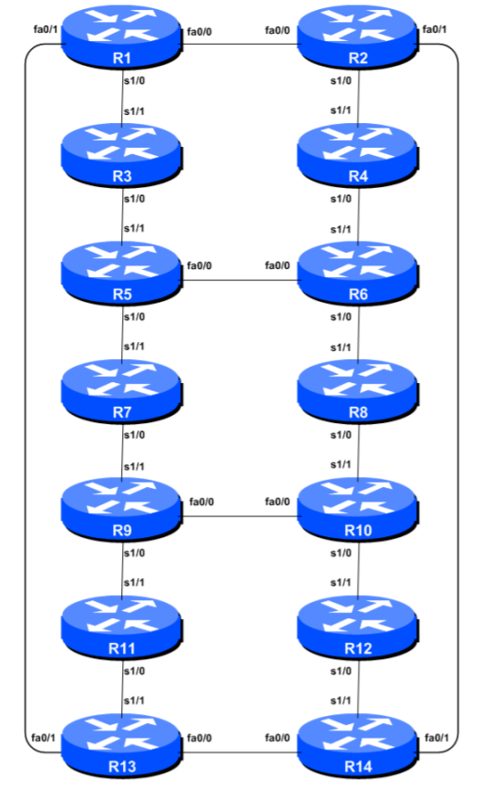

# 14 Router Setup
The lab files are workshop material provided by Dr. Philip Smith available at [BGP4ALL](https://bgp4all.com/pfs/) under a Creative Commons Attribution-NonCommercial-NoDerivatives 4.0 International (CC BY-NC-ND 4.0). Full terms at [https://creativecommons.org/licenses/by-nc-nd/4.0/](https://creativecommons.org/licenses/by-nc-nd/4.0/).

## Objective
Create a basic physical lab with IP addressing and essential router configuration. Ensure that all routers, interfaces, cables, and connections are working properly.

## Prerequisites
- Knowledge of Cisco router CLI.
- Previous hands-on experience.

## Common Topology
The following topology will be used for the first series of labs.

## Lab Notes
This workshop is designed to be run on a Dynamips server using service provider IOS. The configurations and principles apply to Cisco IOS Release 12.4 and onwards. 

### Key Points
- Construct the lab and get familiar with basic network configuration principles.
- Start with physical connections, then configure the routers and test basic IP connectivity.
- Setup routing protocols beginning with IGP before configuring BGP.
- Continuous documentation throughout the workshop is crucial.

## Lab Exercises

### Setup
- **Groups**: Participants work in pairs or groups of three per router.
- **Equipment**: Using Cisco IOS routers on Dynamips.
- **Access**: Connect to assigned routers via telnet; details provided by instructors.

### Configuration Steps
1. **Router Naming**: Assign names like `Router1`, `Router2`, etc.
2. **Disable DNS Lookups**: To speed up traceroutes during labs.
3. **Secure Command Line**: Prevent unintended remote connections due to command-line errors.
4. **Source Routing**: Disable by default for security reasons.
5. **User Authentication**: [Optional] Set usernames and passwords for router access.
6. **Remote Access Setup**: Configure for future module access by other teams.
7. **System Logging**: Disable console logging to reduce interrupt load, use buffering instead.
8. **Save Configuration**: Regularly save configurations to avoid loss during power failures.

### Addressing and Connectivity
- Implement an addressing plan using RFC1918 space for lab purposes.
- Configure back-to-back serial and Ethernet connections as per lab topology.
- Test connectivity using ping and troubleshoot as needed.

### Additional Configurations
- Set up loopback interfaces for route generation and BGP peering.
- Verify configurations and connectivity regularly with lab assistants.
