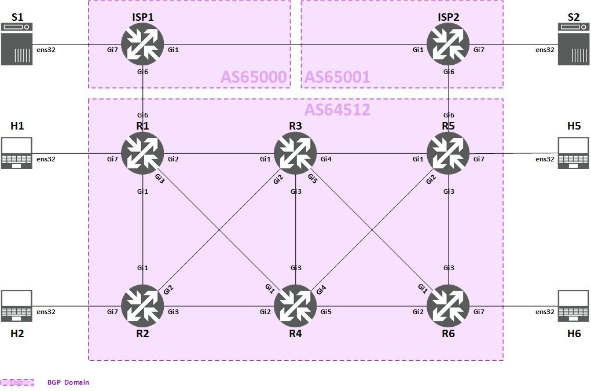

<!-- Last Updated by Makito on 28 Feb 2024 -->

<span style="display:block;text-align:center"></span>

#<center><b>Deploying BGP (Cisco IOS) Lab</b></center>

##**About this Lab**

> This Lab has been designed for you to configure BGP on Cisco Routers (with a number of Linux/Lubuntu hosts) and to advance your knowledge of BGP routing.
> Access the virtual lab here [https://academy.apnic.net/virtual-labs?labId=69078](https://academy.apnic.net/virtual-labs?labId=69078)


## **Introduction **



There are 3 Autonomous Systems (ASes) with totally 8 routers and 6 end-hosts in this lab:

> * **AS64512 is an ISP providing connectivity to end-customers, it is also a customer ISP of AS65000 and AS65001**
	* Routers: R1, R2, R3, R4, R5, R6
	* Customer end-hosts: H1, H2, H5, H6
* **AS65000 is transit provider 1 of AS64512**
	* Router: ISP1
	* Server end-host: S1
* **AS65001 is transit provider 2 of AS64512**
	* Router: ISP2
	* Server end-host: S2

Our main goal is to use BGP for providing end-to-end IPv4 and IPv6 reachability between all end-hosts:

> * Between AS64512's customers (using iBGP)
* From AS64512's customers to the servers hosted in AS65000 and AS65001, and vice-versa (using eBGP)

Once the reachability is available, we will implement authentication for securing our BGP sessions, and route reflection for better scalability of iBGP.

We will go through following tasks one-by-one to achieve our goal:

* **Task 1: Link Address Configuration**
* **Task 2: IGP Configuration**
* **Task 3: iBGP Configuration**
* **Task 4: eBGP Configuration**
* **Task 5: BGP Authentication**
* **Task 6: BGP Route Reflection**

>[!note] Prerequisite knowledge for attending the lab:
* IPv4 and IPv6 routing concepts
* How OSPF (Open Shortest Path First) works
* How BGP (Border Gateway Protocol) works
* Cisco IOS CLI (Command Line Interface)


### **Inline comments** ###

In some configuration and verification tasks of this lab, you might see some lines of text starting with ! (exclamation mark) or # (hashtag) in the code block of sample configuration or verification commands:

* Cisco routers, lines starting with **! (exclamation mark)**:

	```powershell-nocode
	!
	! Enter configuration mode
	configure terminal

	!
	! Set router's host name
	hostname R1
	
	!
	! Create Loopback interface
	interface Loopback0
	 !
	 ! Set description
	 description *** Loopback for Router ID ***

	!
	! Exit configuration mode
	end
	```
		
* Ubuntu end-hosts, lines starting with **# (hashtag)**:

	```powershell-nocode
	# Show address configuration of enp0s3 interface 
	ip addr show dev enp0s3

	# Ping 5 packets to 10.0.0.1
	ping 10.0.0.1 -c 5
	```

These lines of text are inline comments for describing or explaining the actual command lines right below them, so it is not necessary for you to type them during your configuration.


## **Pre-configuration** ##


### **Login information** ###

* Cisco routers:

	```powershell-nocode
	Username: apnic
	Password: training
	Enable Password: labconfig
	```

* Ubuntu hosts:

	```powershell-nocode
	Username: apnic
	Password: training
	```


### **Accessing Cisco IOS** ###

By default, **User EXEC Mode** is the first mode a user has access after logging into the router, it can be identified by the **>** prompt following the router's host name (R1 as example):

```powershell-nocode
R1>
```

To be able to view and make change to the router's configuration, you need to switch to **Privileged EXEC Mode** by issuing this command:

```powershell-nocode
enable
```

Then you will be prompted to key-in an **enable password**, which has been pre-configured as `labconfig`. 

**Privileged EXEC Mode** can be identified by the **#** prompt following the router's host name (R1 as example):

```powershell-nocode
R1#
```

*For more information about access levels in Cisco IOS, you may refer to [here](https://www.cisco.com/E-Learning/bulk/public/tac/cim/cib/using_cisco_ios_software/02_cisco_ios_hierarchy.htm).*


### **Initial configuration** ###

For your information, some miscellaneous settings have been applied as part of initial configuration of all routers in this lab:

```powershell-nocode
!
! Encrypt system passwords
service password-encryption

!
! Use full date time format (includes Year, Millisecond, and Time Zone) in debugging and logging 
service timestamps debug datetime msec show-timezone year
service timestamps log datetime msec show-timezone year

!
! Set router's host name (varies for each router, R1 as example here)
hostname R1

!
! Set log buffer size to 1MB
logging buffered 1048576

!
! Disable unused services
no service pad
no ip bootp server

!
! Do not forward broadcast packets of some protocols 
no ip forward-protocol nd
no ip forward-protocol udp tftp
no ip forward-protocol udp nameserver
no ip forward-protocol udp domain
no ip forward-protocol udp time
no ip forward-protocol udp netbios-ns
no ip forward-protocol udp netbios-dgm
no ip forward-protocol udp tacacs

!
! Do not perform domain lookup
no ip domain lookup

!
! Disable IPv4 source routing
no ip source-route

!
! Disable IPv6 source routing
no ipv6 source-route

line con 0
!
! Prevents logging output from interrupting console session
logging synchronous
```


## **IPv4 / IPv6 Addressing Plan** ##


