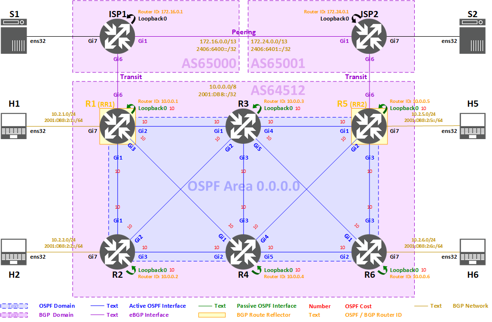

<span style="display:block;text-align:center"></span>
#<center><b>Deploying BGP (Cisco IOS) Lab</b></center>

>###<center>**Task 2: IGP Configuration for AS64512**
</center>


>[!alert] Please make sure all previous tasks work as expected and you understand them before doing this task.


## **Routing Topology** ##



As illustrated by the routing topology above, all customer and server prefixes will be routed by BGP, both intra-AS and inter-AS, and OSPF will be IGP for taking care of underlying connectivity for iBGP sessions within AS64512.

In previous tasks, we have completed address configuration for the routers, the customers, and the servers, so each pair of directly connected nodes are now able to communicate with each other.

> In addition to this, we need to provide:
* reachability between all router's Loopbacks in AS64512 for running iBGP
	* Task 2: IGP Configuration for AS64512
* reachability between all AS64512's customers
	* Task 3: iBGP Configuration for AS64512
* reachability from AS64512's customers to the servers hosted in AS65000 and AS65001, and vice-versa 
	* Task 4: eBGP Configuration

>After full reachability has been achieved, we will then:
* enable MD5 authentication for securing the BGP sessions
	* Task 5: BGP Authentication
* implement BGP route reflection for AS64512 to avoid full mesh iBGP
	* Task 6: BGP Route Reflection

In this task, we will configure **Interior Gateway Protocol (IGP)** on all the routers in AS64512 for reachability between all router's Loopbacks in AS64512. We will use **OSPF (Open Shortest Path First)** routing protocol as the IGP for AS64512. 

!IMAGE[topology_routing_igp_as64512.png](images/topology_routing_igp_as64512.png)

According to above diagram:

 * All routers in AS64512 will be running OSPF
 * There is **only one OSPF Area** in AS64512, which is **Area 0 (0.0.0.0)**, or so-called **Backbone Area**
 * **Point-to-point** interfaces and **Loopback** interfaces of each router will be in **Area 0**
 * **Customer networks** are not included in OSPF, they will be advertised by BGP in another task

> There are two versions of OSPF:
>  
> * OSPFv2 for IPv4 ([RFC2328](https://tools.ietf.org/html/rfc2328))
> * OSPFv3 for IPv6 ([RFC5340](https://tools.ietf.org/html/rfc5340))
> 
> Due to the nature of different packet formats, OSPFv2 and OSPFv3 are not compatible with each other. The two protocols can be run simultaneously on the same link in dual-stack networks. However, each routing domain is totally separate.
>  
> Since [RFC5838](https://tools.ietf.org/html/rfc5838) extended OSPFv3 to support Address Families, OSPFv3 can actually be used for routing both IPv4 and IPv6, while the protocol is running with IPv6 control plane. But considering this feature has not yet been implemented by some vendors, running OSPFv2 for IPv4 and OSPFv3 for IPv6 is still the most common practice in the industry.

We would like provide reachability for **both IPv4 and IPv6**, so we will configure **both OSPFv2 and OSPFv3**, and we will use identical configuration between them for ease of comparison.

> By default, Cisco IOS dynamically assigns cost to each OSPF interface according to the interface's bandwidth. However, in real world, it is common that a network might be running with equipment from different vendors, while some vendors do not implement automatic OSPF cost, network administrators would manually define the OSPF cost of each link for maintaining consistency and compatibility in the network.

For ease of understanding and verification, we will set **a fixed value of 10** as the OSPF cost of each OSPF interface in the network.


### **OSPFv2 and OSPFv3 configuration summary** ###

>* Process ID: 1 (Locally significant)
* Router ID: (Use router's IPv4 Loopback)
* **Area 0**
	* All router point-to-point links
		* Network type: **point-to-point** (For avoiding unnecessary DR / BDR election)
		* OSPF cost: **10**
	* All router Loopback interfaces
		* **Passive interface**
		* OSPF cost: **10**

- There are 4 steps in this task:

* [Step 2.1: Configuring OSPFv2 and OSPFv3 for AS64512](#step-21-configuring-ospfv2-and-ospfv3-for-as64512)

* [Step 2.2: Verifying OSPFv2 and OSPFv3 status](#step-22-verifying-ospfv2-and-ospfv3-status)

* [Step 2.3: Verifying IPv4 and IPv6 routing table](#step-23-verifying-ipv4-and-ipv6-routing-table)

* [Step 2.4: Verifying IPv4 and IPv6 reachability](#step-24-verifying-ipv4-and-ipv6-reachability)


##**Step 2.1: Configuring OSPFv2 and OSPFv3 for AS64512**

In this step, we will configure OSPFv2 and OSPFv3 at the same time. 


#### **Step 2.1.1 Configure OSPFv2 and OSPFv3 on R1** ####

- Select R1 from the Resources tab.

	```powershell-nocode
	Username: apnic
	Password: training
    ```

- The commands below must be run in the privileged exec mode. Type `enable` to enter this mode.

    ```powershell-nocode
	enable
	Password: labconfig
    ```

- Here is the link of [Routing Topology (IGP for AS64512)](images/topology_routing_igp_as64512.png)  for your reference.

- Here is the OSPFv2 and OSPFv3 configuration of **R1**:

	```
	configure terminal
	
	!
	! Initialize OSPFv2 with Process ID: 1 
	router ospf 1
	 !
	 ! Hardcode Loopback IPv4 address as OSPFv2 Router ID
	 router-id 10.0.0.1
	 !
	 ! Log event details when OSPFv2 adjacency changes
	 log-adjacency-changes detail
	 !
	 ! Set OSPFv2 interface as Passive
	 passive-interface Loopback0

	!
	! Initialize OSPFv3 with Process ID: 1
	ipv6 router ospf 1
	 !
	 ! Hardcode Loopback IPv4 address as OSPFv3 Router ID
	 router-id 10.0.0.1
	 !
	 ! Log event details when OSPFv3 adjacency changes
	 log-adjacency-changes detail
	 !
	 ! Set OSPFv3 interface as Passive
	 passive-interface Loopback0
	
	interface Loopback0
	 !
	 ! Manually assign OSPFv2 cost: 10
	 ip ospf cost 10
	 !
	 ! Include this interface in OSPFv2 Process 1 Area 0
	 ip ospf 1 area 0.0.0.0
	 !
	 ! Manually assign OSPFv3 cost: 10
	 ipv6 ospf cost 10
	 !
	 ! Include this interface in OSPFv3 Process 1 Area 0
	 ipv6 ospf 1 area 0.0.0.0
	
	interface GigabitEthernet1
	 ip ospf cost 10
	 !
	 ! Set interface as OSPFv2 point-to-point network type
	 ip ospf network point-to-point
	 ip ospf 1 area 0.0.0.0
	 ipv6 ospf cost 10
	 !
	 ! Set interface as OSPFv3 point-to-point network type
	 ipv6 ospf network point-to-point
	 ipv6 ospf 1 area 0.0.0.0
	
	interface GigabitEthernet2
	 ip ospf cost 10
	 ip ospf network point-to-point
	 ip ospf 1 area 0.0.0.0
	 ipv6 ospf cost 10
	 ipv6 ospf network point-to-point
	 ipv6 ospf 1 area 0.0.0.0
	
	interface GigabitEthernet3
	 ip ospf cost 10
	 ip ospf network point-to-point
	 ip ospf 1 area 0.0.0.0
	 ipv6 ospf cost 10
	 ipv6 ospf network point-to-point
	 ipv6 ospf 1 area 0.0.0.0
	
	end
	```


#### **Step 2.1.2 Configure OSPFv2 and OSPFv3 on R2** ####

- Select R2 from the Resources tab.

	```powershell-nocode
	Username: apnic
	Password: training
    ```

- The commands below must be run in the privileged exec mode. Type `enable` to enter this mode.

    ```powershell-nocode
	enable
	Password: labconfig
    ```

- Here is the link of  [Routing Topology (IGP for AS64512)](images/topology_routing_igp_as64512.png)  for your reference.

- Here is the OSPFv2 and OSPFv3 configuration of **R2**:

	```
	configure terminal
	
	router ospf 1
	 router-id 10.0.0.2
	 log-adjacency-changes detail
	 passive-interface Loopback0

	ipv6 router ospf 1
	 router-id 10.0.0.2
	 log-adjacency-changes detail
	 passive-interface Loopback0
	
	interface Loopback0
	 ip ospf cost 10
	 ip ospf 1 area 0.0.0.0
	 ipv6 ospf cost 10
	 ipv6 ospf 1 area 0.0.0.0
	
	interface GigabitEthernet1
	 ip ospf cost 10
	 ip ospf network point-to-point
	 ip ospf 1 area 0.0.0.0
	 ipv6 ospf cost 10
	 ipv6 ospf network point-to-point
	 ipv6 ospf 1 area 0.0.0.0
	
	interface GigabitEthernet2
	 ip ospf cost 10
	 ip ospf network point-to-point
	 ip ospf 1 area 0.0.0.0
	 ipv6 ospf cost 10
	 ipv6 ospf network point-to-point
	 ipv6 ospf 1 area 0.0.0.0
	
	interface GigabitEthernet3
	 ip ospf cost 10
	 ip ospf network point-to-point
	 ip ospf 1 area 0.0.0.0
	 ipv6 ospf cost 10
	 ipv6 ospf network point-to-point
	 ipv6 ospf 1 area 0.0.0.0
	
	end
	```


#### **Step 2.1.3 Configure OSPFv2 and OSPFv3 on R3** ####

- Select R3 from the Resources tab.

	```powershell-nocode
	Username: apnic
	Password: training
    ```

- The commands below must be run in the privileged exec mode. Type `enable` to enter this mode.

    ```powershell-nocode
	enable
	Password: labconfig
    ```

- Here is the link of  [Routing Topology (IGP for AS64512)](images/topology_routing_igp_as64512.png)  for your reference.

- Here is the OSPFv2 and OSPFv3 configuration of **R3**:

	```
	configure terminal
	
	router ospf 1
	 router-id 10.0.0.3
	 log-adjacency-changes detail
	 passive-interface Loopback0

	ipv6 router ospf 1
	 router-id 10.0.0.3
	 log-adjacency-changes detail
	 passive-interface Loopback0
	
	interface Loopback0
	 ip ospf cost 10
	 ip ospf 1 area 0.0.0.0
	 ipv6 ospf cost 10
	 ipv6 ospf 1 area 0.0.0.0
	
	interface GigabitEthernet1
	 ip ospf cost 10
	 ip ospf network point-to-point
	 ip ospf 1 area 0.0.0.0
	 ipv6 ospf cost 10
	 ipv6 ospf network point-to-point
	 ipv6 ospf 1 area 0.0.0.0
	
	interface GigabitEthernet2
	 ip ospf cost 10
	 ip ospf network point-to-point
	 ip ospf 1 area 0.0.0.0
	 ipv6 ospf cost 10
	 ipv6 ospf network point-to-point
	 ipv6 ospf 1 area 0.0.0.0
	
	interface GigabitEthernet3
	 ip ospf cost 10
	 ip ospf network point-to-point
	 ip ospf 1 area 0.0.0.0
	 ipv6 ospf cost 10
	 ipv6 ospf network point-to-point
	 ipv6 ospf 1 area 0.0.0.0
	
	interface GigabitEthernet4
	 ip ospf cost 10
	 ip ospf network point-to-point
	 ip ospf 1 area 0.0.0.0
	 ipv6 ospf cost 10
	 ipv6 ospf network point-to-point
	 ipv6 ospf 1 area 0.0.0.0
	
	interface GigabitEthernet5
	 ip ospf cost 10
	 ip ospf network point-to-point
	 ip ospf 1 area 0.0.0.0
	 ipv6 ospf cost 10
	 ipv6 ospf network point-to-point
	 ipv6 ospf 1 area 0.0.0.0
	
	end
	```


#### **Step 2.1.4 Configure OSPFv2 and OSPFv3 on R4** ####

- Select R4 from the Resources tab.

	```powershell-nocode
	Username: apnic
	Password: training
    ```

- The commands below must be run in the privileged exec mode. Type `enable` to enter this mode.

    ```powershell-nocode
	enable
	Password: labconfig
    ```

- Here is the link of [Routing Topology (IGP for AS64512)](images/topology_routing_igp_as64512.png)  for your reference.

- Here is the OSPFv2 and OSPFv3 configuration of **R4**:

	```
	configure terminal
	
	router ospf 1
	 router-id 10.0.0.4
	 log-adjacency-changes detail
	 passive-interface Loopback0

	ipv6 router ospf 1
	 router-id 10.0.0.4
	 log-adjacency-changes detail
	 passive-interface Loopback0
	
	interface Loopback0
	 ip ospf cost 10
	 ip ospf 1 area 0.0.0.0
	 ipv6 ospf cost 10
	 ipv6 ospf 1 area 0.0.0.0
	
	interface GigabitEthernet1
	 ip ospf cost 10
	 ip ospf network point-to-point
	 ip ospf 1 area 0.0.0.0
	 ipv6 ospf cost 10
	 ipv6 ospf network point-to-point
	 ipv6 ospf 1 area 0.0.0.0
	
	interface GigabitEthernet2
	 ip ospf cost 10
	 ip ospf network point-to-point
	 ip ospf 1 area 0.0.0.0
	 ipv6 ospf cost 10
	 ipv6 ospf network point-to-point
	 ipv6 ospf 1 area 0.0.0.0
	
	interface GigabitEthernet3
	 ip ospf cost 10
	 ip ospf network point-to-point
	 ip ospf 1 area 0.0.0.0
	 ipv6 ospf cost 10
	 ipv6 ospf network point-to-point
	 ipv6 ospf 1 area 0.0.0.0
	
	interface GigabitEthernet4
	 ip ospf cost 10
	 ip ospf network point-to-point
	 ip ospf 1 area 0.0.0.0
	 ipv6 ospf cost 10
	 ipv6 ospf network point-to-point
	 ipv6 ospf 1 area 0.0.0.0
	
	interface GigabitEthernet5
	 ip ospf cost 10
	 ip ospf network point-to-point
	 ip ospf 1 area 0.0.0.0
	 ipv6 ospf cost 10
	 ipv6 ospf network point-to-point
	 ipv6 ospf 1 area 0.0.0.0
	
	end
	```


#### **Step 2.1.5 Configure OSPFv2 and OSPFv3 on R5** ####

- Select R5 from the Resources tab.

	```powershell-nocode
	Username: apnic
	Password: training
    ```

- The commands below must be run in the privileged exec mode. Type `enable` to enter this mode.

    ```powershell-nocode
	enable
	Password: labconfig
    ```

- Here is the link of  [Routing Topology (IGP for AS64512)](images/topology_routing_igp_as64512.png)  for your reference.

- Here is the OSPFv2 and OSPFv3 configuration of **R5**:

	```
	configure terminal
	
	router ospf 1
	 router-id 10.0.0.5
	 log-adjacency-changes detail
	 passive-interface Loopback0

	ipv6 router ospf 1
	 router-id 10.0.0.5
	 log-adjacency-changes detail
	 passive-interface Loopback0
	
	interface Loopback0
	 ip ospf cost 10
	 ip ospf 1 area 0.0.0.0
	 ipv6 ospf cost 10
	 ipv6 ospf 1 area 0.0.0.0
	
	interface GigabitEthernet1
	 ip ospf cost 10
	 ip ospf network point-to-point
	 ip ospf 1 area 0.0.0.0
	 ipv6 ospf cost 10
	 ipv6 ospf network point-to-point
	 ipv6 ospf 1 area 0.0.0.0
	
	interface GigabitEthernet2
	 ip ospf cost 10
	 ip ospf network point-to-point
	 ip ospf 1 area 0.0.0.0
	 ipv6 ospf cost 10
	 ipv6 ospf network point-to-point
	 ipv6 ospf 1 area 0.0.0.0
	
	interface GigabitEthernet3
	 ip ospf cost 10
	 ip ospf network point-to-point
	 ip ospf 1 area 0.0.0.0
	 ipv6 ospf cost 10
	 ipv6 ospf network point-to-point
	 ipv6 ospf 1 area 0.0.0.0
	
	end
	```


#### **Step 2.1.6 Configure OSPFv2 and OSPFv3 on R6** ####

- Select R6 from the Resources tab.

	```powershell-nocode
	Username: apnic
	Password: training
    ```

- The commands below must be run in the privileged exec mode. Type `enable` to enter this mode.

    ```powershell-nocode
	enable
	Password: labconfig
    ```

- Here is the link of  [Routing Topology (IGP for AS64512)](images/topology_routing_igp_as64512.png)  for your reference.

- Here is the OSPFv2 and OSPFv3 configuration of **R6**:

	```
	configure terminal
	
	router ospf 1
	 router-id 10.0.0.6
	 log-adjacency-changes detail
	 passive-interface Loopback0

	ipv6 router ospf 1
	 router-id 10.0.0.6
	 log-adjacency-changes detail
	 passive-interface Loopback0
	
	interface Loopback0
	 ip ospf cost 10
	 ip ospf 1 area 0.0.0.0
	 ipv6 ospf cost 10
	 ipv6 ospf 1 area 0.0.0.0
	
	interface GigabitEthernet1
	 ip ospf cost 10
	 ip ospf network point-to-point
	 ip ospf 1 area 0.0.0.0
	 ipv6 ospf cost 10
	 ipv6 ospf network point-to-point
	 ipv6 ospf 1 area 0.0.0.0
	
	interface GigabitEthernet2
	 ip ospf cost 10
	 ip ospf network point-to-point
	 ip ospf 1 area 0.0.0.0
	 ipv6 ospf cost 10
	 ipv6 ospf network point-to-point
	 ipv6 ospf 1 area 0.0.0.0
	
	interface GigabitEthernet3
	 ip ospf cost 10
	 ip ospf network point-to-point
	 ip ospf 1 area 0.0.0.0
	 ipv6 ospf cost 10
	 ipv6 ospf network point-to-point
	 ipv6 ospf 1 area 0.0.0.0
	
	end
	```


##**Step 2.2: Verifying OSPFv2 and OSPFv3 status**

>[!alert] Please perform this verification step only when you have fully completed previous configuration steps of this task.

Once we have done OSPFv2 and OSPFv3 configuration on all routers, we will verify whether OSPFv2 and OSPFv3 are running according to our configuration. We expect to see:

* all **point-to-point interfaces** of each router are participating in OSPFv2 and OSPFv3 **as point-to-point network type in Area 0**
* **Loopback interface** of each router is advertised into OSPFv2 and OSPFv3 **as passive interface in Area 0**
* **each active OSPF interface** has **an adjacent OSPF neighbor** in **Full** state

We will do verification on each router with following commands:

* Showing interfaces that are participating in OSPF:
	* OSPFv2: `show ip ospf interface brief`
	* OSPFv3: `show ipv6 ospf interface brief`
* Showing OSPF neighbors that has been discovered and adjacent:
	* OSPFv2: `show ip ospf neighbor`
	* OSPFv3: `show ipv6 ospf neighbor`


#### **Step 2.2.1: Verifying OSPFv2 and OSPFv3 status on R1** ####

- Select R1 from the Resources tab.

	```powershell-nocode
	Username: apnic
	Password: training
    ```

- The commands below must be run in the privileged exec mode. Type `enable` to enter this mode.

    ```powershell-nocode
	enable
	Password: labconfig
    ```

- Here is the link of IMAGE[Network Topology](images/topology_l3addr.png) with IP addresses for your reference.

- To check OSPFv2 interfaces, type `show ip ospf interface brief`:

    ```powershell-nocode
	R1#show ip ospf interface brief
	Interface    PID   Area            IP Address/Mask    Cost  State Nbrs F/C
	Lo0          1     0.0.0.0         10.0.0.1/32        10    LOOP  0/0
	Gi3          1     0.0.0.0         10.1.0.9/30        10    P2P   1/1
	Gi2          1     0.0.0.0         10.1.0.5/30        10    P2P   1/1
	Gi1          1     0.0.0.0         10.1.0.1/30        10    P2P   1/1
    ```

- To check OSPFv3 interfaces, type `show ipv6 ospf interface brief`:

    ```powershell-nocode
	R1#show ipv6 ospf interface brief
	Interface    PID   Area            Intf ID    Cost  State Nbrs F/C
	Lo0          1     0.0.0.0         16         10    LOOP  0/0
	Gi3          1     0.0.0.0         9          10    P2P   1/1
	Gi2          1     0.0.0.0         8          10    P2P   1/1
	Gi1          1     0.0.0.0         7          10    P2P   1/1
    ```

- To check OSPFv2 neighbors, type `show ip ospf neighbor`:

    ```powershell-nocode
	R1#show ip ospf neighbor
	Neighbor ID     Pri   State           Dead Time   Address         Interface
	10.0.0.4          0   FULL/  -        00:00:36    10.1.0.10       GigabitEthernet3
	10.0.0.3          0   FULL/  -        00:00:36    10.1.0.6        GigabitEthernet2
	10.0.0.2          0   FULL/  -        00:00:36    10.1.0.2        GigabitEthernet1
    ```

- To check OSPFv3 neighbors, type `show ipv6 ospf neighbor`:

    ```powershell-nocode
	R1#show ipv6 ospf neighbor
	
						OSPFv3 Router with ID (10.0.0.1) (Process ID 1)
	
	Neighbor ID     Pri   State           Dead Time   Interface ID    Interface
	10.0.0.4          0   FULL/  -        00:00:34    7               GigabitEthernet3
	10.0.0.3          0   FULL/  -        00:00:33    7               GigabitEthernet2
	10.0.0.2          0   FULL/  -        00:00:33    7               GigabitEthernet1
    ```

	From above output, we can know that:
	
	* **4 interfaces** are currently participating in OSPFv2 / OSPFv3 **Process ID 1**
		* Process ID is only locally significant, it does not need to match with another router's Process ID  
	* **All** interfaces are in **Area 0 (Backbone Area)** with **OSPF cost 10**
	* **Active OSPF interfaces** (Loopback0 is passive) are configured as a network type that **does not require DR and BDR**
		* **point-to-point** or **point-to-multipoint** does not require DR and BDR
		* In our case, we have configured our OSPF interfaces as **point-to-point**
	* **3 OSPFv2 neighbors** and **3 OSPFv3 neighbors** are adjacent to R1, Neighbor ID is Router ID of the OSPFv2 / OSPFv3 neighbor
		* 10.0.0.2 (R2) via GigabitEthernet1
		* 10.0.0.3 (R3) via GigabitEthernet2
		* 10.0.0.4 (R4) via GigabitEthernet3
	* **All** OSPF neighbors are in **Full** state
		* LSAs are exchanged successfully and LSDBs are fully synchronized


#### **Step 2.2.2: Verifying OSPFv2 and OSPFv3 status on R2** ####

- Select R2 from the Resources tab.

	```powershell-nocode
	Username: apnic
	Password: training
    ```

- The commands below must be run in the privileged exec mode. Type `enable` to enter this mode.

    ```powershell-nocode
	enable
	Password: labconfig
    ```

- Here is the link of IMAGE[Network Topology](images/topology_l3addr.png) with IP addresses for your reference.

- To check OSPFv2 interfaces, type `show ip ospf interface brief`:

    ```powershell-nocode
	R2#show ip ospf interface brief
	Interface    PID   Area            IP Address/Mask    Cost  State Nbrs F/C
	Lo0          1     0.0.0.0         10.0.0.2/32        10    LOOP  0/0
	Gi3          1     0.0.0.0         10.1.0.17/30       10    P2P   1/1
	Gi2          1     0.0.0.0         10.1.0.13/30       10    P2P   1/1
	Gi1          1     0.0.0.0         10.1.0.2/30        10    P2P   1/1
    ```

- To check OSPFv3 interfaces, type `show ipv6 ospf interface brief`:

    ```powershell-nocode
	R2#show ipv6 ospf interface brief
	Interface    PID   Area            Intf ID    Cost  State Nbrs F/C
	Lo0          1     0.0.0.0         16         10    LOOP  0/0
	Gi3          1     0.0.0.0         9          10    P2P   1/1
	Gi2          1     0.0.0.0         8          10    P2P   1/1
	Gi1          1     0.0.0.0         7          10    P2P   1/1
    ```

- To check OSPFv2 neighbors, type `show ip ospf neighbor`:

    ```powershell-nocode
	R2#show ip ospf neighbor
	Neighbor ID     Pri   State           Dead Time   Address         Interface
	10.0.0.4          0   FULL/  -        00:00:36    10.1.0.18       GigabitEthernet3
	10.0.0.3          0   FULL/  -        00:00:30    10.1.0.14       GigabitEthernet2
	10.0.0.1          0   FULL/  -        00:00:36    10.1.0.1        GigabitEthernet1
    ```

- To check OSPFv3 neighbors, type `show ipv6 ospf neighbor`:

    ```powershell-nocode
	R2#show ipv6 ospf neighbor
	
				OSPFv3 Router with ID (10.0.0.2) (Process ID 1)
	
	Neighbor ID     Pri   State           Dead Time   Interface ID    Interface
	10.0.0.4          0   FULL/  -        00:00:38    8               GigabitEthernet3
	10.0.0.3          0   FULL/  -        00:00:38    8               GigabitEthernet2
	10.0.0.1          0   FULL/  -        00:00:31    7               GigabitEthernet1
    ```


#### **Step 2.2.3: Verifying OSPFv2 and OSPFv3 status on R3** ####

- Select R3 from the Resources tab.

	```powershell-nocode
	Username: apnic
	Password: training
    ```

- The commands below must be run in the privileged exec mode. Type `enable` to enter this mode.

    ```powershell-nocode
	enable
	Password: labconfig
    ```

- Here is the link of IMAGE[Network Topology](images/topology_l3addr.png) with IP addresses for your reference.

- To check OSPFv2 interfaces, type `show ip ospf interface brief`:

    ```powershell-nocode
	R3#show ip ospf interface brief
	Interface    PID   Area            IP Address/Mask    Cost  State Nbrs F/C
	Lo0          1     0.0.0.0         10.0.0.3/32        10    LOOP  0/0
	Gi5          1     0.0.0.0         10.1.0.29/30       10    P2P   1/1
	Gi4          1     0.0.0.0         10.1.0.25/30       10    P2P   1/1
	Gi3          1     0.0.0.0         10.1.0.21/30       10    P2P   1/1
	Gi2          1     0.0.0.0         10.1.0.14/30       10    P2P   1/1
	Gi1          1     0.0.0.0         10.1.0.6/30        10    P2P   1/1
    ```
		
- To check OSPFv3 interfaces, type `show ipv6 ospf interface brief`:

    ```powershell-nocode
	R3#show ipv6 ospf interface brief
	Interface    PID   Area            Intf ID    Cost  State Nbrs F/C
	Lo0          1     0.0.0.0         16         10    LOOP  0/0
	Gi5          1     0.0.0.0         11         10    P2P   1/1
	Gi4          1     0.0.0.0         10         10    P2P   1/1
	Gi3          1     0.0.0.0         9          10    P2P   1/1
	Gi2          1     0.0.0.0         8          10    P2P   1/1
	Gi1          1     0.0.0.0         7          10    P2P   1/1
    ```

- To check OSPFv2 neighbors, type `show ip ospf neighbor`:

    ```powershell-nocode
	R3#show ip ospf neighbor
	Neighbor ID     Pri   State           Dead Time   Address         Interface
	10.0.0.6          0   FULL/  -        00:00:35    10.1.0.30       GigabitEthernet5
	10.0.0.5          0   FULL/  -        00:00:31    10.1.0.26       GigabitEthernet4
	10.0.0.4          0   FULL/  -        00:00:36    10.1.0.22       GigabitEthernet3
	10.0.0.2          0   FULL/  -        00:00:37    10.1.0.13       GigabitEthernet2
	10.0.0.1          0   FULL/  -        00:00:35    10.1.0.5        GigabitEthernet1
    ```

- To check OSPFv3 neighbors, type `show ipv6 ospf neighbor`:

    ```powershell-nocode
	R3#show ipv6 ospf neighbor
	
				OSPFv3 Router with ID (10.0.0.3) (Process ID 1)
	
	Neighbor ID     Pri   State           Dead Time   Interface ID    Interface
	10.0.0.6          0   FULL/  -        00:00:35    7               GigabitEthernet5
	10.0.0.5          0   FULL/  -        00:00:38    7               GigabitEthernet4
	10.0.0.4          0   FULL/  -        00:00:35    9               GigabitEthernet3
	10.0.0.2          0   FULL/  -        00:00:35    8               GigabitEthernet2
	10.0.0.1          0   FULL/  -        00:00:38    8               GigabitEthernet1
    ```


#### **Step 2.2.4: Verifying OSPFv2 and OSPFv3 status on R4** ####

- Select R4 from the Resources tab.

	```powershell-nocode
	Username: apnic
	Password: training
    ```

- The commands below must be run in the privileged exec mode. Type `enable` to enter this mode.

    ```powershell-nocode
	enable
	Password: labconfig
    ```

- Here is the link of IMAGE[Network Topology](images/topology_l3addr.png) with IP addresses for your reference.

- To check OSPFv2 interfaces, type `show ip ospf interface brief`:

    ```powershell-nocode
	R4#show ip ospf interface brief
	Interface    PID   Area            IP Address/Mask    Cost  State Nbrs F/C
	Lo0          1     0.0.0.0         10.0.0.4/32        10    LOOP  0/0
	Gi5          1     0.0.0.0         10.1.0.37/30       10    P2P   1/1
	Gi4          1     0.0.0.0         10.1.0.33/30       10    P2P   1/1
	Gi3          1     0.0.0.0         10.1.0.22/30       10    P2P   1/1
	Gi2          1     0.0.0.0         10.1.0.18/30       10    P2P   1/1
	Gi1          1     0.0.0.0         10.1.0.10/30       10    P2P   1/1
    ```

- To check OSPFv3 interfaces, type `show ipv6 ospf interface brief`:

    ```powershell-nocode
	R4#show ipv6 ospf interface brief
	Interface    PID   Area            Intf ID    Cost  State Nbrs F/C
	Lo0          1     0.0.0.0         16         10    LOOP  0/0
	Gi5          1     0.0.0.0         11         10    P2P   1/1
	Gi4          1     0.0.0.0         10         10    P2P   1/1
	Gi3          1     0.0.0.0         9          10    P2P   1/1
	Gi2          1     0.0.0.0         8          10    P2P   1/1
	Gi1          1     0.0.0.0         7          10    P2P   1/1
    ```

- To check OSPFv2 neighbors, type `show ip ospf neighbor`:

    ```powershell-nocode
	R4#show ip ospf neighbor
	
	Neighbor ID     Pri   State           Dead Time   Address         Interface
	10.0.0.6          0   FULL/  -        00:00:34    10.1.0.38       GigabitEthernet5
	10.0.0.5          0   FULL/  -        00:00:33    10.1.0.34       GigabitEthernet4
	10.0.0.3          0   FULL/  -        00:00:36    10.1.0.21       GigabitEthernet3
	10.0.0.2          0   FULL/  -        00:00:34    10.1.0.17       GigabitEthernet2
	10.0.0.1          0   FULL/  -        00:00:36    10.1.0.9        GigabitEthernet1
    ```

- To check OSPFv3 neighbors, type `show ipv6 ospf neighbor`:

    ```powershell-nocode
	R4#show ipv6 ospf neighbor
	
				OSPFv3 Router with ID (10.0.0.4) (Process ID 1)
	
	Neighbor ID     Pri   State           Dead Time   Interface ID    Interface
	10.0.0.6          0   FULL/  -        00:00:35    8               GigabitEthernet5
	10.0.0.5          0   FULL/  -        00:00:37    8               GigabitEthernet4
	10.0.0.3          0   FULL/  -        00:00:37    9               GigabitEthernet3
	10.0.0.2          0   FULL/  -        00:00:37    9               GigabitEthernet2
	10.0.0.1          0   FULL/  -        00:00:39    9               GigabitEthernet1
    ```


#### **Step 2.2.5: Verifying OSPFv2 and OSPFv3 status on R5** ####

- Select R5 from the Resources tab.

	```powershell-nocode
	Username: apnic
	Password: training
    ```

- The commands below must be run in the privileged exec mode. Type `enable` to enter this mode.

    ```powershell-nocode
	enable
	Password: labconfig
    ```

- Here is the link of IMAGE[Network Topology](images/topology_l3addr.png) with IP addresses for your reference.

- To check OSPFv2 interfaces, type `show ip ospf interface brief`:

    ```powershell-nocode
	R5#show ip ospf interface brief
	Interface    PID   Area            IP Address/Mask    Cost  State Nbrs F/C
	Lo0          1     0.0.0.0         10.0.0.5/32        10    LOOP  0/0
	Gi3          1     0.0.0.0         10.1.0.41/30       10    P2P   1/1
	Gi2          1     0.0.0.0         10.1.0.34/30       10    P2P   1/1
	Gi1          1     0.0.0.0         10.1.0.26/30       10    P2P   1/1
    ```

- To check OSPFv3 interfaces, type `show ipv6 ospf interface brief`:

    ```powershell-nocode
	R5#show ipv6 ospf interface brief
	Interface    PID   Area            Intf ID    Cost  State Nbrs F/C
	Lo0          1     0.0.0.0         16         10    LOOP  0/0
	Gi3          1     0.0.0.0         9          10    P2P   1/1
	Gi2          1     0.0.0.0         8          10    P2P   1/1
	Gi1          1     0.0.0.0         7          10    P2P   1/1
    ```

- To check OSPFv2 neighbors, type `show ip ospf neighbor`:

    ```powershell-nocode
	R5#show ip ospf neighbor
	Neighbor ID     Pri   State           Dead Time   Address         Interface
	10.0.0.6          0   FULL/  -        00:00:31    10.1.0.42       GigabitEthernet3
	10.0.0.4          0   FULL/  -        00:00:34    10.1.0.33       GigabitEthernet2
	10.0.0.3          0   FULL/  -        00:00:33    10.1.0.25       GigabitEthernet1
    ```

- To check OSPFv3 neighbors, type `show ipv6 ospf neighbor`:

    ```powershell-nocode
	R5#show ipv6 ospf neighbor
	
				OSPFv3 Router with ID (10.0.0.5) (Process ID 1)
	
	Neighbor ID     Pri   State           Dead Time   Interface ID    Interface
	10.0.0.6          0   FULL/  -        00:00:34    9               GigabitEthernet3
	10.0.0.4          0   FULL/  -        00:00:39    10              GigabitEthernet2
	10.0.0.3          0   FULL/  -        00:00:37    10              GigabitEthernet1
    ```


#### **Step 2.2.6: Verifying OSPFv2 and OSPFv3 status on R6** ####

- Select R6 from the Resources tab.

	```powershell-nocode
	Username: apnic
	Password: training
    ```

- The commands below must be run in the privileged exec mode. Type `enable` to enter this mode.

    ```powershell-nocode
	enable
	Password: labconfig
    ```

- Here is the link of IMAGE[Network Topology](images/topology_l3addr.png) with IP addresses for your reference.

- To check OSPFv2 interfaces, type `show ip ospf interface brief`:

    ```powershell-nocode
	R6#show ip ospf interface brief
	Interface    PID   Area            IP Address/Mask    Cost  State Nbrs F/C
	Lo0          1     0.0.0.0         10.0.0.6/32        10    LOOP  0/0
	Gi3          1     0.0.0.0         10.1.0.42/30       10    P2P   1/1
	Gi2          1     0.0.0.0         10.1.0.38/30       10    P2P   1/1
	Gi1          1     0.0.0.0         10.1.0.30/30       10    P2P   1/1
    ```

- To check OSPFv3 interfaces, type `show ipv6 ospf interface brief`:

    ```powershell-nocode
	R6#show ipv6 ospf interface brief
	Interface    PID   Area            Intf ID    Cost  State Nbrs F/C
	Lo0          1     0.0.0.0         16         10    LOOP  0/0
	Gi3          1     0.0.0.0         9          10    P2P   1/1
	Gi2          1     0.0.0.0         8          10    P2P   1/1
	Gi1          1     0.0.0.0         7          10    P2P   1/1
    ```

- To check OSPFv2 neighbors, type `show ip ospf neighbor`:

    ```powershell-nocode
	R6#show ip ospf neighbor
	Neighbor ID     Pri   State           Dead Time   Address         Interface
	10.0.0.5          0   FULL/  -        00:00:31    10.1.0.41       GigabitEthernet3
	10.0.0.4          0   FULL/  -        00:00:33    10.1.0.37       GigabitEthernet2
	10.0.0.3          0   FULL/  -        00:00:31    10.1.0.29       GigabitEthernet1
    ```

- To check OSPFv3 neighbors, type `show ipv6 ospf neighbor`:

    ```powershell-nocode
	R6#show ipv6 ospf neighbor
	
				OSPFv3 Router with ID (10.0.0.6) (Process ID 1)
	
	Neighbor ID     Pri   State           Dead Time   Interface ID    Interface
	10.0.0.5          0   FULL/  -        00:00:35    9               GigabitEthernet3
	10.0.0.4          0   FULL/  -        00:00:35    11              GigabitEthernet2
	10.0.0.3          0   FULL/  -        00:00:33    11              GigabitEthernet1
    ```


##**Step 2.3: Verifying IPv4 and IPv6 routing table**

>[!alert] Please perform this verification step only when you have fully completed previous configuration steps of this task.

Before we perform reachability test, we will verify IPv4 and IPv6 routing table of each router. We expect to see **all AS64512's router Loopbacks** in the routing table.

For showing IPv4 routing table:

* use `show ip route` command; or
* use `show ip route ospf` command to show only routes received by OSPFv2

For showing IPv6 routing table:

* use `show ipv6 route` command; or
* use `show ipv6 route ospf` command to show only routes received by OSPFv3


#### **Step 2.3.1: Verifying IPv4 and IPv6 routing table on R1** ####

- Select R1 from the Resources tab.

	```powershell-nocode
	Username: apnic
	Password: training
    ```

- The commands below must be run in the privileged exec mode. Type `enable` to enter this mode.

    ```powershell-nocode
	enable
	Password: labconfig
    ```

- Here is the link of IMAGE[Network Topology](images/topology_l3addr.png) with IP addresses for your reference.

- To check IPv4 routing table, type `show ip route`:

    ```powershell-nocode
	R1#show ip route
	Codes: L - local, C - connected, S - static, R - RIP, M - mobile, B - BGP
	       D - EIGRP, EX - EIGRP external, O - OSPF, IA - OSPF inter area
	       N1 - OSPF NSSA external type 1, N2 - OSPF NSSA external type 2
	       E1 - OSPF external type 1, E2 - OSPF external type 2
	       i - IS-IS, su - IS-IS summary, L1 - IS-IS level-1, L2 - IS-IS level-2
	       ia - IS-IS inter area, * - candidate default, U - per-user static route
	       o - ODR, P - periodic downloaded static route, H - NHRP, l - LISP
	       a - application route
	       + - replicated route, % - next hop override, p - overrides from PfR
	
	Gateway of last resort is not set
	
	      10.0.0.0/8 is variably subnetted, 22 subnets, 3 masks
	C        10.0.0.1/32 is directly connected, Loopback0					<-- R1's Loopback (connected)
	O        10.0.0.2/32 [110/20] via 10.1.0.2, 00:00:37, GigabitEthernet1	<-- R2's Loopback
	O        10.0.0.3/32 [110/20] via 10.1.0.6, 00:00:47, GigabitEthernet2	<-- R3's Loopback
	O        10.0.0.4/32 [110/20] via 10.1.0.10, 00:00:47, GigabitEthernet3	<-- R4's Loopback
	O        10.0.0.5/32 [110/30] via 10.1.0.10, 00:00:37, GigabitEthernet3	<-- R5's Loopback
	                     [110/30] via 10.1.0.6, 00:00:37, GigabitEthernet2
	O        10.0.0.6/32 [110/30] via 10.1.0.10, 00:00:47, GigabitEthernet3	<-- R6's Loopback
	                     [110/30] via 10.1.0.6, 00:00:47, GigabitEthernet2
	C        10.1.0.0/30 is directly connected, GigabitEthernet1
	L        10.1.0.1/32 is directly connected, GigabitEthernet1
	C        10.1.0.4/30 is directly connected, GigabitEthernet2
	L        10.1.0.5/32 is directly connected, GigabitEthernet2
	C        10.1.0.8/30 is directly connected, GigabitEthernet3
	L        10.1.0.9/32 is directly connected, GigabitEthernet3
	O        10.1.0.12/30 [110/20] via 10.1.0.6, 00:00:47, GigabitEthernet2
	                      [110/20] via 10.1.0.2, 00:00:37, GigabitEthernet1
	O        10.1.0.16/30 [110/20] via 10.1.0.10, 00:00:47, GigabitEthernet3
	                      [110/20] via 10.1.0.2, 00:00:37, GigabitEthernet1
	O        10.1.0.20/30 [110/20] via 10.1.0.10, 00:00:47, GigabitEthernet3
	                      [110/20] via 10.1.0.6, 00:00:47, GigabitEthernet2
	O        10.1.0.24/30 [110/20] via 10.1.0.6, 00:00:47, GigabitEthernet2
	O        10.1.0.28/30 [110/20] via 10.1.0.6, 00:00:47, GigabitEthernet2
	O        10.1.0.32/30 [110/20] via 10.1.0.10, 00:00:47, GigabitEthernet3
	O        10.1.0.36/30 [110/20] via 10.1.0.10, 00:00:47, GigabitEthernet3
	O        10.1.0.40/30 [110/30] via 10.1.0.10, 00:00:37, GigabitEthernet3
	                      [110/30] via 10.1.0.6, 00:00:37, GigabitEthernet2
	C        10.2.1.0/24 is directly connected, GigabitEthernet7
	L        10.2.1.1/32 is directly connected, GigabitEthernet7
	      172.20.0.0/16 is variably subnetted, 2 subnets, 2 masks
	C        172.20.0.0/30 is directly connected, GigabitEthernet6
	L        172.20.0.2/32 is directly connected, GigabitEthernet6
    ```

- To check IPv6 routing table, type `show ipv6 route`:

    ```powershell-nocode
	R1#show ipv6 route
	IPv6 Routing Table - default - 25 entries
	Codes: C - Connected, L - Local, S - Static, U - Per-user Static route
	       B - BGP, R - RIP, H - NHRP, I1 - ISIS L1
	       I2 - ISIS L2, IA - ISIS interarea, IS - ISIS summary, D - EIGRP
	       EX - EIGRP external, ND - ND Default, NDp - ND Prefix, DCE - Destination
	       NDr - Redirect, RL - RPL, O - OSPF Intra, OI - OSPF Inter
	       OE1 - OSPF ext 1, OE2 - OSPF ext 2, ON1 - OSPF NSSA ext 1
	       ON2 - OSPF NSSA ext 2, la - LISP alt, lr - LISP site-registrations
	       ld - LISP dyn-eid, lA - LISP away, a - Application
	LC  2001:DB8::1/128 [0/0]												<-- R1's Loopback (connected)
	     via Loopback0, receive
	O   2001:DB8::2/128 [110/10]											<-- R2's Loopback
	     via FE80::253:FF:FE11:201, GigabitEthernet1
	O   2001:DB8::3/128 [110/10]											<-- R3's Loopback
	     via FE80::253:FF:FE11:301, GigabitEthernet2
	O   2001:DB8::4/128 [110/10]											<-- R4's Loopback
	     via FE80::253:FF:FE11:401, GigabitEthernet3
	O   2001:DB8::5/128 [110/20]											<-- R5's Loopback
	     via FE80::253:FF:FE11:301, GigabitEthernet2
	     via FE80::253:FF:FE11:401, GigabitEthernet3
	O   2001:DB8::6/128 [110/20]											<-- R6's Loopack
	     via FE80::253:FF:FE11:301, GigabitEthernet2
	     via FE80::253:FF:FE11:401, GigabitEthernet3
	C   2001:DB8:1::/127 [0/0]
	     via GigabitEthernet1, directly connected
	L   2001:DB8:1::/128 [0/0]
	     via GigabitEthernet1, receive
	C   2001:DB8:1:1::/127 [0/0]
	     via GigabitEthernet2, directly connected
	L   2001:DB8:1:1::/128 [0/0]
	     via GigabitEthernet2, receive
	C   2001:DB8:1:2::/127 [0/0]
	     via GigabitEthernet3, directly connected
	L   2001:DB8:1:2::/128 [0/0]
	     via GigabitEthernet3, receive
	O   2001:DB8:1:3::/127 [110/20]
	     via FE80::253:FF:FE11:301, GigabitEthernet2
	     via FE80::253:FF:FE11:201, GigabitEthernet1
	O   2001:DB8:1:4::/127 [110/20]
	     via FE80::253:FF:FE11:401, GigabitEthernet3
	     via FE80::253:FF:FE11:201, GigabitEthernet1
	O   2001:DB8:1:5::/127 [110/20]
	     via FE80::253:FF:FE11:401, GigabitEthernet3
	     via FE80::253:FF:FE11:301, GigabitEthernet2
	O   2001:DB8:1:6::/127 [110/20]
	     via FE80::253:FF:FE11:301, GigabitEthernet2
	O   2001:DB8:1:7::/127 [110/20]
	     via FE80::253:FF:FE11:301, GigabitEthernet2
	O   2001:DB8:1:8::/127 [110/20]
	     via FE80::253:FF:FE11:401, GigabitEthernet3
	O   2001:DB8:1:9::/127 [110/20]
	     via FE80::253:FF:FE11:401, GigabitEthernet3
	O   2001:DB8:1:A::/127 [110/30]
	     via FE80::253:FF:FE11:301, GigabitEthernet2
	     via FE80::253:FF:FE11:401, GigabitEthernet3
	C   2001:DB8:2:1::/64 [0/0]
	     via GigabitEthernet7, directly connected
	L   2001:DB8:2:1::1/128 [0/0]
	     via GigabitEthernet7, receive
	C   2406:6400:4::/127 [0/0]
	     via GigabitEthernet6, directly connected
	L   2406:6400:4::1/128 [0/0]
	     via GigabitEthernet6, receive
	L   FF00::/8 [0/0]
	     via Null0, receive
    ```

From R1's routing table, we can see:

* **R1's Loopback** (10.0.0.1/32, 2001:DB8::1/128) is **directly connected**
* **R2's Loopback** (10.0.0.2/32, 2001:DB8::2/128) will be routed directly **via R2**
* **R3's Loopback** (10.0.0.3/32, 2001:DB8::3/128) will be routed directly **via R3**
* **R4's Loopback** (10.0.0.4/32, 2001:DB8::4/128) will be routed directly **via R4**
* **R5's Loopback** (10.0.0.5/32, 2001:DB8::5/128) will be routed via both **R3 and R4**
 	* R1-R3-R5 and R1-R4-R5 have equal total path cost
 	* R1 will use both paths and do load sharing between R3 and R4 
* **R6's Loopback** (10.0.0.6/32, 2001:DB8::6/128) will be routed via both **R3 and R4**
 	* R1-R3-R6 and R1-R4-R6 have equal total path cost
 	* R1 will use both paths and do load sharing between R3 and R4


#### **Step 2.3.2: Verifying IPv4 and IPv6 routing table on R2** ####

- Select R2 from the Resources tab.

	```powershell-nocode
	Username: apnic
	Password: training
    ```

- The commands below must be run in the privileged exec mode. Type `enable` to enter this mode.

    ```powershell-nocode
	enable
	Password: labconfig
    ```

- Here is the link of IMAGE[Network Topology](images/topology_l3addr.png) with IP addresses for your reference.

- For showing IPv4 routing table, we can use `show ip route` command, or use `show ip route ospf` command to show only IPv4 routes received by OSPF. The result of IPv4 route received by OSPF is as shown below:

    ```powershell-nocode
	R2#show ip route ospf
	Codes: L - local, C - connected, S - static, R - RIP, M - mobile, B - BGP
	       D - EIGRP, EX - EIGRP external, O - OSPF, IA - OSPF inter area
	       N1 - OSPF NSSA external type 1, N2 - OSPF NSSA external type 2
	       E1 - OSPF external type 1, E2 - OSPF external type 2
	       i - IS-IS, su - IS-IS summary, L1 - IS-IS level-1, L2 - IS-IS level-2
	       ia - IS-IS inter area, * - candidate default, U - per-user static route
	       o - ODR, P - periodic downloaded static route, H - NHRP, l - LISP
	       a - application route
	       + - replicated route, % - next hop override, p - overrides from PfR
	
	Gateway of last resort is not set
	
	      10.0.0.0/8 is variably subnetted, 22 subnets, 3 masks
	O        10.0.0.1/32 [110/20] via 10.1.0.1, 00:00:52, GigabitEthernet1	<-- R1's Loopback
	O        10.0.0.3/32 [110/20] via 10.1.0.14, 00:00:52, GigabitEthernet2	<-- R3's Loopback
	O        10.0.0.4/32 [110/20] via 10.1.0.18, 00:00:52, GigabitEthernet3	<-- R4's Loopback
	O        10.0.0.5/32 [110/30] via 10.1.0.18, 00:00:52, GigabitEthernet3	<-- R5's Loopback
	                     [110/30] via 10.1.0.14, 00:00:52, GigabitEthernet2
	O        10.0.0.6/32 [110/30] via 10.1.0.18, 00:00:52, GigabitEthernet3	<-- R6's Loopback
	                     [110/30] via 10.1.0.14, 00:00:52, GigabitEthernet2
	O        10.1.0.4/30 [110/20] via 10.1.0.14, 00:00:52, GigabitEthernet2
	                     [110/20] via 10.1.0.1, 00:00:52, GigabitEthernet1
	O        10.1.0.8/30 [110/20] via 10.1.0.18, 00:00:52, GigabitEthernet3
	                     [110/20] via 10.1.0.1, 00:00:52, GigabitEthernet1
	O        10.1.0.20/30 [110/20] via 10.1.0.18, 00:00:52, GigabitEthernet3
	                      [110/20] via 10.1.0.14, 00:00:52, GigabitEthernet2
	O        10.1.0.24/30 [110/20] via 10.1.0.14, 00:00:52, GigabitEthernet2
	O        10.1.0.28/30 [110/20] via 10.1.0.14, 00:00:52, GigabitEthernet2
	O        10.1.0.32/30 [110/20] via 10.1.0.18, 00:00:52, GigabitEthernet3
	O        10.1.0.36/30 [110/20] via 10.1.0.18, 00:00:52, GigabitEthernet3
	O        10.1.0.40/30 [110/30] via 10.1.0.18, 00:00:52, GigabitEthernet3
	                      [110/30] via 10.1.0.14, 00:00:52, GigabitEthernet2
    ```

- For showing IPv6 routing table, we can use `show ipv6 route` command, or use `show ipv6 route ospf` command to show only IPv6 routes received by OSPF. The result of IPv4 route received by OSPF is as shown below:


    ```powershell-nocode
	R2#show ipv6 route ospf
	IPv6 Routing Table - default - 23 entries
	Codes: C - Connected, L - Local, S - Static, U - Per-user Static route
	       B - BGP, R - RIP, H - NHRP, I1 - ISIS L1
	       I2 - ISIS L2, IA - ISIS interarea, IS - ISIS summary, D - EIGRP
	       EX - EIGRP external, ND - ND Default, NDp - ND Prefix, DCE - Destination
	       NDr - Redirect, RL - RPL, O - OSPF Intra, OI - OSPF Inter
	       OE1 - OSPF ext 1, OE2 - OSPF ext 2, ON1 - OSPF NSSA ext 1
	       ON2 - OSPF NSSA ext 2, la - LISP alt, lr - LISP site-registrations
	       ld - LISP dyn-eid, lA - LISP away, a - Application
	O   2001:DB8::1/128 [110/10]											<-- R1's Loopback
	     via FE80::253:FF:FE11:101, GigabitEthernet1
	O   2001:DB8::3/128 [110/10]											<-- R3's Loopback
	     via FE80::253:FF:FE11:302, GigabitEthernet2
	O   2001:DB8::4/128 [110/10]											<-- R4's Loopback
	     via FE80::253:FF:FE11:402, GigabitEthernet3
	O   2001:DB8::5/128 [110/20]											<-- R5's Loopback
	     via FE80::253:FF:FE11:302, GigabitEthernet2
	     via FE80::253:FF:FE11:402, GigabitEthernet3
	O   2001:DB8::6/128 [110/20]											<-- R6's Loopback
	     via FE80::253:FF:FE11:302, GigabitEthernet2
	     via FE80::253:FF:FE11:402, GigabitEthernet3
	O   2001:DB8:1:1::/127 [110/20]
	     via FE80::253:FF:FE11:302, GigabitEthernet2
	     via FE80::253:FF:FE11:101, GigabitEthernet1
	O   2001:DB8:1:2::/127 [110/20]
	     via FE80::253:FF:FE11:402, GigabitEthernet3
	     via FE80::253:FF:FE11:101, GigabitEthernet1
	O   2001:DB8:1:5::/127 [110/20]
	     via FE80::253:FF:FE11:402, GigabitEthernet3
	     via FE80::253:FF:FE11:302, GigabitEthernet2
	O   2001:DB8:1:6::/127 [110/20]
	     via FE80::253:FF:FE11:302, GigabitEthernet2
	O   2001:DB8:1:7::/127 [110/20]
	     via FE80::253:FF:FE11:302, GigabitEthernet2
	O   2001:DB8:1:8::/127 [110/20]
	     via FE80::253:FF:FE11:402, GigabitEthernet3
	O   2001:DB8:1:9::/127 [110/20]
	     via FE80::253:FF:FE11:402, GigabitEthernet3
	O   2001:DB8:1:A::/127 [110/30]
	     via FE80::253:FF:FE11:302, GigabitEthernet2
	     via FE80::253:FF:FE11:402, GigabitEthernet3
    ```


#### **Step 2.3.3: Verifying IPv4 and IPv6 routing table on R3** ####

- Select R3 from the Resources tab.

	```powershell-nocode
	Username: apnic
	Password: training
    ```

- The commands below must be run in the privileged exec mode. Type `enable` to enter this mode.

    ```powershell-nocode
	enable
	Password: labconfig
    ```

- Here is the link of IMAGE[Network Topology](images/topology_l3addr.png) with IP addresses for your reference.

- For showing IPv4 routing table, we can use `show ip route` command, or use `show ip route ospf` command to show only IPv4 routes received by OSPF. The result of IPv4 route received by OSPF is as shown below:

    ```powershell-nocode
	R3#show ip route ospf
	Codes: L - local, C - connected, S - static, R - RIP, M - mobile, B - BGP
	       D - EIGRP, EX - EIGRP external, O - OSPF, IA - OSPF inter area
	       N1 - OSPF NSSA external type 1, N2 - OSPF NSSA external type 2
	       E1 - OSPF external type 1, E2 - OSPF external type 2
	       i - IS-IS, su - IS-IS summary, L1 - IS-IS level-1, L2 - IS-IS level-2
	       ia - IS-IS inter area, * - candidate default, U - per-user static route
	       o - ODR, P - periodic downloaded static route, H - NHRP, l - LISP
	       a - application route
	       + - replicated route, % - next hop override, p - overrides from PfR
	
	Gateway of last resort is not set
	
	      10.0.0.0/8 is variably subnetted, 22 subnets, 3 masks
	O        10.0.0.1/32 [110/20] via 10.1.0.5, 00:01:03, GigabitEthernet1	<-- R1's Loopback
	O        10.0.0.2/32 [110/20] via 10.1.0.13, 00:01:03, GigabitEthernet2	<-- R2's Loopback
	O        10.0.0.4/32 [110/20] via 10.1.0.22, 00:01:03, GigabitEthernet3	<-- R4's Loopback
	O        10.0.0.5/32 [110/20] via 10.1.0.26, 00:01:03, GigabitEthernet4	<-- R5's Loopback
	O        10.0.0.6/32 [110/20] via 10.1.0.30, 00:00:53, GigabitEthernet5	<-- R6's Loopback
	O        10.1.0.0/30 [110/20] via 10.1.0.13, 00:01:03, GigabitEthernet2
	                     [110/20] via 10.1.0.5, 00:01:03, GigabitEthernet1
	O        10.1.0.8/30 [110/20] via 10.1.0.22, 00:01:03, GigabitEthernet3
	                     [110/20] via 10.1.0.5, 00:01:03, GigabitEthernet1
	O        10.1.0.16/30 [110/20] via 10.1.0.22, 00:01:03, GigabitEthernet3
	                      [110/20] via 10.1.0.13, 00:01:03, GigabitEthernet2
	O        10.1.0.32/30 [110/20] via 10.1.0.26, 00:01:03, GigabitEthernet4
	                      [110/20] via 10.1.0.22, 00:01:03, GigabitEthernet3
	O        10.1.0.36/30 [110/20] via 10.1.0.30, 00:00:53, GigabitEthernet5
	                      [110/20] via 10.1.0.22, 00:01:03, GigabitEthernet3
	O        10.1.0.40/30 [110/20] via 10.1.0.30, 00:00:53, GigabitEthernet5
	                      [110/20] via 10.1.0.26, 00:01:03, GigabitEthernet4
    ```

- For showing IPv6 routing table, we can use `show ipv6 route` command, or use `show ipv6 route ospf` command to show only IPv6 routes received by OSPF. The result of IPv4 route received by OSPF is as shown below:

    ```powershell-nocode
	R3#show ipv6 route ospf
	IPv6 Routing Table - default - 23 entries
	Codes: C - Connected, L - Local, S - Static, U - Per-user Static route
	       B - BGP, R - RIP, H - NHRP, I1 - ISIS L1
	       I2 - ISIS L2, IA - ISIS interarea, IS - ISIS summary, D - EIGRP
	       EX - EIGRP external, ND - ND Default, NDp - ND Prefix, DCE - Destination
	       NDr - Redirect, RL - RPL, O - OSPF Intra, OI - OSPF Inter
	       OE1 - OSPF ext 1, OE2 - OSPF ext 2, ON1 - OSPF NSSA ext 1
	       ON2 - OSPF NSSA ext 2, la - LISP alt, lr - LISP site-registrations
	       ld - LISP dyn-eid, lA - LISP away, a - Application
	O   2001:DB8::1/128 [110/10]											<-- R1's Loopback
	     via FE80::253:FF:FE11:102, GigabitEthernet1
	O   2001:DB8::2/128 [110/10]											<-- R2's Loopback
	     via FE80::253:FF:FE11:202, GigabitEthernet2
	O   2001:DB8::4/128 [110/10]											<-- R4's Loopback
	     via FE80::253:FF:FE11:403, GigabitEthernet3
	O   2001:DB8::5/128 [110/10]											<-- R5's Loopback
	     via FE80::253:FF:FE11:501, GigabitEthernet4
	O   2001:DB8::6/128 [110/10]											<-- R6's Loopback
	     via FE80::253:FF:FE11:601, GigabitEthernet5
	O   2001:DB8:1::/127 [110/20]
	     via FE80::253:FF:FE11:102, GigabitEthernet1
	     via FE80::253:FF:FE11:202, GigabitEthernet2
	O   2001:DB8:1:2::/127 [110/20]
	     via FE80::253:FF:FE11:102, GigabitEthernet1
	     via FE80::253:FF:FE11:403, GigabitEthernet3
	O   2001:DB8:1:4::/127 [110/20]
	     via FE80::253:FF:FE11:403, GigabitEthernet3
	     via FE80::253:FF:FE11:202, GigabitEthernet2
	O   2001:DB8:1:8::/127 [110/20]
	     via FE80::253:FF:FE11:501, GigabitEthernet4
	     via FE80::253:FF:FE11:403, GigabitEthernet3
	O   2001:DB8:1:9::/127 [110/20]
	     via FE80::253:FF:FE11:601, GigabitEthernet5
	     via FE80::253:FF:FE11:403, GigabitEthernet3
	O   2001:DB8:1:A::/127 [110/20]
	     via FE80::253:FF:FE11:601, GigabitEthernet5
	     via FE80::253:FF:FE11:501, GigabitEthernet4
    ```


#### **Step 2.3.4: Verifying IPv4 and IPv6 routing table on R4** ####

- Select R4 from the Resources tab.

	```powershell-nocode
	Username: apnic
	Password: training
    ```

- The commands below must be run in the privileged exec mode. Type `enable` to enter this mode.

    ```powershell-nocode
	enable
	Password: labconfig
    ```

- Here is the link of IMAGE[Network Topology](images/topology_l3addr.png) with IP addresses for your reference.

- For showing IPv4 routing table, we can use `show ip route` command, or use `show ip route ospf` command to show only IPv4 routes received by OSPF. The result of IPv4 route received by OSPF is as shown below:

    ```powershell-nocode
	R4#show ip route ospf
	Codes: L - local, C - connected, S - static, R - RIP, M - mobile, B - BGP
	       D - EIGRP, EX - EIGRP external, O - OSPF, IA - OSPF inter area
	       N1 - OSPF NSSA external type 1, N2 - OSPF NSSA external type 2
	       E1 - OSPF external type 1, E2 - OSPF external type 2
	       i - IS-IS, su - IS-IS summary, L1 - IS-IS level-1, L2 - IS-IS level-2
	       ia - IS-IS inter area, * - candidate default, U - per-user static route
	       o - ODR, P - periodic downloaded static route, H - NHRP, l - LISP
	       a - application route
	       + - replicated route, % - next hop override, p - overrides from PfR
	
	Gateway of last resort is not set
	
	      10.0.0.0/8 is variably subnetted, 22 subnets, 3 masks
	O        10.0.0.1/32 [110/20] via 10.1.0.9, 00:01:03, GigabitEthernet1	<-- R1's Loopback
	O        10.0.0.2/32 [110/20] via 10.1.0.17, 00:01:03, GigabitEthernet2	<-- R2's Loopback
	O        10.0.0.3/32 [110/20] via 10.1.0.21, 00:01:03, GigabitEthernet3	<-- R3's Loopback
	O        10.0.0.5/32 [110/20] via 10.1.0.34, 00:01:03, GigabitEthernet4	<-- R5's Loopback
	O        10.0.0.6/32 [110/20] via 10.1.0.38, 00:00:53, GigabitEthernet5	<-- R6's Loopback
	O        10.1.0.0/30 [110/20] via 10.1.0.17, 00:01:03, GigabitEthernet2
	                     [110/20] via 10.1.0.9, 00:01:03, GigabitEthernet1
	O        10.1.0.4/30 [110/20] via 10.1.0.21, 00:01:03, GigabitEthernet3
	                     [110/20] via 10.1.0.9, 00:01:03, GigabitEthernet1
	O        10.1.0.12/30 [110/20] via 10.1.0.21, 00:01:03, GigabitEthernet3
		                      [110/20] via 10.1.0.17, 00:01:03, GigabitEthernet2
	O        10.1.0.24/30 [110/20] via 10.1.0.34, 00:01:03, GigabitEthernet4
	                      [110/20] via 10.1.0.21, 00:01:03, GigabitEthernet3
	O        10.1.0.28/30 [110/20] via 10.1.0.38, 00:00:53, GigabitEthernet5
	                      [110/20] via 10.1.0.21, 00:01:03, GigabitEthernet3
	O        10.1.0.40/30 [110/20] via 10.1.0.38, 00:00:53, GigabitEthernet5
	                      [110/20] via 10.1.0.34, 00:01:03, GigabitEthernet4
    ```

- For showing IPv6 routing table, we can use `show ipv6 route` command, or use `show ipv6 route ospf` command to show only IPv6 routes received by OSPF. The result of IPv4 route received by OSPF is as shown below:

    ```powershell-nocode
	R4#show ipv6 route ospf
	IPv6 Routing Table - default - 23 entries
	Codes: C - Connected, L - Local, S - Static, U - Per-user Static route
	       B - BGP, R - RIP, H - NHRP, I1 - ISIS L1
	       I2 - ISIS L2, IA - ISIS interarea, IS - ISIS summary, D - EIGRP
	       EX - EIGRP external, ND - ND Default, NDp - ND Prefix, DCE - Destination
	       NDr - Redirect, RL - RPL, O - OSPF Intra, OI - OSPF Inter
	       OE1 - OSPF ext 1, OE2 - OSPF ext 2, ON1 - OSPF NSSA ext 1
	       ON2 - OSPF NSSA ext 2, la - LISP alt, lr - LISP site-registrations
	       ld - LISP dyn-eid, lA - LISP away, a - Application
	O   2001:DB8::1/128 [110/10]											<-- R1's Loopback
	     via FE80::253:FF:FE11:103, GigabitEthernet1
	O   2001:DB8::2/128 [110/10]											<-- R2's Loopback
	     via FE80::253:FF:FE11:203, GigabitEthernet2
	O   2001:DB8::3/128 [110/10]											<-- R3's Loopback
	     via FE80::253:FF:FE11:303, GigabitEthernet3
	O   2001:DB8::5/128 [110/10]											<-- R5's Loopback
	     via FE80::253:FF:FE11:502, GigabitEthernet4
	O   2001:DB8::6/128 [110/10]											<-- R6's Loopback
	     via FE80::253:FF:FE11:602, GigabitEthernet5
	O   2001:DB8:1::/127 [110/20]
	     via FE80::253:FF:FE11:103, GigabitEthernet1
	     via FE80::253:FF:FE11:203, GigabitEthernet2
	O   2001:DB8:1:1::/127 [110/20]
	     via FE80::253:FF:FE11:103, GigabitEthernet1
	     via FE80::253:FF:FE11:303, GigabitEthernet3
	O   2001:DB8:1:3::/127 [110/20]
	     via FE80::253:FF:FE11:303, GigabitEthernet3
	     via FE80::253:FF:FE11:203, GigabitEthernet2
	O   2001:DB8:1:6::/127 [110/20]
	     via FE80::253:FF:FE11:502, GigabitEthernet4
	     via FE80::253:FF:FE11:303, GigabitEthernet3
	O   2001:DB8:1:7::/127 [110/20]
	     via FE80::253:FF:FE11:602, GigabitEthernet5
	     via FE80::253:FF:FE11:303, GigabitEthernet3
	O   2001:DB8:1:A::/127 [110/20]
	     via FE80::253:FF:FE11:602, GigabitEthernet5
	     via FE80::253:FF:FE11:502, GigabitEthernet4
    ```

#### **Step 2.3.5: Verifying IPv4 and IPv6 routing table on R5** ####

- Select R5 from the Resources tab.

	```powershell-nocode
	Username: apnic
	Password: training
    ```

- The commands below must be run in the privileged exec mode. Type `enable` to enter this mode.

    ```powershell-nocode
	enable
	Password: labconfig
    ```

- Here is the link of IMAGE[Network Topology](images/topology_l3addr.png) with IP addresses for your reference.

- For showing IPv4 routing table, we can use `show ip route` command, or use `show ip route ospf` command to show only IPv4 routes received by OSPF. The result of IPv4 route received by OSPF is as shown below:

    ```powershell-nocode
	R5#show ip route ospf
	Codes: L - local, C - connected, S - static, R - RIP, M - mobile, B - BGP
	       D - EIGRP, EX - EIGRP external, O - OSPF, IA - OSPF inter area
	       N1 - OSPF NSSA external type 1, N2 - OSPF NSSA external type 2
	       E1 - OSPF external type 1, E2 - OSPF external type 2
	       i - IS-IS, su - IS-IS summary, L1 - IS-IS level-1, L2 - IS-IS level-2
	       ia - IS-IS inter area, * - candidate default, U - per-user static route
	       o - ODR, P - periodic downloaded static route, H - NHRP, l - LISP
	       a - application route
	       + - replicated route, % - next hop override, p - overrides from PfR
	
	Gateway of last resort is not set
	
	      10.0.0.0/8 is variably subnetted, 22 subnets, 3 masks
	O        10.0.0.1/32 [110/30] via 10.1.0.33, 00:01:03, GigabitEthernet2	<-- R1's Loopback
	                     [110/30] via 10.1.0.25, 00:01:03, GigabitEthernet1
	O        10.0.0.2/32 [110/30] via 10.1.0.33, 00:01:03, GigabitEthernet2	<-- R2's Loopback
	                     [110/30] via 10.1.0.25, 00:01:03, GigabitEthernet1
	O        10.0.0.3/32 [110/20] via 10.1.0.25, 00:01:03, GigabitEthernet1	<-- R3's Loopback
	O        10.0.0.4/32 [110/20] via 10.1.0.33, 00:01:03, GigabitEthernet2	<-- R4's Loopback
	O        10.0.0.6/32 [110/20] via 10.1.0.42, 00:00:53, GigabitEthernet3	<-- R6's Loopback
	O        10.1.0.0/30 [110/30] via 10.1.0.33, 00:01:03, GigabitEthernet2
	                     [110/30] via 10.1.0.25, 00:01:03, GigabitEthernet1
	O        10.1.0.4/30 [110/20] via 10.1.0.25, 00:01:03, GigabitEthernet1
	O        10.1.0.8/30 [110/20] via 10.1.0.33, 00:01:03, GigabitEthernet2
	O        10.1.0.12/30 [110/20] via 10.1.0.25, 00:01:03, GigabitEthernet1
	O        10.1.0.16/30 [110/20] via 10.1.0.33, 00:01:03, GigabitEthernet2
	O        10.1.0.20/30 [110/20] via 10.1.0.33, 00:01:03, GigabitEthernet2
	                      [110/20] via 10.1.0.25, 00:01:03, GigabitEthernet1
	O        10.1.0.28/30 [110/20] via 10.1.0.42, 00:00:53, GigabitEthernet3
	                      [110/20] via 10.1.0.25, 00:01:03, GigabitEthernet1
	O        10.1.0.36/30 [110/20] via 10.1.0.42, 00:00:53, GigabitEthernet3
	                      [110/20] via 10.1.0.33, 00:01:03, GigabitEthernet2
    ```

- For showing IPv6 routing table, we can use `show ipv6 route` command, or use `show ipv6 route ospf` command to show only IPv6 routes received by OSPF. The result of IPv4 route received by OSPF is as shown below:

    ```powershell-nocode
	R5#show ipv6 route ospf
	IPv6 Routing Table - default - 25 entries
	Codes: C - Connected, L - Local, S - Static, U - Per-user Static route
	       B - BGP, R - RIP, H - NHRP, I1 - ISIS L1
	       I2 - ISIS L2, IA - ISIS interarea, IS - ISIS summary, D - EIGRP
	       EX - EIGRP external, ND - ND Default, NDp - ND Prefix, DCE - Destination
	       NDr - Redirect, RL - RPL, O - OSPF Intra, OI - OSPF Inter
	       OE1 - OSPF ext 1, OE2 - OSPF ext 2, ON1 - OSPF NSSA ext 1
	       ON2 - OSPF NSSA ext 2, la - LISP alt, lr - LISP site-registrations
	       ld - LISP dyn-eid, lA - LISP away, a - Application
	O   2001:DB8::1/128 [110/20]											<-- R1's Loopback
	     via FE80::253:FF:FE11:304, GigabitEthernet1
	     via FE80::253:FF:FE11:404, GigabitEthernet2
	O   2001:DB8::2/128 [110/20]											<-- R2's Loopback
	     via FE80::253:FF:FE11:304, GigabitEthernet1
	     via FE80::253:FF:FE11:404, GigabitEthernet2
	O   2001:DB8::3/128 [110/10]											<-- R3's Loopback
	     via FE80::253:FF:FE11:304, GigabitEthernet1
	O   2001:DB8::4/128 [110/10]											<-- R4's Loopback
	     via FE80::253:FF:FE11:404, GigabitEthernet2
	O   2001:DB8::6/128 [110/10]											<-- R6's Loopback
	     via FE80::253:FF:FE11:603, GigabitEthernet3
	O   2001:DB8:1::/127 [110/30]
	     via FE80::253:FF:FE11:304, GigabitEthernet1
	     via FE80::253:FF:FE11:404, GigabitEthernet2
	O   2001:DB8:1:1::/127 [110/20]
	     via FE80::253:FF:FE11:304, GigabitEthernet1
	O   2001:DB8:1:2::/127 [110/20]
	     via FE80::253:FF:FE11:404, GigabitEthernet2
	O   2001:DB8:1:3::/127 [110/20]
	     via FE80::253:FF:FE11:304, GigabitEthernet1
	O   2001:DB8:1:4::/127 [110/20]
	     via FE80::253:FF:FE11:404, GigabitEthernet2
	O   2001:DB8:1:5::/127 [110/20]
	     via FE80::253:FF:FE11:404, GigabitEthernet2
	     via FE80::253:FF:FE11:304, GigabitEthernet1
	O   2001:DB8:1:7::/127 [110/20]
	     via FE80::253:FF:FE11:603, GigabitEthernet3
	     via FE80::253:FF:FE11:304, GigabitEthernet1
	O   2001:DB8:1:9::/127 [110/20]
	     via FE80::253:FF:FE11:404, GigabitEthernet2
	     via FE80::253:FF:FE11:603, GigabitEthernet3
    ```


#### **Step 2.3.6: Verifying IPv4 and IPv6 routing table on R6** ####

- Select R6 from the Resources tab.

	```powershell-nocode
	Username: apnic
	Password: training
    ```

- The commands below must be run in the privileged exec mode. Type `enable` to enter this mode.

    ```powershell-nocode
	enable
	Password: labconfig
    ```

- Here is the link of IMAGE[Network Topology](images/topology_l3addr.png) with IP addresses for your reference.

- For showing IPv4 routing table, we can use `show ip route` command, or use `show ip route ospf` command to show only IPv4 routes received by OSPF. The result of IPv4 route received by OSPF is as shown below:

    ```powershell-nocode
	R6#show ip route ospf
	Codes: L - local, C - connected, S - static, R - RIP, M - mobile, B - BGP
	       D - EIGRP, EX - EIGRP external, O - OSPF, IA - OSPF inter area
	       N1 - OSPF NSSA external type 1, N2 - OSPF NSSA external type 2
	       E1 - OSPF external type 1, E2 - OSPF external type 2
	       i - IS-IS, su - IS-IS summary, L1 - IS-IS level-1, L2 - IS-IS level-2
	       ia - IS-IS inter area, * - candidate default, U - per-user static route
	       o - ODR, P - periodic downloaded static route, H - NHRP, l - LISP
	       a - application route
	       + - replicated route, % - next hop override, p - overrides from PfR
	
	Gateway of last resort is not set
	
	      10.0.0.0/8 is variably subnetted, 22 subnets, 3 masks
	O        10.0.0.1/32 [110/30] via 10.1.0.37, 00:01:03, GigabitEthernet2	<-- R1's Loopback
	                     [110/30] via 10.1.0.29, 00:01:03, GigabitEthernet1
	O        10.0.0.2/32 [110/30] via 10.1.0.37, 00:01:03, GigabitEthernet2	<-- R2's Loopback
	                     [110/30] via 10.1.0.29, 00:01:03, GigabitEthernet1
	O        10.0.0.3/32 [110/20] via 10.1.0.29, 00:01:03, GigabitEthernet1	<-- R3's Loopback
	O        10.0.0.4/32 [110/20] via 10.1.0.37, 00:01:03, GigabitEthernet2	<-- R4's Loopback
	O        10.0.0.5/32 [110/20] via 10.1.0.41, 00:01:03, GigabitEthernet3	<-- R5's Loopback
	O        10.1.0.0/30 [110/30] via 10.1.0.37, 00:01:03, GigabitEthernet2
	                     [110/30] via 10.1.0.29, 00:01:03, GigabitEthernet1
	O        10.1.0.4/30 [110/20] via 10.1.0.29, 00:01:03, GigabitEthernet1
	O        10.1.0.8/30 [110/20] via 10.1.0.37, 00:01:03, GigabitEthernet2
	O        10.1.0.12/30 [110/20] via 10.1.0.29, 00:01:03, GigabitEthernet1
	O        10.1.0.16/30 [110/20] via 10.1.0.37, 00:01:03, GigabitEthernet2
	O        10.1.0.20/30 [110/20] via 10.1.0.37, 00:01:03, GigabitEthernet2
	                      [110/20] via 10.1.0.29, 00:01:03, GigabitEthernet1
	O        10.1.0.24/30 [110/20] via 10.1.0.41, 00:01:03, GigabitEthernet3
	                      [110/20] via 10.1.0.29, 00:01:03, GigabitEthernet1
	O        10.1.0.32/30 [110/20] via 10.1.0.41, 00:01:03, GigabitEthernet3
	                      [110/20] via 10.1.0.37, 00:01:03, GigabitEthernet2
    ```

- For showing IPv6 routing table, we can use `show ipv6 route` command, or use `show ipv6 route ospf` command to show only IPv6 routes received by OSPF. The result of IPv4 route received by OSPF is as shown below:

    ```powershell-nocode
	R6#show ipv6 route ospf
	IPv6 Routing Table - default - 23 entries
	Codes: C - Connected, L - Local, S - Static, U - Per-user Static route
	       B - BGP, R - RIP, H - NHRP, I1 - ISIS L1
	       I2 - ISIS L2, IA - ISIS interarea, IS - ISIS summary, D - EIGRP
	       EX - EIGRP external, ND - ND Default, NDp - ND Prefix, DCE - Destination
	       NDr - Redirect, RL - RPL, O - OSPF Intra, OI - OSPF Inter
	       OE1 - OSPF ext 1, OE2 - OSPF ext 2, ON1 - OSPF NSSA ext 1
	       ON2 - OSPF NSSA ext 2, la - LISP alt, lr - LISP site-registrations
	       ld - LISP dyn-eid, lA - LISP away, a - Application
	O   2001:DB8::1/128 [110/20]											<-- R1's Loopback
	     via FE80::253:FF:FE11:305, GigabitEthernet1
	     via FE80::253:FF:FE11:405, GigabitEthernet2
	O   2001:DB8::2/128 [110/20]											<-- R2's Loopback
	     via FE80::253:FF:FE11:305, GigabitEthernet1
	     via FE80::253:FF:FE11:405, GigabitEthernet2
	O   2001:DB8::3/128 [110/10]											<-- R3's Loopback
	     via FE80::253:FF:FE11:305, GigabitEthernet1
	O   2001:DB8::4/128 [110/10]											<-- R4's Loopback
	     via FE80::253:FF:FE11:405, GigabitEthernet2
	O   2001:DB8::5/128 [110/10]											<-- R5's Loopback
	     via FE80::253:FF:FE11:503, GigabitEthernet3
	O   2001:DB8:1::/127 [110/30]
	     via FE80::253:FF:FE11:305, GigabitEthernet1
	     via FE80::253:FF:FE11:405, GigabitEthernet2
	O   2001:DB8:1:1::/127 [110/20]
	     via FE80::253:FF:FE11:305, GigabitEthernet1
	O   2001:DB8:1:2::/127 [110/20]
	     via FE80::253:FF:FE11:405, GigabitEthernet2
	O   2001:DB8:1:3::/127 [110/20]
	     via FE80::253:FF:FE11:305, GigabitEthernet1
	O   2001:DB8:1:4::/127 [110/20]
	     via FE80::253:FF:FE11:405, GigabitEthernet2
	O   2001:DB8:1:5::/127 [110/20]
	     via FE80::253:FF:FE11:405, GigabitEthernet2
	     via FE80::253:FF:FE11:305, GigabitEthernet1
	O   2001:DB8:1:6::/127 [110/20]
	     via FE80::253:FF:FE11:503, GigabitEthernet3
	     via FE80::253:FF:FE11:305, GigabitEthernet1
	O   2001:DB8:1:8::/127 [110/20]
	     via FE80::253:FF:FE11:503, GigabitEthernet3
	     via FE80::253:FF:FE11:405, GigabitEthernet2
    ```


##**Step 2.4: Verifying IPv4 and IPv6 reachability**

>[!alert] Please perform this verification step only when you have fully completed previous configuration steps of this task.

- Ping and traceroute from each router's Loopback to other Loopbacks. 


#### **Test from R1 as example** ####

1. IPv4 reachability test

	* **Ping** from **R1's Loopback** to **R2's Loopback**:

		```powershell-nocode
		R1#ping 10.0.0.2 source 10.0.0.1
		Type escape sequence to abort.
		Sending 5, 100-byte ICMP Echos to 10.0.0.2, timeout is 2 seconds:
		Packet sent with a source address of 10.0.0.1
		!!!!!
		Success rate is 100 percent (5/5), round-trip min/avg/max = 1/1/1 ms
		```

	* **Traceroute** from **R1's Loopback** to **R2's Loopback**:

		```powershell-nocode
		R1#traceroute 10.0.0.2 source 10.0.0.1
		Type escape sequence to abort.
		Tracing the route to 10.0.0.2
		VRF info: (vrf in name/id, vrf out name/id)
		  1 10.1.0.2 1 msec *  1 msec
		```

	* **Ping** from **R1's Loopback** to **R3's Loopback**:

		```powershell-nocode
		R1#ping 10.0.0.3 source 10.0.0.1
		Type escape sequence to abort.
		Sending 5, 100-byte ICMP Echos to 10.0.0.3, timeout is 2 seconds:
		Packet sent with a source address of 10.0.0.1
		!!!!!
		Success rate is 100 percent (5/5), round-trip min/avg/max = 1/1/1 ms
		```

	* **Traceroute** from **R1's Loopback** to **R3's Loopback**:

		```powershell-nocode
		R1#traceroute 10.0.0.3 source 10.0.0.1
		Type escape sequence to abort.
		Tracing the route to 10.0.0.3
		VRF info: (vrf in name/id, vrf out name/id)
		  1 10.1.0.6 1 msec *  1 msec
		```
	
	* **Ping** from **R1's Loopback** to **R4's Loopback**:

		```powershell-nocode
		R1#ping 10.0.0.4 source 10.0.0.1
		Type escape sequence to abort.
		Sending 5, 100-byte ICMP Echos to 10.0.0.4, timeout is 2 seconds:
		Packet sent with a source address of 10.0.0.1
		!!!!!
		Success rate is 100 percent (5/5), round-trip min/avg/max = 1/1/1 ms
		```

	* **Traceroute** from **R1's Loopback** to **R4's Loopback**:

		```powershell-nocode
		R1#traceroute 10.0.0.4 source 10.0.0.1
		Type escape sequence to abort.
		Tracing the route to 10.0.0.4
		VRF info: (vrf in name/id, vrf out name/id)
		  1 10.1.0.10 1 msec *  2 msec
		```

	* **Ping** from **R1's Loopback** to **R5's Loopback**:

		```powershell-nocode
		R1#ping 10.0.0.5 source 10.0.0.1
		Type escape sequence to abort.
		Sending 5, 100-byte ICMP Echos to 10.0.0.5, timeout is 2 seconds:
		Packet sent with a source address of 10.0.0.1
		!!!!!
		Success rate is 100 percent (5/5), round-trip min/avg/max = 1/1/1 ms
		```

	* **Traceroute** from **R1's Loopback** to **R5's Loopback**:

		```powershell-nocode
		R1#traceroute 10.0.0.5 source 10.0.0.1
		Type escape sequence to abort.
		Tracing the route to 10.0.0.5
		VRF info: (vrf in name/id, vrf out name/id)
		  1 10.1.0.6 1 msec
		    10.1.0.10 1 msec
		    10.1.0.6 1 msec
		  2 10.1.0.34 1 msec
		    10.1.0.26 1 msec *
		```

	* **Ping** from **R1's Loopback** to **R6's Loopback**:

		```powershell-nocode
		R1#ping 10.0.0.6 source 10.0.0.1
		Type escape sequence to abort.
		Sending 5, 100-byte ICMP Echos to 10.0.0.6, timeout is 2 seconds:
		Packet sent with a source address of 10.0.0.1
		!!!!!
		Success rate is 100 percent (5/5), round-trip min/avg/max = 1/1/1 ms
		```

	* **Traceroute** from **R1's Loopback** to **R6's Loopback**:

		```powershell-nocode
		R1#traceroute 10.0.0.6 source 10.0.0.1
		Type escape sequence to abort.
		Tracing the route to 10.0.0.6
		VRF info: (vrf in name/id, vrf out name/id)
		  1 10.1.0.6 1 msec
		    10.1.0.10 1 msec
		    10.1.0.6 1 msec
		  2 10.1.0.38 1 msec
		    10.1.0.30 1 msec *
		```

2. IPv6 reachability test
 
	* **Ping** from **R1's Loopback** to **R2's Loopback**:

		```powershell-nocode
		R1#ping 2001:DB8::2 source 2001:DB8::1
		Type escape sequence to abort.
		Sending 5, 100-byte ICMP Echos to 2001:DB8::2, timeout is 2 seconds:
		Packet sent with a source address of 2001:DB8::1
		!!!!!
		Success rate is 100 percent (5/5), round-trip min/avg/max = 1/1/1 ms
		```

	* **Traceroute** from **R1's Loopback** to **R2's Loopback**:

		```powershell-nocode
		R1#traceroute 2001:DB8::2 source 2001:DB8::1
		Type escape sequence to abort.
		Tracing the route to 2001:DB8::2
		
		  1 2001:DB8:1::1 1 msec 1 msec 1 msec
		```

	* **Ping** from **R1's Loopback** to **R3's Loopback**:

    	```powershell-nocode
		R1#ping 2001:DB8::3 source 2001:DB8::1
		Type escape sequence to abort.
		Sending 5, 100-byte ICMP Echos to 2001:DB8::3, timeout is 2 seconds:
		Packet sent with a source address of 2001:DB8::1
		!!!!!
		Success rate is 100 percent (5/5), round-trip min/avg/max = 1/1/1 ms
    	```

	* **Traceroute** from **R1's Loopback** to **R3's Loopback**:

		```powershell-nocode
		R1#traceroute 2001:DB8::3 source 2001:DB8::1
		Type escape sequence to abort.
		Tracing the route to 2001:DB8::3
		
		  1 2001:DB8:1:1::1 1 msec 1 msec 1 msec
		```

	* **Ping** from **R1's Loopback** to **R4's Loopback**:

		```powershell-nocode
		R1#ping 2001:DB8::4 source 2001:DB8::1
		Type escape sequence to abort.
		Sending 5, 100-byte ICMP Echos to 2001:DB8::4, timeout is 2 seconds:
		Packet sent with a source address of 2001:DB8::1
		!!!!!
		Success rate is 100 percent (5/5), round-trip min/avg/max = 1/1/1 ms
		```

	* **Traceroute** from **R1's Loopback** to **R4's Loopback**:

		```powershell-nocode
		R1#traceroute 2001:DB8::4 source 2001:DB8::1
		Type escape sequence to abort.
		Tracing the route to 2001:DB8::4
		
		  1 2001:DB8:1:2::1 1 msec 1 msec 1 msec
		```
	
	* **Ping** from **R1's Loopback** to **R5's Loopback**:

		```powershell-nocode
		R1#ping 2001:DB8::5 source 2001:DB8::1
		Type escape sequence to abort.
		Sending 5, 100-byte ICMP Echos to 2001:DB8::5, timeout is 2 seconds:
		Packet sent with a source address of 2001:DB8::1
		!!!!!
		Success rate is 100 percent (5/5), round-trip min/avg/max = 1/1/1 ms
		```
	
	* **Traceroute** from **R1's Loopback** to **R5's Loopback**:

		```powershell-nocode
		R1#traceroute 2001:DB8::5 source 2001:DB8::1
		Type escape sequence to abort.
		Tracing the route to 2001:DB8::5
		
		  1 2001:DB8:1:2::1 1 msec 1 msec 1 msec
		  2 2001:DB8:1:8::1 1 msec 1 msec 1 msec
		```
	
	* **Ping** from **R1's Loopback** to **R6's Loopback**:

		```powershell-nocode
		R1#ping 2001:DB8::6 source 2001:DB8::1
		Type escape sequence to abort.
		Sending 5, 100-byte ICMP Echos to 2001:DB8::6, timeout is 2 seconds:
		Packet sent with a source address of 2001:DB8::1
		!!!!!
		Success rate is 100 percent (5/5), round-trip min/avg/max = 1/1/2 ms
		```

	* **Traceroute** from **R1's Loopback** to **R6's Loopback**:

		```powershell-nocode
		R1#traceroute 2001:DB8::6 source 2001:DB8::1
		Type escape sequence to abort.
		Tracing the route to 2001:DB8::6
		
		  1 2001:DB8:1:1::1 1 msec 1 msec 1 msec
		  2 2001:DB8:1:7::1 1 msec 1 msec 1 msec
		```