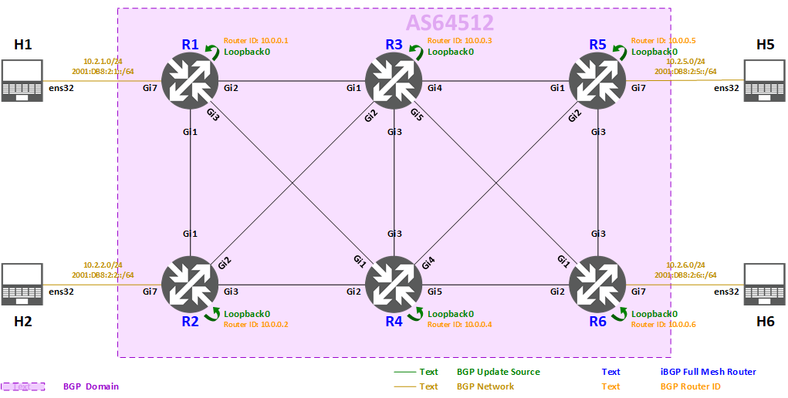

<span style="display:block;text-align:center"></span>
#<center><b>Deploying BGP (Cisco IOS) Lab</b></center>


>###<center>**Task 3: iBGP Configuration for AS64512**
</center>


>[!alert] Please make sure all previous tasks work as expected and you understand them before doing this task.



Now we have IGP running in AS64512, and each router has connectivity to all other routers, so we can go ahead to implement **Border Gateway Protocol (BGP)** on all the routers in AS64512 for providing reachability between the customers (H1, H2, H5, H6).

> There are two types of BGP neighbor relationships:
> 
> * **internal BGP (iBGP)**
> 	* Peering between routers inside an AS
> 	* Not required to be directly connected, usually formed between router's Loopbacks
> 		* IGP takes care of underlying connectivity between Loopbacks
> 	* AS_PATH is not manipulated
> 	* By default, NEXT_HOP is unchanged
> 	* iBGP must be fully meshed
> 		* iBGP does not pass on prefixes learned from other iBGP neighbors
> * **external BGP (eBGP)**
> 	* Peering between routers from different ASes
> 	* Almost always formed between directly connected peers (AS edge / border routers)
> 		* Multi-hop configuration is required if peers are not directly connected
> 	* Prepend own ASN to advertised prefix's AS_PATH
> 	* By default, NEXT_HOP is changed to self
> 
> **Multiprotocol Border Gateway Protocol (MP-BGP)** was defined in [RFC4760](https://tools.ietf.org/html/rfc4760), it is an extension to Border Gateway Protocol (BGP) that allows different types of addresses (known as Address Families) to be distributed in parallel. Whereas standard BGP supports only IPv4 Unicast addresses, MP-BGP supports IPv4 and IPv6 addresses and it supports Unicast and Multicast variants of each.

In this task, we will configure the iBGP for AS64512, and we will use:

* IPv4 Unicast Address Family for routing IPv4
* IPv6 Unicast Address Family for routing IPv6

>[!knowledge] Technically, it is possible to run only single BGP session to carry both Address Families (IPv4 Unicast and IPv6 Unicast), or run separate BGP sessions for IPv4 Unicast and IPv6 Unicast.

We will demonstrate running separate BGP sessions for IPv4 Unicast and IPv6 Unicast in this lab:

* IPv4 transport for the BGP sessions of IPv4 Unicast Address Family
* IPv6 transport for the BGP sessions of IPv6 Unicast Address Family


### **iBGP configuration summary** ###

>* **Autonomous System Number (ASN): 64512**
* Router ID: (Use router's IPv4 Loopback)
* **Full mesh iBGP**
	* R1 peers with R2, R3, R4, R5, R6
	* R2 peers with R1, R3, R4, R5, R6
	* R3 peers with R1, R2, R4, R5, R6
	* R4 peers with R1, R2, R3, R5, R6
	* R5 peers with R1, R2, R3, R4, R6
	* R6 peers with R1, R2, R3, R4, R5
* Remote address: **peer's Loopback**
* Update source: **own Loopback**
* Originate BGP networks:
	* R1
		* 10.2.1.0/24, 2001:DB8:2:1::/64
	* R2
		* 10.2.2.0/24, 2001:DB8:2:2::/64
	* R5
		* 10.2.5.0/24, 2001:DB8:2:5::/64
	* R6
		* 10.2.6.0/24, 2001:DB8:2:6::/64
* Address Families:
	* **IPv4 Unicast** (on IPv4 transport)
	* **IPv6 Unicast** (on IPv6 transport) 


####**There are 4 steps in this task:**

* [Step 3.1: Configuring iBGP for AS64512](#step-31-configuring-ibgp-for-as64512)

* [Step 3.2: Verifying BGP neighbors and BGP table](#step-32-verifying-bgp-neighbors-and-bgp-table)

* [Step 3.3: Verifying IPv4 and IPv6 routing table](#step-33-verifying-ipv4-and-ipv6-routing-table)

* [Step 3.4: Verifying IPv4 and IPv6 reachability](#step-34-verifying-ipv4-and-ipv6-reachability)


##**Step 3.1: Configuring iBGP for AS64512**

In this step, we will configure MP-BGP IPv4 Unicast Address Family and IPv6 Unicast Address Family at the same time.

>[!knowledge] By default, IOS has enabled IPv4 Unicast Address Family for all BGP sessions, to disable this behavior, use `no bgp default ipv4-unicast` command under `router bgp [asn]` configuration.

>[!knowledge] In Cisco IOS, you can group BGP neighbors who share the same outbound policies together in what is called a BGP peer group. Instead of configuring each neighbor with the same policy individually, a peer group allows you to group the policies which can be applied to individual peers thus making efficient update calculation along with simplified configuration. For more information about peer group, please refer to [here](https://www.cisco.com/c/en/us/support/docs/ip/border-gateway-protocol-bgp/13755-29.html).

We will simplify our iBGP configuration by:

* creating a peer group with common configuration (remote ASN, update source)
* adding all iBGP neighbors as members of the peer group


#### **Step 3.1.1: Configuring iBGP on R1** ####

- Select R1 from the Resources tab.

	```powershell-nocode
	Username: apnic
	Password: training
    ```

- The commands below must be run in the privileged exec mode. Type `enable` to enter this mode.

    ```powershell-nocode
	enable
	Password: labconfig
    ```

- Here is the link of IMAGE[Network Topology](images/topology_l3addr.png) with IP addresses for your reference.

- Here is the iBGP configuration on **R1**:

	```
	configure terminal
	
	!
	! Enter BGP configuration for AS64512
	router bgp 64512
	 !
	 ! Hardcode Loopback IPv4 address as BGP Router ID
	 bgp router-id 10.0.0.1
	 !
	 ! Log event details when BGP neighbor changes
	 bgp log-neighbor-changes
	 !
	 ! Do not enable IPv4 Unicast Address Family by default
	 no bgp default ipv4-unicast
	 !
	 ! Create a new peer group for IPv4 Unicast: IBGP-IPV4
	 neighbor IBGP-IPV4 peer-group
	 !
	 ! Configure remote ASN of IBGP-IPV4 peer group: 64512 (iBGP)
	 neighbor IBGP-IPV4 remote-as 64512
	 !
	 ! Use Loopback0 as source interface for BGP sessions of IBGP-IPV4 peer group
	 neighbor IBGP-IPV4 update-source Loopback0
	 !
	 ! Add 10.0.0.2 as a member of IBGP-IPV4 peer group
	 neighbor 10.0.0.2 peer-group IBGP-IPV4
	 neighbor 10.0.0.3 peer-group IBGP-IPV4
	 neighbor 10.0.0.4 peer-group IBGP-IPV4
	 neighbor 10.0.0.5 peer-group IBGP-IPV4
	 neighbor 10.0.0.6 peer-group IBGP-IPV4
	 !
	 ! Create a new peer group for IPv6 Unicast: IBGP-IPV6
	 neighbor IBGP-IPV6 peer-group
	 !
	 ! Configure remote ASN of IBGP-IPV6 peer group: 64512 (iBGP)
	 neighbor IBGP-IPV6 remote-as 64512
	 !
	 ! Use Loopback0 as source interface for BGP sessions of IBGP-IPV6 peer group
	 neighbor IBGP-IPV6 update-source Loopback0
	 !
	 ! Add 2001:DB8::2 as a member of IBGP-IPV6 peer group
	 neighbor 2001:DB8::2 peer-group IBGP-IPV6
	 neighbor 2001:DB8::3 peer-group IBGP-IPV6
	 neighbor 2001:DB8::4 peer-group IBGP-IPV6
	 neighbor 2001:DB8::5 peer-group IBGP-IPV6
	 neighbor 2001:DB8::6 peer-group IBGP-IPV6
	
	 !
	 ! Enter IPv4 Unicast Address Family configuration
	 address-family ipv4 unicast
	  !
	  ! Advertise prefix into BGP: 10.2.1.0/24
	  network 10.2.1.0 mask 255.255.255.0
	  !
	  ! Enable IPv4 Unicast Address Family capability
	  neighbor 10.0.0.2 activate
	  neighbor 10.0.0.3 activate
	  neighbor 10.0.0.4 activate
	  neighbor 10.0.0.5 activate
	  neighbor 10.0.0.6 activate
	 !
	 ! Exit IPv4 Unicast Address Family configuration
	 exit-address-family
	
	 !
	 ! Enter IPv6 Unicast Address Family configuration
	 address-family ipv6 unicast
	  !
	  ! Advertise prefix into BGP: 2001:DB8:2:1::/64
	  network 2001:DB8:2:1::/64
	  !
	  ! Enable IPv6 Unicast Address Family capability
	  neighbor 2001:DB8::2 activate
	  neighbor 2001:DB8::3 activate
	  neighbor 2001:DB8::4 activate
	  neighbor 2001:DB8::5 activate
	  neighbor 2001:DB8::6 activate
	 !
	 ! Exit IPv6 Unicast Address Family configuration
	 exit-address-family
	
	end
	```


#### **Step 3.1.2: Configuring iBGP on R2** ####

- Select R2 from the Resources tab.

	```powershell-nocode
	Username: apnic
	Password: training
    ```

- The commands below must be run in the privileged exec mode. Type `enable` to enter this mode.

    ```powershell-nocode
	enable
	Password: labconfig
    ```

- Here is the link of IMAGE[Network Topology](images/topology_l3addr.png) with IP addresses for your reference.

- Here is the iBGP configuration on **R2**:

	```
	configure terminal
	
	router bgp 64512
	 bgp router-id 10.0.0.2
	 bgp log-neighbor-changes
	 no bgp default ipv4-unicast
	 neighbor IBGP-IPV4 peer-group
	 neighbor IBGP-IPV4 remote-as 64512
	 neighbor IBGP-IPV4 update-source Loopback0
	 neighbor 10.0.0.1 peer-group IBGP-IPV4
	 neighbor 10.0.0.3 peer-group IBGP-IPV4
	 neighbor 10.0.0.4 peer-group IBGP-IPV4
	 neighbor 10.0.0.5 peer-group IBGP-IPV4
	 neighbor 10.0.0.6 peer-group IBGP-IPV4
	 neighbor IBGP-IPV6 peer-group
	 neighbor IBGP-IPV6 remote-as 64512
	 neighbor IBGP-IPV6 update-source Loopback0
	 neighbor 2001:DB8::1 peer-group IBGP-IPV6
	 neighbor 2001:DB8::3 peer-group IBGP-IPV6
	 neighbor 2001:DB8::4 peer-group IBGP-IPV6
	 neighbor 2001:DB8::5 peer-group IBGP-IPV6
	 neighbor 2001:DB8::6 peer-group IBGP-IPV6
	
	 address-family ipv4 unicast
	  network 10.2.2.0 mask 255.255.255.0
	  neighbor 10.0.0.1 activate
	  neighbor 10.0.0.3 activate
	  neighbor 10.0.0.4 activate
	  neighbor 10.0.0.5 activate
	  neighbor 10.0.0.6 activate
	 exit-address-family
	
	 address-family ipv6 unicast
	  network 2001:DB8:2:2::/64
	  neighbor 2001:DB8::1 activate
	  neighbor 2001:DB8::3 activate
	  neighbor 2001:DB8::4 activate
	  neighbor 2001:DB8::5 activate
	  neighbor 2001:DB8::6 activate
	 exit-address-family
	
	end
	```


#### **Step 3.1.3: Configuring iBGP on R3** ####

- Select R3 from the Resources tab.

	```powershell-nocode
	Username: apnic
	Password: training
    ```

- The commands below must be run in the privileged exec mode. Type `enable` to enter this mode.

    ```powershell-nocode
	enable
	Password: labconfig
    ```

- Here is the link of IMAGE[Network Topology](images/topology_l3addr.png) with IP addresses for your reference.

- Here is the iBGP configuration on **R3**:

	```
	configure terminal
	
	router bgp 64512
	 bgp router-id 10.0.0.3
	 bgp log-neighbor-changes
	 no bgp default ipv4-unicast
	 neighbor IBGP-IPV4 peer-group
	 neighbor IBGP-IPV4 remote-as 64512
	 neighbor IBGP-IPV4 update-source Loopback0
	 neighbor 10.0.0.1 peer-group IBGP-IPV4
	 neighbor 10.0.0.2 peer-group IBGP-IPV4
	 neighbor 10.0.0.4 peer-group IBGP-IPV4
	 neighbor 10.0.0.5 peer-group IBGP-IPV4
	 neighbor 10.0.0.6 peer-group IBGP-IPV4
	 neighbor IBGP-IPV6 peer-group
	 neighbor IBGP-IPV6 remote-as 64512
	 neighbor IBGP-IPV6 update-source Loopback0
	 neighbor 2001:DB8::1 peer-group IBGP-IPV6
	 neighbor 2001:DB8::2 peer-group IBGP-IPV6
	 neighbor 2001:DB8::4 peer-group IBGP-IPV6
	 neighbor 2001:DB8::5 peer-group IBGP-IPV6
	 neighbor 2001:DB8::6 peer-group IBGP-IPV6
	
	 address-family ipv4 unicast
	  neighbor 10.0.0.1 activate
	  neighbor 10.0.0.2 activate
	  neighbor 10.0.0.4 activate
	  neighbor 10.0.0.5 activate
	  neighbor 10.0.0.6 activate
	 exit-address-family
	
	 address-family ipv6 unicast
	  neighbor 2001:DB8::1 activate
	  neighbor 2001:DB8::2 activate
	  neighbor 2001:DB8::4 activate
	  neighbor 2001:DB8::5 activate
	  neighbor 2001:DB8::6 activate
	 exit-address-family
	
	end
	```


#### **Step 3.1.4: Configuring iBGP on R4** ####

- Select R4 from the Resources tab.

	```powershell-nocode
	Username: apnic
	Password: training
    ```

- The commands below must be run in the privileged exec mode. Type `enable` to enter this mode.

    ```powershell-nocode
	enable
	Password: labconfig
    ```

- Here is the link of IMAGE[Network Topology](images/topology_l3addr.png) with IP addresses for your reference.

- Here is the iBGP configuration on **R4**:

	```
	configure terminal
	
	router bgp 64512
	 bgp router-id 10.0.0.4
	 bgp log-neighbor-changes
	 no bgp default ipv4-unicast
	 neighbor IBGP-IPV4 peer-group
	 neighbor IBGP-IPV4 remote-as 64512
	 neighbor IBGP-IPV4 update-source Loopback0
	 neighbor 10.0.0.1 peer-group IBGP-IPV4
	 neighbor 10.0.0.2 peer-group IBGP-IPV4
	 neighbor 10.0.0.3 peer-group IBGP-IPV4
	 neighbor 10.0.0.5 peer-group IBGP-IPV4
	 neighbor 10.0.0.6 peer-group IBGP-IPV4
	 neighbor IBGP-IPV6 peer-group
	 neighbor IBGP-IPV6 remote-as 64512
	 neighbor IBGP-IPV6 update-source Loopback0
	 neighbor 2001:DB8::1 peer-group IBGP-IPV6
	 neighbor 2001:DB8::2 peer-group IBGP-IPV6
	 neighbor 2001:DB8::3 peer-group IBGP-IPV6
	 neighbor 2001:DB8::5 peer-group IBGP-IPV6
	 neighbor 2001:DB8::6 peer-group IBGP-IPV6
	
	 address-family ipv4 unicast
	  neighbor 10.0.0.1 activate
	  neighbor 10.0.0.2 activate
	  neighbor 10.0.0.3 activate
	  neighbor 10.0.0.5 activate
	  neighbor 10.0.0.6 activate
	 exit-address-family
	
	 address-family ipv6 unicast
	  neighbor 2001:DB8::1 activate
	  neighbor 2001:DB8::2 activate
	  neighbor 2001:DB8::3 activate
	  neighbor 2001:DB8::5 activate
	  neighbor 2001:DB8::6 activate
	 exit-address-family
	
	end
	```


#### **Step 3.1.5: Configuring iBGP on R5** ####

- Select R5 from the Resources tab.

	```powershell-nocode
	Username: apnic
	Password: training
    ```

- The commands below must be run in the privileged exec mode. Type `enable` to enter this mode.

    ```powershell-nocode
	enable
	Password: labconfig
    ```

- Here is the link of IMAGE[Network Topology](images/topology_l3addr.png) with IP addresses for your reference.

- Here is the iBGP configuration on **R5**:

	```
	configure terminal
	
	router bgp 64512
	 bgp router-id 10.0.0.5
	 bgp log-neighbor-changes
	 no bgp default ipv4-unicast
	 neighbor IBGP-IPV4 peer-group
	 neighbor IBGP-IPV4 remote-as 64512
	 neighbor IBGP-IPV4 update-source Loopback0
	 neighbor 10.0.0.1 peer-group IBGP-IPV4
	 neighbor 10.0.0.2 peer-group IBGP-IPV4
	 neighbor 10.0.0.3 peer-group IBGP-IPV4
	 neighbor 10.0.0.4 peer-group IBGP-IPV4
	 neighbor 10.0.0.6 peer-group IBGP-IPV4
	 neighbor IBGP-IPV6 peer-group
	 neighbor IBGP-IPV6 remote-as 64512
	 neighbor IBGP-IPV6 update-source Loopback0
	 neighbor 2001:DB8::1 peer-group IBGP-IPV6
	 neighbor 2001:DB8::2 peer-group IBGP-IPV6
	 neighbor 2001:DB8::3 peer-group IBGP-IPV6
	 neighbor 2001:DB8::4 peer-group IBGP-IPV6
	 neighbor 2001:DB8::6 peer-group IBGP-IPV6
	
	 address-family ipv4 unicast
	  network 10.2.5.0 mask 255.255.255.0
	  neighbor 10.0.0.1 activate
	  neighbor 10.0.0.2 activate
	  neighbor 10.0.0.3 activate
	  neighbor 10.0.0.4 activate
	  neighbor 10.0.0.6 activate
	 exit-address-family
	
	 address-family ipv6 unicast
	  network 2001:DB8:2:5::/64
	  neighbor 2001:DB8::1 activate
	  neighbor 2001:DB8::2 activate
	  neighbor 2001:DB8::3 activate
	  neighbor 2001:DB8::4 activate
	  neighbor 2001:DB8::6 activate
	 exit-address-family
	
	end
	```


#### **Step 3.1.6: Configuring iBGP on R6** ####

- Select R6 from the Resources tab.

	```powershell-nocode
	Username: apnic
	Password: training
    ```

- The commands below must be run in the privileged exec mode. Type `enable` to enter this mode.

    ```powershell-nocode
	enable
	Password: labconfig
    ```

- Here is the link of IMAGE[Network Topology](images/topology_l3addr.png) with IP addresses for your reference.

- Here is the iBGP configuration on **R6**:

	```
	configure terminal
	
	router bgp 64512
	 bgp router-id 10.0.0.6
	 bgp log-neighbor-changes
	 no bgp default ipv4-unicast
	 neighbor IBGP-IPV4 peer-group
	 neighbor IBGP-IPV4 remote-as 64512
	 neighbor IBGP-IPV4 update-source Loopback0
	 neighbor 10.0.0.1 peer-group IBGP-IPV4
	 neighbor 10.0.0.2 peer-group IBGP-IPV4
	 neighbor 10.0.0.3 peer-group IBGP-IPV4
	 neighbor 10.0.0.4 peer-group IBGP-IPV4
	 neighbor 10.0.0.5 peer-group IBGP-IPV4
	 neighbor IBGP-IPV6 peer-group
	 neighbor IBGP-IPV6 remote-as 64512
	 neighbor IBGP-IPV6 update-source Loopback0
	 neighbor 2001:DB8::1 peer-group IBGP-IPV6
	 neighbor 2001:DB8::2 peer-group IBGP-IPV6
	 neighbor 2001:DB8::3 peer-group IBGP-IPV6
	 neighbor 2001:DB8::4 peer-group IBGP-IPV6
	 neighbor 2001:DB8::5 peer-group IBGP-IPV6
	
	 address-family ipv4 unicast
	  network 10.2.6.0 mask 255.255.255.0
	  neighbor 10.0.0.1 activate
	  neighbor 10.0.0.2 activate
	  neighbor 10.0.0.3 activate
	  neighbor 10.0.0.4 activate
	  neighbor 10.0.0.5 activate
	 exit-address-family
	
	 address-family ipv6 unicast
	  network 2001:DB8:2:6::/64
	  neighbor 2001:DB8::1 activate
	  neighbor 2001:DB8::2 activate
	  neighbor 2001:DB8::3 activate
	  neighbor 2001:DB8::4 activate
	  neighbor 2001:DB8::5 activate
	 exit-address-family
	
	end
	```


##**Step 3.2: Verifying BGP neighbors and BGP table**

>[!alert] Please perform this verification step only when you have fully completed previous configuration steps of this task.

Once we have done full mesh iBGP configuration on all routers in AS64512, we will verify whether BGP is running according to our configuration. We expect to see:

* each router has **established iBGP** sessions **with other routers** 
* R1, R2, R5, R6 are advertising their customer's prefix to other routers
	* **1 IPv4 Unicast prefix**
		* 10.2.R.0/24, R = router number
	* **1 IPv6 Unicast prefix**
		* 2001:DB8:2:R::/64, R = router number
* all routers have following prefixes in their BGP table
	* **4 IPv4 Unicast prefixes** from iBGP neighbors
		* 10.2.1.0/24, AS_PATH: (empty), NEXT_HOP: 10.0.0.1
		* 10.2.2.0/24, AS_PATH: (empty), NEXT_HOP: 10.0.0.2
		* 10.2.5.0/24, AS_PATH: (empty), NEXT_HOP: 10.0.0.5
		* 10.2.6.0/24, AS_PATH: (empty), NEXT_HOP: 10.0.0.6
	* **4 IPv6 Unicast prefixes** from iBGP neighbors
		* 2001:DB8:2:1::/64, AS_PATH: (empty), NEXT_HOP: 2001:DB8::1
		* 2001:DB8:2:2::/64, AS_PATH: (empty), NEXT_HOP: 2001:DB8::2
		* 2001:DB8:2:5::/64, AS_PATH: (empty), NEXT_HOP: 2001:DB8::5
		* 2001:DB8:2:6::/64, AS_PATH: (empty), NEXT_HOP: 2001:DB8::6
	* **NEXT_HOP** will show as **0.0.0.0 for IPv4** or **:: for IPv6** in BGP table, if a prefix is **locally originated by the router**

We will do verification with following commands:

* Showing BGP neighbors:
	* IPv4 Unicast: `show bgp ipv4 unicast summary` or `show ip bgp summary`
	* IPv6 Unicast: `show bgp ipv6 unicast summary`
* Showing detail information of specific neighbor (optional):
	* IPv4 Unicast: `show bgp ipv4 unicast neighbor [remote-address]` or `show ip bgp neighbor [remote-address]`
	* IPv6 Unicast: `show bgp ipv6 unicast neighbor [remote-address]`
* Showing prefixes advertised to specific neighbor (optional):
	* IPv4 Unicast: `show bgp ipv4 unicast neighbor [remote-address] advertised-routes` or `show ip bgp neighbor [remote-address] advertised-routes`
	* IPv6 Unicast: `show bgp ipv6 unicast neighbor [remote-address] advertised-routes`
* Showing BGP table:
	* IPv4 Unicast: `show bgp ipv4 unicast` or `show ip bgp`
	* IPv6 Unicast: `show bgp ipv6 unicast`
* Showing detail information of specific BGP prefix (optional):
	* IPv4 Unicast: `show bgp ipv4 unicast [prefix]/[len]` or `show ip bgp [prefix]/[len]` 
	* IPv6 Unicast: `show bgp ipv6 unicast [prefix]/[len]`


#### **Step 3.2.1: Verifying BGP neighbors and BGP table on R1** ####

- Select R1 from the Resources tab.

	```powershell-nocode
	Username: apnic
	Password: training
    ```

- The commands below must be run in the privileged exec mode. Type `enable` to enter this mode.

    ```powershell-nocode
	enable
	Password: labconfig
    ```

- Here is the link of IMAGE[Network Topology](images/topology_l3addr.png) with IP addresses for your reference.

- To check IPv4 Unicast BGP neighbors, type `show bgp ipv4 unicast summary`, the result is as shown below:

    ```powershell-nocode
	R1#show bgp ipv4 unicast summary
	BGP router identifier 10.0.0.1, local AS number 64512
	BGP table version is 5, main routing table version 5
	4 network entries using 992 bytes of memory
	4 path entries using 512 bytes of memory
	4/4 BGP path/bestpath attribute entries using 1056 bytes of memory
	0 BGP route-map cache entries using 0 bytes of memory
	0 BGP filter-list cache entries using 0 bytes of memory
	BGP using 2560 total bytes of memory
	BGP activity 46/38 prefixes, 46/38 paths, scan interval 60 secs
	
	Neighbor        V           AS MsgRcvd MsgSent   TblVer  InQ OutQ Up/Down  State/PfxRcd
	10.0.0.2        4        64512       5       5        5    0    0 00:01:07        1
	10.0.0.3        4        64512       4       5        5    0    0 00:01:09        0
	10.0.0.4        4        64512       4       5        5    0    0 00:01:06        0
	10.0.0.5        4        64512       5       5        5    0    0 00:01:08        1
	10.0.0.6        4        64512       5       5        5    0    0 00:01:03        1
    ```

- To check IPv6 Unicast BGP neighbors, type `show bgp ipv6 unicast summary`, the result is as shown below:

    ```powershell-nocode
	R1#show bgp ipv6 unicast summary
	BGP router identifier 10.0.0.1, local AS number 64512
	BGP table version is 5, main routing table version 5
	4 network entries using 1088 bytes of memory
	4 path entries using 608 bytes of memory
	4/4 BGP path/bestpath attribute entries using 1056 bytes of memory
	0 BGP route-map cache entries using 0 bytes of memory
	0 BGP filter-list cache entries using 0 bytes of memory
	BGP using 2752 total bytes of memory
	BGP activity 46/38 prefixes, 46/38 paths, scan interval 60 secs
	
	Neighbor        V           AS MsgRcvd MsgSent   TblVer  InQ OutQ Up/Down  State/PfxRcd
	2001:DB8::2     4        64512       5       5        5    0    0 00:01:21        1
	2001:DB8::3     4        64512       4       5        5    0    0 00:01:24        0
	2001:DB8::4     4        64512       4       5        5    0    0 00:01:22        0
	2001:DB8::5     4        64512       5       5        5    0    0 00:01:24        1
	2001:DB8::6     4        64512       5       5        5    0    0 00:01:24        1
    ```

- To check detail information of IPv4 Unicast BGP neighbor 10.0.0.6 (R6), type `show bgp ipv4 unicast neighbor 10.0.0.6`, the result is shown as below:

    ```powershell-nocode

	R1#show bgp ipv4 unicast neighbor 10.0.0.6
	BGP neighbor is 10.0.0.6,  remote AS 64512, internal link
	 Member of peer-group IBGP-IPV4 for session parameters
	  BGP version 4, remote router ID 10.0.0.6
	  BGP state = Established, up for 00:01:30
	  Last read 00:00:35, last write 00:00:36, hold time is 180, keepalive interval is 60 seconds
	  Neighbor sessions:
	    1 active, is not multisession capable (disabled)
	  Neighbor capabilities:
	    Route refresh: advertised and received(new)
	    Four-octets ASN Capability: advertised and received
	    Address family IPv4 Unicast: advertised and received
	    Enhanced Refresh Capability: advertised and received
	    Multisession Capability:
	    Stateful switchover support enabled: NO for session 1
	  Message statistics:
	    InQ depth is 0
	    OutQ depth is 0
	
	                         Sent       Rcvd
	    Opens:                  1          1
	    Notifications:          0          0
	    Updates:                2          2
	    Keepalives:             2          2
	    Route Refresh:          0          0
	    Total:                  5          5
	  Do log neighbor state changes (via global configuration)
	  Default minimum time between advertisement runs is 0 seconds
		
	 For address family: IPv4 Unicast
	  Session: 10.0.0.6
	  BGP table version 5, neighbor version 5/0
	  Output queue size : 0
	  Index 6, Advertise bit 0
	  6 update-group member
	  IBGP-IPV4 peer-group member
	  Slow-peer detection is disabled
	  Slow-peer split-update-group dynamic is disabled
	                                 Sent       Rcvd
	  Prefix activity:               ----       ----
	    Prefixes Current:               1          1 (Consumes 128 bytes)
	    Prefixes Total:                 1          1
	    Implicit Withdraw:              0          0
	    Explicit Withdraw:              0          0
	    Used as bestpath:             n/a          1
	    Used as multipath:            n/a          0
	    Used as secondary:            n/a          0
	
	                                   Outbound    Inbound
	  Local Policy Denied Prefixes:    --------    -------
	    Bestpath from this peer:              1        n/a
	    Bestpath from iBGP peer:              2        n/a
	    Total:                                3          0
	  Number of NLRIs in the update sent: max 1, min 0
	  Last detected as dynamic slow peer: never
	  Dynamic slow peer recovered: never
	  Refresh Epoch: 1
	  Last Sent Refresh Start-of-rib: never
	  Last Sent Refresh End-of-rib: never
	  Last Received Refresh Start-of-rib: never
	  Last Received Refresh End-of-rib: never
		                                       Sent       Rcvd
	        Refresh activity:              ----       ----
	          Refresh Start-of-RIB          0          0
	          Refresh End-of-RIB            0          0
	
	  Address tracking is enabled, the RIB does have a route to 10.0.0.6
	  Route to peer address reachability Up: 1; Down: 0
	    Last notification 01:18:49
	  Connections established 6; dropped 5
	  Last reset 00:01:41, due to Active open failed
	  Interface associated: (none) (peering address NOT in same link)
	  Transport(tcp) path-mtu-discovery is enabled
	  Graceful-Restart is disabled
	  SSO is disabled
	Connection state is ESTAB, I/O status: 1, unread input bytes: 0
	Connection is ECN Disabled, Mininum incoming TTL 0, Outgoing TTL 255
	Local host: 10.0.0.1, Local port: 31183
	Foreign host: 10.0.0.6, Foreign port: 179
	Connection tableid (VRF): 0
	Maximum output segment queue size: 50
		
	Enqueued packets for retransmit: 0, input: 0  mis-ordered: 0 (0 bytes)
		
	Event Timers (current time is 0x2DAA664):
	Timer          Starts    Wakeups            Next
	Retrans             4          0             0x0
	TimeWait            0          0             0x0
	AckHold             4          2             0x0
	SendWnd             0          0             0x0
	KeepAlive           0          0             0x0
	GiveUp              0          0             0x0
	PmtuAger            1          0       0x2E26E68
	DeadWait            0          0             0x0
	Linger              0          0             0x0
	ProcessQ            0          0             0x0
		
	iss: 2871734915  snduna: 2871735089  sndnxt: 2871735089
	irs: 1735247122  rcvnxt: 1735247296
		
	sndwnd:  16211  scale:      0  maxrcvwnd:  16384
	rcvwnd:  16211  scale:      0  delrcvwnd:    173
		
	SRTT: 413 ms, RTTO: 3205 ms, RTV: 2792 ms, KRTT: 0 ms
	minRTT: 2 ms, maxRTT: 1000 ms, ACK hold: 200 ms
	uptime: 90046 ms, Sent idletime: 35545 ms, Receive idletime: 35746 ms
	Status Flags: active open
	Option Flags: nagle, path mtu capable
	IP Precedence value : 6
		
	Datagrams (max data segment is 1460 bytes):
	Rcvd: 8 (out of order: 0), with data: 4, total data bytes: 173
	Sent: 9 (retransmit: 0, fastretransmit: 0, partialack: 0, Second Congestion: 0), with data: 4, total data bytes: 173
		
	 Packets received in fast path: 0, fast processed: 0, slow path: 0
	 fast lock acquisition failures: 0, slow path: 0
	TCP Semaphore      0x7FE73BE70770  FREE
    ```

- To check IPv4 Unicast prefixes advertised to BGP neighbor 10.0.0.6 (R6), type `show bgp ipv4 unicast neighbors 10.0.0.6 advertised-routes`, the result is shown as below:

    ```powershell-nocode
	R1#show bgp ipv4 unicast neighbors 10.0.0.6 advertised-routes
	BGP table version is 5, local router ID is 10.0.0.1
	Status codes: s suppressed, d damped, h history, * valid, > best, i - internal,
	              r RIB-failure, S Stale, m multipath, b backup-path, f RT-Filter,
	              x best-external, a additional-path, c RIB-compressed,
	              t secondary path,
	Origin codes: i - IGP, e - EGP, ? - incomplete
	RPKI validation codes: V valid, I invalid, N Not found
	
	     Network          Next Hop            Metric LocPrf Weight Path
	 *>   10.2.1.0/24      0.0.0.0                  0         32768 i		<-- Customer H1
	
	Total number of prefixes 1
    ```

- To check IPv4 Unicast BGP table, type `show bgp ipv4 unicast`, the result is shown as below:

    ```powershell-nocode
	R1#show bgp ipv4 unicast
	BGP table version is 5, local router ID is 10.0.0.1
	Status codes: s suppressed, d damped, h history, * valid, > best, i - internal,
	              r RIB-failure, S Stale, m multipath, b backup-path, f RT-Filter,
	              x best-external, a additional-path, c RIB-compressed,
	              t secondary path,
	Origin codes: i - IGP, e - EGP, ? - incomplete
	RPKI validation codes: V valid, I invalid, N Not found
	
	     Network          Next Hop            Metric LocPrf Weight Path
	 *>   10.2.1.0/24      0.0.0.0                  0         32768 i		<-- Customer H1 (originated)
	 *>i  10.2.2.0/24      10.0.0.2                 0    100      0 i		<-- Customer H2
	 *>i  10.2.5.0/24      10.0.0.5                 0    100      0 i		<-- Customer H5
	 *>i  10.2.6.0/24      10.0.0.6                 0    100      0 i		<-- Customer H6
    ```

- To check IPv6 Unicast BGP table, type `show bgp ipv6 unicast`, the result is shown as below:

    ```powershell-nocode
	R1#show bgp ipv6 unicast
	BGP table version is 5, local router ID is 10.0.0.1
	Status codes: s suppressed, d damped, h history, * valid, > best, i - internal,
	              r RIB-failure, S Stale, m multipath, b backup-path, f RT-Filter,
	              x best-external, a additional-path, c RIB-compressed,
	              t secondary path,
	Origin codes: i - IGP, e - EGP, ? - incomplete
	RPKI validation codes: V valid, I invalid, N Not found
	
	     Network          Next Hop            Metric LocPrf Weight Path
	 *>   2001:DB8:2:1::/64													<-- Customer H1 (originated)
	                       ::                       0         32768 i
	 *>i  2001:DB8:2:2::/64													<-- Customer H2
	                       2001:DB8::2              0    100      0 i
	 *>i  2001:DB8:2:5::/64													<-- Customer H5
	                       2001:DB8::5              0    100      0 i
	 *>i  2001:DB8:2:6::/64													<-- Customer H6
	                       2001:DB8::6              0    100      0 i
    ```

- To check detail information of IPv4 Unicast BGP prefix 10.2.6.0/24 (Customer H6), type `show bgp ipv4 unicast 10.2.6.0/24`, the result is shown as below:

    ```powershell-nocode
	R1#show bgp ipv4 unicast 10.2.6.0/24
	BGP routing table entry for 10.2.6.0/24, version 3
	Paths: (1 available, best #1, table default)
	Flag: 0x100
	  Not advertised to any peer											<-- Not advertised to others
	  Refresh Epoch 1
	  Local																	<-- Originated by Local AS
	    10.0.0.6 (metric 30) from 10.0.0.6 (10.0.0.6)						<-- Next hop is 10.0.0.6 (R6)
	      Origin IGP, metric 0, localpref 100, valid, internal, best		<-- iBGP, best path
	      rx pathid: 0, tx pathid: 0x0
    ```

From above output, we can know that:

* R1 is running BGP with **ASN 64512**
* R1 has **established** BGP session with **10 neighbors**
	* **5 neighbors** with IPv4 transport
	* **5 neighbors** with IPv6 transport
* **All neighbors** are **iBGP neighbors** (same local and remote ASN)
	* **5 neighbors** have enabled **IPv4 Unicast** Address Family
		* 10.0.0.2 (R2)
		* 10.0.0.3 (R3)
		* 10.0.0.4 (R4)
		* 10.0.0.5 (R5)
		* 10.0.0.6 (R6)
	* **5 neighbors** have enabled **IPv6 Unicast** Address Family
		* 2001:DB8::2 (R2)
		* 2001:DB8::3 (R3)
		* 2001:DB8::4 (R4)
		* 2001:DB8::5 (R5)
		* 2001:DB8::6 (R6)
* **1 IPv4 Unicast prefix** locally originated by **R1**
	* 10.2.1.0/24
* **1 IPv6 Unicast prefix** locally originated by **R1**
	* 2001:DB8:2:1::/64
* **1 IPv4 Unicast prefix** received from **each neighbor that has a customer**
	* 10.2.2.0/24 from 10.0.0.2 (R2)
	* 10.2.5.0/24 from 10.0.0.5 (R5)
	* 10.2.6.0/24 from 10.0.0.6 (R6)
* **1 IPv6 Unicast prefix** received from **each neighbor that has a customer**
	* 2001:DB8:2:2::/64 from 2001:DB8::2 (R2)
	* 2001:DB8:2:5::/64 from 2001:DB8::5 (R5)
	* 2001:DB8:2:6::/64 from 2001:DB8::6 (R6)


#### **Step 3.2.2: Verifying BGP neighbors and BGP table on R2** ####

- Select R2 from the Resources tab.

	```powershell-nocode
	Username: apnic
	Password: training
    ```

- The commands below must be run in the privileged exec mode. Type `enable` to enter this mode.

    ```powershell-nocode
	enable
	Password: labconfig
    ```

- Here is the link of IMAGE[Network Topology](images/topology_l3addr.png) with IP addresses for your reference.

- To check IPv4 Unicast BGP neighbors, type `show bgp ipv4 unicast summary`, the result is as shown below:

    ```powershell-nocode
	R2#show bgp ipv4 unicast summary
	BGP router identifier 10.0.0.2, local AS number 64512
	BGP table version is 5, main routing table version 5
	4 network entries using 992 bytes of memory
	4 path entries using 512 bytes of memory
	4/4 BGP path/bestpath attribute entries using 1056 bytes of memory
	0 BGP route-map cache entries using 0 bytes of memory
	0 BGP filter-list cache entries using 0 bytes of memory
	BGP using 2560 total bytes of memory
	BGP activity 34/26 prefixes, 34/26 paths, scan interval 60 secs
	
	Neighbor        V           AS MsgRcvd MsgSent   TblVer  InQ OutQ Up/Down  State/PfxRcd
	10.0.0.1        4        64512       5       5        5    0    0 00:01:08        1
	10.0.0.3        4        64512       4       5        5    0    0 00:01:03        0
	10.0.0.4        4        64512       4       5        5    0    0 00:01:05        0
	10.0.0.5        4        64512       5       5        5    0    0 00:01:08        1
	10.0.0.6        4        64512       5       5        5    0    0 00:01:08        1
    ```

- To check IPv6 Unicast BGP neighbors, type `show bgp ipv6 unicast summary`, the result is as shown below:

    ```powershell-nocode
	R2#show bgp ipv6 unicast summary
	BGP router identifier 10.0.0.2, local AS number 64512
	BGP table version is 5, main routing table version 5
	4 network entries using 1088 bytes of memory
	4 path entries using 608 bytes of memory
	4/4 BGP path/bestpath attribute entries using 1056 bytes of memory
	0 BGP route-map cache entries using 0 bytes of memory
	0 BGP filter-list cache entries using 0 bytes of memory
	BGP using 2752 total bytes of memory
	BGP activity 34/26 prefixes, 34/26 paths, scan interval 60 secs
	
	Neighbor        V           AS MsgRcvd MsgSent   TblVer  InQ OutQ Up/Down  State/PfxRcd
	2001:DB8::1     4        64512       5       5        5    0    0 00:01:21        1
	2001:DB8::3     4        64512       4       5        5    0    0 00:01:24        0
	2001:DB8::4     4        64512       4       5        5    0    0 00:01:22        0
	2001:DB8::5     4        64512       5       5        5    0    0 00:01:20        1
	2001:DB8::6     4        64512       5       5        5    0    0 00:01:21        1
    ```

- To check IPv4 Unicast BGP table, type `show bgp ipv4 unicast`, the result is shown as below:

    ```powershell-nocode
	R2#show bgp ipv4 unicast
	BGP table version is 5, local router ID is 10.0.0.2
	Status codes: s suppressed, d damped, h history, * valid, > best, i - internal,
	              r RIB-failure, S Stale, m multipath, b backup-path, f RT-Filter,
	              x best-external, a additional-path, c RIB-compressed,
	              t secondary path,
	Origin codes: i - IGP, e - EGP, ? - incomplete
	RPKI validation codes: V valid, I invalid, N Not found
	
	     Network          Next Hop            Metric LocPrf Weight Path
	 *>i  10.2.1.0/24      10.0.0.1                 0    100      0 i		<-- Customer H1
	 *>   10.2.2.0/24      0.0.0.0                  0         32768 i		<-- Customer H2 (originated)
	 *>i  10.2.5.0/24      10.0.0.5                 0    100      0 i		<-- Customer H5
	 *>i  10.2.6.0/24      10.0.0.6                 0    100      0 i		<-- Customer H6
    ```

- To check IPv6 Unicast BGP table, type `show bgp ipv6 unicast`, the result is shown as below:

    ```powershell-nocode
	R2#show bgp ipv6 unicast
	BGP table version is 5, local router ID is 10.0.0.2
	Status codes: s suppressed, d damped, h history, * valid, > best, i - internal,
	              r RIB-failure, S Stale, m multipath, b backup-path, f RT-Filter,
	              x best-external, a additional-path, c RIB-compressed,
	              t secondary path,
	Origin codes: i - IGP, e - EGP, ? - incomplete
	RPKI validation codes: V valid, I invalid, N Not found
	
	     Network          Next Hop            Metric LocPrf Weight Path
	 *>i  2001:DB8:2:1::/64													<-- Customer H1
	                       2001:DB8::1              0    100      0 i
	 *>   2001:DB8:2:2::/64													<-- Customer H2 (originated)
	                       ::                       0         32768 i
	 *>i  2001:DB8:2:5::/64													<-- Customer H5
	                       2001:DB8::5              0    100      0 i
	 *>i  2001:DB8:2:6::/64													<-- Customer H6
	                       2001:DB8::6              0    100      0 i
    ```


#### **Step 3.2.3: Verifying BGP neighbors and BGP table on R3** ####

- Select R3 from the Resources tab.

	```powershell-nocode
	Username: apnic
	Password: training
    ```

- The commands below must be run in the privileged exec mode. Type `enable` to enter this mode.

    ```powershell-nocode
	enable
	Password: labconfig
    ```

- Here is the link of IMAGE[Network Topology](images/topology_l3addr.png) with IP addresses for your reference.

- To check IPv4 Unicast BGP neighbors, type `show bgp ipv4 unicast summary`, the result is as shown below:

    ```powershell-nocode
	R3#show bgp ipv4 unicast summary
	BGP router identifier 10.0.0.3, local AS number 64512
	BGP table version is 5, main routing table version 5
	4 network entries using 992 bytes of memory
	4 path entries using 512 bytes of memory
	4/4 BGP path/bestpath attribute entries using 1056 bytes of memory
	0 BGP route-map cache entries using 0 bytes of memory
	0 BGP filter-list cache entries using 0 bytes of memory
	BGP using 2560 total bytes of memory
	BGP activity 34/26 prefixes, 34/26 paths, scan interval 60 secs
	
	Neighbor        V           AS MsgRcvd MsgSent   TblVer  InQ OutQ Up/Down  State/PfxRcd
	10.0.0.1        4        64512       5       4        5    0    0 00:01:10        1
	10.0.0.2        4        64512       5       4        5    0    0 00:01:04        1
	10.0.0.4        4        64512       4       4        5    0    0 00:01:09        0
	10.0.0.5        4        64512       5       4        5    0    0 00:01:09        1
	10.0.0.6        4        64512       5       4        5    0    0 00:01:07        1
    ```

- To check IPv6 Unicast BGP neighbors, type `show bgp ipv6 unicast summary`, the result is as shown below:

    ```powershell-nocode
	R3#show bgp ipv6 unicast summary
	BGP router identifier 10.0.0.3, local AS number 64512
	BGP table version is 5, main routing table version 5
	4 network entries using 1088 bytes of memory
	4 path entries using 608 bytes of memory
	4/4 BGP path/bestpath attribute entries using 1056 bytes of memory
	0 BGP route-map cache entries using 0 bytes of memory
	0 BGP filter-list cache entries using 0 bytes of memory
	BGP using 2752 total bytes of memory
	BGP activity 34/26 prefixes, 34/26 paths, scan interval 60 secs
	
	Neighbor        V           AS MsgRcvd MsgSent   TblVer  InQ OutQ Up/Down  State/PfxRcd
	2001:DB8::1     4        64512       5       4        5    0    0 00:01:25        1
	2001:DB8::2     4        64512       5       4        5    0    0 00:01:24        1
	2001:DB8::4     4        64512       4       4        5    0    0 00:01:21        0
	2001:DB8::5     4        64512       5       4        5    0    0 00:01:24        1
	2001:DB8::6     4        64512       5       4        5    0    0 00:01:19        1
    ```

- To check IPv4 Unicast BGP table, type `show bgp ipv4 unicast`, the result is shown as below:

    ```powershell-nocode
	R3#show bgp ipv4 unicast
	BGP table version is 5, local router ID is 10.0.0.3
	Status codes: s suppressed, d damped, h history, * valid, > best, i - internal,
	              r RIB-failure, S Stale, m multipath, b backup-path, f RT-Filter,
	              x best-external, a additional-path, c RIB-compressed,
	              t secondary path,
	Origin codes: i - IGP, e - EGP, ? - incomplete
	RPKI validation codes: V valid, I invalid, N Not found
	
	     Network          Next Hop            Metric LocPrf Weight Path
	 *>i  10.2.1.0/24      10.0.0.1                 0    100      0 i		<-- Customer H1
	 *>i  10.2.2.0/24      10.0.0.2                 0    100      0 i		<-- Customer H2
	 *>i  10.2.5.0/24      10.0.0.5                 0    100      0 i		<-- Customer H5
	 *>i  10.2.6.0/24      10.0.0.6                 0    100      0 i		<-- Customer H6
    ```

- To check IPv6 Unicast BGP table, type `show bgp ipv6 unicast`, the result is shown as below:

    ```powershell-nocode
	R3#show bgp ipv6 unicast
	BGP table version is 5, local router ID is 10.0.0.3
	Status codes: s suppressed, d damped, h history, * valid, > best, i - internal,
	              r RIB-failure, S Stale, m multipath, b backup-path, f RT-Filter,
	              x best-external, a additional-path, c RIB-compressed,
	              t secondary path,
	Origin codes: i - IGP, e - EGP, ? - incomplete
	RPKI validation codes: V valid, I invalid, N Not found
	
	     Network          Next Hop            Metric LocPrf Weight Path
	 *>i  2001:DB8:2:1::/64													<-- Customer H1
	                       2001:DB8::1              0    100      0 i
	 *>i  2001:DB8:2:2::/64													<-- Customer H2
	                       2001:DB8::2              0    100      0 i
	 *>i  2001:DB8:2:5::/64													<-- Customer H5
	                       2001:DB8::5              0    100      0 i
	 *>i  2001:DB8:2:6::/64													<-- Customer H6
	                       2001:DB8::6              0    100      0 i
    ```


#### **Step 3.2.4: Verifying BGP neighbors and BGP table on R4** ####

- Select R4 from the Resources tab.

	```powershell-nocode
	Username: apnic
	Password: training
    ```

- The commands below must be run in the privileged exec mode. Type `enable` to enter this mode.

    ```powershell-nocode
	enable
	Password: labconfig
    ```

- Here is the link of IMAGE[Network Topology](images/topology_l3addr.png) with IP addresses for your reference.

- To check IPv4 Unicast BGP neighbors, type `show bgp ipv4 unicast summary`, the result is as shown below:

    ```powershell-nocode
	R4#show bgp ipv4 unicast summary
	BGP router identifier 10.0.0.4, local AS number 64512
	BGP table version is 5, main routing table version 5
	4 network entries using 992 bytes of memory
	4 path entries using 512 bytes of memory
	4/4 BGP path/bestpath attribute entries using 1056 bytes of memory
	0 BGP route-map cache entries using 0 bytes of memory
	0 BGP filter-list cache entries using 0 bytes of memory
	BGP using 2560 total bytes of memory
	BGP activity 34/26 prefixes, 34/26 paths, scan interval 60 secs
	
	Neighbor        V           AS MsgRcvd MsgSent   TblVer  InQ OutQ Up/Down  State/PfxRcd
	10.0.0.1        4        64512       5       4        5    0    0 00:01:08        1
	10.0.0.2        4        64512       5       4        5    0    0 00:01:06        1
	10.0.0.3        4        64512       4       4        5    0    0 00:01:10        0
	10.0.0.5        4        64512       5       4        5    0    0 00:01:10        1
	10.0.0.6        4        64512       5       4        5    0    0 00:01:05        1
    ```

- To check IPv6 Unicast BGP neighbors, type `show bgp ipv6 unicast summary`, the result is as shown below:

    ```powershell-nocode
	R4#show bgp ipv6 unicast summary
	BGP router identifier 10.0.0.4, local AS number 64512
	BGP table version is 5, main routing table version 5
	4 network entries using 1088 bytes of memory
	4 path entries using 608 bytes of memory
	4/4 BGP path/bestpath attribute entries using 1056 bytes of memory
	0 BGP route-map cache entries using 0 bytes of memory
	0 BGP filter-list cache entries using 0 bytes of memory
	BGP using 2752 total bytes of memory
	BGP activity 34/26 prefixes, 34/26 paths, scan interval 60 secs
	
	Neighbor        V           AS MsgRcvd MsgSent   TblVer  InQ OutQ Up/Down  State/PfxRcd
	2001:DB8::1     4        64512       5       4        5    0    0 00:01:24        1
	2001:DB8::2     4        64512       5       4        5    0    0 00:01:23        1
	2001:DB8::3     4        64512       4       4        5    0    0 00:01:21        0
	2001:DB8::5     4        64512       5       4        5    0    0 00:01:24        1
	2001:DB8::6     4        64512       5       4        5    0    0 00:01:23        1
    ```

- To check IPv4 Unicast BGP table, type `show bgp ipv4 unicast`, the result is shown as below:

    ```powershell-nocode
	R4#show bgp ipv4 unicast
	BGP table version is 5, local router ID is 10.0.0.4
	Status codes: s suppressed, d damped, h history, * valid, > best, i - internal,
	              r RIB-failure, S Stale, m multipath, b backup-path, f RT-Filter,
	              x best-external, a additional-path, c RIB-compressed,
	              t secondary path,
	Origin codes: i - IGP, e - EGP, ? - incomplete
	RPKI validation codes: V valid, I invalid, N Not found
	
	     Network          Next Hop            Metric LocPrf Weight Path
	 *>i  10.2.1.0/24      10.0.0.1                 0    100      0 i		<-- Customer H1
	 *>i  10.2.2.0/24      10.0.0.2                 0    100      0 i		<-- Customer H2
	 *>i  10.2.5.0/24      10.0.0.5                 0    100      0 i		<-- Customer H5
	 *>i  10.2.6.0/24      10.0.0.6                 0    100      0 i		<-- Customer H6
    ```

- To check IPv6 Unicast BGP table, type `show bgp ipv6 unicast`, the result is shown as below:

    ```powershell-nocode
	R4#show bgp ipv6 unicast
	BGP table version is 5, local router ID is 10.0.0.4
	Status codes: s suppressed, d damped, h history, * valid, > best, i - internal,
	              r RIB-failure, S Stale, m multipath, b backup-path, f RT-Filter,
	              x best-external, a additional-path, c RIB-compressed,
	              t secondary path,
	Origin codes: i - IGP, e - EGP, ? - incomplete
	RPKI validation codes: V valid, I invalid, N Not found
	
	     Network          Next Hop            Metric LocPrf Weight Path
	 *>i  2001:DB8:2:1::/64													<-- Customer H1
	                       2001:DB8::1              0    100      0 i
	 *>i  2001:DB8:2:2::/64													<-- Customer H2
	                       2001:DB8::2              0    100      0 i
	 *>i  2001:DB8:2:5::/64													<-- Customer H5
	                       2001:DB8::5              0    100      0 i
	 *>i  2001:DB8:2:6::/64													<-- Customer H6
	                       2001:DB8::6              0    100      0 i
    ```


#### **Step 3.2.5: Verifying BGP neighbors and BGP table on R5** ####

- Select R5 from the Resources tab.

	```powershell-nocode
	Username: apnic
	Password: training
    ```

- The commands below must be run in the privileged exec mode. Type `enable` to enter this mode.

    ```powershell-nocode
	enable
	Password: labconfig
    ```

- Here is the link of IMAGE[Network Topology](images/topology_l3addr.png) with IP addresses for your reference.

- To check IPv4 Unicast BGP neighbors, type `show bgp ipv4 unicast summary`, the result is as shown below:

    ```powershell-nocode
	R5#show bgp ipv4 unicast summary
	BGP router identifier 10.0.0.5, local AS number 64512
	BGP table version is 5, main routing table version 5
	4 network entries using 992 bytes of memory
	4 path entries using 512 bytes of memory
	4/4 BGP path/bestpath attribute entries using 1056 bytes of memory
	0 BGP route-map cache entries using 0 bytes of memory
	0 BGP filter-list cache entries using 0 bytes of memory
	BGP using 2560 total bytes of memory
	BGP activity 34/26 prefixes, 34/26 paths, scan interval 60 secs
	
	Neighbor        V           AS MsgRcvd MsgSent   TblVer  InQ OutQ Up/Down  State/PfxRcd
	10.0.0.1        4        64512       5       5        5    0    0 00:01:10        1
	10.0.0.2        4        64512       5       5        5    0    0 00:01:09        1
	10.0.0.3        4        64512       4       5        5    0    0 00:01:10        0
	10.0.0.4        4        64512       4       5        5    0    0 00:01:10        0
	10.0.0.6        4        64512       5       5        5    0    0 00:01:08        1
    ```

- To check IPv6 Unicast BGP neighbors, type `show bgp ipv6 unicast summary`, the result is as shown below:

    ```powershell-nocode
	R5#show bgp ipv6 unicast summary
	BGP router identifier 10.0.0.5, local AS number 64512
	BGP table version is 5, main routing table version 5
	4 network entries using 1088 bytes of memory
	4 path entries using 608 bytes of memory
	4/4 BGP path/bestpath attribute entries using 1056 bytes of memory
	0 BGP route-map cache entries using 0 bytes of memory
	0 BGP filter-list cache entries using 0 bytes of memory
	BGP using 2752 total bytes of memory
	BGP activity 34/26 prefixes, 34/26 paths, scan interval 60 secs
	
	Neighbor        V           AS MsgRcvd MsgSent   TblVer  InQ OutQ Up/Down  State/PfxRcd
	2001:DB8::1     4        64512       5       5        5    0    0 00:01:26        1
	2001:DB8::2     4        64512       5       5        5    0    0 00:01:22        1
	2001:DB8::3     4        64512       4       5        5    0    0 00:01:25        0
	2001:DB8::4     4        64512       4       5        5    0    0 00:01:25        0
	2001:DB8::6     4        64512       5       5        5    0    0 00:01:24        1
    ```

- To check IPv4 Unicast BGP table, type `show bgp ipv4 unicast`, the result is shown as below:

    ```powershell-nocode
	R5#show bgp ipv4 unicast
	BGP table version is 5, local router ID is 10.0.0.5
	Status codes: s suppressed, d damped, h history, * valid, > best, i - internal,
	              r RIB-failure, S Stale, m multipath, b backup-path, f RT-Filter,
	              x best-external, a additional-path, c RIB-compressed,
	              t secondary path,
	Origin codes: i - IGP, e - EGP, ? - incomplete
	RPKI validation codes: V valid, I invalid, N Not found
	
	     Network          Next Hop            Metric LocPrf Weight Path
	 *>i  10.2.1.0/24      10.0.0.1                 0    100      0 i		<-- Customer H1
	 *>i  10.2.2.0/24      10.0.0.2                 0    100      0 i		<-- Customer H2
	 *>   10.2.5.0/24      0.0.0.0                  0         32768 i		<-- Customer H5 (originated)
	 *>i  10.2.6.0/24      10.0.0.6                 0    100      0 i		<-- Customer H6
    ```

- To check IPv6 Unicast BGP table, type `show bgp ipv6 unicast`, the result is shown as below:

    ```powershell-nocode
	R5#show bgp ipv6 unicast
	BGP table version is 5, local router ID is 10.0.0.5
	Status codes: s suppressed, d damped, h history, * valid, > best, i - internal,
	              r RIB-failure, S Stale, m multipath, b backup-path, f RT-Filter,
	              x best-external, a additional-path, c RIB-compressed,
	              t secondary path,
	Origin codes: i - IGP, e - EGP, ? - incomplete
	RPKI validation codes: V valid, I invalid, N Not found
	
	     Network          Next Hop            Metric LocPrf Weight Path
	 *>i  2001:DB8:2:1::/64													<-- Customer H1
	                       2001:DB8::1              0    100      0 i
	 *>i  2001:DB8:2:2::/64													<-- Customer H2
	                       2001:DB8::2              0    100      0 i
	 *>   2001:DB8:2:5::/64													<-- Customer H5 (originated)
	                       ::                       0         32768 i
	 *>i  2001:DB8:2:6::/64													<-- Customer H6
	                       2001:DB8::6              0    100      0 i
    ```


#### **Step 3.2.6: Verifying BGP neighbors and BGP table on R6** ####

- Select R6 from the Resources tab.

	```powershell-nocode
	Username: apnic
	Password: training
    ```

- The commands below must be run in the privileged exec mode. Type `enable` to enter this mode.

    ```powershell-nocode
	enable
	Password: labconfig
    ```

- Here is the link of IMAGE[Network Topology](images/topology_l3addr.png) with IP addresses for your reference.

- To check IPv4 Unicast BGP neighbors, type `show bgp ipv4 unicast summary`, the result is as shown below:

    ```powershell-nocode
	R6#show bgp ipv4 unicast summary
	BGP router identifier 10.0.0.6, local AS number 64512
	BGP table version is 5, main routing table version 5
	4 network entries using 992 bytes of memory
	4 path entries using 512 bytes of memory
	4/4 BGP path/bestpath attribute entries using 1056 bytes of memory
	0 BGP route-map cache entries using 0 bytes of memory
	0 BGP filter-list cache entries using 0 bytes of memory
	BGP using 2560 total bytes of memory
	BGP activity 34/26 prefixes, 34/26 paths, scan interval 60 secs
	
	Neighbor        V           AS MsgRcvd MsgSent   TblVer  InQ OutQ Up/Down  State/PfxRcd
	10.0.0.1        4        64512       5       5        5    0    0 00:01:06        1
	10.0.0.2        4        64512       5       5        5    0    0 00:01:10        1
	10.0.0.3        4        64512       4       5        5    0    0 00:01:08        0
	10.0.0.4        4        64512       4       5        5    0    0 00:01:06        0
	10.0.0.5        4        64512       5       5        5    0    0 00:01:09        1
    ```

- To check IPv6 Unicast BGP neighbors, type `show bgp ipv6 unicast summary`, the result is as shown below:

    ```powershell-nocode
	R6#show bgp ipv6 unicast summary
	BGP router identifier 10.0.0.6, local AS number 64512
	BGP table version is 5, main routing table version 5
	4 network entries using 1088 bytes of memory
	4 path entries using 608 bytes of memory
	4/4 BGP path/bestpath attribute entries using 1056 bytes of memory
	0 BGP route-map cache entries using 0 bytes of memory
	0 BGP filter-list cache entries using 0 bytes of memory
	BGP using 2752 total bytes of memory
	BGP activity 34/26 prefixes, 34/26 paths, scan interval 60 secs
	
	Neighbor        V           AS MsgRcvd MsgSent   TblVer  InQ OutQ Up/Down  State/PfxRcd
	2001:DB8::1     4        64512       5       5        5    0    0 00:01:27        1
	2001:DB8::2     4        64512       5       5        5    0    0 00:01:24        1
	2001:DB8::3     4        64512       4       5        5    0    0 00:01:21        0
	2001:DB8::4     4        64512       4       5        5    0    0 00:01:24        0
	2001:DB8::5     4        64512       5       5        5    0    0 00:01:24        1
    ```

- To check IPv4 Unicast BGP table, type `show bgp ipv4 unicast`, the result is shown as below:

    ```powershell-nocode
	R6#show bgp ipv4 unicast
	BGP table version is 5, local router ID is 10.0.0.6
	Status codes: s suppressed, d damped, h history, * valid, > best, i - internal,
	              r RIB-failure, S Stale, m multipath, b backup-path, f RT-Filter,
	              x best-external, a additional-path, c RIB-compressed,
	              t secondary path,
	Origin codes: i - IGP, e - EGP, ? - incomplete
	RPKI validation codes: V valid, I invalid, N Not found
	
	     Network          Next Hop            Metric LocPrf Weight Path
	 *>i  10.2.1.0/24      10.0.0.1                 0    100      0 i		<-- Customer H1
	 *>i  10.2.2.0/24      10.0.0.2                 0    100      0 i		<-- Customer H2
	 *>i  10.2.5.0/24      10.0.0.5                 0    100      0 i		<-- Customer H5
	 *>   10.2.6.0/24      0.0.0.0                  0         32768 i		<-- Customer H6 (originated)
    ```

- To check IPv6 Unicast BGP table, type `show bgp ipv6 unicast`, the result is shown as below:

    ```powershell-nocode
	R6#show bgp ipv6 unicast
	BGP table version is 5, local router ID is 10.0.0.6
	Status codes: s suppressed, d damped, h history, * valid, > best, i - internal,
	              r RIB-failure, S Stale, m multipath, b backup-path, f RT-Filter,
	              x best-external, a additional-path, c RIB-compressed,
	              t secondary path,
	Origin codes: i - IGP, e - EGP, ? - incomplete
	RPKI validation codes: V valid, I invalid, N Not found
	
	     Network          Next Hop            Metric LocPrf Weight Path
	 *>i  2001:DB8:2:1::/64													<-- Customer H1
	                       2001:DB8::1              0    100      0 i
	 *>i  2001:DB8:2:2::/64													<-- Customer H2
	                       2001:DB8::2              0    100      0 i
	 *>i  2001:DB8:2:5::/64													<-- Customer H5
	                       2001:DB8::5              0    100      0 i
	 *>   2001:DB8:2:6::/64													<-- Customer H6 (originated)
	                       ::                       0         32768 i
    ```


##**Step 3.3: Verifying IPv4 and IPv6 routing table**

>[!alert] Please perform this verification step only when you have fully completed previous configuration steps of this task.

Before we perform reachability test, we will verify IPv4 and IPv6 routing table of each router. We expect to see **all remote customer prefixes** appear as **iBGP routes (Administrative Distance 200)** in the routing table.

Use following commands for showing BGP routes in routing table:

* IPv4 Unicast: `show ip route bgp`
* IPv6 Unicast: `show ipv6 route bgp`

Use following command for showing detail information of a specific route destination (optional):

* Routing table (RIB)
	* IPv4 Unicast: `show ip route [destination]`
	* IPv6 Unicast: `show ipv6 route [destination]`
* Forwarding table (FIB)
	* IPv4 Unicast: `show ip cef [destination] detail`
	* IPv6 Unicast: `show ipv6 cef [destination] detail` 


#### **Step 3.3.1: Verifying IPv4 and IPv6 routing table on R1** ####

- Select R1 from the Resources tab.

	```powershell-nocode
	Username: apnic
	Password: training
    ```

- The commands below must be run in the privileged exec mode. Type `enable` to enter this mode.

    ```powershell-nocode
	enable
	Password: labconfig
    ```

- Here is the link of IMAGE[Network Topology](images/topology_l3addr.png) with IP addresses for your reference.

- To check IPv4 Unicast BGP routes, type `show ip route bgp`, the result is as shown below:

    ```powershell-nocode
	R1#show ip route bgp
	Codes: L - local, C - connected, S - static, R - RIP, M - mobile, B - BGP
	       D - EIGRP, EX - EIGRP external, O - OSPF, IA - OSPF inter area
	       N1 - OSPF NSSA external type 1, N2 - OSPF NSSA external type 2
	       E1 - OSPF external type 1, E2 - OSPF external type 2
	       i - IS-IS, su - IS-IS summary, L1 - IS-IS level-1, L2 - IS-IS level-2
	       ia - IS-IS inter area, * - candidate default, U - per-user static route
	       o - ODR, P - periodic downloaded static route, H - NHRP, l - LISP
	       a - application route
	       + - replicated route, % - next hop override, p - overrides from PfR
	
	Gateway of last resort is not set
	
	      10.0.0.0/8 is variably subnetted, 25 subnets, 3 masks
	B        10.2.2.0/24 [200/0] via 10.0.0.2, 00:02:07						<-- Customer H2, iBGP
	B        10.2.5.0/24 [200/0] via 10.0.0.5, 00:02:07						<-- Customer H5, iBGP
	B        10.2.6.0/24 [200/0] via 10.0.0.6, 00:02:07						<-- Customer H6, iBGP
    ```

- To check IPv6 Unicast BGP routes, type `show ipv6 route bgp`, the result is as shown below:

    ```powershell-nocode
	R1#show ipv6 route bgp
	IPv6 Routing Table - default - 28 entries
	Codes: C - Connected, L - Local, S - Static, U - Per-user Static route
	       B - BGP, R - RIP, H - NHRP, I1 - ISIS L1
	       I2 - ISIS L2, IA - ISIS interarea, IS - ISIS summary, D - EIGRP
	       EX - EIGRP external, ND - ND Default, NDp - ND Prefix, DCE - Destination
	       NDr - Redirect, RL - RPL, O - OSPF Intra, OI - OSPF Inter
	       OE1 - OSPF ext 1, OE2 - OSPF ext 2, ON1 - OSPF NSSA ext 1
	       ON2 - OSPF NSSA ext 2, la - LISP alt, lr - LISP site-registrations
	       ld - LISP dyn-eid, lA - LISP away, a - Application
	B   2001:DB8:2:2::/64 [200/0]											<-- Customer H2, iBGP
	     via 2001:DB8::2
	B   2001:DB8:2:5::/64 [200/0]											<-- Customer H5, iBGP
	     via 2001:DB8::5
	B   2001:DB8:2:6::/64 [200/0]											<-- Customer H6, iBGP
	     via 2001:DB8::6
    ```

- Routing details for destination 10.2.2.2 (H2)

    ```powershell-nocode
	R1#show ip route 10.2.2.2
	Routing entry for 10.2.2.0/24
	  Known via "bgp 64512", distance 200, metric 0, type internal			<-- iBGP
	  Last update from 10.0.0.2 00:02:50 ago
	  Routing Descriptor Blocks:
	  * 10.0.0.2, from 10.0.0.2, 00:02:50 ago
	      Route metric is 0, traffic share count is 1
	      AS Hops 0
	      MPLS label: none
    ```

- Routing details for destination 10.2.5.2 (H5)


    ```powershell-nocode
	R1#show ip route 10.2.5.2
	Routing entry for 10.2.5.0/24
	  Known via "bgp 64512", distance 200, metric 0, type internal			<-- iBGP
	  Last update from 10.0.0.5 00:02:51 ago
	  Routing Descriptor Blocks:
	  * 10.0.0.5, from 10.0.0.5, 00:02:51 ago
	      Route metric is 0, traffic share count is 1
	      AS Hops 0
	      MPLS label: none
    ```

- Routing details for destination 10.2.6.2 (H6)

    ```powershell-nocode
	R1#show ip route 10.2.6.2
	Routing entry for 10.2.6.0/24
	  Known via "bgp 64512", distance 200, metric 0, type internal			<-- iBGP
	  Last update from 10.0.0.6 00:02:52 ago
	  Routing Descriptor Blocks:
	  * 10.0.0.6, from 10.0.0.6, 00:02:52 ago
	      Route metric is 0, traffic share count is 1
	      AS Hops 0
	      MPLS label: none
    ```

- Forwarding details for destinations 10.2.2.2 (H2)

    ```powershell-nocode
	R1#show ip cef 10.2.2.2 detail
	10.2.2.0/24, epoch 2, flags [rib only nolabel, rib defined all labels]
	  recursive via 10.0.0.2
	    nexthop 10.1.0.2 GigabitEthernet1									<-- via R2
    ```

- Forwarding details for destinations 10.2.5.2 (H5)

    ```powershell-nocode
	R1#show ip cef 10.2.5.2 detail
	10.2.5.0/24, epoch 2, flags [rib only nolabel, rib defined all labels]
	  recursive via 10.0.0.5
	    nexthop 10.1.0.6 GigabitEthernet2									<-- via R3
	    nexthop 10.1.0.10 GigabitEthernet3									<-- via R4
    ```

- Forwarding details for destinations 10.2.6.2 (H6)

    ```powershell-nocode
	R1#show ip cef 10.2.6.2 detail
	10.2.6.0/24, epoch 2, flags [rib only nolabel, rib defined all labels]
	  recursive via 10.0.0.6
	    nexthop 10.1.0.6 GigabitEthernet2									<-- via R3
	    nexthop 10.1.0.10 GigabitEthernet3									<-- via R4
    ```

From R1's routing table, we can see:

* **Customer H2 (10.2.2.0/24, 2001:DB8:2:2::/64) will be routed via R2**
	* BGP next hop is 10.0.0.2 (R2's Loopback)
	* According to underlying OSPF, there is only one shortest path to reach R2's Loopback:
		* R1-R2, actual next hop: 10.1.0.2
* **Customer H5 (10.2.5.0/24, 2001:DB8:2:5::/64) will be routed via both R3 and R4**
 	* BGP next hop is 10.0.0.5 (R5's Loopback)
 	* According to underlying OSPF, there are two equal cost paths to reach R5's Loopback:
	 	* R1-R3-R5, actual next hop: 10.1.0.6
	 	* R1-R4-R5, actual next hop: 10.1.0.10
	* R1 will use both paths and do load sharing between them 
* **Customer H6 (10.2.6.0/24, 2001:DB8:2:6::/64) will be routed via both R3 and R4**
 	* BGP next hop is 10.0.0.6 (R6's Loopback)
 	* According to underlying OSPF, there are two equal cost paths to reach R6's Loopback:
	 	* R1-R3-R6, actual next hop: 10.1.0.6
	 	* R1-R4-R6, actual next hop: 10.1.0.10
	* R1 will use both paths and do load sharing between them


#### **Step 3.3.2: Verifying IPv4 and IPv6 routing table on R2** ####

- Select R2 from the Resources tab.

	```powershell-nocode
	Username: apnic
	Password: training
    ```

- The commands below must be run in the privileged exec mode. Type `enable` to enter this mode.

    ```powershell-nocode
	enable
	Password: labconfig
    ```

- Here is the link of IMAGE[Network Topology](images/topology_l3addr.png) with IP addresses for your reference.

- To check IPv4 Unicast BGP routes, type `show ip route bgp`, the result is as shown below:

    ```powershell-nocode
	R2#show ip route bgp
	Codes: L - local, C - connected, S - static, R - RIP, M - mobile, B - BGP
	       D - EIGRP, EX - EIGRP external, O - OSPF, IA - OSPF inter area
	       N1 - OSPF NSSA external type 1, N2 - OSPF NSSA external type 2
	       E1 - OSPF external type 1, E2 - OSPF external type 2
	       i - IS-IS, su - IS-IS summary, L1 - IS-IS level-1, L2 - IS-IS level-2
	       ia - IS-IS inter area, * - candidate default, U - per-user static route
	       o - ODR, P - periodic downloaded static route, H - NHRP, l - LISP
	       a - application route
	       + - replicated route, % - next hop override, p - overrides from PfR
	
	Gateway of last resort is not set
	
	      10.0.0.0/8 is variably subnetted, 25 subnets, 3 masks
	B        10.2.1.0/24 [200/0] via 10.0.0.1, 00:02:08						<-- Customer H1, iBGP
	B        10.2.5.0/24 [200/0] via 10.0.0.5, 00:02:08						<-- Customer H5, iBGP
	B        10.2.6.0/24 [200/0] via 10.0.0.6, 00:02:08						<-- Customer H6, iBGP
    ```

- To check IPv6 Unicast BGP routes, type `show ipv6 route bgp`, the result is as shown below:

    ```powershell-nocode
	R2#show ipv6 route bgp
	IPv6 Routing Table - default - 26 entries
	Codes: C - Connected, L - Local, S - Static, U - Per-user Static route
			B - BGP, R - RIP, H - NHRP, I1 - ISIS L1
			I2 - ISIS L2, IA - ISIS interarea, IS - ISIS summary, D - EIGRP
			EX - EIGRP external, ND - ND Default, NDp - ND Prefix, DCE - Destination
			NDr - Redirect, RL - RPL, O - OSPF Intra, OI - OSPF Inter
			OE1 - OSPF ext 1, OE2 - OSPF ext 2, ON1 - OSPF NSSA ext 1
			ON2 - OSPF NSSA ext 2, la - LISP alt, lr - LISP site-registrations
			ld - LISP dyn-eid, lA - LISP away, a - Application
	B   2001:DB8:2:1::/64 [200/0]											<-- Customer H1, iBGP
			via 2001:DB8::1
	B   2001:DB8:2:5::/64 [200/0]											<-- Customer H5, iBGP
			via 2001:DB8::5
	B   2001:DB8:2:6::/64 [200/0]											<-- Customer H6, iBGP
			via 2001:DB8::6
    ```


#### **Step 3.3.3: Verifying IPv4 and IPv6 routing table on R3** ####

- Select R3 from the Resources tab.

	```powershell-nocode
	Username: apnic
	Password: training
    ```

- The commands below must be run in the privileged exec mode. Type `enable` to enter this mode.

    ```powershell-nocode
	enable
	Password: labconfig
    ```

- Here is the link of IMAGE[Network Topology](images/topology_l3addr.png) with IP addresses for your reference.

- To check IPv4 Unicast BGP routes, type `show ip route bgp`, the result is as shown below:

    ```powershell-nocode
	R3#show ip route bgp
	Codes: L - local, C - connected, S - static, R - RIP, M - mobile, B - BGP
	       D - EIGRP, EX - EIGRP external, O - OSPF, IA - OSPF inter area
	       N1 - OSPF NSSA external type 1, N2 - OSPF NSSA external type 2
	       E1 - OSPF external type 1, E2 - OSPF external type 2
	       i - IS-IS, su - IS-IS summary, L1 - IS-IS level-1, L2 - IS-IS level-2
	       ia - IS-IS inter area, * - candidate default, U - per-user static route
	       o - ODR, P - periodic downloaded static route, H - NHRP, l - LISP
	       a - application route
	       + - replicated route, % - next hop override, p - overrides from PfR
	
	Gateway of last resort is not set
	
	      10.0.0.0/8 is variably subnetted, 26 subnets, 3 masks
	B        10.2.1.0/24 [200/0] via 10.0.0.1, 00:02:07						<-- Customer H1, iBGP
	B        10.2.2.0/24 [200/0] via 10.0.0.2, 00:02:07						<-- Customer H2, iBGP
	B        10.2.5.0/24 [200/0] via 10.0.0.5, 00:02:07						<-- Customer H5, iBGP
	B        10.2.6.0/24 [200/0] via 10.0.0.6, 00:02:07						<-- Customer H6, iBGP
    ```

- To check IPv6 Unicast BGP routes, type `show ipv6 route bgp`, the result is as shown below:

    ```powershell-nocode
	R3#show ipv6 route bgp
	IPv6 Routing Table - default - 27 entries
	Codes: C - Connected, L - Local, S - Static, U - Per-user Static route
			B - BGP, R - RIP, H - NHRP, I1 - ISIS L1
			I2 - ISIS L2, IA - ISIS interarea, IS - ISIS summary, D - EIGRP
			EX - EIGRP external, ND - ND Default, NDp - ND Prefix, DCE - Destination
			NDr - Redirect, RL - RPL, O - OSPF Intra, OI - OSPF Inter
			OE1 - OSPF ext 1, OE2 - OSPF ext 2, ON1 - OSPF NSSA ext 1
			ON2 - OSPF NSSA ext 2, la - LISP alt, lr - LISP site-registrations
			ld - LISP dyn-eid, lA - LISP away, a - Application
	B   2001:DB8:2:1::/64 [200/0]											<-- Customer H1, iBGP
			via 2001:DB8::1
	B   2001:DB8:2:2::/64 [200/0]											<-- Customer H2, iBGP
			via 2001:DB8::2
	B   2001:DB8:2:5::/64 [200/0]											<-- Customer H5, iBGP
			via 2001:DB8::5
	B   2001:DB8:2:6::/64 [200/0]											<-- Customer H6, iBGP
			via 2001:DB8::6
    ```


#### **Step 3.3.4: Verifying IPv4 and IPv6 routing table on R4** ####

- Select R4 from the Resources tab.

	```powershell-nocode
	Username: apnic
	Password: training
    ```

- The commands below must be run in the privileged exec mode. Type `enable` to enter this mode.

    ```powershell-nocode
	enable
	Password: labconfig
    ```

- Here is the link of IMAGE[Network Topology](images/topology_l3addr.png) with IP addresses for your reference.

- To check IPv4 Unicast BGP routes, type `show ip route bgp`, the result is as shown below:

    ```powershell-nocode
	R4#show ip route bgp
	Codes: L - local, C - connected, S - static, R - RIP, M - mobile, B - BGP
	       D - EIGRP, EX - EIGRP external, O - OSPF, IA - OSPF inter area
	       N1 - OSPF NSSA external type 1, N2 - OSPF NSSA external type 2
	       E1 - OSPF external type 1, E2 - OSPF external type 2
	       i - IS-IS, su - IS-IS summary, L1 - IS-IS level-1, L2 - IS-IS level-2
	       ia - IS-IS inter area, * - candidate default, U - per-user static route
	       o - ODR, P - periodic downloaded static route, H - NHRP, l - LISP
	       a - application route
	       + - replicated route, % - next hop override, p - overrides from PfR
	
	Gateway of last resort is not set
	
	      10.0.0.0/8 is variably subnetted, 26 subnets, 3 masks
	B        10.2.1.0/24 [200/0] via 10.0.0.1, 00:02:07						<-- Customer H1, iBGP
	B        10.2.2.0/24 [200/0] via 10.0.0.2, 00:02:07						<-- Customer H2, iBGP
	B        10.2.5.0/24 [200/0] via 10.0.0.5, 00:02:07						<-- Customer H5, iBGP
	B        10.2.6.0/24 [200/0] via 10.0.0.6, 00:02:07						<-- Customer H6, iBGP
    ```

- To check IPv6 Unicast BGP routes, type `show ipv6 route bgp`, the result is as shown below:

    ```powershell-nocode
	R4#show ipv6 route bgp
	IPv6 Routing Table - default - 27 entries
	Codes: C - Connected, L - Local, S - Static, U - Per-user Static route
			B - BGP, R - RIP, H - NHRP, I1 - ISIS L1
			I2 - ISIS L2, IA - ISIS interarea, IS - ISIS summary, D - EIGRP
			EX - EIGRP external, ND - ND Default, NDp - ND Prefix, DCE - Destination
			NDr - Redirect, RL - RPL, O - OSPF Intra, OI - OSPF Inter
			OE1 - OSPF ext 1, OE2 - OSPF ext 2, ON1 - OSPF NSSA ext 1
			ON2 - OSPF NSSA ext 2, la - LISP alt, lr - LISP site-registrations
			ld - LISP dyn-eid, lA - LISP away, a - Application
	B   2001:DB8:2:1::/64 [200/0]											<-- Customer H1, iBGP
			via 2001:DB8::1
	B   2001:DB8:2:2::/64 [200/0]											<-- Customer H2, iBGP
			via 2001:DB8::2
	B   2001:DB8:2:5::/64 [200/0]											<-- Customer H5, iBGP
			via 2001:DB8::5
	B   2001:DB8:2:6::/64 [200/0]											<-- Customer H6, iBGP
			via 2001:DB8::6
    ```


#### **Step 3.3.5: Verifying IPv4 and IPv6 routing table on R5** ####

- Select R5 from the Resources tab.

	```powershell-nocode
	Username: apnic
	Password: training
    ```

- The commands below must be run in the privileged exec mode. Type `enable` to enter this mode.

    ```powershell-nocode
	enable
	Password: labconfig
    ```

- Here is the link of IMAGE[Network Topology](images/topology_l3addr.png) with IP addresses for your reference.

- To check IPv4 Unicast BGP routes, type `show ip route bgp`, the result is as shown below:

    ```powershell-nocode
	R5#show ip route bgp
	Codes: L - local, C - connected, S - static, R - RIP, M - mobile, B - BGP
	       D - EIGRP, EX - EIGRP external, O - OSPF, IA - OSPF inter area
	       N1 - OSPF NSSA external type 1, N2 - OSPF NSSA external type 2
	       E1 - OSPF external type 1, E2 - OSPF external type 2
	       i - IS-IS, su - IS-IS summary, L1 - IS-IS level-1, L2 - IS-IS level-2
	       ia - IS-IS inter area, * - candidate default, U - per-user static route
	       o - ODR, P - periodic downloaded static route, H - NHRP, l - LISP
	       a - application route
	       + - replicated route, % - next hop override, p - overrides from PfR
	
	Gateway of last resort is not set
	
	      10.0.0.0/8 is variably subnetted, 25 subnets, 3 masks
	B        10.2.1.0/24 [200/0] via 10.0.0.1, 00:02:08						<-- Customer H1, iBGP
	B        10.2.2.0/24 [200/0] via 10.0.0.2, 00:02:08						<-- Customer H2, iBGP
	B        10.2.6.0/24 [200/0] via 10.0.0.6, 00:02:08						<-- Customer H6, iBGP
    ```

- To check IPv6 Unicast BGP routes, type `show ipv6 route bgp`, the result is as shown below:

    ```powershell-nocode
	R5#show ipv6 route bgp
	IPv6 Routing Table - default - 28 entries
	Codes: C - Connected, L - Local, S - Static, U - Per-user Static route
			B - BGP, R - RIP, H - NHRP, I1 - ISIS L1
			I2 - ISIS L2, IA - ISIS interarea, IS - ISIS summary, D - EIGRP
			EX - EIGRP external, ND - ND Default, NDp - ND Prefix, DCE - Destination
			NDr - Redirect, RL - RPL, O - OSPF Intra, OI - OSPF Inter
			OE1 - OSPF ext 1, OE2 - OSPF ext 2, ON1 - OSPF NSSA ext 1
			ON2 - OSPF NSSA ext 2, la - LISP alt, lr - LISP site-registrations
			ld - LISP dyn-eid, lA - LISP away, a - Application
	B   2001:DB8:2:1::/64 [200/0]											<-- Customer H1, iBGP
			via 2001:DB8::1
	B   2001:DB8:2:2::/64 [200/0]											<-- Customer H2, iBGP
			via 2001:DB8::2
	B   2001:DB8:2:6::/64 [200/0]											<-- Customer H6, iBGP
			via 2001:DB8::6
    ```


#### **Step 3.3.6: Verifying IPv4 and IPv6 routing table on R6** ####

- Select R6 from the Resources tab.

	```powershell-nocode
	Username: apnic
	Password: training
    ```

- The commands below must be run in the privileged exec mode. Type `enable` to enter this mode.

    ```powershell-nocode
	enable
	Password: labconfig
    ```

- Here is the link of IMAGE[Network Topology](images/topology_l3addr.png) with IP addresses for your reference.

- To check IPv4 Unicast BGP routes, type `show ip route bgp`, the result is as shown below:

    ```powershell-nocode
	R6#show ip route bgp
	Codes: L - local, C - connected, S - static, R - RIP, M - mobile, B - BGP
	       D - EIGRP, EX - EIGRP external, O - OSPF, IA - OSPF inter area
	       N1 - OSPF NSSA external type 1, N2 - OSPF NSSA external type 2
	       E1 - OSPF external type 1, E2 - OSPF external type 2
	       i - IS-IS, su - IS-IS summary, L1 - IS-IS level-1, L2 - IS-IS level-2
	       ia - IS-IS inter area, * - candidate default, U - per-user static route
	       o - ODR, P - periodic downloaded static route, H - NHRP, l - LISP
	       a - application route
	       + - replicated route, % - next hop override, p - overrides from PfR
	
	Gateway of last resort is not set
	
	      10.0.0.0/8 is variably subnetted, 25 subnets, 3 masks
	B        10.2.1.0/24 [200/0] via 10.0.0.1, 00:02:08						<-- Customer H1, iBGP
	B        10.2.2.0/24 [200/0] via 10.0.0.2, 00:02:08						<-- Customer H2, iBGP
	B        10.2.5.0/24 [200/0] via 10.0.0.5, 00:02:08						<-- Customer H5, iBGP
    ```

- To check IPv6 Unicast BGP routes, type `show ipv6 route bgp`, the result is as shown below:

    ```powershell-nocode
	R6#show ipv6 route bgp
	IPv6 Routing Table - default - 26 entries
	Codes: C - Connected, L - Local, S - Static, U - Per-user Static route
			B - BGP, R - RIP, H - NHRP, I1 - ISIS L1
			I2 - ISIS L2, IA - ISIS interarea, IS - ISIS summary, D - EIGRP
			EX - EIGRP external, ND - ND Default, NDp - ND Prefix, DCE - Destination
			NDr - Redirect, RL - RPL, O - OSPF Intra, OI - OSPF Inter
			OE1 - OSPF ext 1, OE2 - OSPF ext 2, ON1 - OSPF NSSA ext 1
			ON2 - OSPF NSSA ext 2, la - LISP alt, lr - LISP site-registrations
			ld - LISP dyn-eid, lA - LISP away, a - Application
	B   2001:DB8:2:1::/64 [200/0]											<-- Customer H1, iBGP
			via 2001:DB8::1
	B   2001:DB8:2:2::/64 [200/0]											<-- Customer H2, iBGP
			via 2001:DB8::2
	B   2001:DB8:2:5::/64 [200/0]											<-- Customer H5, iBGP
			via 2001:DB8::5
    ```


##**Step 3.4: Verifying IPv4 and IPv6 reachability**

>[!alert] Please perform this verification step only when you have fully completed previous configuration steps of this task.

Ping and traceroute between customer hosts, every customer should be able to reach all other customers. 


#### **Test from H1 as example** ####

1. IPv4 reachability test

	* **Ping** from **H1** to **H2**:
	
    	```powershell-nocode
		apnic@h1:~$ ping 10.2.2.2 -c 5
		PING 10.2.2.2 (10.2.2.2) 56(84) bytes of data.
		64 bytes from 10.2.2.2: icmp_seq=1 ttl=62 time=0.982 ms
		64 bytes from 10.2.2.2: icmp_seq=2 ttl=62 time=0.970 ms
		64 bytes from 10.2.2.2: icmp_seq=3 ttl=62 time=0.985 ms
		64 bytes from 10.2.2.2: icmp_seq=4 ttl=62 time=0.977 ms
		64 bytes from 10.2.2.2: icmp_seq=5 ttl=62 time=0.987 ms
		
		--- 10.2.2.2 ping statistics ---
		5 packets transmitted, 5 received, 0% packet loss, time 4005ms
		rtt min/avg/max/mdev = 0.970/0.980/0.987/0.020 ms
    	```

	* **Traceroute** from **H1** to **H2**:

    	```powershell-nocode
		apnic@h1:~$ traceroute 10.2.2.2 -n
		traceroute to 10.2.2.2 (10.2.2.2), 30 hops max, 60 byte packets
		 1  10.2.1.1  0.508 ms  0.325 ms  0.379 ms
		 2  10.1.0.2  0.977 ms  0.627 ms  0.779 ms
		 3  10.2.2.2  0.743 ms  0.802 ms  0.793 ms
    	```
	
	* **Ping** from **H1** to **H5**:

    	```powershell-nocode
		apnic@h1:~$ ping 10.2.5.2 -c 5
		PING 10.2.5.2 (10.2.5.2) 56(84) bytes of data.
		64 bytes from 10.2.5.2: icmp_seq=1 ttl=61 time=1.30 ms
		64 bytes from 10.2.5.2: icmp_seq=2 ttl=61 time=1.33 ms
		64 bytes from 10.2.5.2: icmp_seq=3 ttl=61 time=1.50 ms
		64 bytes from 10.2.5.2: icmp_seq=4 ttl=61 time=1.20 ms
		64 bytes from 10.2.5.2: icmp_seq=5 ttl=61 time=1.33 ms
		
		--- 10.2.5.2 ping statistics ---
		5 packets transmitted, 5 received, 0% packet loss, time 4007ms
		rtt min/avg/max/mdev = 1.205/1.337/1.505/0.099 ms
    	```

	* **Traceroute** from **H1** to **H5**:

    	```powershell-nocode
		apnic@h1:~$ traceroute 10.2.5.2 -n
		traceroute to 10.2.5.2 (10.2.5.2), 30 hops max, 60 byte packets
		 1  10.2.1.1  0.380 ms  0.471 ms  0.354 ms
		 2  10.1.0.6  1.074 ms  0.970 ms  0.919 ms
		 3  10.1.0.26  1.264 ms  1.225 ms  1.271 ms
		 4  10.2.5.2  1.388 ms  1.558 ms  1.394 ms
    	```

	* **Ping** from **H1** to **H6**:

    	```powershell-nocode
		apnic@h1:~$ ping 10.2.6.2 -c 5
		PING 10.2.6.2 (10.2.6.2) 56(84) bytes of data.
		64 bytes from 10.2.6.2: icmp_seq=1 ttl=61 time=1.40 ms
		64 bytes from 10.2.6.2: icmp_seq=2 ttl=61 time=1.40 ms
		64 bytes from 10.2.6.2: icmp_seq=3 ttl=61 time=1.32 ms
		64 bytes from 10.2.6.2: icmp_seq=4 ttl=61 time=1.40 ms
		64 bytes from 10.2.6.2: icmp_seq=5 ttl=61 time=1.43 ms
		
		--- 10.2.6.2 ping statistics ---
		5 packets transmitted, 5 received, 0% packet loss, time 4006ms
		rtt min/avg/max/mdev = 1.324/1.395/1.432/0.049 ms
    	```

	* **Traceroute** from **H1** to **H6**:

    	```powershell-nocode
		apnic@h1:~$ traceroute 10.2.6.2 -n
		traceroute to 10.2.6.2 (10.2.6.2), 30 hops max, 60 byte packets
		 1  10.2.1.1  0.390 ms  0.466 ms  0.386 ms
		 2  10.1.0.6  0.787 ms  0.792 ms  0.840 ms
		 3  10.1.0.30  1.337 ms  1.239 ms  1.223 ms
		 4  10.2.6.2  1.276 ms  1.583 ms  1.282 ms
    	```

2. IPv6 reachability test
 
	* **Ping** from **H1** to **H2**:
	
    	```powershell-nocode
		apnic@h1:~$ ping 2001:DB8:2:2::2 -c 5
		PING 2001:DB8:2:2::2(2001:db8:2:2::2) 56 data bytes
		64 bytes from 2001:db8:2:2::2: icmp_seq=1 ttl=62 time=0.942 ms
		64 bytes from 2001:db8:2:2::2: icmp_seq=2 ttl=62 time=0.890 ms
		64 bytes from 2001:db8:2:2::2: icmp_seq=3 ttl=62 time=0.801 ms
		64 bytes from 2001:db8:2:2::2: icmp_seq=4 ttl=62 time=0.807 ms
		64 bytes from 2001:db8:2:2::2: icmp_seq=5 ttl=62 time=0.954 ms
		
		--- 2001:DB8:2:2::2 ping statistics ---
		5 packets transmitted, 5 received, 0% packet loss, time 4102ms
		rtt min/avg/max/mdev = 0.801/0.878/0.954/0.074 ms
    	```

	* **Traceroute** from **H1** to **H2**:

    	```powershell-nocode
		apnic@h1:~$ traceroute 2001:DB8:2:2::2 -n
		traceroute to 2001:DB8:2:2::2 (2001:db8:2:2::2), 30 hops max, 80 byte packets
		 1  2001:db8:2:1::1  0.559 ms  0.629 ms  0.604 ms
		 2  2001:db8:1::1  0.930 ms  0.990 ms  0.954 ms
		 3  2001:db8:2:2::2  0.974 ms  1.009 ms  0.936 ms
    	```

	* **Ping** from **H1** to **H5**:

    	```powershell-nocode
		apnic@h1:~$ ping 2001:DB8:2:5::2 -c 5
		PING 2001:DB8:2:5::2(2001:db8:2:5::2) 56 data bytes
		64 bytes from 2001:db8:2:5::2: icmp_seq=1 ttl=61 time=1.18 ms
		64 bytes from 2001:db8:2:5::2: icmp_seq=2 ttl=61 time=1.23 ms
		64 bytes from 2001:db8:2:5::2: icmp_seq=3 ttl=61 time=1.24 ms
		64 bytes from 2001:db8:2:5::2: icmp_seq=4 ttl=61 time=1.22 ms
		64 bytes from 2001:db8:2:5::2: icmp_seq=5 ttl=61 time=1.18 ms
		
		--- 2001:DB8:2:5::2 ping statistics ---
		5 packets transmitted, 5 received, 0% packet loss, time 4005ms
		rtt min/avg/max/mdev = 1.182/1.214/1.243/0.025 ms
    	```


	* **Traceroute** from **H1** to **H5**:


    	```powershell-nocode
		apnic@h1:~$ traceroute 2001:DB8:2:5::2 -n
		traceroute to 2001:DB8:2:5::2 (2001:db8:2:5::2), 30 hops max, 80 byte packets
		 1  2001:db8:2:1::1  0.781 ms  0.558 ms  0.623 ms
		 2  2001:db8:1:1::1  1.100 ms  1.269 ms  1.201 ms
		 3  2001:db8:1:6::1  1.665 ms  1.598 ms  1.708 ms
		 4  2001:db8:2:5::2  1.256 ms  1.211 ms  1.407 ms
    	```

	* **Ping** from **H1** to **H6**:
	
    	```powershell-nocode
		apnic@h1:~$ ping 2001:DB8:2:6::2 -c 5
		PING 2001:DB8:2:6::2(2001:db8:2:6::2) 56 data bytes
		64 bytes from 2001:db8:2:6::2: icmp_seq=1 ttl=61 time=1.35 ms
		64 bytes from 2001:db8:2:6::2: icmp_seq=2 ttl=61 time=1.23 ms
		64 bytes from 2001:db8:2:6::2: icmp_seq=3 ttl=61 time=1.27 ms
		64 bytes from 2001:db8:2:6::2: icmp_seq=4 ttl=61 time=1.35 ms
		64 bytes from 2001:db8:2:6::2: icmp_seq=5 ttl=61 time=1.50 ms
		
		--- 2001:DB8:2:6::2 ping statistics ---
		5 packets transmitted, 5 received, 0% packet loss, time 4005ms
		rtt min/avg/max/mdev = 1.233/1.343/1.503/0.095 ms
    	```

	* **Traceroute** from **H1** to **H6**:

    	```powershell-nocode
		apnic@h1:~$ traceroute 2001:DB8:2:6::2 -n
		traceroute to 2001:DB8:2:6::2 (2001:db8:2:6::2), 30 hops max, 80 byte packets
		1  2001:db8:2:1::1  0.699 ms  0.778 ms  0.693 ms
		2  2001:db8:1:2::1  1.210 ms  1.132 ms  1.203 ms
		3  2001:db8:1:9::1  1.376 ms  1.577 ms  1.597 ms
		4  2001:db8:2:6::2  1.322 ms  1.309 ms  1.382 ms
    	```