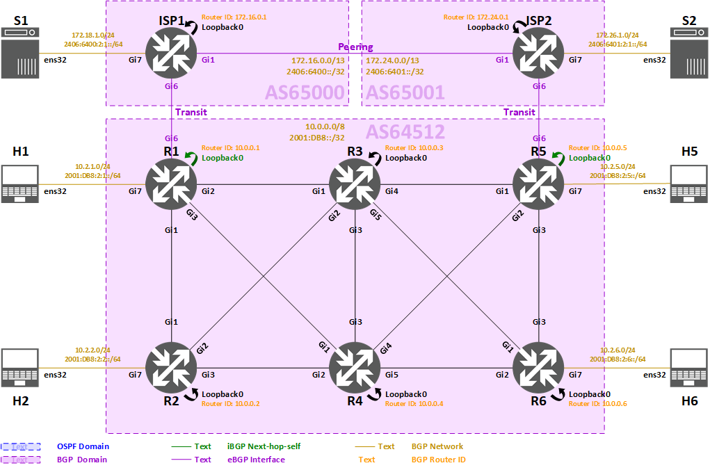

<span style="display:block;text-align:center"></span>
#<center><b>Deploying BGP (Cisco IOS) Lab</b></center>


>###<center>**Task 4: eBGP Configuration**
</center>


>[!alert] Please make sure all previous tasks work as expected and you understand them before doing this task.



After having end-to-end reachability within AS64512, we would also like to connect to our transit providers (AS65000 and AS65001) for the customers (H1, H2, H5, H6) to have access to the servers (S1, S2).

>[!note] Relationships between the ASes:
* AS65000 is a transit provider of AS64512, and AS64512 is a customer of AS65000
* AS65001 is a transit provider of AS64512, and AS64512 is a customer of AS65001
* AS65000 is peering with AS65001 for exchanging their local traffic and customer traffic

>[!hint]Summary of routing policies:
* AS64512
	* should have full reachability to all networks through AS65000 and AS65001
	* should not be a transit point between its two transit providers
* AS65000 and AS65001
	* should originate a default route to AS64512
	* should only advertised own prefixes and AS64512's prefixes to each other
* By default, BGP will advertise the best path of each prefix to other BGP neighbors, BGP filter (prefix or AS Path filter) should be implemented to enforce this routing policy

We will implement **external Border Gateway Protocol (eBGP)** between the three ASes.

>[!knowledge]While there are various methods to implement the above mentioned routing policies on different platforms, for simplicity, we will use prefix list feature of Cisco IOS to permit the exact prefixes.


### **eBGP configuration summary** ###

>* Router ID: (Use router's IPv4 Loopback)
* **eBGP**
	* between AS64512 and AS65000
		* R1 peers with ISP1
		* R1 iBGP Next hop option: **self**
	* between AS64512 and AS65001
		* R5 peers with ISP2
		* R5 iBGP Next hop option: **self**
	* between AS65000 and AS65001
		* ISP1 peers with ISP2
* Remote address: **peer's point-to-point address**
* Originate BGP networks:
	* R1, R5:
		* 10.0.0.0/8, 2001:DB8::/32
	* ISP1:
		* 0.0.0.0/0, ::/0
		* 172.16.0.0/13, 2406:6400::/32
		* 172.18.1.0/24, 2406:6400:2:1::/64
	* ISP2:
		* 0.0.0.0/0, ::/0
		* 172.24.0.0/13, 2406:6401::/32
		* 172.26.1.0/24, 2406:6401:2:1::/64
* Routing policies:
	* AS64512 (R1, R5)
		* advertises to AS65000 (ISP1) and AS65001 (ISP2):
			* 10.0.0.0/8, 2001:DB8::/32
			* 10.2.1.0/24, 2001:DB8:2:1::/64
			* 10.2.2.0/24, 2001:DB8:2:2::/64
			* 10.2.5.0/24, 2001:DB8:2:5::/64
			* 10.2.6.0/24, 2001:DB8:2:6::/64
	* AS65000 (ISP1):
		* advertises to AS64512 (R1):
			* 0.0.0.0/0, ::/0
			* 172.16.0.0/13, 2406:6400::/32
			* 172.18.1.0/24, 2406:6400:2:1::/64
		* advertises to AS65001 (ISP2):
			* 172.16.0.0/13, 2406:6400::/32
			* 172.18.1.0/24, 2406:6400:2:1::/64
			* 10.0.0.0/8, 2001:DB8::/32
			* 10.2.1.0/24, 2001:DB8:2:1::/64
			* 10.2.2.0/24, 2001:DB8:2:2::/64
			* 10.2.5.0/24, 2001:DB8:2:5::/64
			* 10.2.6.0/24, 2001:DB8:2:6::/64
	* AS65001 (ISP2):
		* advertises to AS64512 (R5):
			* 0.0.0.0/0, ::/0
			* 172.24.0.0/13, 2406:6401::/32
			* 172.26.1.0/24, 2406:6401:2:1::/64
		* advertises to AS65000 (ISP1):
			* 172.24.0.0/13, 2406:6401::/32
			* 172.26.1.0/24, 2406:6401:2:1::/64
			* 10.0.0.0/8, 2001:DB8::/32
			* 10.2.1.0/24, 2001:DB8:2:1::/64
			* 10.2.2.0/24, 2001:DB8:2:2::/64
			* 10.2.5.0/24, 2001:DB8:2:5::/64
			* 10.2.6.0/24, 2001:DB8:2:6::/64
* Address Families:
	* **IPv4 Unicast** (on IPv4 transport)
	* **IPv6 Unicast** (on IPv6 transport)


#### **There are 4 steps in this task:**

* [Step 4.1: Configuring eBGP](#step-41-configuring-ebgp)

* [Step 4.2: Verifying BGP neighbors and BGP table](#step-42-verifying-bgp-neighbors-and-bgp-table)

* [Step 4.3: Verifying IPv4 and IPv6 routing table](#step-43-verifying-ipv4-and-ipv6-routing-table)

* [Step 4.4: Verifying IPv4 and IPv6 reachability](#step-44-verifying-ipv4-and-ipv6-reachability)


### **Step 4.1: Configuring eBGP** ###


#### **Step 4.1.1: Configuring eBGP on R1** ####

- Select R1 from the Resources tab.

	```powershell-nocode
	Username: apnic
	Password: training
    ```

- The commands below must be run in the privileged exec mode. Type `enable` to enter this mode.

    ```powershell-nocode
	enable
	Password: labconfig
    ```

- Here is the link of IMAGE[Network Topology](images/topology_l3addr.png) with IP addresses for your reference.

- Here is the routing policies configuration of **R1**:

	```
	configure terminal
	
	!
	! Create an IPv4 prefix list for filtering outbound advertisement to AS65000.
	! Permit prefixes that should be advertised to AS65000.
	ip prefix-list EBGP-AS65000-IPV4-OUT seq 10 permit 10.0.0.0/8
	ip prefix-list EBGP-AS65000-IPV4-OUT seq 20 permit 10.2.1.0/24
	ip prefix-list EBGP-AS65000-IPV4-OUT seq 30 permit 10.2.2.0/24
	ip prefix-list EBGP-AS65000-IPV4-OUT seq 40 permit 10.2.5.0/24
	ip prefix-list EBGP-AS65000-IPV4-OUT seq 50 permit 10.2.6.0/24
	!
	! Deny everything else.
	ip prefix-list EBGP-AS65000-IPV4-OUT seq 1000 deny 0.0.0.0/0 le 32
	
	!
	! Create an IPv6 prefix list for filtering outbound advertisement to AS65000.
	! Permit prefixes that should be advertised to AS65000.
	ipv6 prefix-list EBGP-AS65000-IPV6-OUT seq 10 permit 2001:DB8::/32
	ipv6 prefix-list EBGP-AS65000-IPV6-OUT seq 20 permit 2001:DB8:2:1::/64
	ipv6 prefix-list EBGP-AS65000-IPV6-OUT seq 30 permit 2001:DB8:2:2::/64
	ipv6 prefix-list EBGP-AS65000-IPV6-OUT seq 40 permit 2001:DB8:2:5::/64
	ipv6 prefix-list EBGP-AS65000-IPV6-OUT seq 50 permit 2001:DB8:2:6::/64
	!
	! Deny everything else.
	ipv6 prefix-list EBGP-AS65000-IPV6-OUT seq 1000 deny ::/0 le 128

	!
	! Enter BGP configuration for AS64512
	router bgp 64512
	 !
	 ! Create an eBGP neighbor for IPv4 Unicast: 172.20.0.1 (AS65000)
	 neighbor 172.20.0.1 remote-as 65000
	 !
	 ! Create an eBGP neighbor for IPv6 Unicast: 2406:6400:4:: (AS65000)
	 neighbor 2406:6400:4:: remote-as 65000
	
	 !
	 ! Enter IPv4 Unicast Address Family configuration
	 address-family ipv4 unicast
	  !
	  ! Advertise aggregate prefix into BGP: 10.0.0.0/8
	  network 10.0.0.0 mask 255.0.0.0
	  !
	  ! Enable IPv4 Unicast Address Family capability
	  neighbor 172.20.0.1 activate
	  !
	  ! Apply outbound prefix list filter
	  neighbor 172.20.0.1 prefix-list EBGP-AS65000-IPV4-OUT out
	 !
	 ! iBGP Next hop option: self
	 ! Replace the next hop of all eBGP prefixes that received by this router
	 ! to its update source (Loopback0) when the prefixes are advertised into iBGP
	 neighbor IBGP-IPV4 next-hop-self
	 !
	 ! Exit IPv4 Unicast Address Family configuration
	 exit-address-family
	
	 !
	 ! Enter IPv6 Unicast Address Family configuration
	 address-family ipv6 unicast
	  !
	  ! Advertise aggregate prefix into BGP: 2001:DB8::/32
	  network 2001:DB8::/32
	  !
	  ! Enable IPv6 Unicast Address Family capability
	  neighbor 2406:6400:4:: activate
	  !
	  ! Apply outbound prefix list filter
	  neighbor 2406:6400:4:: prefix-list EBGP-AS65000-IPV6-OUT out
	 !
	 ! iBGP Next hop option: self
	 ! Replace the next hop of all eBGP prefixes that received by this router
	 ! to its update source (Loopback0) when the prefixes are advertised into iBGP
	 neighbor IBGP-IPV6 next-hop-self
	 !
	 ! Exit IPv6 Unicast Address Family configuration
	 exit-address-family

	!
	! Create a black hole route for IPv4 Unicast aggregate prefix.
	! In Cisco IOS, BGP will not advertise the prefix that does not exist in the routing table.
	ip route 10.0.0.0 255.0.0.0 Null0
	
	!
	! Create a black hole route for IPv6 Unicast aggregate prefix.
	! In Cisco IOS, BGP will not advertise the prefix that does not exist in the routing table.
	ipv6 route 2001:DB8::/32 Null0
	
	end
	```


#### **Step 4.1.2: Configuring eBGP on R5** ####

- Select R5 from the Resources tab.

	```powershell-nocode
	Username: apnic
	Password: training
    ```

- The commands below must be run in the privileged exec mode. Type `enable` to enter this mode.

    ```powershell-nocode
	enable
	Password: labconfig
    ```

- Here is the link of IMAGE[Network Topology](images/topology_l3addr.png) with IP addresses for your reference.

- Here is the eBGP configuration of **R5**:

	```
	configure terminal
	
	ip prefix-list EBGP-AS65001-IPV4-OUT seq 10 permit 10.0.0.0/8
	ip prefix-list EBGP-AS65001-IPV4-OUT seq 20 permit 10.2.1.0/24
	ip prefix-list EBGP-AS65001-IPV4-OUT seq 30 permit 10.2.2.0/24
	ip prefix-list EBGP-AS65001-IPV4-OUT seq 40 permit 10.2.5.0/24
	ip prefix-list EBGP-AS65001-IPV4-OUT seq 50 permit 10.2.6.0/24
	ip prefix-list EBGP-AS65001-IPV4-OUT seq 1000 deny 0.0.0.0/0 le 32
	
	ipv6 prefix-list EBGP-AS65001-IPV6-OUT seq 10 permit 2001:DB8::/32
	ipv6 prefix-list EBGP-AS65001-IPV6-OUT seq 20 permit 2001:DB8:2:1::/64
	ipv6 prefix-list EBGP-AS65001-IPV6-OUT seq 30 permit 2001:DB8:2:2::/64
	ipv6 prefix-list EBGP-AS65001-IPV6-OUT seq 40 permit 2001:DB8:2:5::/64
	ipv6 prefix-list EBGP-AS65001-IPV6-OUT seq 50 permit 2001:DB8:2:6::/64
	ipv6 prefix-list EBGP-AS65001-IPV6-OUT seq 1000 deny ::/0 le 128
	
	router bgp 64512
	 neighbor 172.28.0.1 remote-as 65001
	 neighbor 2406:6401:4:: remote-as 65001
	
	 address-family ipv4 unicast
	  network 10.0.0.0 mask 255.0.0.0
	  neighbor 172.28.0.1 activate
	  neighbor 172.28.0.1 prefix-list EBGP-AS65001-IPV4-OUT out
	  neighbor IBGP-IPV4 next-hop-self
	 exit-address-family
	
	 address-family ipv6 unicast
	  network 2001:DB8::/32
	  neighbor 2406:6401:4:: activate
	  neighbor 2406:6401:4:: prefix-list EBGP-AS65001-IPV6-OUT out
	  neighbor IBGP-IPV6 next-hop-self
	 exit-address-family
	
	ip route 10.0.0.0 255.0.0.0 Null0
	
	ipv6 route 2001:DB8::/32 Null0
	
	end
	```


#### **Step 4.1.3: Configuring eBGP on ISP1** ####

- Select ISP1 from the Resources tab.

	```powershell-nocode
	Username: apnic
	Password: training
    ```

- The commands below must be run in the privileged exec mode. Type `enable` to enter this mode.

    ```powershell-nocode
	enable
	Password: labconfig
    ```

- Here is the link of IMAGE[Network Topology](images/topology_l3addr.png) with IP addresses for your reference.

- Here is the eBGP configuration of **ISP1**:

	```
	configure terminal
	
	ip prefix-list EBGP-AS64512-IPV4-OUT seq 10 permit 172.16.0.0/13
	ip prefix-list EBGP-AS64512-IPV4-OUT seq 20 permit 172.18.1.0/24
	ip prefix-list EBGP-AS64512-IPV4-OUT seq 990 permit 0.0.0.0/0
	ip prefix-list EBGP-AS64512-IPV4-OUT seq 1000 deny 0.0.0.0/0 le 32
	
	ipv6 prefix-list EBGP-AS64512-IPV6-OUT seq 10 permit 2406:6400::/32
	ipv6 prefix-list EBGP-AS64512-IPV6-OUT seq 20 permit 2406:6400:2:1::/64
	ipv6 prefix-list EBGP-AS64512-IPV6-OUT seq 990 permit ::/0
	ipv6 prefix-list EBGP-AS64512-IPV6-OUT seq 1000 deny ::/0 le 128
	
	ip prefix-list EBGP-AS65001-IPV4-OUT seq 10 permit 172.16.0.0/13
	ip prefix-list EBGP-AS65001-IPV4-OUT seq 20 permit 172.18.1.0/24
	ip prefix-list EBGP-AS65001-IPV4-OUT seq 110 permit 10.0.0.0/8
	ip prefix-list EBGP-AS65001-IPV4-OUT seq 120 permit 10.2.1.0/24
	ip prefix-list EBGP-AS65001-IPV4-OUT seq 130 permit 10.2.2.0/24
	ip prefix-list EBGP-AS65001-IPV4-OUT seq 140 permit 10.2.5.0/24
	ip prefix-list EBGP-AS65001-IPV4-OUT seq 150 permit 10.2.6.0/24
	ip prefix-list EBGP-AS65001-IPV4-OUT seq 1000 deny 0.0.0.0/0 le 32
	
	ipv6 prefix-list EBGP-AS65001-IPV6-OUT seq 10 permit 2406:6400::/32
	ipv6 prefix-list EBGP-AS65001-IPV6-OUT seq 20 permit 2406:6400:2:1::/64
	ipv6 prefix-list EBGP-AS65001-IPV6-OUT seq 110 permit 2001:DB8::/32
	ipv6 prefix-list EBGP-AS65001-IPV6-OUT seq 120 permit 2001:DB8:2:1::/64
	ipv6 prefix-list EBGP-AS65001-IPV6-OUT seq 130 permit 2001:DB8:2:2::/64
	ipv6 prefix-list EBGP-AS65001-IPV6-OUT seq 140 permit 2001:DB8:2:5::/64
	ipv6 prefix-list EBGP-AS65001-IPV6-OUT seq 150 permit 2001:DB8:2:6::/64
	ipv6 prefix-list EBGP-AS65001-IPV6-OUT seq 1000 deny ::/0 le 128
	
	router bgp 65000
	 bgp router-id 172.16.0.1
	 bgp log-neighbor-changes
	 no bgp default ipv4-unicast
	 neighbor 172.20.0.2 remote-as 64512
	 neighbor 172.20.0.6 remote-as 65001
	 neighbor 2406:6400:4::1 remote-as 64512
	 neighbor 2406:6400:4:1::1 remote-as 65001
	
	 address-family ipv4 unicast
	  network 172.16.0.0 mask 255.248.0.0
	  network 172.18.1.0 mask 255.255.255.0
	  neighbor 172.20.0.2 activate
	  !
	  ! Originate default route for this BGP neighbor
	  neighbor 172.20.0.2 default-originate
	  neighbor 172.20.0.2 prefix-list EBGP-AS64512-IPV4-OUT out
	  neighbor 172.20.0.6 activate
	  neighbor 172.20.0.6 prefix-list EBGP-AS65001-IPV4-OUT out
	 exit-address-family
	
	 address-family ipv6 unicast
	  network 2406:6400::/32
	  network 2406:6400:2:1::/64
	  neighbor 2406:6400:4::1 activate
	  !
	  ! Originate default route for this BGP neighbor
	  neighbor 2406:6400:4::1 default-originate
	  neighbor 2406:6400:4::1 prefix-list EBGP-AS64512-IPV6-OUT out
	  neighbor 2406:6400:4:1::1 activate
	  neighbor 2406:6400:4:1::1 prefix-list EBGP-AS65001-IPV6-OUT out
	 exit-address-family
	
	ip route 172.16.0.0 255.248.0.0 Null0
	
	ipv6 route 2406:6400::/32 Null0
	
	end
	```


#### **Step 4.1.4: Configuring eBGP on ISP2** ####

- Select ISP2 from the Resources tab.

	```powershell-nocode
	Username: apnic
	Password: training
    ```

- The commands below must be run in the privileged exec mode. Type `enable` to enter this mode.

    ```powershell-nocode
	enable
	Password: labconfig
    ```

- Here is the link of IMAGE[Network Topology](images/topology_l3addr.png) with IP addresses for your reference.

- Here is the eBGP configuration of **ISP2**:

	```
	configure terminal
	
	ip prefix-list EBGP-AS64512-IPV4-OUT seq 10 permit 172.24.0.0/13
	ip prefix-list EBGP-AS64512-IPV4-OUT seq 20 permit 172.26.1.0/24
	ip prefix-list EBGP-AS64512-IPV4-OUT seq 990 permit 0.0.0.0/0
	ip prefix-list EBGP-AS64512-IPV4-OUT seq 1000 deny 0.0.0.0/0 le 32
	
	ipv6 prefix-list EBGP-AS64512-IPV6-OUT seq 10 permit 2406:6401::/32
	ipv6 prefix-list EBGP-AS64512-IPV6-OUT seq 20 permit 2406:6401:2:1::/64
	ipv6 prefix-list EBGP-AS64512-IPV6-OUT seq 990 permit ::/0
	ipv6 prefix-list EBGP-AS64512-IPV6-OUT seq 1000 deny ::/0 le 128
	
	ip prefix-list EBGP-AS65000-IPV4-OUT seq 10 permit 172.24.0.0/13
	ip prefix-list EBGP-AS65000-IPV4-OUT seq 20 permit 172.26.1.0/24
	ip prefix-list EBGP-AS65000-IPV4-OUT seq 110 permit 10.0.0.0/8
	ip prefix-list EBGP-AS65000-IPV4-OUT seq 120 permit 10.2.1.0/24
	ip prefix-list EBGP-AS65000-IPV4-OUT seq 130 permit 10.2.2.0/24
	ip prefix-list EBGP-AS65000-IPV4-OUT seq 140 permit 10.2.5.0/24
	ip prefix-list EBGP-AS65000-IPV4-OUT seq 150 permit 10.2.6.0/24
	ip prefix-list EBGP-AS65000-IPV4-OUT seq 1000 deny 0.0.0.0/0 le 32
	
	ipv6 prefix-list EBGP-AS65000-IPV6-OUT seq 10 permit 2406:6401::/32
	ipv6 prefix-list EBGP-AS65000-IPV6-OUT seq 20 permit 2406:6401:2:1::/64
	ipv6 prefix-list EBGP-AS65000-IPV6-OUT seq 110 permit 2001:DB8::/32
	ipv6 prefix-list EBGP-AS65000-IPV6-OUT seq 120 permit 2001:DB8:2:1::/64
	ipv6 prefix-list EBGP-AS65000-IPV6-OUT seq 130 permit 2001:DB8:2:2::/64
	ipv6 prefix-list EBGP-AS65000-IPV6-OUT seq 140 permit 2001:DB8:2:5::/64
	ipv6 prefix-list EBGP-AS65000-IPV6-OUT seq 150 permit 2001:DB8:2:6::/64
	ipv6 prefix-list EBGP-AS65000-IPV6-OUT seq 1000 deny ::/0 le 128
	
	router bgp 65001
	 bgp router-id 172.24.0.1
	 bgp log-neighbor-changes
	 no bgp default ipv4-unicast
	 neighbor 172.28.0.2 remote-as 64512
	 neighbor 172.20.0.5 remote-as 65000
	 neighbor 2406:6401:4::1 remote-as 64512
	 neighbor 2406:6400:4:1:: remote-as 65000
	
	 address-family ipv4 unicast
	  network 172.24.0.0 mask 255.248.0.0
	  network 172.26.1.0 mask 255.255.255.0
	  neighbor 172.28.0.2 activate
	  neighbor 172.28.0.2 default-originate
	  neighbor 172.28.0.2 prefix-list EBGP-AS64512-IPV4-OUT out
	  neighbor 172.20.0.5 activate
	  neighbor 172.20.0.5 prefix-list EBGP-AS65000-IPV4-OUT out
	 exit-address-family
	
	 address-family ipv6 unicast
	  network 2406:6401::/32
	  network 2406:6401:2:1::/64
	  neighbor 2406:6401:4::1 activate
	  neighbor 2406:6401:4::1 default-originate
	  neighbor 2406:6401:4::1 prefix-list EBGP-AS64512-IPV6-OUT out
	  neighbor 2406:6400:4:1:: activate
	  neighbor 2406:6400:4:1:: prefix-list EBGP-AS65000-IPV6-OUT out
	 exit-address-family
	
	ip route 172.24.0.0 255.248.0.0 Null0
	
	ipv6 route 2406:6401::/32 Null0
	
	end
	```


### **Step 4.2: Verifying BGP neighbors and BGP table** ###

>[!alert] Please perform this verification step only when you have fully completed previous configuration steps of this task.

Once we have done the eBGP configuration, we will verify whether BGP is running according to our configuration. We expect to see:

* **R1** has established **eBGP** sessions with **ISP1**
* **R5** has established **eBGP** sessions with **ISP2**
* **ISP1** has established **eBGP** sessions with **ISP2**
* Prefixes are advertised and received according to our **routing policies**

We will do verification with following commands:

* Showing BGP neighbors:
	* IPv4 Unicast: `show bgp ipv4 unicast summary` or `show ip bgp summary`
	* IPv6 Unicast: `show bgp ipv6 unicast summary`
* Showing detail information of specific neighbor (optional):
	* IPv4 Unicast: `show bgp ipv4 unicast neighbor [remote-address]` or `show ip bgp neighbor [remote-address]`
	* IPv6 Unicast: `show bgp ipv6 unicast neighbor [remote-address]`
* Showing prefixes advertised to specific neighbor (optional):
	* IPv4 Unicast: `show bgp ipv4 unicast neighbor [remote-address] advertised-routes` or `show ip bgp neighbor [remote-address] advertised-routes`
	* IPv6 Unicast: `show bgp ipv6 unicast neighbor [remote-address] advertised-routes`
* Showing BGP table:
	* IPv4 Unicast: `show bgp ipv4 unicast` or `show ip bgp`
	* IPv6 Unicast: `show bgp ipv6 unicast`
* Showing detail information of specific BGP prefix (optional):
	* IPv4 Unicast: `show bgp ipv4 unicast [prefix]/[len]` or `show ip bgp [prefix]/[len]` 
	* IPv6 Unicast: `show bgp ipv6 unicast [prefix]/[len]`


#### **Step 4.2.1: Verifying BGP neighbors and BGP table on R1** ####

- Select R1 from the Resources tab.

	```powershell-nocode
	Username: apnic
	Password: training
    ```

- The commands below must be run in the privileged exec mode. Type `enable` to enter this mode.

    ```powershell-nocode
	enable
	Password: labconfig
    ```

- Here is the link of IMAGE[Network Topology](images/topology_l3addr.png) with IP addresses for your reference.

- To check IPv4 Unicast BGP neighbors, type `show bgp ipv4 unicast summary`, the result is as shown below:

    ```powershell-nocode
	R1#show bgp ipv4 unicast summary
	BGP router identifier 10.0.0.1, local AS number 64512
	BGP table version is 11, main routing table version 11
	10 network entries using 2480 bytes of memory
	12 path entries using 1536 bytes of memory
	8/7 BGP path/bestpath attribute entries using 2112 bytes of memory
	2 BGP AS-PATH entries using 48 bytes of memory
	0 BGP route-map cache entries using 0 bytes of memory
	0 BGP filter-list cache entries using 0 bytes of memory
	BGP using 6176 total bytes of memory
	BGP activity 212/192 prefixes, 265/241 paths, scan interval 60 secs
	
	Neighbor        V           AS MsgRcvd MsgSent   TblVer  InQ OutQ Up/Down  State/PfxRcd
	10.0.0.2        4        64512      23      25       11    0    0 00:18:07        1
	10.0.0.3        4        64512      22      24       11    0    0 00:18:12        0
	10.0.0.4        4        64512      22      25       11    0    0 00:18:12        0
	10.0.0.5        4        64512      25      24       11    0    0 00:18:10        5
	10.0.0.6        4        64512      23      24       11    0    0 00:18:13        1
	172.20.0.1      4        65000       7       9       11    0    0 00:01:35        3
    ```

- To check IPv6 Unicast BGP neighbors, type `show bgp ipv6 unicast summary`, the result is as shown below:

	```powershell-nocode
	R1#show bgp ipv6 unicast summary
	BGP router identifier 10.0.0.1, local AS number 64512
	BGP table version is 11, main routing table version 11
	10 network entries using 2720 bytes of memory
	12 path entries using 1824 bytes of memory
	8/7 BGP path/bestpath attribute entries using 2112 bytes of memory
	2 BGP AS-PATH entries using 48 bytes of memory
	0 BGP route-map cache entries using 0 bytes of memory
	0 BGP filter-list cache entries using 0 bytes of memory
	BGP using 6704 total bytes of memory
	BGP activity 212/192 prefixes, 265/241 paths, scan interval 60 secs
	
	Neighbor        V           AS MsgRcvd MsgSent   TblVer  InQ OutQ Up/Down  State/PfxRcd
	2001:DB8::2     4        64512      24      25       11    0    0 00:18:26        1
	2001:DB8::3     4        64512      23      26       11    0    0 00:18:29        0
	2001:DB8::4     4        64512      22      25       11    0    0 00:18:27        0
	2001:DB8::5     4        64512      26      26       11    0    0 00:18:26        5
	2001:DB8::6     4        64512      24      25       11    0    0 00:18:24        1
	2406:6400:4::   4        65000       8      10       11    0    0 00:01:57        3
	```

- To check detail information of IPv4 Unicast BGP neighbor 172.20.0.1 (ISP1), type `show bgp ipv4 unicast neighbor 172.20.0.1`, the result is shown as below:

    ```powershell-nocode
	R1#show bgp ipv4 unicast neighbors 172.20.0.1
	BGP neighbor is 172.20.0.1,  remote AS 65000, external link
	  BGP version 4, remote router ID 172.16.0.1
	  BGP state = Established, up for 00:02:50
	  Last read 00:00:54, last write 00:00:13, hold time is 180, keepalive interval is 60 seconds
	  Neighbor sessions:
	    1 active, is not multisession capable (disabled)
	  Neighbor capabilities:
	    Route refresh: advertised and received(new)
	    Four-octets ASN Capability: advertised and received
	    Address family IPv4 Unicast: advertised and received
	    Enhanced Refresh Capability: advertised and received
	    Multisession Capability:
	    Stateful switchover support enabled: NO for session 1
	  Message statistics:
	    InQ depth is 0
	    OutQ depth is 0
	
	                         Sent       Rcvd
	    Opens:                  1          1
	    Notifications:          0          0
	    Updates:                5          3
	    Keepalives:             5          4
	    Route Refresh:          0          0
	    Total:                 11          8
	  Do log neighbor state changes (via global configuration)
	  Default minimum time between advertisement runs is 30 seconds
		
	 For address family: IPv4 Unicast
	  Session: 172.20.0.1
	  BGP table version 11, neighbor version 11/0
	  Output queue size : 0
	  Index 27, Advertise bit 1
	  27 update-group member
	  Outgoing update prefix filter list is EBGP-AS65000-IPV4-OUT
	  Slow-peer detection is disabled
	  Slow-peer split-update-group dynamic is disabled
		                                 Sent       Rcvd
	  Prefix activity:               ----       ----
	    Prefixes Current:               5          3 (Consumes 384 bytes)
	    Prefixes Total:                 5          3
	    Implicit Withdraw:              0          0
	    Explicit Withdraw:              0          0
	    Used as bestpath:             n/a          3
	    Used as multipath:            n/a          0
	    Used as secondary:            n/a          0
	
	                                   Outbound    Inbound
	  Local Policy Denied Prefixes:    --------    -------
	    prefix-list                           2          0
	    Bestpath from this peer:              3        n/a
	    Total:                                5          0
	  Number of NLRIs in the update sent: max 2, min 0
	  Last detected as dynamic slow peer: never
	  Dynamic slow peer recovered: never
	  Refresh Epoch: 1
	  Last Sent Refresh Start-of-rib: never
	  Last Sent Refresh End-of-rib: never
	  Last Received Refresh Start-of-rib: never
	  Last Received Refresh End-of-rib: never
		                                       Sent       Rcvd
	        Refresh activity:              ----       ----
	          Refresh Start-of-RIB          0          0
	          Refresh End-of-RIB            0          0
		
	  Address tracking is enabled, the RIB does have a route to 172.20.0.1
	  Route to peer address reachability Up: 3; Down: 3
	    Last notification 03:11:04
	  Connections established 11; dropped 10
	  Last reset 00:19:34, due to Active open failed
	  External BGP neighbor configured for connected checks (single-hop no-disable-connected-check)
	  Interface associated: GigabitEthernet6 (peering address in same link)
	  Transport(tcp) path-mtu-discovery is enabled
	  Graceful-Restart is disabled
	  SSO is disabled
	Connection state is ESTAB, I/O status: 1, unread input bytes: 0
	Connection is ECN Disabled, Mininum incoming TTL 0, Outgoing TTL 1
	Local host: 172.20.0.2, Local port: 179
	Foreign host: 172.20.0.1, Foreign port: 51766
	Connection tableid (VRF): 0
	Maximum output segment queue size: 50
		
	Enqueued packets for retransmit: 0, input: 0  mis-ordered: 0 (0 bytes)
		
	Event Timers (current time is 0xFC111F1):
	Timer          Starts    Wakeups            Next
	Retrans             6          0             0x0
	TimeWait            0          0             0x0
	AckHold             5          2             0x0
	SendWnd             0          0             0x0
	KeepAlive           0          0             0x0
	GiveUp              0          0             0x0
	PmtuAger            0          0             0x0
	DeadWait            0          0             0x0
	Linger              0          0             0x0
	ProcessQ            0          0             0x0
		
	iss: 2870691939  snduna: 2870692312  sndnxt: 2870692312
	irs: 2982179264  rcvnxt: 2982179522
		
	sndwnd:  16012  scale:      0  maxrcvwnd:  16384
	rcvwnd:  16127  scale:      0  delrcvwnd:    257
		
	SRTT: 551 ms, RTTO: 3075 ms, RTV: 2524 ms, KRTT: 0 ms
	minRTT: 1 ms, maxRTT: 1000 ms, ACK hold: 200 ms
	uptime: 170791 ms, Sent idletime: 13190 ms, Receive idletime: 12987 ms
	Status Flags: passive open, gen tcbs
	Option Flags: nagle, path mtu capable
	IP Precedence value : 6
		
	Datagrams (max data segment is 1460 bytes):
	Rcvd: 13 (out of order: 0), with data: 6, total data bytes: 257
	Sent: 12 (retransmit: 0, fastretransmit: 0, partialack: 0, Second Congestion: 0), with data: 7, total data bytes: 372
		
	 Packets received in fast path: 0, fast processed: 0, slow path: 0
	 fast lock acquisition failures: 0, slow path: 0
	TCP Semaphore      0x7FE7A2633CC0  FREE
    ```

- To check IPv4 Unicast prefixes advertised to BGP neighbor 172.20.0.1 (ISP1), type `show bgp ipv4 unicast neighbors 172.20.0.1 advertised-routes`, the result is as shown below:

    ```powershell-nocode
	R1#show bgp ipv4 unicast neighbors 172.20.0.1 advertised-routes
	BGP table version is 11, local router ID is 10.0.0.1
	Status codes: s suppressed, d damped, h history, * valid, > best, i - internal,
	              r RIB-failure, S Stale, m multipath, b backup-path, f RT-Filter,
	              x best-external, a additional-path, c RIB-compressed,
	              t secondary path,
	Origin codes: i - IGP, e - EGP, ? - incomplete
	RPKI validation codes: V valid, I invalid, N Not found
	
	     Network          Next Hop            Metric LocPrf Weight Path
	 *>   10.0.0.0         0.0.0.0                  0         32768 i		<-- AS64512 aggregation (originated)
	 *>   10.2.1.0/24      0.0.0.0                  0         32768 i		<-- Customer H1 (originated)
	 *>i  10.2.2.0/24      10.0.0.2                 0    100      0 i		<-- Customer H2
	 *>i  10.2.5.0/24      10.0.0.5                 0    100      0 i		<-- Customer H5
	 *>i  10.2.6.0/24      10.0.0.6                 0    100      0 i 		<-- Customer H6
	
	Total number of prefixes 5
    ```

- To check IPv4 Unicast BGP table, type `show bgp ipv4 unicast`, the result is shown as below:

	Expectation:

	* **4 additional IPv4 Unicast prefixes** from iBGP neighbor **R5**
		* 0.0.0.0/0, AS_PATH: 65001, NEXT_HOP: 10.0.0.5
		* 10.0.0.0/8, AS_PATH: (empty), NEXT_HOP: 10.0.0.5
		* 172.24.0.0/13, AS_PATH: 65001, NEXT_HOP: 10.0.0.5
		* 172.26.1.0/24, AS_PATH: 65001, NEXT_HOP: 10.0.0.5
	* **3 IPv4 Unicast prefixes** from eBGP neighbor **ISP1**:
		* 0.0.0.0/0, AS_PATH: 65000
		* 172.16.0.0/13, AS_PATH: 65000
		* 172.18.1.0/24, AS_PATH: 65000

	Result:
	
    ```powershell-nocode
	R1#show bgp ipv4 unicast
	BGP table version is 11, local router ID is 10.0.0.1
	Status codes: s suppressed, d damped, h history, * valid, > best, i - internal,
	              r RIB-failure, S Stale, m multipath, b backup-path, f RT-Filter,
	              x best-external, a additional-path, c RIB-compressed,
	              t secondary path,
	Origin codes: i - IGP, e - EGP, ? - incomplete
	RPKI validation codes: V valid, I invalid, N Not found
	
	     Network          Next Hop            Metric LocPrf Weight Path
	 * i  0.0.0.0          10.0.0.5                 0    100      0 65001 i	<-- Default route
	 *>                    172.20.0.1                             0 65000 i
	 * i  10.0.0.0         10.0.0.5                 0    100      0 i		<-- AS64512 aggregation
	 *>                    0.0.0.0                  0         32768 i
	 *>   10.2.1.0/24      0.0.0.0                  0         32768 i
	 *>i  10.2.2.0/24      10.0.0.2                 0    100      0 i
	 *>i  10.2.5.0/24      10.0.0.5                 0    100      0 i
	 *>i  10.2.6.0/24      10.0.0.6                 0    100      0 i
	 *>   172.16.0.0/13    172.20.0.1               0             0 65000 i	<-- AS65000 aggregation
	 *>   172.18.1.0/24    172.20.0.1               0             0 65000 i <-- Server S1
	 *>i  172.24.0.0/13    10.0.0.5                 0    100      0 65001 i	<-- AS65001 aggregation
	 *>i  172.26.1.0/24    10.0.0.5                 0    100      0 65001 i	<-- Server S2
    ```

- To check IPv6 Unicast BGP table, type `show bgp ipv6 unicast`, the result is shown as below:

	Expectation:
	
	* **4 additional IPv6 Unicast prefixes** from iBGP neighbor **R5**
		* ::/0, AS_PATH: 65001, NEXT_HOP: 2001:DB8::5
		* 2001:DB8::/32, AS_PATH: (empty), NEXT_HOP: 2001:DB8::5
		* 2406:6401::/32, AS_PATH: 65001, NEXT_HOP: 2001:DB8::5
		* 2406:6401:2:1::/64, AS_PATH: 65001, NEXT_HOP: 2001:DB8::5
	* **3 IPv6 Unicast prefixes** from eBGP neighbor **ISP1**:
		* ::/0, AS_PATH: 65000
		* 2406:6400::/32, AS_PATH: 65000
		* 2406:6400:2:1::/64, AS_PATH: 65000
	
	Result:

    ```powershell-nocode
	R1#show bgp ipv6 unicast
	BGP table version is 11, local router ID is 10.0.0.1
	Status codes: s suppressed, d damped, h history, * valid, > best, i - internal,
	              r RIB-failure, S Stale, m multipath, b backup-path, f RT-Filter,
	              x best-external, a additional-path, c RIB-compressed,
	              t secondary path,
	Origin codes: i - IGP, e - EGP, ? - incomplete
	RPKI validation codes: V valid, I invalid, N Not found
	
	     Network          Next Hop            Metric LocPrf Weight Path
	 * i  ::/0             2001:DB8::5              0    100      0 65001 i	<-- Default route
	 *>                    2406:6400:4::                          0 65000 i
	 * i  2001:DB8::/32    2001:DB8::5              0    100      0 i		<-- AS64512 aggregation
	 *>                    ::                       0         32768 i
	 *>   2001:DB8:2:1::/64
	                       ::                       0         32768 i
	 *>i  2001:DB8:2:2::/64
	                       2001:DB8::2              0    100      0 i
	 *>i  2001:DB8:2:5::/64
	                       2001:DB8::5              0    100      0 i
	 *>i  2001:DB8:2:6::/64
	                       2001:DB8::6              0    100      0 i
	 *>   2406:6400::/32   2406:6400:4::            0             0 65000 i	<-- AS65000 aggregation
	 *>   2406:6400:2:1::/64												<-- Server S1
	                       2406:6400:4::            0             0 65000 i
	 *>i  2406:6401::/32   2001:DB8::5              0    100      0 65001 i <-- AS65001 aggregation
	 *>i  2406:6401:2:1::/64												<-- Server S2
	                       2001:DB8::5              0    100      0 65001 i
    ```

- To check detail information of IPv4 Unicast BGP prefix 172.18.1.0/24 (Server S1), type `show bgp ipv4 unicast 172.18.1.2`, the result is shown as below:

    ```powershell-nocode
	R1#show bgp ipv4 unicast 172.18.1.2
	BGP routing table entry for 172.18.1.0/24, version 8
	Paths: (1 available, best #1, table default)
	  Advertised to update-groups:
	     26																	<-- Advertised to group 26
	  Refresh Epoch 1
	  65000																	<-- Originated by AS65000
	    172.20.0.1 from 172.20.0.1 (172.16.0.1)								<-- Next hop is 172.20.0.1 (ISP1)
	      Origin IGP, metric 0, localpref 100, valid, external, best		<-- eBGP, best path
	      rx pathid: 0, tx pathid: 0x0
	```

	```powershell-nocode
	R1#show bgp ipv4 unicast update-group 26								<-- Show members of group 26
	BGP version 4 update-group 26, internal, Address Family: IPv4 Unicast
	  BGP Update version : 11/0, messages 0, active RGs: 1
	  NEXT_HOP is always this router for eBGP paths							<-- Next hop: self
	  Topology: global, highest version: 11, tail marker: 11
	  Format state: Current working (OK, last not in list)
	                Refresh blocked (not in list, last not in list)
	  Update messages formatted 3, replicated 15, current 0, refresh 0, limit 1000
	  Number of NLRIs in the update sent: max 2, min 0
	  Minimum time between advertisement runs is 0 seconds
	  Has 5 members:
	   10.0.0.2         10.0.0.3         10.0.0.4         10.0.0.5			<-- Members: R2, R3, R4, R5, R6
	   10.0.0.6
    ```

From above output, we can know that:

* R1 is running BGP with **ASN 64512**
* R1 has **established** BGP session with **12 neighbors (2 additional, previously 10)**
	* **6 neighbors (1 additional, previously 5)** with IPv4 transport
	* **6 neighbors (1 additional, previously 5)** with IPv6 transport
* **2 neighbors** are **eBGP neighbors** (different local and remote ASN)
	* **1 neighbor** has enabled **IPv4 Unicast** Address Family
		* 172.20.0.1 (AS65000, ISP1)
	* **1 neighbor** has enabled **IPv6 Unicast** Address Family
		* 2406:6400:4:: (AS65000, ISP1) 
* **3 IPv4 Unicast prefixes** received from **eBGP neighbor ISP1**
	* 0.0.0.0/0 (default route)
	* 172.16.0.0/13 (AS65000 aggregation)
	* 172.18.1.0/24 (Server S1)
* **3 IPv6 Unicast prefixes** received from **eBGP neighbor ISP1**
	* ::/0 (default route)
	* 2406:6400::/32 (AS65000 aggregation)
	* 2406:6400:2:1::/64 (Server S1)
* **4 additional IPv4 Unicast prefixes** received from **iBGP neighbor R5**
	* 0.0.0.0/0 (default route)
	* 10.0.0.0/8 (AS64512 aggregation)
	* 172.24.0.0/13 (AS65001 aggregation)
	* 172.26.1.0/24 (Server S2)
* **4 additional IPv6 Unicast prefixes** received from **iBGP neighbor R5**
	* ::/0 (default route)
	* 2001:DB8::/32 (AS64512 aggregation)
	* 2406:6401::/32 (AS65001 aggregation)
	* 2406:6401:2:1::/64 (Server S2)


#### **Step 4.2.2: Verifying BGP neighbors and BGP table on R2** ####

- Select R2 from the Resources tab.

	```powershell-nocode
	Username: apnic
	Password: training
    ```

- The commands below must be run in the privileged exec mode. Type `enable` to enter this mode.

    ```powershell-nocode
	enable
	Password: labconfig
    ```

- Here is the link of IMAGE[Network Topology](images/topology_l3addr.png) with IP addresses for your reference.

- To check IPv4 Unicast BGP neighbors, type `show bgp ipv4 unicast summary`, the result is as shown below:

	```powershell-nocode
	R2#show bgp ipv4 unicast summary
	BGP router identifier 10.0.0.2, local AS number 64512
	BGP table version is 11, main routing table version 11
	10 network entries using 2480 bytes of memory
	12 path entries using 1536 bytes of memory
	8/7 BGP path/bestpath attribute entries using 2112 bytes of memory
	2 BGP AS-PATH entries using 48 bytes of memory
	0 BGP route-map cache entries using 0 bytes of memory
	0 BGP filter-list cache entries using 0 bytes of memory
	BGP using 6176 total bytes of memory
	BGP activity 184/164 prefixes, 235/211 paths, scan interval 60 secs
	
	Neighbor        V           AS MsgRcvd MsgSent   TblVer  InQ OutQ Up/Down  State/PfxRcd
	10.0.0.1        4        64512      25      23       11    0    0 00:18:08        5
	10.0.0.3        4        64512      22      23       11    0    0 00:18:09        0
	10.0.0.4        4        64512      23      24       11    0    0 00:18:12        0
	10.0.0.5        4        64512      25      23       11    0    0 00:18:09        5
	10.0.0.6        4        64512      23      24       11    0    0 00:18:10        1
	```

- To check IPv6 Unicast BGP neighbors, type `show bgp ipv6 unicast summary`, the result is as shown below:

	```powershell-nocode
	R2#show bgp ipv6 unicast summary
	BGP router identifier 10.0.0.2, local AS number 64512
	BGP table version is 11, main routing table version 11
	10 network entries using 2720 bytes of memory
	12 path entries using 1824 bytes of memory
	8/7 BGP path/bestpath attribute entries using 2112 bytes of memory
	2 BGP AS-PATH entries using 48 bytes of memory
	0 BGP route-map cache entries using 0 bytes of memory
	0 BGP filter-list cache entries using 0 bytes of memory
	BGP using 6704 total bytes of memory
	BGP activity 184/164 prefixes, 235/211 paths, scan interval 60 secs
	
	Neighbor        V           AS MsgRcvd MsgSent   TblVer  InQ OutQ Up/Down  State/PfxRcd
	2001:DB8::1     4        64512      25      24       11    0    0 00:18:26        5
	2001:DB8::3     4        64512      23      24       11    0    0 00:18:27        0
	2001:DB8::4     4        64512      22      24       11    0    0 00:18:27        0
	2001:DB8::5     4        64512      25      24       11    0    0 00:18:25        5
	2001:DB8::6     4        64512      24      24       11    0    0 00:18:25        1
	```

- To check IPv4 Unicast BGP table, type `show bgp ipv4 unicast`, the result is shown as below:

	Expectation:
	
	* **4 additional IPv4 Unicast prefixes** from iBGP neighbor **R1**
		* 0.0.0.0/0, AS_PATH: 65000, NEXT_HOP: 10.0.0.1
		* 10.0.0.0/8, AS_PATH: (empty), NEXT_HOP: 10.0.0.1
		* 172.16.0.0/13, AS_PATH: 65000, NEXT_HOP: 10.0.0.1
		* 172.18.1.0/24, AS_PATH: 65000, NEXT_HOP: 10.0.0.1
	* **4 additional IPv4 Unicast prefixes** from iBGP neighbor **R5**
		* 0.0.0.0/0, AS_PATH: 65001, NEXT_HOP: 10.0.0.5
		* 10.0.0.0/8, AS_PATH: (empty), NEXT_HOP: 10.0.0.5
		* 172.24.0.0/13, AS_PATH: 65001, NEXT_HOP: 10.0.0.5
		* 172.26.1.0/24, AS_PATH: 65001, NEXT_HOP: 10.0.0.5

	Result:
	```powershell-nocode
	R2#show bgp ipv4 unicast
	BGP table version is 11, local router ID is 10.0.0.2
	Status codes: s suppressed, d damped, h history, * valid, > best, i - internal,
	              r RIB-failure, S Stale, m multipath, b backup-path, f RT-Filter,
	              x best-external, a additional-path, c RIB-compressed,
	              t secondary path,
	Origin codes: i - IGP, e - EGP, ? - incomplete
	RPKI validation codes: V valid, I invalid, N Not found
	
	     Network          Next Hop            Metric LocPrf Weight Path
	 * i  0.0.0.0          10.0.0.5                 0    100      0 65001 i	<-- Default route
	 *>i                   10.0.0.1                 0    100      0 65000 i
	 * i  10.0.0.0         10.0.0.5                 0    100      0 i		<-- AS64512 aggregation
	 *>i                   10.0.0.1                 0    100      0 i
	 *>i  10.2.1.0/24      10.0.0.1                 0    100      0 i
	 *>   10.2.2.0/24      0.0.0.0                  0         32768 i
	 *>i  10.2.5.0/24      10.0.0.5                 0    100      0 i
	 *>i  10.2.6.0/24      10.0.0.6                 0    100      0 i
	 *>i  172.16.0.0/13    10.0.0.1                 0    100      0 65000 i	<-- AS65000 aggregation
	 *>i  172.18.1.0/24    10.0.0.1                 0    100      0 65000 i	<-- Server S1
	 *>i  172.24.0.0/13    10.0.0.5                 0    100      0 65001 i	<-- AS65001 aggregation
	 *>i  172.26.1.0/24    10.0.0.5                 0    100      0 65001 i	<-- Server S2
	```

- To check IPv6 Unicast BGP table, type `show bgp ipv6 unicast`, the result is shown as below:

	Expectation:
	
	* **4 additional IPv6 Unicast prefixes** received from iBGP neighbor **R1**
		* ::/0, AS_PATH: 65000, NEXT_HOP: 2001:DB8::1
		* 2001:DB8::/32, AS_PATH: (empty), NEXT_HOP: 2001:DB8::1
		* 2406:6400::/32, AS_PATH: 65000, NEXT_HOP: 2001:DB8::1
		* 2406:6400:2:1::/64, AS_PATH: 65000, NEXT_HOP: 2001:DB8::1
	* **4 additional IPv6 Unicast prefixes** received from iBGP neighbor **R5**
		* ::/0, AS_PATH: 65001, NEXT_HOP: 2001:DB8::5
		* 2001:DB8::/32, AS_PATH: (empty), NEXT_HOP: 2001:DB8::5
		* 2406:6401::/32, AS_PATH: 65001, NEXT_HOP: 2001:DB8::5
		* 2406:6401:2:1::/64, AS_PATH: 65001, NEXT_HOP: 2001:DB8::5
	
	Result:
	
	```powershell-nocode
	R2#show bgp ipv6 unicast
	BGP table version is 11, local router ID is 10.0.0.2
	Status codes: s suppressed, d damped, h history, * valid, > best, i - internal,
	              r RIB-failure, S Stale, m multipath, b backup-path, f RT-Filter,
	              x best-external, a additional-path, c RIB-compressed,
	              t secondary path,
	Origin codes: i - IGP, e - EGP, ? - incomplete
	RPKI validation codes: V valid, I invalid, N Not found
	
	     Network          Next Hop            Metric LocPrf Weight Path
	 * i  ::/0             2001:DB8::5              0    100      0 65001 i	<-- Default route
	 *>i                   2001:DB8::1              0    100      0 65000 i
	 * i  2001:DB8::/32    2001:DB8::5              0    100      0 i		<-- AS64512 aggregation
	 *>i                   2001:DB8::1              0    100      0 i
	 *>i  2001:DB8:2:1::/64
	                       2001:DB8::1              0    100      0 i
	 *>   2001:DB8:2:2::/64
	                       ::                       0         32768 i
	 *>i  2001:DB8:2:5::/64
	                       2001:DB8::5              0    100      0 i
	 *>i  2001:DB8:2:6::/64
	                       2001:DB8::6              0    100      0 i
	 *>i  2406:6400::/32   2001:DB8::1              0    100      0 65000 i	<-- AS65000 aggregation
	 *>i  2406:6400:2:1::/64												<-- Server S1
	                       2001:DB8::1              0    100      0 65000 i
	 *>i  2406:6401::/32   2001:DB8::5              0    100      0 65001 i	<-- AS65001 aggregation
	 *>i  2406:6401:2:1::/64												<-- Server S2
	                       2001:DB8::5              0    100      0 65001 i
	```


#### **Step 4.2.3: Verifying BGP neighbors and BGP table on R3** ####

- Select R3 from the Resources tab.

	```powershell-nocode
	Username: apnic
	Password: training
    ```

- The commands below must be run in the privileged exec mode. Type `enable` to enter this mode.

    ```powershell-nocode
	enable
	Password: labconfig
    ```

- Here is the link of IMAGE[Network Topology](images/topology_l3addr.png) with IP addresses for your reference.

- To check IPv4 Unicast BGP neighbors, type `show bgp ipv4 unicast summary`, the result is as shown below:

	```powershell-nocode
	R3#show bgp ipv4 unicast summary
	BGP router identifier 10.0.0.3, local AS number 64512
	BGP table version is 11, main routing table version 11
	10 network entries using 2480 bytes of memory
	12 path entries using 1536 bytes of memory
	8/7 BGP path/bestpath attribute entries using 2112 bytes of memory
	2 BGP AS-PATH entries using 48 bytes of memory
	0 BGP route-map cache entries using 0 bytes of memory
	0 BGP filter-list cache entries using 0 bytes of memory
	BGP using 6176 total bytes of memory
	BGP activity 184/164 prefixes, 235/211 paths, scan interval 60 secs
	
	Neighbor        V           AS MsgRcvd MsgSent   TblVer  InQ OutQ Up/Down  State/PfxRcd
	10.0.0.1        4        64512      24      22       11    0    0 00:18:13        5
	10.0.0.2        4        64512      23      22       11    0    0 00:18:10        1
	10.0.0.4        4        64512      23      22       11    0    0 00:18:09        0
	10.0.0.5        4        64512      25      23       11    0    0 00:18:10        5
	10.0.0.6        4        64512      24      22       11    0    0 00:18:14        1
	```

- To check IPv6 Unicast BGP neighbors, type `show bgp ipv6 unicast summary`, the result is as shown below:

	```powershell-nocode
		R3#show bgp ipv6 unicast summary
		BGP router identifier 10.0.0.3, local AS number 64512
		BGP table version is 11, main routing table version 11
		10 network entries using 2720 bytes of memory
		12 path entries using 1824 bytes of memory
		8/7 BGP path/bestpath attribute entries using 2112 bytes of memory
		2 BGP AS-PATH entries using 48 bytes of memory
		0 BGP route-map cache entries using 0 bytes of memory
		0 BGP filter-list cache entries using 0 bytes of memory
		BGP using 6704 total bytes of memory
		BGP activity 184/164 prefixes, 235/211 paths, scan interval 60 secs
		
		Neighbor        V           AS MsgRcvd MsgSent   TblVer  InQ OutQ Up/Down  State/PfxRcd
		2001:DB8::1     4        64512      26      23       11    0    0 00:18:30        5
		2001:DB8::2     4        64512      24      23       11    0    0 00:18:27        1
		2001:DB8::4     4        64512      23      23       11    0    0 00:18:22        0
		2001:DB8::5     4        64512      25      23       11    0    0 00:18:26        5
		2001:DB8::6     4        64512      24      22       11    0    0 00:18:26        1
	```

- To check IPv4 Unicast BGP table, type `show bgp ipv4 unicast`, the result is shown as below:

	Expectation:
	
	* **4 additional IPv4 Unicast prefixes** from iBGP neighbor **R1**
		* 0.0.0.0/0, AS_PATH: 65000, NEXT_HOP: 10.0.0.1
		* 10.0.0.0/8, AS_PATH: (empty), NEXT_HOP: 10.0.0.1
		* 172.16.0.0/13, AS_PATH: 65000, NEXT_HOP: 10.0.0.1
		* 172.18.1.0/24, AS_PATH: 65000, NEXT_HOP: 10.0.0.1
	* **4 additional IPv4 Unicast prefixes** from iBGP neighbor **R5**
		* 0.0.0.0/0, AS_PATH: 65001, NEXT_HOP: 10.0.0.5
		* 10.0.0.0/8, AS_PATH: (empty), NEXT_HOP: 10.0.0.5
		* 172.24.0.0/13, AS_PATH: 65001, NEXT_HOP: 10.0.0.5
		* 172.26.1.0/24, AS_PATH: 65001, NEXT_HOP: 10.0.0.5

	Result:
	
	```powershell-nocode
	R3#show bgp ipv4 unicast
	BGP table version is 11, local router ID is 10.0.0.3
	Status codes: s suppressed, d damped, h history, * valid, > best, i - internal,
	              r RIB-failure, S Stale, m multipath, b backup-path, f RT-Filter,
	              x best-external, a additional-path, c RIB-compressed,
	              t secondary path,
	Origin codes: i - IGP, e - EGP, ? - incomplete
	RPKI validation codes: V valid, I invalid, N Not found
	
	     Network          Next Hop            Metric LocPrf Weight Path
	 * i  0.0.0.0          10.0.0.5                 0    100      0 65001 i	<-- Default route
	 *>i                   10.0.0.1                 0    100      0 65000 i
	 * i  10.0.0.0         10.0.0.5                 0    100      0 i		<-- AS64512 aggregation
	 *>i                   10.0.0.1                 0    100      0 i
	 *>i  10.2.1.0/24      10.0.0.1                 0    100      0 i
	 *>i  10.2.2.0/24      10.0.0.2                 0    100      0 i
	 *>i  10.2.5.0/24      10.0.0.5                 0    100      0 i
	 *>i  10.2.6.0/24      10.0.0.6                 0    100      0 i
	 *>i  172.16.0.0/13    10.0.0.1                 0    100      0 65000 i	<-- AS65000 aggregation
	 *>i  172.18.1.0/24    10.0.0.1                 0    100      0 65000 i	<-- Server S1
	 *>i  172.24.0.0/13    10.0.0.5                 0    100      0 65001 i	<-- AS65001 aggregation
	 *>i  172.26.1.0/24    10.0.0.5                 0    100      0 65001 i	<-- Server S2
	```

- To check IPv6 Unicast BGP table, type `show bgp ipv6 unicast`, the result is shown as below:

	Expectation:
	
	* **4 additional IPv6 Unicast prefixes** from iBGP neighbor **R1**
		* ::/0, AS_PATH: 65000, NEXT_HOP: 2001:DB8::1
		* 2001:DB8::/32, AS_PATH: (empty), NEXT_HOP: 2001:DB8::1
		* 2406:6400::/32, AS_PATH: 65000, NEXT_HOP: 2001:DB8::1
		* 2406:6400:2:1::/64, AS_PATH: 65000, NEXT_HOP: 2001:DB8::1
	* **4 additional IPv6 Unicast prefixes** from iBGP neighbor **R5**
		* ::/0, AS_PATH: 65001, NEXT_HOP: 2001:DB8::5
		* 2001:DB8::/32, AS_PATH: (empty), NEXT_HOP: 2001:DB8::5
		* 2406:6401::/32, AS_PATH: 65001, NEXT_HOP: 2001:DB8::5
		* 2406:6401:2:1::/64, AS_PATH: 65001, NEXT_HOP: 2001:DB8::5
	
	Result:

	```powershell-nocode
	R3#show bgp ipv6 unicast
	BGP table version is 11, local router ID is 10.0.0.3
	Status codes: s suppressed, d damped, h history, * valid, > best, i - internal,
	              r RIB-failure, S Stale, m multipath, b backup-path, f RT-Filter,
	              x best-external, a additional-path, c RIB-compressed,
		              t secondary path,
	Origin codes: i - IGP, e - EGP, ? - incomplete
	RPKI validation codes: V valid, I invalid, N Not found
	     Network          Next Hop            Metric LocPrf Weight Path
	 * i  ::/0             2001:DB8::5              0    100      0 65001 i	<-- Default route
	 *>i                   2001:DB8::1              0    100      0 65000 i
	 * i  2001:DB8::/32    2001:DB8::5              0    100      0 i		<-- AS64512 aggregation
	 *>i                   2001:DB8::1              0    100      0 i
	 *>i  2001:DB8:2:1::/64
	                       2001:DB8::1              0    100      0 i
	 *>i  2001:DB8:2:2::/64
	                       2001:DB8::2              0    100      0 i
	 *>i  2001:DB8:2:5::/64
	                       2001:DB8::5              0    100      0 i
	 *>i  2001:DB8:2:6::/64
	                       2001:DB8::6              0    100      0 i
	 *>i  2406:6400::/32   2001:DB8::1              0    100      0 65000 i	<-- AS65000 aggregation
	 *>i  2406:6400:2:1::/64												<-- Server S1
	                       2001:DB8::1              0    100      0 65000 i
	 *>i  2406:6401::/32   2001:DB8::5              0    100      0 65001 i	<-- AS65001 aggregation
	 *>i  2406:6401:2:1::/64												<-- Server S2
	                       2001:DB8::5              0    100      0 65001 i
	```


#### **Step 4.2.4: Verifying BGP neighbors and BGP table on R4** ####

- Select R4 from the Resources tab.

	```powershell-nocode
	Username: apnic
	Password: training
    ```

- The commands below must be run in the privileged exec mode. Type `enable` to enter this mode.

    ```powershell-nocode
	enable
	Password: labconfig
    ```

- Here is the link of IMAGE[Network Topology](images/topology_l3addr.png) with IP addresses for your reference.

- To check IPv4 Unicast BGP neighbors, type `show bgp ipv4 unicast summary`, the result is as shown below:

	```powershell-nocode
	R4#show bgp ipv4 unicast summary
	BGP router identifier 10.0.0.4, local AS number 64512
	BGP table version is 11, main routing table version 11
	10 network entries using 2480 bytes of memory
	12 path entries using 1536 bytes of memory
	8/7 BGP path/bestpath attribute entries using 2112 bytes of memory
	2 BGP AS-PATH entries using 48 bytes of memory
	0 BGP route-map cache entries using 0 bytes of memory
	0 BGP filter-list cache entries using 0 bytes of memory
	BGP using 6176 total bytes of memory
	BGP activity 202/182 prefixes, 255/231 paths, scan interval 60 secs
	
	Neighbor        V           AS MsgRcvd MsgSent   TblVer  InQ OutQ Up/Down  State/PfxRcd
	10.0.0.1        4        64512      25      22       11    0    0 00:18:14        5
	10.0.0.2        4        64512      24      23       11    0    0 00:18:13        1
	10.0.0.3        4        64512      22      23       11    0    0 00:18:09        0
	10.0.0.5        4        64512      25      23       11    0    0 00:18:09        5
	10.0.0.6        4        64512      24      23       11    0    0 00:18:07        1
	```

- To check IPv6 Unicast BGP neighbors, type `show bgp ipv6 unicast summary`, the result is as shown below:
		
	```powershell-nocode
	R4#show bgp ipv6 unicast summary
	BGP router identifier 10.0.0.4, local AS number 64512
	BGP table version is 11, main routing table version 11
	10 network entries using 2720 bytes of memory
	12 path entries using 1824 bytes of memory
	8/7 BGP path/bestpath attribute entries using 2112 bytes of memory
	2 BGP AS-PATH entries using 48 bytes of memory
	0 BGP route-map cache entries using 0 bytes of memory
	0 BGP filter-list cache entries using 0 bytes of memory
	BGP using 6704 total bytes of memory
	BGP activity 202/182 prefixes, 255/231 paths, scan interval 60 secs
	
	Neighbor        V           AS MsgRcvd MsgSent   TblVer  InQ OutQ Up/Down  State/PfxRcd
	2001:DB8::1     4        64512      25      22       11    0    0 00:18:28        5
	2001:DB8::2     4        64512      24      22       11    0    0 00:18:28        1
	2001:DB8::3     4        64512      23      23       11    0    0 00:18:22        0
	2001:DB8::5     4        64512      25      22       11    0    0 00:18:27        5
	2001:DB8::6     4        64512      24      22       11    0    0 00:18:26        1
	```

- To check IPv4 Unicast BGP table, type `show bgp ipv4 unicast`, the result is shown as below:

	Expectation:
	
	* **4 additional IPv4 Unicast prefixes** from iBGP neighbor **R1**
		* 0.0.0.0/0, AS_PATH: 65000, NEXT_HOP: 10.0.0.1
		* 10.0.0.0/8, AS_PATH: (empty), NEXT_HOP: 10.0.0.1
		* 172.16.0.0/13, AS_PATH: 65000, NEXT_HOP: 10.0.0.1
		* 172.18.1.0/24, AS_PATH: 65000, NEXT_HOP: 10.0.0.1
	* **4 additional IPv4 Unicast prefixes** from iBGP neighbor **R5**
		* 0.0.0.0/0, AS_PATH: 65001, NEXT_HOP: 10.0.0.5
		* 10.0.0.0/8, AS_PATH: (empty), NEXT_HOP: 10.0.0.5
		* 172.24.0.0/13, AS_PATH: 65001, NEXT_HOP: 10.0.0.5
		* 172.26.1.0/24, AS_PATH: 65001, NEXT_HOP: 10.0.0.5

	Result:

	```powershell-nocode
	R4#show bgp ipv4 unicast
	BGP table version is 11, local router ID is 10.0.0.4
	Status codes: s suppressed, d damped, h history, * valid, > best, i - internal,
	              r RIB-failure, S Stale, m multipath, b backup-path, f RT-Filter,
	              x best-external, a additional-path, c RIB-compressed,
	              t secondary path,
	Origin codes: i - IGP, e - EGP, ? - incomplete
	RPKI validation codes: V valid, I invalid, N Not found
	
	     Network          Next Hop            Metric LocPrf Weight Path
	 * i  0.0.0.0          10.0.0.5                 0    100      0 65001 i	<-- Default route
	 *>i                   10.0.0.1                 0    100      0 65000 i
	 * i  10.0.0.0         10.0.0.5                 0    100      0 i		<-- AS64512 aggregation
	 *>i                   10.0.0.1                 0    100      0 i
	 *>i  10.2.1.0/24      10.0.0.1                 0    100      0 i
	 *>i  10.2.2.0/24      10.0.0.2                 0    100      0 i
	 *>i  10.2.5.0/24      10.0.0.5                 0    100      0 i
	 *>i  10.2.6.0/24      10.0.0.6                 0    100      0 i
	 *>i  172.16.0.0/13    10.0.0.1                 0    100      0 65000 i	<-- AS65000 aggregation
	 *>i  172.18.1.0/24    10.0.0.1                 0    100      0 65000 i	<-- Server S1
	 *>i  172.24.0.0/13    10.0.0.5                 0    100      0 65001 i	<-- AS65001 aggregation
	 *>i  172.26.1.0/24    10.0.0.5                 0    100      0 65001 i	<-- Server S2
	```

- To check IPv6 Unicast BGP table, type `show bgp ipv6 unicast`, the result is shown as below:

	Expectation:
	
	* **4 additional IPv6 Unicast prefixes** from iBGP neighbor **R1**
		* ::/0, AS_PATH: 65000, NEXT_HOP: 2001:DB8::1
		* 2001:DB8::/32, AS_PATH: (empty), NEXT_HOP: 2001:DB8::1
		* 2406:6400::/32, AS_PATH: 65000, NEXT_HOP: 2001:DB8::1
		* 2406:6400:2:1::/64, AS_PATH: 65000, NEXT_HOP: 2001:DB8::1
	* **4 additional IPv6 Unicast prefixes** from iBGP neighbor **R5**
		* ::/0, AS_PATH: 65001, NEXT_HOP: 2001:DB8::5
		* 2001:DB8::/32, AS_PATH: (empty), NEXT_HOP: 2001:DB8::5
		* 2406:6401::/32, AS_PATH: 65001, NEXT_HOP: 2001:DB8::5
		* 2406:6401:2:1::/64, AS_PATH: 65001, NEXT_HOP: 2001:DB8::5

	Result:

	```powershell-nocode
	R4#show bgp ipv6 unicast
	BGP table version is 11, local router ID is 10.0.0.4
	Status codes: s suppressed, d damped, h history, * valid, > best, i - internal,
	              r RIB-failure, S Stale, m multipath, b backup-path, f RT-Filter,
	              x best-external, a additional-path, c RIB-compressed,
	              t secondary path,
	Origin codes: i - IGP, e - EGP, ? - incomplete
	RPKI validation codes: V valid, I invalid, N Not found
	
	     Network          Next Hop            Metric LocPrf Weight Path
	 * i  ::/0             2001:DB8::5              0    100      0 65001 i	<-- Default route
	 *>i                   2001:DB8::1              0    100      0 65000 i
	 * i  2001:DB8::/32    2001:DB8::5              0    100      0 i		<-- AS64512 aggregation
	 *>i                   2001:DB8::1              0    100      0 i
	 *>i  2001:DB8:2:1::/64
	                       2001:DB8::1              0    100      0 i
	 *>i  2001:DB8:2:2::/64
	                       2001:DB8::2              0    100      0 i
	 *>i  2001:DB8:2:5::/64
	                       2001:DB8::5              0    100      0 i
	 *>i  2001:DB8:2:6::/64
	                       2001:DB8::6              0    100      0 i
	 *>i  2406:6400::/32   2001:DB8::1              0    100      0 65000 i	<-- AS65000 aggregation
	 *>i  2406:6400:2:1::/64												<-- Server S1
	                       2001:DB8::1              0    100      0 65000 i
	 *>i  2406:6401::/32   2001:DB8::5              0    100      0 65001 i	<-- AS65001 aggregation
	 *>i  2406:6401:2:1::/64												<-- Server S2
	                       2001:DB8::5              0    100      0 65001 i
	```


#### **Step 4.2.5: Verifying BGP neighbors and BGP table on R5** ####

- Select R5 from the Resources tab.

	```powershell-nocode
	Username: apnic
	Password: training
    ```

- The commands below must be run in the privileged exec mode. Type `enable` to enter this mode.

    ```powershell-nocode
	enable
	Password: labconfig
    ```

- Here is the link of IMAGE[Network Topology](images/topology_l3addr.png) with IP addresses for your reference.

- To check IPv4 Unicast BGP neighbors, type `show bgp ipv4 unicast summary`, the result is as shown below:

	```powershell-nocode
	R5#show bgp ipv4 unicast summary
	BGP router identifier 10.0.0.5, local AS number 64512
	BGP table version is 12, main routing table version 12
	10 network entries using 2480 bytes of memory
	12 path entries using 1536 bytes of memory
	8/7 BGP path/bestpath attribute entries using 2112 bytes of memory
	2 BGP AS-PATH entries using 48 bytes of memory
	0 BGP route-map cache entries using 0 bytes of memory
	0 BGP filter-list cache entries using 0 bytes of memory
	BGP using 6176 total bytes of memory
	BGP activity 178/158 prefixes, 244/220 paths, scan interval 60 secs
	
	Neighbor        V           AS MsgRcvd MsgSent   TblVer  InQ OutQ Up/Down  State/PfxRcd
	10.0.0.1        4        64512      24      25       12    0    0 00:18:12        5
	10.0.0.2        4        64512      23      25       12    0    0 00:18:10        1
	10.0.0.3        4        64512      23      25       12    0    0 00:18:11        0
	10.0.0.4        4        64512      23      25       12    0    0 00:18:09        0
	10.0.0.6        4        64512      23      24       12    0    0 00:18:11        1
	172.28.0.1      4        65001       7       9       12    0    0 00:01:29        3
	```

- To check IPv6 Unicast BGP neighbors, type `show bgp ipv6 unicast summary`, the result is as shown below:

	```powershell-nocode
	R5#show bgp ipv6 unicast summary
	BGP router identifier 10.0.0.5, local AS number 64512
	BGP table version is 12, main routing table version 12
	10 network entries using 2720 bytes of memory
	12 path entries using 1824 bytes of memory
	8/7 BGP path/bestpath attribute entries using 2112 bytes of memory
	2 BGP AS-PATH entries using 48 bytes of memory
	0 BGP route-map cache entries using 0 bytes of memory
	0 BGP filter-list cache entries using 0 bytes of memory
	BGP using 6704 total bytes of memory
	BGP activity 178/158 prefixes, 244/220 paths, scan interval 60 secs
	
	Neighbor        V           AS MsgRcvd MsgSent   TblVer  InQ OutQ Up/Down  State/PfxRcd
	2001:DB8::1     4        64512      26      26       12    0    0 00:18:28        5
	2001:DB8::2     4        64512      24      25       12    0    0 00:18:27        1
	2001:DB8::3     4        64512      23      25       12    0    0 00:18:27        0
	2001:DB8::4     4        64512      22      25       12    0    0 00:18:27        0
	2001:DB8::6     4        64512      23      25       12    0    0 00:18:24        1
	2406:6401:4::   4        65001       8       9       12    0    0 00:01:49        3
	```

- To check IPv4 Unicast BGP table, type `show bgp ipv4 unicast`, the result is shown as below:

	Expectation:

	* **4 additional IPv4 Unicast prefixes** from iBGP neighbor **R1**
		* 0.0.0.0/0, AS_PATH: 65000, NEXT_HOP: 10.0.0.1
		* 10.0.0.0/8, AS_PATH: (empty), NEXT_HOP: 10.0.0.1
		* 172.16.0.0/13, AS_PATH: 65000, NEXT_HOP: 10.0.0.1
		* 172.18.1.0/24, AS_PATH: 65000, NEXT_HOP: 10.0.0.1
	* **3 IPv4 Unicast prefixes** from eBGP neighbor **ISP2**:
		* 0.0.0.0/0, AS_PATH: 65001
		* 172.24.0.0/13, AS_PATH: 65001
		* 172.26.1.0/24, AS_PATH: 65001

	Result:

	```powershell-nocode
	R5#show bgp ipv4 unicast
	BGP table version is 12, local router ID is 10.0.0.5
	Status codes: s suppressed, d damped, h history, * valid, > best, i - internal,
	              r RIB-failure, S Stale, m multipath, b backup-path, f RT-Filter,
	              x best-external, a additional-path, c RIB-compressed,
	              t secondary path,
	Origin codes: i - IGP, e - EGP, ? - incomplete
	RPKI validation codes: V valid, I invalid, N Not found
	
	     Network          Next Hop            Metric LocPrf Weight Path
	 *>   0.0.0.0          172.28.0.1                             0 65001 i	<-- Default route
	 * i                   10.0.0.1                 0    100      0 65000 i
	 * i  10.0.0.0         10.0.0.1                 0    100      0 i		<-- AS64512 aggregation
	 *>                    0.0.0.0                  0         32768 i
	 *>i  10.2.1.0/24      10.0.0.1                 0    100      0 i
	 *>i  10.2.2.0/24      10.0.0.2                 0    100      0 i
	 *>   10.2.5.0/24      0.0.0.0                  0         32768 i
	 *>i  10.2.6.0/24      10.0.0.6                 0    100      0 i
	 *>i  172.16.0.0/13    10.0.0.1                 0    100      0 65000 i	<-- AS65000 aggregation
	 *>i  172.18.1.0/24    10.0.0.1                 0    100      0 65000 i	<-- Server S1
	 *>   172.24.0.0/13    172.28.0.1               0             0 65001 i	<-- AS65001 aggregation
	 *>   172.26.1.0/24    172.28.0.1               0             0 65001 i	<-- Server S2
	```

- To check IPv6 Unicast BGP table, type `show bgp ipv6 unicast`, the result is shown as below:

	Expectation:

	* **4 additional IPv6 Unicast prefixes** from iBGP neighbor **R1**
		* ::/0, AS_PATH: 65000, NEXT_HOP: 2001:DB8::1
		* 2001:DB8::/32, AS_PATH: (empty), NEXT_HOP: 2001:DB8::1
		* 2406:6400::/32, AS_PATH: 65000, NEXT_HOP: 2001:DB8::1
		* 2406:6400:2:1::/64, AS_PATH: 65000, NEXT_HOP: 2001:DB8::1
	* **3 IPv6 Unicast prefixes** from eBGP neighbor **ISP2**:
		* ::/0, AS_PATH: 65001
		* 2406:6401::/32, AS_PATH: 65001
		* 2406:6401:2:1::/64, AS_PATH: 65001
	
	Result:

	```powershell-nocode
	R5#show bgp ipv6 unicast
	BGP table version is 12, local router ID is 10.0.0.5
	Status codes: s suppressed, d damped, h history, * valid, > best, i - internal,
	              r RIB-failure, S Stale, m multipath, b backup-path, f RT-Filter,
	              x best-external, a additional-path, c RIB-compressed,
	              t secondary path,
	Origin codes: i - IGP, e - EGP, ? - incomplete
	RPKI validation codes: V valid, I invalid, N Not found
	
	     Network          Next Hop            Metric LocPrf Weight Path
	 *>   ::/0             2406:6401:4::                          0 65001 i	<-- Default route
	 * i                   2001:DB8::1              0    100      0 65000 i
	 * i  2001:DB8::/32    2001:DB8::1              0    100      0 i		<-- AS64512 aggregation
	 *>                    ::                       0         32768 i
	 *>i  2001:DB8:2:1::/64
	                       2001:DB8::1              0    100      0 i
	 *>i  2001:DB8:2:2::/64
	                       2001:DB8::2              0    100      0 i
	 *>   2001:DB8:2:5::/64
	                       ::                       0         32768 i
	 *>i  2001:DB8:2:6::/64
	                       2001:DB8::6              0    100      0 i
	 *>i  2406:6400::/32   2001:DB8::1              0    100      0 65000 i	<-- AS65000 aggregation
	 *>i  2406:6400:2:1::/64												<-- Server S1
	                       2001:DB8::1              0    100      0 65000 i
	 *>   2406:6401::/32   2406:6401:4::            0             0 65001 i	<-- AS65001 aggregation
	 *>   2406:6401:2:1::/64												<-- Server S2
	                       2406:6401:4::            0             0 65001 i
	```


#### **Step 4.2.6: Verifying BGP neighbors and BGP table on R6** ####

- Select R6 from the Resources tab.

	```powershell-nocode
	Username: apnic
	Password: training
    ```

- The commands below must be run in the privileged exec mode. Type `enable` to enter this mode.

    ```powershell-nocode
	enable
	Password: labconfig
    ```

- Here is the link of IMAGE[Network Topology](images/topology_l3addr.png) with IP addresses for your reference.

- To check IPv4 Unicast BGP neighbors, type `show bgp ipv4 unicast summary`, the result is as shown below:

	```powershell-nocode
	R6#show bgp ipv4 unicast summary
	BGP router identifier 10.0.0.6, local AS number 64512
	BGP table version is 13, main routing table version 13
	10 network entries using 2480 bytes of memory
	12 path entries using 1536 bytes of memory
	8/7 BGP path/bestpath attribute entries using 2112 bytes of memory
	2 BGP AS-PATH entries using 48 bytes of memory
	0 BGP route-map cache entries using 0 bytes of memory
	0 BGP filter-list cache entries using 0 bytes of memory
	BGP using 6176 total bytes of memory
	BGP activity 184/164 prefixes, 235/211 paths, scan interval 60 secs
	
	Neighbor        V           AS MsgRcvd MsgSent   TblVer  InQ OutQ Up/Down  State/PfxRcd
	10.0.0.1        4        64512      24      23       13    0    0 00:18:16        5
	10.0.0.2        4        64512      24      23       13    0    0 00:18:12        1
	10.0.0.3        4        64512      22      24       13    0    0 00:18:15        0
	10.0.0.4        4        64512      23      24       13    0    0 00:18:08        0
	10.0.0.5        4        64512      24      23       13    0    0 00:18:12        5
	```

- To check IPv6 Unicast BGP neighbors, type `show bgp ipv6 unicast summary`, the result is as shown below:
		
	```powershell-nocode
	R6#show bgp ipv6 unicast summary
	BGP router identifier 10.0.0.6, local AS number 64512
	BGP table version is 13, main routing table version 13
	10 network entries using 2720 bytes of memory
	12 path entries using 1824 bytes of memory
	8/7 BGP path/bestpath attribute entries using 2112 bytes of memory
	2 BGP AS-PATH entries using 48 bytes of memory
	0 BGP route-map cache entries using 0 bytes of memory
	0 BGP filter-list cache entries using 0 bytes of memory
	BGP using 6704 total bytes of memory
	BGP activity 184/164 prefixes, 235/211 paths, scan interval 60 secs
	
	Neighbor        V           AS MsgRcvd MsgSent   TblVer  InQ OutQ Up/Down  State/PfxRcd
	2001:DB8::1     4        64512      25      24       13    0    0 00:18:26        5
	2001:DB8::2     4        64512      24      24       13    0    0 00:18:27        1
	2001:DB8::3     4        64512      22      24       13    0    0 00:18:27        0
	2001:DB8::4     4        64512      22      24       13    0    0 00:18:27        0
	2001:DB8::5     4        64512      25      23       13    0    0 00:18:24        5
	```

- To check IPv4 Unicast BGP table, type `show bgp ipv4 unicast`, the result is shown as below:

	Expectation:
	
	* **4 additional IPv4 Unicast prefixes** from iBGP neighbor **R1**
		* 0.0.0.0/0, AS_PATH: 65000, NEXT_HOP: 10.0.0.1
		* 10.0.0.0/8, AS_PATH: (empty), NEXT_HOP: 10.0.0.1
		* 172.16.0.0/13, AS_PATH: 65000, NEXT_HOP: 10.0.0.1
		* 172.18.1.0/24, AS_PATH: 65000, NEXT_HOP: 10.0.0.1
	* **4 additional IPv4 Unicast prefixes** from iBGP neighbor **R5**
		* 0.0.0.0/0, AS_PATH: 65001, NEXT_HOP: 10.0.0.5
		* 10.0.0.0/8, AS_PATH: (empty), NEXT_HOP: 10.0.0.5
		* 172.24.0.0/13, AS_PATH: 65001, NEXT_HOP: 10.0.0.5
		* 172.26.1.0/24, AS_PATH: 65001, NEXT_HOP: 10.0.0.5
	
	Result:

	```powershell-nocode
	R6#show bgp ipv4 unicast
	BGP table version is 13, local router ID is 10.0.0.6
	Status codes: s suppressed, d damped, h history, * valid, > best, i - internal,
	              r RIB-failure, S Stale, m multipath, b backup-path, f RT-Filter,
	              x best-external, a additional-path, c RIB-compressed,
	              t secondary path,
	Origin codes: i - IGP, e - EGP, ? - incomplete
	RPKI validation codes: V valid, I invalid, N Not found
	
	     Network          Next Hop            Metric LocPrf Weight Path
	 *>i  0.0.0.0          10.0.0.5                 0    100      0 65001 i	<-- Default route
	 * i                   10.0.0.1                 0    100      0 65000 i
	 *>i  10.0.0.0         10.0.0.5                 0    100      0 i		<-- AS64512 aggregation
	 * i                   10.0.0.1                 0    100      0 i
	 *>i  10.2.1.0/24      10.0.0.1                 0    100      0 i
	 *>i  10.2.2.0/24      10.0.0.2                 0    100      0 i
	 *>i  10.2.5.0/24      10.0.0.5                 0    100      0 i
	 *>   10.2.6.0/24      0.0.0.0                  0         32768 i
	 *>i  172.16.0.0/13    10.0.0.1                 0    100      0 65000 i	<-- AS65000 aggregation
	 *>i  172.18.1.0/24    10.0.0.1                 0    100      0 65000 i	<-- Server S1
	 *>i  172.24.0.0/13    10.0.0.5                 0    100      0 65001 i	<-- AS65001 aggregation
	 *>i  172.26.1.0/24    10.0.0.5                 0    100      0 65001 i	<-- Server S2
	```

- To check IPv6 Unicast BGP table, type `show bgp ipv6 unicast`, the result is shown as below:

	Expectation:
	
	* **4 additional IPv6 Unicast prefixes** from iBGP neighbor **R1**
		* ::/0, AS_PATH: 65000, NEXT_HOP: 2001:DB8::1
		* 2001:DB8::/32, AS_PATH: (empty), NEXT_HOP: 2001:DB8::1
		* 2406:6400::/32, AS_PATH: 65000, NEXT_HOP: 2001:DB8::1
		* 2406:6400:2:1::/64, AS_PATH: 65000, NEXT_HOP: 2001:DB8::1
	* **4 additional IPv6 Unicast prefixes** from iBGP neighbor **R5**
		* ::/0, AS_PATH: 65001, NEXT_HOP: 2001:DB8::5
		* 2001:DB8::/32, AS_PATH: (empty), NEXT_HOP: 2001:DB8::5
		* 2406:6401::/32, AS_PATH: 65001, NEXT_HOP: 2001:DB8::5
		* 2406:6401:2:1::/64, AS_PATH: 65001, NEXT_HOP: 2001:DB8::5

	Result:

	```powershell-nocode
	R6#show bgp ipv6 unicast
	BGP table version is 13, local router ID is 10.0.0.6
	Status codes: s suppressed, d damped, h history, * valid, > best, i - internal,
	              r RIB-failure, S Stale, m multipath, b backup-path, f RT-Filter,
	              x best-external, a additional-path, c RIB-compressed,
	              t secondary path,
	Origin codes: i - IGP, e - EGP, ? - incomplete
	RPKI validation codes: V valid, I invalid, N Not found
	
	     Network          Next Hop            Metric LocPrf Weight Path
	 *>i  ::/0             2001:DB8::5              0    100      0 65001 i	<-- Default route
	 * i                   2001:DB8::1              0    100      0 65000 i
	 *>i  2001:DB8::/32    2001:DB8::5              0    100      0 i		<-- AS64512 aggregation
	 * i                   2001:DB8::1              0    100      0 i
	 *>i  2001:DB8:2:1::/64
	                       2001:DB8::1              0    100      0 i
	 *>i  2001:DB8:2:2::/64
	                       2001:DB8::2              0    100      0 i
	 *>i  2001:DB8:2:5::/64
	                       2001:DB8::5              0    100      0 i
	 *>   2001:DB8:2:6::/64
	                       ::                       0         32768 i
	 *>i  2406:6400::/32   2001:DB8::1              0    100      0 65000 i	<-- AS65000 aggregation
	 *>i  2406:6400:2:1::/64												<-- Server S1
	                       2001:DB8::1              0    100      0 65000 i
	 *>i  2406:6401::/32   2001:DB8::5              0    100      0 65001 i	<-- AS65001 aggregation
	 *>i  2406:6401:2:1::/64												<-- Server S2
	                       2001:DB8::5              0    100      0 65001 i
	```powershell-nocode


#### **Step 4.2.7: Verifying BGP neighbors and BGP table on ISP1** ####

- Select ISP1 from the Resources tab.

	```powershell-nocode
	Username: apnic
	Password: training
    ```

- The commands below must be run in the privileged exec mode. Type `enable` to enter this mode.

    ```powershell-nocode
	enable
	Password: labconfig
    ```

- Here is the link of IMAGE[Network Topology](images/topology_l3addr.png) with IP addresses for your reference.

- To check IPv4 Unicast BGP neighbors, type `show bgp ipv4 unicast summary`, the result is as shown below:

	```powershell-nocode
	ISP1#show bgp ipv4 unicast summary
	BGP router identifier 172.16.0.1, local AS number 65000
	BGP table version is 12, main routing table version 12
	10 network entries using 2480 bytes of memory
	15 path entries using 1920 bytes of memory
	11/6 BGP path/bestpath attribute entries using 2904 bytes of memory
	3 BGP AS-PATH entries using 88 bytes of memory
	0 BGP route-map cache entries using 0 bytes of memory
	0 BGP filter-list cache entries using 0 bytes of memory
	BGP using 7392 total bytes of memory
	BGP activity 159/139 prefixes, 289/259 paths, scan interval 60 secs
	
	Neighbor        V           AS MsgRcvd MsgSent   TblVer  InQ OutQ Up/Down  State/PfxRcd
	172.20.0.2      4        64512       9       7       12    0    0 00:01:38        5
	172.20.0.6      4        65001      10      10       12    0    0 00:01:37        7
	```

- To check IPv6 Unicast BGP neighbors, type `show bgp ipv6 unicast summary`, the result is as shown below:
		
	```powershell-nocode
	ISP1#show bgp ipv6 unicast summary
	BGP router identifier 172.16.0.1, local AS number 65000
	BGP table version is 12, main routing table version 12
	10 network entries using 2720 bytes of memory
	15 path entries using 2280 bytes of memory
	11/6 BGP path/bestpath attribute entries using 2904 bytes of memory
	3 BGP AS-PATH entries using 88 bytes of memory
	0 BGP route-map cache entries using 0 bytes of memory
	0 BGP filter-list cache entries using 0 bytes of memory
	BGP using 7992 total bytes of memory
	BGP activity 159/139 prefixes, 289/259 paths, scan interval 60 secs
	
	Neighbor        V           AS MsgRcvd MsgSent   TblVer  InQ OutQ Up/Down  State/PfxRcd
	2406:6400:4::1  4        64512      10       8       12    0    0 00:01:59        5
	2406:6400:4:1::1
					4        65001      10      10       12    0    0 00:01:46        7
	```

- To check IPv4 Unicast BGP table, type `show bgp ipv4 unicast`, the result is shown as below:

	Expectation:
	
	* **5 IPv4 Unicast prefixes** from eBGP neighbor **R1**:
		* 10.0.0.0/8, AS_PATH: 64512
		* 10.2.1.0/24, AS_PATH: 64512
		* 10.2.2.0/24, AS_PATH: 64512
		* 10.2.5.0/24, AS_PATH: 64512
		* 10.2.6.0/24, AS_PATH: 64512
	* **7 IPv4 Unicast prefixes** from eBGP neighbor **ISP2**:
		* 10.0.0.0/8, AS_PATH: 65001 64512
		* 10.2.1.0/24, AS_PATH: 65001 64512
		* 10.2.2.0/24, AS_PATH: 65001 64512
		* 10.2.5.0/24, AS_PATH: 65001 64512
		* 10.2.6.0/24, AS_PATH: 65001 64512
		* 172.24.0.0/13, AS_PATH: 65001
		* 172.26.1.0/24, AS_PATH: 65001
	
	Result:

	```powershell-nocode
	ISP1#show bgp ipv4 unicast
	BGP table version is 12, local router ID is 172.16.0.1
	Status codes: s suppressed, d damped, h history, * valid, > best, i - internal,
	              r RIB-failure, S Stale, m multipath, b backup-path, f RT-Filter,
	              x best-external, a additional-path, c RIB-compressed,
	              t secondary path,
	Origin codes: i - IGP, e - EGP, ? - incomplete
	RPKI validation codes: V valid, I invalid, N Not found
	
	     Network          Next Hop            Metric LocPrf Weight Path
	      0.0.0.0          0.0.0.0                                0 i
	 *    10.0.0.0         172.20.0.6                             0 65001 64512 i	<-- AS64512 aggregation
	 *>                    172.20.0.2               0             0 64512 i
	 *    10.2.1.0/24      172.20.0.6                             0 65001 64512 i	<-- Customer H1
	 *>                    172.20.0.2               0             0 64512 i
	 *    10.2.2.0/24      172.20.0.6                             0 65001 64512 i	<-- Customer H2
	 *>                    172.20.0.2                             0 64512 i
	 *    10.2.5.0/24      172.20.0.6                             0 65001 64512 i	<-- Customer H5
	 *>                    172.20.0.2                             0 64512 i
	 *    10.2.6.0/24      172.20.0.6                             0 65001 64512 i	<-- Customer H6
	 *>                    172.20.0.2                             0 64512 i
	 *>   172.16.0.0/13    0.0.0.0                  0         32768 i
	 *>   172.18.1.0/24    0.0.0.0                  0         32768 i
	 *>   172.24.0.0/13    172.20.0.6               0             0 65001 i	<-- AS65001 aggregation
	 *>   172.26.1.0/24    172.20.0.6               0             0 65001 i	<-- Server S2
	```

- To check IPv6 Unicast BGP table, type `show bgp ipv6 unicast`, the result is shown as below:
		
	Expectation:
	
	* **5 IPv6 Unicast prefixes** from eBGP neighbor **R1**:
		* 2001:DB8::/32, AS_PATH: 64512
		* 2001:DB8:2:1::/64, AS_PATH: 64512
		* 2001:DB8:2:2::/64, AS_PATH: 64512
		* 2001:DB8:2:5::/64, AS_PATH: 64512
		* 2001:DB8:2:6::/64, AS_PATH: 64512
	* **7 IPv6 Unicast prefixes** from eBGP neighbor **ISP2**:
		* 2001:DB8::/32, AS_PATH: 65001 64512
		* 2001:DB8:2:1::/64, AS_PATH: 65001 64512
		* 2001:DB8:2:2::/64, AS_PATH: 65001 64512
		* 2001:DB8:2:5::/64, AS_PATH: 65001 64512
		* 2001:DB8:2:6::/64, AS_PATH: 65001 64512
		* 2406:6401::/32, AS_PATH: 65001
		* 2406:6401:2:1::/64, AS_PATH: 65001
	
	Result:

	```powershell-nocode
	ISP1#show bgp ipv6 unicast
	BGP table version is 12, local router ID is 172.16.0.1
	Status codes: s suppressed, d damped, h history, * valid, > best, i - internal,
	              r RIB-failure, S Stale, m multipath, b backup-path, f RT-Filter,
	              x best-external, a additional-path, c RIB-compressed,
	              t secondary path,
	Origin codes: i - IGP, e - EGP, ? - incomplete
	RPKI validation codes: V valid, I invalid, N Not found
	
	     Network          Next Hop            Metric LocPrf Weight Path
	      ::/0             ::                                     0 i
	 *    2001:DB8::/32    2406:6400:4:1::1									<-- AS64512 aggregation
	                                                              0 65001 64512 i
	 *>                    2406:6400:4::1           0             0 64512 i
	 *    2001:DB8:2:1::/64													<-- Customer H1
	                       2406:6400:4:1::1
	                                                              0 65001 64512 i
	 *>                    2406:6400:4::1           0             0 64512 i
	 *    2001:DB8:2:2::/64													<-- Customer H2
	                       2406:6400:4:1::1
	                                                              0 65001 64512 i
	 *>                    2406:6400:4::1                         0 64512 i
	 *    2001:DB8:2:5::/64													<-- Customer H5
	                       2406:6400:4:1::1
	                                                              0 65001 64512 i
	 *>                    2406:6400:4::1                         0 64512 i
	 *    2001:DB8:2:6::/64													<-- Customer H6
	                       2406:6400:4:1::1
	                                                              0 65001 64512 i
	 *>                    2406:6400:4::1                         0 64512 i
	 *>   2406:6400::/32   ::                       0         32768 i
	 *>   2406:6400:2:1::/64
	                       ::                       0         32768 i
	 *>   2406:6401::/32   2406:6400:4:1::1									<-- AS65001 aggregation
	                                                0             0 65001 i
	 *>   2406:6401:2:1::/64												<-- Server S2
	                       2406:6400:4:1::1
	                                                0             0 65001 i
	```

Base on the BGP table of ISP1, we realized that, AS65000 can reach AS64512 **via two paths**:

* Directly **via IP transit link** of AS64512 (ISP1-R1 point-to-point link)
	* This path is selected as the best path due to shortest AS_PATH
* Indirectly **via AS65001**
	* AS65001 is a transit provider of AS64512
	* AS65001 is peering with AS65000 for exchanging their local traffic and customer traffic

If the **direct path is down**, AS65000 still **can re-route** to AS64512 via AS65001.

On the other hand, since **AS64512 is a customer** of AS65000 and AS65001, AS64512 should **never allow transit** traffic between the two providers through its network, and we have implemented our **routing policy** (with prefix filter) in previous step (Step 4.1: Configuring eBGP) for this purpose. Therefore, **AS65000 has only single path to reach AS65001**, which is their peering link (ISP1-ISP2 point-to-point link). If the peering link is down, AS65000 can no longer reach AS65001.

The same scenario applies to AS65001 and ISP2.


#### **Step 4.2.8: Verifying BGP neighbors and BGP table on ISP2** ####

- Select ISP2 from the Resources tab.

	```powershell-nocode
	Username: apnic
	Password: training
    ```

- The commands below must be run in the privileged exec mode. Type `enable` to enter this mode.

    ```powershell-nocode
	enable
	Password: labconfig
    ```

- Here is the link of IMAGE[Network Topology](images/topology_l3addr.png) with IP addresses for your reference.

- To check IPv4 Unicast BGP neighbors, type `show bgp ipv4 unicast summary`, the result is as shown below:

	```powershell-nocode
	ISP2#show bgp ipv4 unicast summary
	BGP router identifier 172.24.0.1, local AS number 65001
	BGP table version is 17, main routing table version 17
	10 network entries using 2480 bytes of memory
	15 path entries using 1920 bytes of memory
	11/6 BGP path/bestpath attribute entries using 2904 bytes of memory
	3 BGP AS-PATH entries using 88 bytes of memory
	0 BGP route-map cache entries using 0 bytes of memory
	0 BGP filter-list cache entries using 0 bytes of memory
	BGP using 7392 total bytes of memory
	BGP activity 144/124 prefixes, 274/244 paths, scan interval 60 secs
	
	Neighbor        V           AS MsgRcvd MsgSent   TblVer  InQ OutQ Up/Down  State/PfxRcd
	172.20.0.5      4        65000      10      10       17    0    0 00:01:38        7
	172.28.0.2      4        64512       9       7       17    0    0 00:01:30        5
	```

- To check IPv6 Unicast BGP neighbors, type `show bgp ipv6 unicast summary`, the result is as shown below:

	```powershell-nocode
	ISP2#show bgp ipv6 unicast summary
	BGP router identifier 172.24.0.1, local AS number 65001
	BGP table version is 12, main routing table version 12
	10 network entries using 2720 bytes of memory
	15 path entries using 2280 bytes of memory
	11/6 BGP path/bestpath attribute entries using 2904 bytes of memory
	3 BGP AS-PATH entries using 88 bytes of memory
	0 BGP route-map cache entries using 0 bytes of memory
	0 BGP filter-list cache entries using 0 bytes of memory
	BGP using 7992 total bytes of memory
	BGP activity 144/124 prefixes, 274/244 paths, scan interval 60 secs
	
	Neighbor        V           AS MsgRcvd MsgSent   TblVer  InQ OutQ Up/Down  State/PfxRcd
	2406:6400:4:1:: 4        65000      10      10       12    0    0 00:01:47        7
	2406:6401:4::1  4        64512       9       8       12    0    0 00:01:51        5
	```powershell-nocode

- To check IPv4 Unicast BGP table, type `show bgp ipv4 unicast`, the result is shown as below:

	Expectation:
	
	* **5 IPv4 Unicast prefixes** from eBGP neighbor **R5**:
		* 10.0.0.0/8, AS_PATH: 64512
		* 10.2.1.0/24, AS_PATH: 64512
		* 10.2.2.0/24, AS_PATH: 64512
		* 10.2.5.0/24, AS_PATH: 64512
		* 10.2.6.0/24, AS_PATH: 64512
	* **7 IPv4 Unicast prefixes** from eBGP neighbor **ISP1**:
		* 10.0.0.0/8, AS_PATH: 65000 64512
		* 10.2.1.0/24, AS_PATH: 65000 64512
		* 10.2.2.0/24, AS_PATH: 65000 64512
		* 10.2.5.0/24, AS_PATH: 65000 64512
		* 10.2.6.0/24, AS_PATH: 65000 64512
		* 172.16.0.0/13, AS_PATH: 65000
		* 172.20.1.0/24, AS_PATH: 65000
	
	Result:

	```powershell-nocode
	ISP2#show bgp ipv4 unicast
	BGP table version is 17, local router ID is 172.24.0.1
	Status codes: s suppressed, d damped, h history, * valid, > best, i - internal,
	              r RIB-failure, S Stale, m multipath, b backup-path, f RT-Filter,
	              x best-external, a additional-path, c RIB-compressed,
	              t secondary path,
	Origin codes: i - IGP, e - EGP, ? - incomplete
	RPKI validation codes: V valid, I invalid, N Not found
	
	     Network          Next Hop            Metric LocPrf Weight Path
	      0.0.0.0          0.0.0.0                                0 i
	 *>   10.0.0.0         172.28.0.2               0             0 64512 i	<-- AS64512 aggregation
	 *                     172.20.0.5                             0 65000 64512 i
	 *>   10.2.1.0/24      172.28.0.2                             0 64512 i	<-- Customer H1
	 *                     172.20.0.5                             0 65000 64512 i
	 *>   10.2.2.0/24      172.28.0.2                             0 64512 i	<-- Customer H2
	 *                     172.20.0.5                             0 65000 64512 i
	 *>   10.2.5.0/24      172.28.0.2               0             0 64512 i	<-- Customer H5
	 *                     172.20.0.5                             0 65000 64512 i
	 *>   10.2.6.0/24      172.28.0.2                             0 64512 i	<-- Customer H6
	 *                     172.20.0.5                             0 65000 64512 i
	 *>   172.16.0.0/13    172.20.0.5               0             0 65000 i	<-- AS65000 aggregation
	 *>   172.18.1.0/24    172.20.0.5               0             0 65000 i	<-- Server S1
	 *>   172.24.0.0/13    0.0.0.0                  0         32768 i
	 *>   172.26.1.0/24    0.0.0.0                  0         32768 i
	```powershell-nocode

- To check IPv6 Unicast BGP table, type `show bgp ipv6 unicast`, the result is shown as below:

	Expectation:
	
	* **5 IPv6 Unicast prefixes** from eBGP neighbor **R5**:
		* 2001:DB8::/32, AS_PATH: 64512
		* 2001:DB8:2:1::/64, AS_PATH: 64512
		* 2001:DB8:2:2::/64, AS_PATH: 64512
		* 2001:DB8:2:5::/64, AS_PATH: 64512
		* 2001:DB8:2:6::/64, AS_PATH: 64512
	* **7 IPv6 Unicast prefixes** from eBGP neighbor **ISP1**:
		* 2001:DB8::/32, AS_PATH: 65000 64512
		* 2001:DB8:2:1::/64, AS_PATH: 65000 64512
		* 2001:DB8:2:2::/64, AS_PATH: 65000 64512
		* 2001:DB8:2:5::/64, AS_PATH: 65000 64512
		* 2001:DB8:2:6::/64, AS_PATH: 65000 64512
		* 2406:6400::/32, AS_PATH: 65000
		* 2406:6400:2:1::/64, AS_PATH: 65000
	
	Result:

	```powershell-nocode
	ISP2#show bgp ipv6 unicast
	BGP table version is 12, local router ID is 172.24.0.1
	Status codes: s suppressed, d damped, h history, * valid, > best, i - internal,
	              r RIB-failure, S Stale, m multipath, b backup-path, f RT-Filter,
	              x best-external, a additional-path, c RIB-compressed,
	              t secondary path,
	Origin codes: i - IGP, e - EGP, ? - incomplete
	RPKI validation codes: V valid, I invalid, N Not found
	
	     Network          Next Hop            Metric LocPrf Weight Path
	      ::/0             ::                                     0 i
	 *    2001:DB8::/32    2406:6400:4:1::                        0 65000 64512 i	<-- AS64512 aggregation
	 *>                    2406:6401:4::1           0             0 64512 i
	 *    2001:DB8:2:1::/64													<-- Customer H1
	                       2406:6400:4:1::                        0 65000 64512 i
	 *>                    2406:6401:4::1                         0 64512 i
	 *    2001:DB8:2:2::/64													<-- Customer H2
	                       2406:6400:4:1::                        0 65000 64512 i
	 *>                    2406:6401:4::1                         0 64512 i
	 *    2001:DB8:2:5::/64													<-- Customer H5
	                       2406:6400:4:1::                        0 65000 64512 i
	 *>                    2406:6401:4::1           0             0 64512 i
	 *    2001:DB8:2:6::/64													<-- Customer H6
	                       2406:6400:4:1::                        0 65000 64512 i
	 *>                    2406:6401:4::1                         0 64512 i
	 *>   2406:6400::/32   2406:6400:4:1::          0             0 65000 i	<-- AS65000 aggregation
	 *>   2406:6400:2:1::/64												<-- Server S1
	                       2406:6400:4:1::          0             0 65000 i
	 *>   2406:6401::/32   ::                       0         32768 i
	 *>   2406:6401:2:1::/64
	                       ::                       0         32768 i
	```


### **Step 4.3: Verifying IPv4 and IPv6 routing table** ###

>[!alert] Please perform this verification step only when you have fully completed previous configuration steps of this task.

Before we perform reachability test, we will verify IPv4 and IPv6 routing table of each router. We expect to see:

* **Default routes** appear as
	* **eBGP** routes in the routing table of **R1, R5**
	* **iBGP** routes in the routing table of **R2, R3, R4, R6**
* **AS65000's prefixes** appear as
	* **eBGP** routes in the routing table of **R1, ISP2**
	* **iBGP** routes in the routing table of **R2, R3, R4, R5, R6**
* **AS65001's prefixes** appear as
	* **eBGP** routes in the routing table of **R5, ISP1**
	* **iBGP** routes in the routing table of **R1, R2, R3, R4, R6**
* **AS64512's prefixes** appear as
	* **eBGP** routes in the routing table of **ISP1, ISP2**
	* **iBGP** routes in the routing table of **all AS64512's routers**
* **eBGP** route has **Administrative Distance 20**
* **iBGP** route has **Administrative Distance 200**

Use following commands for showing BGP routes in routing table:

* IPv4 Unicast: `show ip route bgp`
* IPv6 Unicast: `show ipv6 route bgp`

Use following command for showing detail information of a specific route destination (optional):

* Routing table (RIB)
	* IPv4 Unicast: `show ip route [destination]`
	* IPv6 Unicast: `show ipv6 route [destination]`
* Forwarding table (FIB)
	* IPv4 Unicast: `show ip cef [destination] detail`
	* IPv6 Unicast: `show ipv6 cef [destination] detail` 


#### **Step 4.3.1: Verifying IPv4 and IPv6 routing table on R1** ####

- Select R1 from the Resources tab.

	```powershell-nocode
	Username: apnic
	Password: training
    ```

- The commands below must be run in the privileged exec mode. Type `enable` to enter this mode.

    ```powershell-nocode
	enable
	Password: labconfig
    ```

- Here is the link of IMAGE[Network Topology](images/topology_l3addr.png) with IP addresses for your reference.

- To check IPv4 Unicast BGP routes, type `show ip route bgp`, the result is as shown below:

	```powershell-nocode
	R1#show ip route bgp
	Codes: L - local, C - connected, S - static, R - RIP, M - mobile, B - BGP
	       D - EIGRP, EX - EIGRP external, O - OSPF, IA - OSPF inter area
	       N1 - OSPF NSSA external type 1, N2 - OSPF NSSA external type 2
	       E1 - OSPF external type 1, E2 - OSPF external type 2
	       i - IS-IS, su - IS-IS summary, L1 - IS-IS level-1, L2 - IS-IS level-2
	       ia - IS-IS inter area, * - candidate default, U - per-user static route
	       o - ODR, P - periodic downloaded static route, H - NHRP, l - LISP
	       a - application route
	       + - replicated route, % - next hop override, p - overrides from PfR
	
	Gateway of last resort is 172.20.0.1 to network 0.0.0.0
	
	B*    0.0.0.0/0 [20/0] via 172.20.0.1, 00:09:08							<-- Default route
	      10.0.0.0/8 is variably subnetted, 26 subnets, 4 masks
	B        10.2.2.0/24 [200/0] via 10.0.0.2, 00:24:35
	B        10.2.5.0/24 [200/0] via 10.0.0.5, 00:24:32
	B        10.2.6.0/24 [200/0] via 10.0.0.6, 00:24:35
	B     172.16.0.0/13 [20/0] via 172.20.0.1, 00:09:08						<-- AS65000 aggregation
	      172.18.0.0/24 is subnetted, 1 subnets
	B        172.18.1.0 [20/0] via 172.20.0.1, 00:09:08						<-- Server S1
	B     172.24.0.0/13 [200/0] via 10.0.0.5, 00:08:59						<-- AS65001 aggregation
	      172.26.0.0/24 is subnetted, 1 subnets
	B        172.26.1.0 [200/0] via 10.0.0.5, 00:08:59						<-- Server S2
	```

- To check IPv6 Unicast BGP routes, type `show ipv6 route bgp`, the result is as shown below:

	```powershell-nocode
	R1#show ipv6 route bgp
	IPv6 Routing Table - default - 34 entries
	Codes: C - Connected, L - Local, S - Static, U - Per-user Static route
			B - BGP, R - RIP, H - NHRP, I1 - ISIS L1
			I2 - ISIS L2, IA - ISIS interarea, IS - ISIS summary, D - EIGRP
			EX - EIGRP external, ND - ND Default, NDp - ND Prefix, DCE - Destination
			NDr - Redirect, RL - RPL, O - OSPF Intra, OI - OSPF Inter
			OE1 - OSPF ext 1, OE2 - OSPF ext 2, ON1 - OSPF NSSA ext 1
			ON2 - OSPF NSSA ext 2, la - LISP alt, lr - LISP site-registrations
			ld - LISP dyn-eid, lA - LISP away, a - Application
	B   ::/0 [20/0]															<-- Default route
			via FE80::253:1FF:FE11:106, GigabitEthernet6
	B   2001:DB8:2:2::/64 [200/0]
			via 2001:DB8::2
	B   2001:DB8:2:5::/64 [200/0]
			via 2001:DB8::5
	B   2001:DB8:2:6::/64 [200/0]
			via 2001:DB8::6
	B   2406:6400::/32 [20/0]												<-- AS65000 aggregation
			via FE80::253:1FF:FE11:106, GigabitEthernet6
	B   2406:6400:2:1::/64 [20/0]											<-- Server S1
			via FE80::253:1FF:FE11:106, GigabitEthernet6
	B   2406:6401::/32 [200/0]												<-- AS65001 aggregation
			via 2001:DB8::5
	B   2406:6401:2:1::/64 [200/0]											<-- Server S2
			via 2001:DB8::5
	```
		
* Routing details for 0.0.0.0/0 (default route), destinations 172.18.1.2 (S1) and 172.26.1.2 (S2)

	```powershell-nocode
	R1#show ip route 0.0.0.0
	Routing entry for 0.0.0.0/0, supernet
	  Known via "bgp 64512", distance 20, metric 0, candidate default path
	  Tag 65000, type external												<-- eBGP
	  Last update from 172.20.0.1 00:09:46 ago
	  Routing Descriptor Blocks:
	  * 172.20.0.1, from 172.20.0.1, 00:09:46 ago
	      Route metric is 0, traffic share count is 1
	      AS Hops 1
	      Route tag 65000
	      MPLS label: none
	```

	```powershell-nocode
	R1#show ip route 172.18.1.2
	Routing entry for 172.18.1.0/24
	  Known via "bgp 64512", distance 20, metric 0
	  Tag 65000, type external												<-- eBGP
	  Last update from 172.20.0.1 00:09:52 ago
	  Routing Descriptor Blocks:
	  * 172.20.0.1, from 172.20.0.1, 00:09:52 ago
	      Route metric is 0, traffic share count is 1
	      AS Hops 1
	      Route tag 65000
	      MPLS label: none
	```

	```powershell-nocode
	R1#show ip route 172.26.1.2
	Routing entry for 172.26.1.0/24
	  Known via "bgp 64512", distance 200, metric 0
	  Tag 65001, type internal												<-- iBGP
	  Last update from 10.0.0.5 00:09:48 ago
	  Routing Descriptor Blocks:
	  * 10.0.0.5, from 10.0.0.5, 00:09:48 ago
	      Route metric is 0, traffic share count is 1
	      AS Hops 1
	      Route tag 65001
	      MPLS label: none
	```

* Forwarding details for 0.0.0.0/0 (default route), destinations 172.18.1.2 (S1) and 172.26.1.2 (S2)

	```powershell-nocode
	R1#show ip cef 0.0.0.0/0 detail
	0.0.0.0/0, epoch 2, flags [rib only nolabel, rib defined all labels, default route]
	  recursive via 172.20.0.1
	    attached to GigabitEthernet6										<-- via ISP1
	```

	```powershell-nocode
	R1#show ip cef 172.18.1.2 detail
	172.18.1.0/24, epoch 2, flags [rib only nolabel, rib defined all labels]
	  recursive via 172.20.0.1
	    attached to GigabitEthernet6										<-- via ISP1
	```

	```powershell-nocode
	R1#show ip cef 172.26.1.2 detail
	172.26.1.0/24, epoch 2, flags [rib only nolabel, rib defined all labels]
	  recursive via 10.0.0.5
	    nexthop 10.1.0.6 GigabitEthernet2									<-- via R3
	    nexthop 10.1.0.10 GigabitEthernet3									<-- via R4
	```

From R1's routing table, we can see:

* **Server S1 (172.18.1.0/24, 2406:6400:2:1::/64) will be routed via ISP1**
	* BGP next hop is 172.20.0.1
* **Server S2 (172.26.1.0/24, 2406:6401:2:1::/64) will be routed via both R3 and R4**
 	* BGP next hop is 10.0.0.5 (R5's Loopback)
 	* According to underlying OSPF, there are two equal cost paths to reach R5's Loopback:
	 	* R1-R3-R5, actual next hop: 10.1.0.6
	 	* R1-R4-R5, actual next hop: 10.1.0.10
	* R1 will use both paths and do load sharing between them 
	* R5 will then route it further to ISP2 once the packet arrived in R5 
* **Other traffic (0.0.0.0/0, ::/0) will be routed via ISP1**
	* BGP next hop is 172.20.0.1


#### **Step 4.3.2: Verifying IPv4 and IPv6 routing table on R2** ####

- Select R2 from the Resources tab.

	```powershell-nocode
	Username: apnic
	Password: training
    ```

- The commands below must be run in the privileged exec mode. Type `enable` to enter this mode.

    ```powershell-nocode
	enable
	Password: labconfig
    ```

- Here is the link of IMAGE[Network Topology](images/topology_l3addr.png) with IP addresses for your reference.


- To check IPv4 Unicast BGP routes, type `show ip route bgp`, the result is as shown below:

	```powershell-nocode
	R2#show ip route bgp
	Codes: L - local, C - connected, S - static, R - RIP, M - mobile, B - BGP
	       D - EIGRP, EX - EIGRP external, O - OSPF, IA - OSPF inter area
	       N1 - OSPF NSSA external type 1, N2 - OSPF NSSA external type 2
	       E1 - OSPF external type 1, E2 - OSPF external type 2
	       i - IS-IS, su - IS-IS summary, L1 - IS-IS level-1, L2 - IS-IS level-2
	       ia - IS-IS inter area, * - candidate default, U - per-user static route
	       o - ODR, P - periodic downloaded static route, H - NHRP, l - LISP
	       a - application route
	       + - replicated route, % - next hop override, p - overrides from PfR
	
	Gateway of last resort is 10.0.0.1 to network 0.0.0.0
	
	B*    0.0.0.0/0 [200/0] via 10.0.0.1, 00:09:08							<-- Default route
	      10.0.0.0/8 is variably subnetted, 26 subnets, 4 masks
	B        10.0.0.0/8 [200/0] via 10.0.0.1, 00:24:35
	B        10.2.1.0/24 [200/0] via 10.0.0.1, 00:24:35
	B        10.2.5.0/24 [200/0] via 10.0.0.5, 00:24:32
	B        10.2.6.0/24 [200/0] via 10.0.0.6, 00:24:42
	B     172.16.0.0/13 [200/0] via 10.0.0.1, 00:09:08						<-- AS65000 aggregation
	      172.18.0.0/24 is subnetted, 1 subnets
	B        172.18.1.0 [200/0] via 10.0.0.1, 00:09:08						<-- Server S1
	B     172.24.0.0/13 [200/0] via 10.0.0.5, 00:08:59						<-- AS65001 aggregation
	      172.26.0.0/24 is subnetted, 1 subnets
	B        172.26.1.0 [200/0] via 10.0.0.5, 00:08:59						<-- Server S2
    ```

- To check IPv6 Unicast BGP routes, type `show ipv6 route bgp`, the result is as shown below:

    ```powershell-nocode
	R2#show ipv6 route bgp
	IPv6 Routing Table - default - 32 entries
	Codes: C - Connected, L - Local, S - Static, U - Per-user Static route
			B - BGP, R - RIP, H - NHRP, I1 - ISIS L1
			I2 - ISIS L2, IA - ISIS interarea, IS - ISIS summary, D - EIGRP
			EX - EIGRP external, ND - ND Default, NDp - ND Prefix, DCE - Destination
			NDr - Redirect, RL - RPL, O - OSPF Intra, OI - OSPF Inter
			OE1 - OSPF ext 1, OE2 - OSPF ext 2, ON1 - OSPF NSSA ext 1
			ON2 - OSPF NSSA ext 2, la - LISP alt, lr - LISP site-registrations
			ld - LISP dyn-eid, lA - LISP away, a - Application
	B   ::/0 [200/0]														<-- Default route
			via 2001:DB8::1
	B   2001:DB8::/32 [200/0]
			via 2001:DB8::1
	B   2001:DB8:2:1::/64 [200/0]
			via 2001:DB8::1
	B   2001:DB8:2:5::/64 [200/0]
			via 2001:DB8::5
	B   2001:DB8:2:6::/64 [200/0]
			via 2001:DB8::6
	B   2406:6400::/32 [200/0]												<-- AS65000 aggregation
			via 2001:DB8::1
	B   2406:6400:2:1::/64 [200/0]											<-- Server S1
			via 2001:DB8::1
	B   2406:6401::/32 [200/0]												<-- AS65001 aggregation
			via 2001:DB8::5
	B   2406:6401:2:1::/64 [200/0]											<-- Server S2
			via 2001:DB8::5
    ```


#### **Step 4.3.3: Verifying IPv4 and IPv6 routing table on R3** ####

- Select R3 from the Resources tab.

	```powershell-nocode
	Username: apnic
	Password: training
    ```

- The commands below must be run in the privileged exec mode. Type `enable` to enter this mode.

    ```powershell-nocode
	enable
	Password: labconfig
    ```

- Here is the link of IMAGE[Network Topology](images/topology_l3addr.png) with IP addresses for your reference.

- To check IPv4 Unicast BGP routes, type `show ip route bgp`, the result is as shown below:


    ```powershell-nocode
	R3#show ip route bgp
	Codes: L - local, C - connected, S - static, R - RIP, M - mobile, B - BGP
	       D - EIGRP, EX - EIGRP external, O - OSPF, IA - OSPF inter area
	       N1 - OSPF NSSA external type 1, N2 - OSPF NSSA external type 2
	       E1 - OSPF external type 1, E2 - OSPF external type 2
	       i - IS-IS, su - IS-IS summary, L1 - IS-IS level-1, L2 - IS-IS level-2
	       ia - IS-IS inter area, * - candidate default, U - per-user static route
	       o - ODR, P - periodic downloaded static route, H - NHRP, l - LISP
	       a - application route
	       + - replicated route, % - next hop override, p - overrides from PfR
	
	Gateway of last resort is 10.0.0.1 to network 0.0.0.0
	
	B*    0.0.0.0/0 [200/0] via 10.0.0.1, 00:09:09							<-- Default route
	      10.0.0.0/8 is variably subnetted, 27 subnets, 4 masks
	B        10.0.0.0/8 [200/0] via 10.0.0.1, 00:24:36
	B        10.2.1.0/24 [200/0] via 10.0.0.1, 00:24:36
	B        10.2.2.0/24 [200/0] via 10.0.0.2, 00:24:43
	B        10.2.5.0/24 [200/0] via 10.0.0.5, 00:24:34
	B        10.2.6.0/24 [200/0] via 10.0.0.6, 00:24:43
	B     172.16.0.0/13 [200/0] via 10.0.0.1, 00:09:09						<-- AS65000 aggregation
	      172.18.0.0/24 is subnetted, 1 subnets
	B        172.18.1.0 [200/0] via 10.0.0.1, 00:09:09						<-- Server S1
	B     172.24.0.0/13 [200/0] via 10.0.0.5, 00:09:01						<-- AS65001 aggregation
	      172.26.0.0/24 is subnetted, 1 subnets
	B        172.26.1.0 [200/0] via 10.0.0.5, 00:09:01						<-- Server S2
	```

- To check IPv6 Unicast BGP routes, type `show ipv6 route bgp`, the result is as shown below:


    ```powershell-nocode
	R3#show ipv6 route bgp
	IPv6 Routing Table - default - 33 entries
	Codes: C - Connected, L - Local, S - Static, U - Per-user Static route
			B - BGP, R - RIP, H - NHRP, I1 - ISIS L1
			I2 - ISIS L2, IA - ISIS interarea, IS - ISIS summary, D - EIGRP
			EX - EIGRP external, ND - ND Default, NDp - ND Prefix, DCE - Destination
			NDr - Redirect, RL - RPL, O - OSPF Intra, OI - OSPF Inter
			OE1 - OSPF ext 1, OE2 - OSPF ext 2, ON1 - OSPF NSSA ext 1
			ON2 - OSPF NSSA ext 2, la - LISP alt, lr - LISP site-registrations
			ld - LISP dyn-eid, lA - LISP away, a - Application
	B   ::/0 [200/0]														<-- Default route
			via 2001:DB8::1
	B   2001:DB8::/32 [200/0]
			via 2001:DB8::1
	B   2001:DB8:2:1::/64 [200/0]
			via 2001:DB8::1
	B   2001:DB8:2:2::/64 [200/0]
			via 2001:DB8::2
	B   2001:DB8:2:5::/64 [200/0]
			via 2001:DB8::5
	B   2001:DB8:2:6::/64 [200/0]
			via 2001:DB8::6
	B   2406:6400::/32 [200/0]												<-- AS65000 aggregation
			via 2001:DB8::1
	B   2406:6400:2:1::/64 [200/0]											<-- Server S1
			via 2001:DB8::1
	B   2406:6401::/32 [200/0]												<-- AS65001 aggregation
			via 2001:DB8::5
	B   2406:6401:2:1::/64 [200/0]											<-- Server S2
			via 2001:DB8::5
	```


#### **Step 4.3.4: Verifying IPv4 and IPv6 routing table on R4** ####

- Select R4 from the Resources tab.

	```powershell-nocode
	Username: apnic
	Password: training
    ```

- The commands below must be run in the privileged exec mode. Type `enable` to enter this mode.

    ```powershell-nocode
	enable
	Password: labconfig
    ```

- Here is the link of IMAGE[Network Topology](images/topology_l3addr.png) with IP addresses for your reference.

- To check IPv4 Unicast BGP routes, type `show ip route bgp`, the result is as shown below:

    ```powershell-nocode
	R4#show ip route bgp
	Codes: L - local, C - connected, S - static, R - RIP, M - mobile, B - BGP
	       D - EIGRP, EX - EIGRP external, O - OSPF, IA - OSPF inter area
	       N1 - OSPF NSSA external type 1, N2 - OSPF NSSA external type 2
	       E1 - OSPF external type 1, E2 - OSPF external type 2
	       i - IS-IS, su - IS-IS summary, L1 - IS-IS level-1, L2 - IS-IS level-2
	       ia - IS-IS inter area, * - candidate default, U - per-user static route
	       o - ODR, P - periodic downloaded static route, H - NHRP, l - LISP
	       a - application route
	       + - replicated route, % - next hop override, p - overrides from PfR
	
	Gateway of last resort is 10.0.0.1 to network 0.0.0.0
	
	B*    0.0.0.0/0 [200/0] via 10.0.0.1, 00:09:10							<-- Default route
	      10.0.0.0/8 is variably subnetted, 27 subnets, 4 masks
	B        10.0.0.0/8 [200/0] via 10.0.0.1, 00:24:37
	B        10.2.1.0/24 [200/0] via 10.0.0.1, 00:24:37
	B        10.2.2.0/24 [200/0] via 10.0.0.2, 00:24:44
	B        10.2.5.0/24 [200/0] via 10.0.0.5, 00:24:34
	B        10.2.6.0/24 [200/0] via 10.0.0.6, 00:24:44
	B     172.16.0.0/13 [200/0] via 10.0.0.1, 00:09:10						<-- AS65000 aggregation
	      172.18.0.0/24 is subnetted, 1 subnets
	B        172.18.1.0 [200/0] via 10.0.0.1, 00:09:10						<-- Server S1
	B     172.24.0.0/13 [200/0] via 10.0.0.5, 00:09:01						<-- AS65001 aggregation
	      172.26.0.0/24 is subnetted, 1 subnets
	B        172.26.1.0 [200/0] via 10.0.0.5, 00:09:01						<-- Server S2
	```	

- To check IPv6 Unicast BGP routes, type `show ipv6 route bgp`, the result is as shown below:

    ```powershell-nocode
	R4#show ipv6 route bgp
	IPv6 Routing Table - default - 33 entries
	Codes: C - Connected, L - Local, S - Static, U - Per-user Static route
			B - BGP, R - RIP, H - NHRP, I1 - ISIS L1
			I2 - ISIS L2, IA - ISIS interarea, IS - ISIS summary, D - EIGRP
			EX - EIGRP external, ND - ND Default, NDp - ND Prefix, DCE - Destination
			NDr - Redirect, RL - RPL, O - OSPF Intra, OI - OSPF Inter
			OE1 - OSPF ext 1, OE2 - OSPF ext 2, ON1 - OSPF NSSA ext 1
			ON2 - OSPF NSSA ext 2, la - LISP alt, lr - LISP site-registrations
			ld - LISP dyn-eid, lA - LISP away, a - Application
	B   ::/0 [200/0]														<-- Default route
			via 2001:DB8::1
	B   2001:DB8::/32 [200/0]
			via 2001:DB8::1
	B   2001:DB8:2:1::/64 [200/0]
			via 2001:DB8::1
	B   2001:DB8:2:2::/64 [200/0]
			via 2001:DB8::2
	B   2001:DB8:2:5::/64 [200/0]
			via 2001:DB8::5
	B   2001:DB8:2:6::/64 [200/0]
			via 2001:DB8::6
	B   2406:6400::/32 [200/0]												<-- AS65000 aggregation
			via 2001:DB8::1
	B   2406:6400:2:1::/64 [200/0]											<-- Server S1
			via 2001:DB8::1
	B   2406:6401::/32 [200/0]												<-- AS65001 aggregation
			via 2001:DB8::5
	B   2406:6401:2:1::/64 [200/0]											<-- Server S2
			via 2001:DB8::5
	```


#### **Step 4.3.5: Verifying IPv4 and IPv6 routing table on R5** ####

- Select R5 from the Resources tab.

	```powershell-nocode
	Username: apnic
	Password: training
    ```

- The commands below must be run in the privileged exec mode. Type `enable` to enter this mode.

    ```powershell-nocode
	enable
	Password: labconfig
    ```

- Here is the link of IMAGE[Network Topology](images/topology_l3addr.png) with IP addresses for your reference.

- To check IPv4 Unicast BGP routes, type `show ip route bgp`, the result is as shown below:

    ```powershell-nocode
	R5#show ip route bgp
	Codes: L - local, C - connected, S - static, R - RIP, M - mobile, B - BGP
	       D - EIGRP, EX - EIGRP external, O - OSPF, IA - OSPF inter area
	       N1 - OSPF NSSA external type 1, N2 - OSPF NSSA external type 2
	       E1 - OSPF external type 1, E2 - OSPF external type 2
	       i - IS-IS, su - IS-IS summary, L1 - IS-IS level-1, L2 - IS-IS level-2
	       ia - IS-IS inter area, * - candidate default, U - per-user static route
	       o - ODR, P - periodic downloaded static route, H - NHRP, l - LISP
	       a - application route
	       + - replicated route, % - next hop override, p - overrides from PfR
	
	Gateway of last resort is 172.28.0.1 to network 0.0.0.0
	
	B*    0.0.0.0/0 [20/0] via 172.28.0.1, 00:09:01							<-- Default route
	      10.0.0.0/8 is variably subnetted, 26 subnets, 4 masks
	B        10.2.1.0/24 [200/0] via 10.0.0.1, 00:24:34
	B        10.2.2.0/24 [200/0] via 10.0.0.2, 00:24:34
	B        10.2.6.0/24 [200/0] via 10.0.0.6, 00:24:34
	B     172.16.0.0/13 [200/0] via 10.0.0.1, 00:09:10						<-- AS65000 aggregation
	      172.18.0.0/24 is subnetted, 1 subnets
	B        172.18.1.0 [200/0] via 10.0.0.1, 00:09:10						<-- Server S1
	B     172.24.0.0/13 [20/0] via 172.28.0.1, 00:09:01						<-- AS65001 aggregation
	      172.26.0.0/24 is subnetted, 1 subnets
	B        172.26.1.0 [20/0] via 172.28.0.1, 00:09:01						<-- Server S2
	```

- To check IPv6 Unicast BGP routes, type `show ipv6 route bgp`, the result is as shown below:


    ```powershell-nocode
	R5#show ipv6 route bgp
	IPv6 Routing Table - default - 34 entries
	Codes: C - Connected, L - Local, S - Static, U - Per-user Static route
			B - BGP, R - RIP, H - NHRP, I1 - ISIS L1
			I2 - ISIS L2, IA - ISIS interarea, IS - ISIS summary, D - EIGRP
			EX - EIGRP external, ND - ND Default, NDp - ND Prefix, DCE - Destination
			NDr - Redirect, RL - RPL, O - OSPF Intra, OI - OSPF Inter
			OE1 - OSPF ext 1, OE2 - OSPF ext 2, ON1 - OSPF NSSA ext 1
			ON2 - OSPF NSSA ext 2, la - LISP alt, lr - LISP site-registrations
			ld - LISP dyn-eid, lA - LISP away, a - Application
	B   ::/0 [20/0]															<-- Default route
			via FE80::253:2FF:FE11:106, GigabitEthernet6
	B   2001:DB8:2:1::/64 [200/0]
			via 2001:DB8::1
	B   2001:DB8:2:2::/64 [200/0]
			via 2001:DB8::2
	B   2001:DB8:2:6::/64 [200/0]
			via 2001:DB8::6
	B   2406:6400::/32 [200/0]												<-- AS65000 aggregation
			via 2001:DB8::1
	B   2406:6400:2:1::/64 [200/0]											<-- Server S1
			via 2001:DB8::1
	B   2406:6401::/32 [20/0]												<-- AS65001 aggregation
			via FE80::253:2FF:FE11:106, GigabitEthernet6
	B   2406:6401:2:1::/64 [20/0]											<-- Server S2
			via FE80::253:2FF:FE11:106, GigabitEthernet6
	```


#### **Step 4.3.6: Verifying IPv4 and IPv6 routing table on R6** ####

- Select R6 from the Resources tab.

	```powershell-nocode
	Username: apnic
	Password: training
    ```

- The commands below must be run in the privileged exec mode. Type `enable` to enter this mode.

    ```powershell-nocode
	enable
	Password: labconfig
    ```

- Here is the link of IMAGE[Network Topology](images/topology_l3addr.png) with IP addresses for your reference.


- To check IPv4 Unicast BGP routes, type `show ip route bgp`, the result is as shown below:

    ```powershell-nocode
	R6#show ip route bgp
	Codes: L - local, C - connected, S - static, R - RIP, M - mobile, B - BGP
	       D - EIGRP, EX - EIGRP external, O - OSPF, IA - OSPF inter area
	       N1 - OSPF NSSA external type 1, N2 - OSPF NSSA external type 2
	       E1 - OSPF external type 1, E2 - OSPF external type 2
	       i - IS-IS, su - IS-IS summary, L1 - IS-IS level-1, L2 - IS-IS level-2
	       ia - IS-IS inter area, * - candidate default, U - per-user static route
	       o - ODR, P - periodic downloaded static route, H - NHRP, l - LISP
	       a - application route
	       + - replicated route, % - next hop override, p - overrides from PfR
	
	Gateway of last resort is 10.0.0.5 to network 0.0.0.0
	
	B*    0.0.0.0/0 [200/0] via 10.0.0.5, 00:09:01							<-- Default route
	      10.0.0.0/8 is variably subnetted, 26 subnets, 4 masks
	B        10.0.0.0/8 [200/0] via 10.0.0.5, 00:24:34
	B        10.2.1.0/24 [200/0] via 10.0.0.1, 00:24:37
	B        10.2.2.0/24 [200/0] via 10.0.0.2, 00:24:44
	B        10.2.5.0/24 [200/0] via 10.0.0.5, 00:24:34
	B     172.16.0.0/13 [200/0] via 10.0.0.1, 00:09:10						<-- AS65000 aggregation
	      172.18.0.0/24 is subnetted, 1 subnets
	B        172.18.1.0 [200/0] via 10.0.0.1, 00:09:10						<-- Server S1
	B     172.24.0.0/13 [200/0] via 10.0.0.5, 00:09:01						<-- AS65001 aggregation
	      172.26.0.0/24 is subnetted, 1 subnets
	B        172.26.1.0 [200/0] via 10.0.0.5, 00:09:01						<-- Server S2
	```

- To check IPv6 Unicast BGP routes, type `show ipv6 route bgp`, the result is as shown below:

    ```powershell-nocode
	R6#show ipv6 route bgp
	IPv6 Routing Table - default - 32 entries
	Codes: C - Connected, L - Local, S - Static, U - Per-user Static route
			B - BGP, R - RIP, H - NHRP, I1 - ISIS L1
			I2 - ISIS L2, IA - ISIS interarea, IS - ISIS summary, D - EIGRP
			EX - EIGRP external, ND - ND Default, NDp - ND Prefix, DCE - Destination
			NDr - Redirect, RL - RPL, O - OSPF Intra, OI - OSPF Inter
			OE1 - OSPF ext 1, OE2 - OSPF ext 2, ON1 - OSPF NSSA ext 1
			ON2 - OSPF NSSA ext 2, la - LISP alt, lr - LISP site-registrations
			ld - LISP dyn-eid, lA - LISP away, a - Application
	B   ::/0 [200/0]														<-- Default route
			via 2001:DB8::5
	B   2001:DB8::/32 [200/0]
			via 2001:DB8::5
	B   2001:DB8:2:1::/64 [200/0]
			via 2001:DB8::1
	B   2001:DB8:2:2::/64 [200/0]
			via 2001:DB8::2
	B   2001:DB8:2:5::/64 [200/0]
			via 2001:DB8::5
	B   2406:6400::/32 [200/0]												<-- AS65000 aggregation
			via 2001:DB8::1
	B   2406:6400:2:1::/64 [200/0]											<-- Server S1
			via 2001:DB8::1
	B   2406:6401::/32 [200/0]												<-- AS65001 aggregation
			via 2001:DB8::5
	B   2406:6401:2:1::/64 [200/0]											<-- Server S2
			via 2001:DB8::5
	```


#### **Step 4.3.7: Verifying IPv4 and IPv6 routing table on ISP1** ####

- Select ISP1 from the Resources tab.

	```powershell-nocode
	Username: apnic
	Password: training
    ```

- The commands below must be run in the privileged exec mode. Type `enable` to enter this mode.

    ```powershell-nocode
	enable
	Password: labconfig
    ```

- Here is the link of IMAGE[Network Topology](images/topology_l3addr.png) with IP addresses for your reference.


- To check IPv4 Unicast BGP routes, type `show ip route bgp`, the result is as shown below:

    ```powershell-nocode
	ISP1#show ip route bgp
	Codes: L - local, C - connected, S - static, R - RIP, M - mobile, B - BGP
	       D - EIGRP, EX - EIGRP external, O - OSPF, IA - OSPF inter area
	       N1 - OSPF NSSA external type 1, N2 - OSPF NSSA external type 2
	       E1 - OSPF external type 1, E2 - OSPF external type 2
	       i - IS-IS, su - IS-IS summary, L1 - IS-IS level-1, L2 - IS-IS level-2
	       ia - IS-IS inter area, * - candidate default, U - per-user static route
	       o - ODR, P - periodic downloaded static route, H - NHRP, l - LISP
	       a - application route
	       + - replicated route, % - next hop override, p - overrides from PfR
	
	Gateway of last resort is not set
	
	      10.0.0.0/8 is variably subnetted, 7 subnets, 3 masks
	B        10.0.0.0/8 [20/0] via 172.20.0.2, 00:09:11						<-- AS64512 aggregation
	B        10.2.1.0/24 [20/0] via 172.20.0.2, 00:09:11					<-- Customer H1
	B        10.2.2.0/24 [20/0] via 172.20.0.2, 00:09:11					<-- Customer H2
	B        10.2.5.0/24 [20/0] via 172.20.0.2, 00:09:11					<-- Customer H5
	B        10.2.6.0/24 [20/0] via 172.20.0.2, 00:09:11					<-- Customer H6
	B     172.24.0.0/13 [20/0] via 172.20.0.6, 00:09:10						<-- AS65001 aggregation
	      172.26.0.0/24 is subnetted, 1 subnets
	B        172.26.1.0 [20/0] via 172.20.0.6, 00:09:10						<-- Server S2
	```

- To check IPv6 Unicast BGP routes, type `show ipv6 route bgp`, the result is as shown below:


    ```powershell-nocode
	ISP1#show ipv6 route bgp
	IPv6 Routing Table - default - 16 entries
	Codes: C - Connected, L - Local, S - Static, U - Per-user Static route
			B - BGP, R - RIP, H - NHRP, I1 - ISIS L1
			I2 - ISIS L2, IA - ISIS interarea, IS - ISIS summary, D - EIGRP
			EX - EIGRP external, ND - ND Default, NDp - ND Prefix, DCE - Destination
			NDr - Redirect, RL - RPL, O - OSPF Intra, OI - OSPF Inter
			OE1 - OSPF ext 1, OE2 - OSPF ext 2, ON1 - OSPF NSSA ext 1
			ON2 - OSPF NSSA ext 2, la - LISP alt, lr - LISP site-registrations
			ld - LISP dyn-eid, lA - LISP away, a - Application
	B   2001:DB8::/32 [20/0]												<-- AS64512 aggregation
			via FE80::253:FF:FE11:106, GigabitEthernet6
	B   2001:DB8:2:1::/64 [20/0]											<-- Customer H1
			via FE80::253:FF:FE11:106, GigabitEthernet6
	B   2001:DB8:2:2::/64 [20/0]											<-- Customer H2
			via FE80::253:FF:FE11:106, GigabitEthernet6
	B   2001:DB8:2:5::/64 [20/0]											<-- Customer H5
			via FE80::253:FF:FE11:106, GigabitEthernet6
	B   2001:DB8:2:6::/64 [20/0]											<-- Customer H6
			via FE80::253:FF:FE11:106, GigabitEthernet6
	B   2406:6401::/32 [20/0]												<-- AS65001 aggregation
			via FE80::253:2FF:FE11:101, GigabitEthernet1
	B   2406:6401:2:1::/64 [20/0]											<-- Server S2
			via FE80::253:2FF:FE11:101, GigabitEthernet1
	```


#### **Step 4.3.8: Verifying IPv4 and IPv6 routing table on ISP2** ####

- Select ISP2 from the Resources tab.

	```powershell-nocode
	Username: apnic
	Password: training
    ```
- The commands below must be run in the privileged exec mode. Type `enable` to enter this mode.

    ```powershell-nocode
	enable
	Password: labconfig
    ```

- Here is the link of IMAGE[Network Topology](images/topology_l3addr.png) with IP addresses for your reference.

- To check IPv4 Unicast BGP routes, type `show ip route bgp`, the result is as shown below:

    ```powershell-nocode
	ISP2#show ip route bgp
	Codes: L - local, C - connected, S - static, R - RIP, M - mobile, B - BGP
	       D - EIGRP, EX - EIGRP external, O - OSPF, IA - OSPF inter area
	       N1 - OSPF NSSA external type 1, N2 - OSPF NSSA external type 2
	       E1 - OSPF external type 1, E2 - OSPF external type 2
	       i - IS-IS, su - IS-IS summary, L1 - IS-IS level-1, L2 - IS-IS level-2
	       ia - IS-IS inter area, * - candidate default, U - per-user static route
	       o - ODR, P - periodic downloaded static route, H - NHRP, l - LISP
	       a - application route
	       + - replicated route, % - next hop override, p - overrides from PfR
	
	Gateway of last resort is not set
	
	      10.0.0.0/8 is variably subnetted, 7 subnets, 3 masks
	B        10.0.0.0/8 [20/0] via 172.28.0.2, 00:09:03						<-- AS64512 aggregation
	B        10.2.1.0/24 [20/0] via 172.28.0.2, 00:09:03					<-- Customer H1
	B        10.2.2.0/24 [20/0] via 172.28.0.2, 00:09:03					<-- Customer H2
	B        10.2.5.0/24 [20/0] via 172.28.0.2, 00:09:03					<-- Customer H5
	B        10.2.6.0/24 [20/0] via 172.28.0.2, 00:09:03					<-- Customer H6
	B     172.16.0.0/13 [20/0] via 172.20.0.5, 00:09:10						<-- AS65000 aggregation
	      172.18.0.0/24 is subnetted, 1 subnets
	B        172.18.1.0 [20/0] via 172.20.0.5, 00:09:10						<-- Server S1
	```

- To check IPv6 Unicast BGP routes, type `show ipv6 route bgp`, the result is as shown below:

    ```powershell-nocode
	ISP2#show ipv6 route bgp
	IPv6 Routing Table - default - 16 entries
	Codes: C - Connected, L - Local, S - Static, U - Per-user Static route
			B - BGP, R - RIP, H - NHRP, I1 - ISIS L1
			I2 - ISIS L2, IA - ISIS interarea, IS - ISIS summary, D - EIGRP
			EX - EIGRP external, ND - ND Default, NDp - ND Prefix, DCE - Destination
			NDr - Redirect, RL - RPL, O - OSPF Intra, OI - OSPF Inter
			OE1 - OSPF ext 1, OE2 - OSPF ext 2, ON1 - OSPF NSSA ext 1
			ON2 - OSPF NSSA ext 2, la - LISP alt, lr - LISP site-registrations
			ld - LISP dyn-eid, lA - LISP away, a - Application
	B   2001:DB8::/32 [20/0]												<-- AS64512 aggregation
			via FE80::253:FF:FE11:506, GigabitEthernet6
	B   2001:DB8:2:1::/64 [20/0]											<-- Customer H1
			via FE80::253:FF:FE11:506, GigabitEthernet6
	B   2001:DB8:2:2::/64 [20/0]											<-- Customer H2
			via FE80::253:FF:FE11:506, GigabitEthernet6
	B   2001:DB8:2:5::/64 [20/0]											<-- Customer H5
			via FE80::253:FF:FE11:506, GigabitEthernet6
	B   2001:DB8:2:6::/64 [20/0]											<-- Customer H6
			via FE80::253:FF:FE11:506, GigabitEthernet6
	B   2406:6400::/32 [20/0]												<-- AS65000 aggregation
			via FE80::253:1FF:FE11:101, GigabitEthernet1
	B   2406:6400:2:1::/64 [20/0]											<-- Server S1
			via FE80::253:1FF:FE11:101, GigabitEthernet1
	```


### **Step 4.4: Verifying IPv4 and IPv6 reachability** ###

>[!alert] Please perform this verification step only when you have fully completed previous configuration steps of this task.

Ping and traceroute from customers to servers, all customers should be able to reach all servers, and vice-versa. 


#### **Test from H1 as example** ####

1. IPv4 reachability test

	* **Ping** from **H1** to **S1**:
	
    	```powershell-nocode
		apnic@h1:~$ ping 172.18.1.2 -c 5
		PING 172.18.1.2 (172.18.1.2) 56(84) bytes of data.
		64 bytes from 172.18.1.2: icmp_seq=1 ttl=62 time=1.03 ms
		64 bytes from 172.18.1.2: icmp_seq=2 ttl=62 time=1.11 ms
		64 bytes from 172.18.1.2: icmp_seq=3 ttl=62 time=1.05 ms
		64 bytes from 172.18.1.2: icmp_seq=4 ttl=62 time=1.24 ms
		64 bytes from 172.18.1.2: icmp_seq=5 ttl=62 time=1.20 ms
		
		--- 172.18.1.2 ping statistics ---
		5 packets transmitted, 5 received, 0% packet loss, time 4006ms
		rtt min/avg/max/mdev = 1.033/1.130/1.246/0.089 ms
		```

	* **Traceroute** from **H1** to **S1**:

    	```powershell-nocode
		apnic@h1:~$ traceroute 172.18.1.2 -n
		traceroute to 172.18.1.2 (172.18.1.2), 30 hops max, 60 byte packets
		 1  10.2.1.1  0.500 ms  0.756 ms  0.538 ms
		 2  172.20.0.1  0.814 ms  0.940 ms  0.913 ms
		 3  172.18.1.2  0.864 ms  0.899 ms  0.937 ms
		```

	* **Ping** from **H1** to **S2**:

    	```powershell-nocode
		apnic@h1:~$ ping 172.26.1.2 -c 5
		PING 172.26.1.2 (172.26.1.2) 56(84) bytes of data.
		64 bytes from 172.26.1.2: icmp_seq=1 ttl=60 time=2.27 ms
		64 bytes from 172.26.1.2: icmp_seq=2 ttl=60 time=1.98 ms
		64 bytes from 172.26.1.2: icmp_seq=3 ttl=60 time=2.02 ms
		64 bytes from 172.26.1.2: icmp_seq=4 ttl=60 time=1.95 ms
		64 bytes from 172.26.1.2: icmp_seq=5 ttl=60 time=2.03 ms
		
		--- 172.26.1.2 ping statistics ---
		5 packets transmitted, 5 received, 0% packet loss, time 4007ms
		rtt min/avg/max/mdev = 1.953/2.054/2.274/0.120 ms
		```


	* **Traceroute** from **H1** to **S2**:

    	```powershell-nocode
		apnic@h1:~$ traceroute 172.26.1.2 -n
		traceroute to 172.26.1.2 (172.26.1.2), 30 hops max, 60 byte packets
		 1  10.2.1.1  0.407 ms  0.446 ms  0.361 ms
		 2  10.1.0.6  0.814 ms  0.931 ms  0.893 ms
		 3  10.1.0.26  1.236 ms  1.371 ms  1.377 ms
		 4  172.28.0.1  1.447 ms  1.366 ms  1.409 ms
		 5  172.26.1.2  1.821 ms  1.987 ms  1.846 ms
		```

2. IPv6 reachability test
 
	* **Ping** from **H1** to **S1**:

    	```powershell-nocode
		apnic@h1:~$ ping 2406:6400:2:1::2 -c 5
		PING 2406:6400:2:1::2(2406:6400:2:1::2) 56 data bytes
		64 bytes from 2406:6400:2:1::2: icmp_seq=1 ttl=62 time=1.24 ms
		64 bytes from 2406:6400:2:1::2: icmp_seq=2 ttl=62 time=1.11 ms
		64 bytes from 2406:6400:2:1::2: icmp_seq=3 ttl=62 time=1.10 ms
		64 bytes from 2406:6400:2:1::2: icmp_seq=4 ttl=62 time=1.00 ms
		64 bytes from 2406:6400:2:1::2: icmp_seq=5 ttl=62 time=1.00 ms
		
		--- 2406:6400:2:1::2 ping statistics ---
		5 packets transmitted, 5 received, 0% packet loss, time 4006ms
		rtt min/avg/max/mdev = 1.007/1.094/1.246/0.092 ms
		```

	* **Traceroute** from **H1** to **S1**:

    	```powershell-nocode
		apnic@h1:~$ traceroute 2406:6400:2:1::2 -n
		traceroute to 2406:6400:2:1::2 (2406:6400:2:1::2), 30 hops max, 80 byte packets
		 1  2001:db8:2:1::1  0.821 ms  0.637 ms  0.702 ms
		 2  2406:6400:4::  1.446 ms  1.377 ms  1.261 ms
		 3  2406:6400:2:1::2  0.814 ms  1.009 ms  0.993 ms
		```
	
	* **Ping** from **H1** to **S2**:

    	```powershell-nocode

		apnic@h1:~$ ping 2406:6401:2:1::2 -c 5
		PING 2406:6401:2:1::2(2406:6401:2:1::2) 56 data bytes
		64 bytes from 2406:6401:2:1::2: icmp_seq=1 ttl=60 time=1.61 ms
		64 bytes from 2406:6401:2:1::2: icmp_seq=2 ttl=60 time=1.77 ms
		64 bytes from 2406:6401:2:1::2: icmp_seq=3 ttl=60 time=1.72 ms
		64 bytes from 2406:6401:2:1::2: icmp_seq=4 ttl=60 time=1.86 ms
		64 bytes from 2406:6401:2:1::2: icmp_seq=5 ttl=60 time=1.76 ms
		
		--- 2406:6401:2:1::2 ping statistics ---
		5 packets transmitted, 5 received, 0% packet loss, time 4009ms
		rtt min/avg/max/mdev = 1.615/1.749/1.863/0.092 ms
		```

	* **Traceroute** from **H1** to **S2**:

    	```powershell-nocode
		apnic@h1:~$ traceroute 2406:6401:2:1::2 -n
		traceroute to 2406:6401:2:1::2 (2406:6401:2:1::2), 30 hops max, 80 byte packets
		 1  2001:db8:2:1::1  0.621 ms  0.881 ms  0.689 ms
		 2  2001:db8:1:1::1  1.201 ms  1.105 ms  1.183 ms
		 3  2001:db8:1:6::1  1.483 ms  1.645 ms  1.576 ms
		 4  2406:6401:4::  1.995 ms  1.859 ms  2.091 ms
		 5  2406:6401:2:1::2  1.865 ms  1.751 ms  1.709 ms
		```