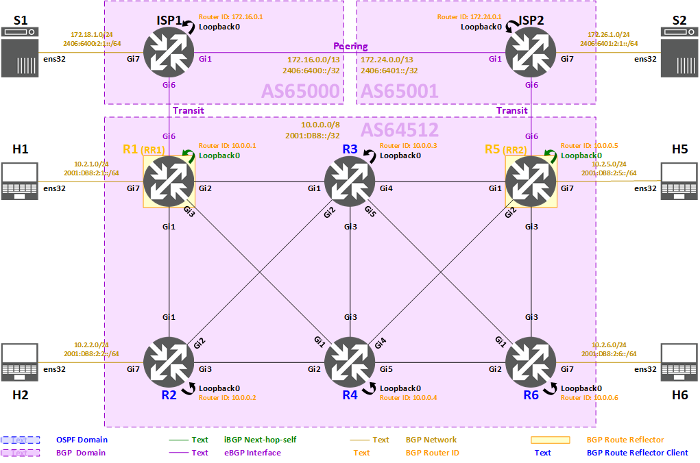

<span style="display:block;text-align:center"></span>
#<center><b>Deploying BGP (Cisco IOS) Lab</b></center>


>###<center>**Task 6: BGP Route Reflection**
</center>

>[!alert] Please make sure all previous tasks work as expected and you understand them before doing this task.




>[!help]Due to the split horizon rule of iBGP, all iBGP peers within an AS must be fully meshed, this leads to a scalability issue when there are many BGP routers in the network, it could result huge amount of iBGP sessions, which is hard to maintain and troubleshoot.
* Number of full mesh iBGP sessions: **n (n - 1) / 2**
	* n = number of BGP routers
	* **10** routers = **10 (10 - 1) / 2** = **45** sessions
	* **50** routers = **50 (50 - 1) / 2** = **1,225** sessions

>[!hint]One solution to reduce the number of iBGP sessions within an AS is **route reflection**. Rather than each BGP router having to peer with every other BGP router within the AS, each BGP router instead peers with a router reflector. Routing advertisements sent to the route reflector are then reflected out to all other BGP routers.

In this task, we will migrate AS64512's full mesh iBGP to a route reflection design with **two route reflectors**:

* **R1** is assigned as **route reflector 1 (RR1)**
* **R5** is assigned as **route reflector 2 (RR2)**

All the **other routers (R2, R3, R4, R6)** will be route reflector clients, and will **only peer with the route reflectors (R1, R5)**, there will be **no iBGP session required between the clients**.


### **Route reflector configuration summary** ###

>* Route Reflectors:
	* R1 as RR1
		* Next hop option: **self**
	* R5 as RR2
		* Next hop option: **self**
* Route Reflector Clients:
	* R2
	* R3
	* R4
	* R6
* Address Families:
	* **IPv4 Unicast** (on IPv4 transport)
	* **IPv6 Unicast** (on IPv6 transport)

- There are 3 steps in this task:

* [Step 6.1: Configuring BGP route reflection](#step-61-configuring-bgp-route-reflection)

* [Step 6.2: Verifying BGP route reflection](#step-62-verifying-bgp-route-reflection)

* [Step 6.3: Verifying IPv4 and IPv6 reachability](#step-63-verifying-ipv4-and-ipv6-reachability)


### **Step 6.1: Configuring BGP route reflection** ###

In this step, we will configure the route reflectors (R1, R5) and their clients (R2, R3, R4, R6) for both IPv4 Unicast Address Family and IPv6 Unicast Address Family, and we will remove unnecessary iBGP sessions between the clients.  


#### **Step 6.1.1: Configuring BGP route reflection on R1** ####

- Select R1 from the Resources tab.

	```powershell-nocode
	Username: apnic
	Password: training
    ```

- The commands below must be run in the privileged exec mode. Type `enable` to enter this mode.

    ```powershell-nocode
	enable
	Password: labconfig
    ```

- Here is the link of [Routing Topology - iBGP (AS64512, route reflector)](topology_routing_ibgp_as64512_rr4.png) for your reference.

- Here is the BGP route reflection configuration on **R1**:

	```
	configure terminal
	
	!
	! Enter BGP configuration for AS64512
	router bgp 64512
	 !
	 ! Create peer group for IPv4 Unicast route reflector clients: IBGP-IPV4-RRC
	 neighbor IBGP-IPV4-RRC peer-group
	 neighbor IBGP-IPV4-RRC remote-as 64512
	 neighbor IBGP-IPV4-RRC update-source Loopback0
	 neighbor IBGP-IPV4-RRC password iBGP%IW0ntTe11U!!
	 !
	 ! Move route reflector clients to the IBGP-IPV4-RRC peer group
	 no neighbor 10.0.0.2 peer-group IBGP-IPV4
	 no neighbor 10.0.0.3 peer-group IBGP-IPV4
	 no neighbor 10.0.0.4 peer-group IBGP-IPV4
	 no neighbor 10.0.0.6 peer-group IBGP-IPV4
	 neighbor 10.0.0.2 peer-group IBGP-IPV4-RRC
	 neighbor 10.0.0.3 peer-group IBGP-IPV4-RRC
	 neighbor 10.0.0.4 peer-group IBGP-IPV4-RRC
	 neighbor 10.0.0.6 peer-group IBGP-IPV4-RRC
	 !
	 ! Create peer group for IPv6 Unicast route reflector clients: IBGP-IPV6-RRC
	 neighbor IBGP-IPV6-RRC peer-group
	 neighbor IBGP-IPV6-RRC remote-as 64512
	 neighbor IBGP-IPV6-RRC update-source Loopback0
	 neighbor IBGP-IPV6-RRC password iBGP%IW0ntTe11U!!
	 !
	 ! Move route reflector clients to the IBGP-IPV6-RRC peer group
	 no neighbor 2001:DB8::2 peer-group IBGP-IPV6
	 no neighbor 2001:DB8::3 peer-group IBGP-IPV6
	 no neighbor 2001:DB8::4 peer-group IBGP-IPV6
	 no neighbor 2001:DB8::6 peer-group IBGP-IPV6
	 neighbor 2001:DB8::2 peer-group IBGP-IPV6-RRC
	 neighbor 2001:DB8::3 peer-group IBGP-IPV6-RRC
	 neighbor 2001:DB8::4 peer-group IBGP-IPV6-RRC
	 neighbor 2001:DB8::6 peer-group IBGP-IPV6-RRC
	
	 !
	 ! Enter IPv4 Unicast Address Family configuration
	 address-family ipv4 unicast
	  !
	  ! iBGP Next hop option: self
	  ! Replace the next hop of all eBGP prefixes that received by this router
	  ! to its update source (Loopback0) when the prefixes are advertised into iBGP
	  neighbor IBGP-IPV4-RRC next-hop-self
	  !
	  ! Set peer group IBGP-IPV4-RRC as route reflector clients
	  neighbor IBGP-IPV4-RRC route-reflector-client
	  !
	  ! Re-enable IPv4 Unicast Address Family capability for route reflector clients
	  neighbor 10.0.0.2 activate
	  neighbor 10.0.0.3 activate
	  neighbor 10.0.0.4 activate
	  neighbor 10.0.0.6 activate
	 !
	 ! Exit IPv4 Unicast Address Family configuration
	 exit-address-family
	
	 !
	 ! Enter IPv6 Unicast Address Family configuration
	 address-family ipv6 unicast
	  !
	  ! iBGP Next hop option: self
	  ! Replace the next hop of all eBGP prefixes that received by this router
	  ! to its update source (Loopback0) when the prefixes are advertised into iBGP
	  neighbor IBGP-IPV6-RRC next-hop-self
	  !
	  ! Set peer group IBGP-IPV6-RRC as route reflector clients
	  neighbor IBGP-IPV6-RRC route-reflector-client
	  !
	  ! Re-enter IPv6 Unicast Address Family configuration for route reflector clients
	  neighbor 2001:DB8::2 activate
	  neighbor 2001:DB8::3 activate
	  neighbor 2001:DB8::4 activate
	  neighbor 2001:DB8::6 activate
	 !
	 ! Exit IPv6 Unicast Address Family configuration
	 exit-address-family
	
	end
	```


#### **Step 6.1.2: Configuring BGP route reflection on R2** ####

- Select R2 from the Resources tab.

	```powershell-nocode
	Username: apnic
	Password: training
    ```

- The commands below must be run in the privileged exec mode. Type `enable` to enter this mode.

    ```powershell-nocode
	enable
	Password: labconfig
    ```

- Here is the link of [Routing Topology - iBGP (AS64512, route reflector)](topology_routing_ibgp_as64512_rr4.png) for your reference.

- Here is the BGP route reflection configuration on **R2**:

	```
	configure terminal
	
	router bgp 64512
	 !
	 ! R2 is a route reflector client of R1 (RR1) and R5 (RR2),
	 ! so it does not require peering with other clients (R3, R4, R5) anymore.
	 ! Therefore, the iBGP neighbors can be removed.
	 no neighbor 10.0.0.3
	 no neighbor 10.0.0.4
	 no neighbor 10.0.0.6
	 no neighbor 2001:DB8::3
	 no neighbor 2001:DB8::4
	 no neighbor 2001:DB8::6
	
	end
	```


#### **Step 6.1.3: Configuring BGP route reflection on R3** ####

- Select R3 from the Resources tab.

	```powershell-nocode
	Username: apnic
	Password: training
    ```

- The commands below must be run in the privileged exec mode. Type `enable` to enter this mode.

    ```powershell-nocode
	enable
	Password: labconfig
    ```

- Here is the link of [Routing Topology - iBGP (AS64512, route reflector)](topology_routing_ibgp_as64512_rr4.png) for your reference.

- Here is the BGP route reflection configuration on **R3**:

	```
	configure terminal
	
	router bgp 64512
	 no neighbor 10.0.0.2
	 no neighbor 10.0.0.4
	 no neighbor 10.0.0.6
	 no neighbor 2001:DB8::2
	 no neighbor 2001:DB8::4
	 no neighbor 2001:DB8::6
	
	end
	```


#### **Step 6.1.4: Configuring BGP route reflection on R4** ####

- Select R4 from the Resources tab.

	```powershell-nocode
	Username: apnic
	Password: training
    ```

- The commands below must be run in the privileged exec mode. Type `enable` to enter this mode.

    ```powershell-nocode
	enable
	Password: labconfig
    ```

- Here is the link of [Routing Topology - iBGP (AS64512, route reflector)](topology_routing_ibgp_as64512_rr4.png) for your reference.

- Here is the BGP route reflection configuration on **R4**:

	```
	configure terminal
	
	router bgp 64512
	 no neighbor 10.0.0.2
	 no neighbor 10.0.0.3
	 no neighbor 10.0.0.6
	 no neighbor 2001:DB8::2
	 no neighbor 2001:DB8::3
	 no neighbor 2001:DB8::6
	
	end
	```


#### **Step 6.1.5: Configuring BGP route reflection on R5** ####

- Select R5 from the Resources tab.

	```powershell-nocode
	Username: apnic
	Password: training
    ```

- The commands below must be run in the privileged exec mode. Type `enable` to enter this mode.

    ```powershell-nocode
	enable
	Password: labconfig
    ```

- Here is the link of [Routing Topology - iBGP (AS64512, route reflector)](topology_routing_ibgp_as64512_rr4.png) for your reference.

- Here is the BGP route reflection configuration on **R5**:

	```
	configure terminal
	
	router bgp 64512
	 neighbor IBGP-IPV4-RRC peer-group
	 neighbor IBGP-IPV4-RRC remote-as 64512
	 neighbor IBGP-IPV4-RRC update-source Loopback0
	 neighbor IBGP-IPV4-RRC password iBGP%IW0ntTe11U!!
	 no neighbor 10.0.0.2 peer-group IBGP-IPV4
	 no neighbor 10.0.0.3 peer-group IBGP-IPV4
	 no neighbor 10.0.0.4 peer-group IBGP-IPV4
	 no neighbor 10.0.0.6 peer-group IBGP-IPV4
	 neighbor 10.0.0.2 peer-group IBGP-IPV4-RRC
	 neighbor 10.0.0.3 peer-group IBGP-IPV4-RRC
	 neighbor 10.0.0.4 peer-group IBGP-IPV4-RRC
	 neighbor 10.0.0.6 peer-group IBGP-IPV4-RRC
	 neighbor IBGP-IPV6-RRC peer-group
	 neighbor IBGP-IPV6-RRC remote-as 64512
	 neighbor IBGP-IPV6-RRC update-source Loopback0
	 neighbor IBGP-IPV6-RRC password iBGP%IW0ntTe11U!!
	 no neighbor 2001:DB8::2 peer-group IBGP-IPV6
	 no neighbor 2001:DB8::3 peer-group IBGP-IPV6
	 no neighbor 2001:DB8::4 peer-group IBGP-IPV6
	 no neighbor 2001:DB8::6 peer-group IBGP-IPV6
	 neighbor 2001:DB8::2 peer-group IBGP-IPV6-RRC
	 neighbor 2001:DB8::3 peer-group IBGP-IPV6-RRC
	 neighbor 2001:DB8::4 peer-group IBGP-IPV6-RRC
	 neighbor 2001:DB8::6 peer-group IBGP-IPV6-RRC
	
	 address-family ipv4 unicast
	  neighbor IBGP-IPV4-RRC next-hop-self
	  neighbor IBGP-IPV4-RRC route-reflector-client
	  neighbor 10.0.0.2 activate
	  neighbor 10.0.0.3 activate
	  neighbor 10.0.0.4 activate
	  neighbor 10.0.0.6 activate
	 exit-address-family
	
	 address-family ipv6 unicast
	  neighbor IBGP-IPV6-RRC next-hop-self
	  neighbor IBGP-IPV6-RRC route-reflector-client
	  neighbor 2001:DB8::2 activate
	  neighbor 2001:DB8::3 activate
	  neighbor 2001:DB8::4 activate
	  neighbor 2001:DB8::6 activate
	 exit-address-family
	
	end
	```


#### **Step 6.1.6: Configuring BGP route reflection on R6** ####

- Select R6 from the Resources tab.

	```powershell-nocode
	Username: apnic
	Password: training
    ```

- The commands below must be run in the privileged exec mode. Type `enable` to enter this mode.

    ```powershell-nocode
	enable
	Password: labconfig
    ```

- Here is the link of [Routing Topology - iBGP (AS64512, route reflector)](topology_routing_ibgp_as64512_rr4.png) for your reference.

- Here is the BGP route reflection configuration on **R6**:

	```
	configure terminal
	
	router bgp 64512
	 no neighbor 10.0.0.2
	 no neighbor 10.0.0.3
	 no neighbor 10.0.0.4
	 no neighbor 2001:DB8::2
	 no neighbor 2001:DB8::3
	 no neighbor 2001:DB8::4
	
	end
	```


### **Step 6.2: Verifying BGP route reflection** ###

>[!alert] Please perform this verification step only when you have fully completed previous configuration steps of this task.

In this step, we will check whether we have successfully implemented route reflection. We can expect:

* Number of BGP neighbors:
	* R1, R5: No change
	* R2, R3, R4, R6: **Only 4 iBGP neighbors (2 IPv4, 2 IPv6)** with both route reflectors
* BGP table:
	* iBGP prefixes are reflected by R1, R5
	* Some prefixes have redundant BGP path with same next hop
* Routing table: No change
* Reachability: No change


#### **Step 6.2.1: Verifying BGP route reflection on Route reflector 1 (R1)** ####

- Select R1 from the Resources tab.

	```powershell-nocode
	Username: apnic
	Password: training
    ```

- The commands below must be run in the privileged exec mode. Type `enable` to enter this mode.

    ```powershell-nocode
	enable
	Password: labconfig
    ```

- Here is the link of [Routing Topology - iBGP (AS64512, route reflector)](topology_routing_ibgp_as64512_rr4.png) with IP addresses for your reference.

1. Verify BGP neighbors

	- To check IPv4 Unicast BGP neighbors, type `show bgp ipv4 unicast summary`, the result is as shown below:

    	```powershell-nocode
		R1#show bgp ipv4 unicast summary
		BGP router identifier 10.0.0.1, local AS number 64512
		BGP table version is 15, main routing table version 15
		10 network entries using 2480 bytes of memory
		14 path entries using 1792 bytes of memory
		10/7 BGP path/bestpath attribute entries using 2640 bytes of memory
		2 BGP rrinfo entries using 80 bytes of memory
		2 BGP AS-PATH entries using 48 bytes of memory
		0 BGP route-map cache entries using 0 bytes of memory
		0 BGP filter-list cache entries using 0 bytes of memory
		BGP using 7040 total bytes of memory
		BGP activity 20/0 prefixes, 32/4 paths, scan interval 60 secs
		
		Neighbor        V           AS MsgRcvd MsgSent   TblVer  InQ OutQ Up/Down  State/PfxRcd
		10.0.0.2        4        64512       8      14       15    0    0 00:01:37        1
		10.0.0.3        4        64512       7      14       15    0    0 00:01:36        0
		10.0.0.4        4        64512       7      12       15    0    0 00:01:40        0
		10.0.0.5        4        64512      18      23       15    0    0 00:10:07        7
		10.0.0.6        4        64512       8      14       15    0    0 00:01:35        1
		172.20.0.1      4        65000      16      19       15    0    0 00:10:34        3
		```
	
	- To check IPv6 Unicast BGP neighbors, type `show bgp ipv6 unicast summary`, the result is as shown below:

    	```powershell-nocode
		R1#show bgp ipv6 unicast summary
		BGP router identifier 10.0.0.1, local AS number 64512
		BGP table version is 15, main routing table version 15
		10 network entries using 2720 bytes of memory
		14 path entries using 2128 bytes of memory
		10/7 BGP path/bestpath attribute entries using 2640 bytes of memory
		2 BGP rrinfo entries using 80 bytes of memory
		2 BGP AS-PATH entries using 48 bytes of memory
		0 BGP route-map cache entries using 0 bytes of memory
		0 BGP filter-list cache entries using 0 bytes of memory
		BGP using 7616 total bytes of memory
		BGP activity 20/0 prefixes, 32/4 paths, scan interval 60 secs
		
		Neighbor        V           AS MsgRcvd MsgSent   TblVer  InQ OutQ Up/Down  State/PfxRcd
		2001:DB8::2     4        64512       9      12       15    0    0 00:01:52        1
		2001:DB8::3     4        64512       8      15       15    0    0 00:01:49        0
		2001:DB8::4     4        64512       7      15       15    0    0 00:01:48        0
		2001:DB8::5     4        64512      18      18       15    0    0 00:10:38        7
		2001:DB8::6     4        64512       9      15       15    0    0 00:01:48        1
		2406:6400:4::   4        65000      16      19       15    0    0 00:10:39        3
		```
	
	- To check detail information of IPv4 Unicast BGP route reflector client 10.0.0.6 (R6), type `show bgp ipv4 unicast neighbors 10.0.0.6`, the result is as shown below:

    	```powershell-nocode
		R1#show bgp ipv4 unicast neighbors 10.0.0.6
		BGP neighbor is 10.0.0.6,  remote AS 64512, internal link
		 Member of peer-group IBGP-IPV4-RRC for session parameters
		  BGP version 4, remote router ID 10.0.0.6
		  BGP state = Established, up for 00:02:19
		-- (snipped some unimportant parts of the output) --
		
		 For address family: IPv4 Unicast
		  Session: 10.0.0.6
		  BGP table version 15, neighbor version 15/0
		  Output queue size : 0
		  Index 3, Advertise bit 2
		  Route-Reflector Client												<-- Route reflector client
		  3 update-group member
		  IBGP-IPV4-RRC peer-group member										<-- IBGP-IPV4-RRC peer group
		  NEXT_HOP is always this router for eBGP paths
		  Slow-peer detection is disabled
		  Slow-peer split-update-group dynamic is disabled
		-- (snipped some unimportant parts of the output) --
		```

		>[!alert] The original output of above command actually displayed massive details of the BGP neighbor. For ease of understanding, we have excluded some unimportant parts of the output that are not our focus here.
	
	There is no change on the number of BGP neighbors, only R2, R3, R4, R6 are set as route reflector clients, and R5 has advertised a few prefixes additionally as a result of route reflection for its route reflector clients. 

2. Verify BGP table

	- To check IPv4 Unicast BGP table, type `show bgp ipv4 unicast`, the result is as shown below:

    	```powershell-nocode
		R1#show bgp ipv4 unicast
		BGP table version is 15, local router ID is 10.0.0.1
		Status codes: s suppressed, d damped, h history, * valid, > best, i - internal,
		              r RIB-failure, S Stale, m multipath, b backup-path, f RT-Filter,
		              x best-external, a additional-path, c RIB-compressed,
		              t secondary path,
		Origin codes: i - IGP, e - EGP, ? - incomplete
		RPKI validation codes: V valid, I invalid, N Not found
		
		     Network          Next Hop            Metric LocPrf Weight Path
		 * i  0.0.0.0          10.0.0.5                 0    100      0 65001 i	<-- Default route
		 *>                    172.20.0.1                             0 65000 i
		 * i  10.0.0.0         10.0.0.5                 0    100      0 i
		 *>                    0.0.0.0                  0         32768 i
		 *>   10.2.1.0/24      0.0.0.0                  0         32768 i
		 * i  10.2.2.0/24      10.0.0.2                 0    100      0 i
		 *>i                   10.0.0.2                 0    100      0 i
		 *>i  10.2.5.0/24      10.0.0.5                 0    100      0 i
		 * i  10.2.6.0/24      10.0.0.6                 0    100      0 i
		 *>i                   10.0.0.6                 0    100      0 i
		 *>   172.16.0.0/13    172.20.0.1               0             0 65000 i	<-- AS65000 aggregation
		 *>   172.18.1.0/24    172.20.0.1               0             0 65000 i <-- Server S1
		 *>i  172.24.0.0/13    10.0.0.5                 0    100      0 65001 i	<-- AS65001 aggregation
		 *>i  172.26.1.0/24    10.0.0.5                 0    100      0 65001 i <-- Server S2
		```
	
	- To check IPv6 Unicast BGP table, type `show bgp ipv6 unicast`, the result is as shown below:

    	```powershell-nocode
		R1#show bgp ipv6 unicast
		BGP table version is 15, local router ID is 10.0.0.1
		Status codes: s suppressed, d damped, h history, * valid, > best, i - internal,
		              r RIB-failure, S Stale, m multipath, b backup-path, f RT-Filter,
		              x best-external, a additional-path, c RIB-compressed,
		              t secondary path,
		Origin codes: i - IGP, e - EGP, ? - incomplete
		RPKI validation codes: V valid, I invalid, N Not found
		
		     Network          Next Hop            Metric LocPrf Weight Path
		 * i  ::/0             2001:DB8::5              0    100      0 65001 i	<-- Default route
		 *>                    2406:6400:4::                          0 65000 i
		 * i  2001:DB8::/32    2001:DB8::5              0    100      0 i
		 *>                    ::                       0         32768 i
		 *>   2001:DB8:2:1::/64
		                       ::                       0         32768 i
		 * i  2001:DB8:2:2::/64
		                       2001:DB8::2              0    100      0 i
		 *>i                   2001:DB8::2              0    100      0 i
		 *>i  2001:DB8:2:5::/64
		                       2001:DB8::5              0    100      0 i
		 * i  2001:DB8:2:6::/64
		                       2001:DB8::6              0    100      0 i
		 *>i                   2001:DB8::6              0    100      0 i
		 *>   2406:6400::/32   2406:6400:4::            0             0 65000 i	<-- AS65000 aggregation
		 *>   2406:6400:2:1::/64												<-- Server S1
		                       2406:6400:4::            0             0 65000 i
		 *>i  2406:6401::/32   2001:DB8::5              0    100      0 65001 i	<-- AS65001 aggregation
		 *>i  2406:6401:2:1::/64												<-- Server S2
		                       2001:DB8::5              0    100      0 65001 i
		```
	
	All BGP prefixes appear in the BGP table as they did in previous task, and some iBGP prefixes have redundant path advertised by another route reflector (R5).

3. Verify routing table

	- To check IPv4 Unicast BGP routes, type `show ip route bgp`, the result is as shown below:

    	```powershell-nocode
		R1#show ip route bgp
		Codes: L - local, C - connected, S - static, R - RIP, M - mobile, B - BGP
		       D - EIGRP, EX - EIGRP external, O - OSPF, IA - OSPF inter area
		       N1 - OSPF NSSA external type 1, N2 - OSPF NSSA external type 2
		       E1 - OSPF external type 1, E2 - OSPF external type 2
		       i - IS-IS, su - IS-IS summary, L1 - IS-IS level-1, L2 - IS-IS level-2
		       ia - IS-IS inter area, * - candidate default, U - per-user static route
		       o - ODR, P - periodic downloaded static route, H - NHRP, l - LISP
		       a - application route
		       + - replicated route, % - next hop override, p - overrides from PfR
		
		Gateway of last resort is 172.20.0.1 to network 0.0.0.0
		
		B*    0.0.0.0/0 [20/0] via 172.20.0.1, 00:11:16							<-- Default route
		      10.0.0.0/8 is variably subnetted, 26 subnets, 4 masks
		B        10.2.2.0/24 [200/0] via 10.0.0.2, 00:03:30
		B        10.2.5.0/24 [200/0] via 10.0.0.5, 00:11:15
		B        10.2.6.0/24 [200/0] via 10.0.0.6, 00:03:28
		B     172.16.0.0/13 [20/0] via 172.20.0.1, 00:11:16						<-- AS65000 aggregation
		      172.18.0.0/24 is subnetted, 1 subnets
		B        172.18.1.0 [20/0] via 172.20.0.1, 00:11:16						<-- Server S1
		B     172.24.0.0/13 [200/0] via 10.0.0.5, 00:11:15						<-- AS65001 aggregation
		      172.26.0.0/24 is subnetted, 1 subnets
		B        172.26.1.0 [200/0] via 10.0.0.5, 00:11:15						<-- Server S2
		```
	
	- To check IPv6 Unicast BGP routes, type `show ipv6 route bgp`, the result is as shown below:

    	```powershell-nocode
			R1#show ipv6 route bgp
			IPv6 Routing Table - default - 34 entries
			Codes: C - Connected, L - Local, S - Static, U - Per-user Static route
			       B - BGP, R - RIP, H - NHRP, I1 - ISIS L1
			       I2 - ISIS L2, IA - ISIS interarea, IS - ISIS summary, D - EIGRP
			       EX - EIGRP external, ND - ND Default, NDp - ND Prefix, DCE - Destination
			       NDr - Redirect, RL - RPL, O - OSPF Intra, OI - OSPF Inter
			       OE1 - OSPF ext 1, OE2 - OSPF ext 2, ON1 - OSPF NSSA ext 1
			       ON2 - OSPF NSSA ext 2, la - LISP alt, lr - LISP site-registrations
			       ld - LISP dyn-eid, lA - LISP away, a - Application
			B   ::/0 [20/0]															<-- Default route
			     via FE80::253:1FF:FE11:106, GigabitEthernet6
			B   2001:DB8:2:2::/64 [200/0]
			     via 2001:DB8::2
			B   2001:DB8:2:5::/64 [200/0]
			     via 2001:DB8::5
			B   2001:DB8:2:6::/64 [200/0]
			     via 2001:DB8::6
			B   2406:6400::/32 [20/0]												<-- AS65000 aggregation
			     via FE80::253:1FF:FE11:106, GigabitEthernet6
			B   2406:6400:2:1::/64 [20/0]											<-- Server S1
			     via FE80::253:1FF:FE11:106, GigabitEthernet6
			B   2406:6401::/32 [200/0]												<-- AS65001 aggregation
			     via 2001:DB8::5
			B   2406:6401:2:1::/64 [200/0]											<-- Server S2
			     via 2001:DB8::5
		```
	
	All BGP routes appear in the routing table as they did in previous task.


#### **Step 6.2.2: Verifying BGP route reflection on Route reflector 2 (R5)** ####

- Select R5 from the Resources tab.

	```powershell-nocode
	Username: apnic
	Password: training
    ```

- The commands below must be run in the privileged exec mode. Type `enable` to enter this mode.

    ```powershell-nocode
	enable
	Password: labconfig
    ```

- Here is the link of [Routing Topology - iBGP (AS64512, route reflector)](topology_routing_ibgp_as64512_rr4.png) with IP addresses for your reference.

1. Verify BGP neighbors

	- To check IPv4 Unicast BGP neighbors, type `show bgp ipv4 unicast summary`, the result is as shown below:

    	```powershell-nocode
		R5#show bgp ipv4 unicast summary
		BGP router identifier 10.0.0.5, local AS number 64512
		BGP table version is 20, main routing table version 20
		10 network entries using 2480 bytes of memory
		14 path entries using 1792 bytes of memory
		10/7 BGP path/bestpath attribute entries using 2640 bytes of memory
		2 BGP rrinfo entries using 80 bytes of memory
		2 BGP AS-PATH entries using 48 bytes of memory
		0 BGP route-map cache entries using 0 bytes of memory
		0 BGP filter-list cache entries using 0 bytes of memory
		BGP using 7040 total bytes of memory
		BGP activity 20/0 prefixes, 32/4 paths, scan interval 60 secs
		
		Neighbor        V           AS MsgRcvd MsgSent   TblVer  InQ OutQ Up/Down  State/PfxRcd
		10.0.0.1        4        64512      23      18       20    0    0 00:10:09        7
		10.0.0.2        4        64512       8      15       20    0    0 00:01:18        1
		10.0.0.3        4        64512       7      13       20    0    0 00:01:17        0
		10.0.0.4        4        64512       7      13       20    0    0 00:01:16        0
		10.0.0.6        4        64512       8      12       20    0    0 00:01:18        1
		172.28.0.1      4        65001      16      17       20    0    0 00:10:35        3
		```
	
	- To check IPv6 Unicast BGP neighbors, type `show bgp ipv6 unicast summary`, the result is as shown below:

    	```powershell-nocode
		R5#show bgp ipv6 unicast summary
		BGP router identifier 10.0.0.5, local AS number 64512
		BGP table version is 16, main routing table version 16
		10 network entries using 2720 bytes of memory
		14 path entries using 2128 bytes of memory
		10/7 BGP path/bestpath attribute entries using 2640 bytes of memory
		2 BGP rrinfo entries using 80 bytes of memory
		2 BGP AS-PATH entries using 48 bytes of memory
		0 BGP route-map cache entries using 0 bytes of memory
		0 BGP filter-list cache entries using 0 bytes of memory
		BGP using 7616 total bytes of memory
		BGP activity 20/0 prefixes, 32/4 paths, scan interval 60 secs
		
		Neighbor        V           AS MsgRcvd MsgSent   TblVer  InQ OutQ Up/Down  State/PfxRcd
		2001:DB8::1     4        64512      18      18       16    0    0 00:10:40        7
		2001:DB8::2     4        64512       8      15       16    0    0 00:01:32        1
		2001:DB8::3     4        64512       7      13       16    0    0 00:01:27        0
		2001:DB8::4     4        64512       7      13       16    0    0 00:01:32        0
		2001:DB8::6     4        64512       8      12       16    0    0 00:01:32        1
		2406:6401:4::   4        65001      16      18       16    0    0 00:10:39        3
		```
	
	- To check detail information of IPv4 Unicast BGP route reflector client 10.0.0.2 (R2), type `show bgp ipv4 unicast neighbors 10.0.0.2`, the result is as shown below:

    	```powershell-nocode
		R5#show bgp ipv4 unicast neighbors 10.0.0.2
		BGP neighbor is 10.0.0.2,  remote AS 64512, internal link
		 Member of peer-group IBGP-IPV4-RRC for session parameters
		  BGP version 4, remote router ID 10.0.0.2
		  BGP state = Established, up for 00:02:21
		-- (snipped some unimportant parts of the output) --
		
		 For address family: IPv4 Unicast
		  Session: 10.0.0.2
		  BGP table version 20, neighbor version 20/0
		  Output queue size : 0
		  Index 3, Advertise bit 2
		  Route-Reflector Client												<-- Route reflector client
		  3 update-group member
		  IBGP-IPV4-RRC peer-group member										<-- IBGP-IPV4-RRC peer group
		  NEXT_HOP is always this router for eBGP paths
		  Slow-peer detection is disabled
		  Slow-peer split-update-group dynamic is disabled
		-- (snipped some unimportant parts of the output) --
		```

		>[!alert] The original output of above command actually displayed massive details of the BGP neighbor. For ease of understanding, we have excluded some unimportant parts of the output that are not our focus here.
	
	There is no change on the number of BGP neighbors, only R2, R3, R4, R6 are set as route reflector clients, and R1 has advertised a few prefixes additionally as a result of route reflection for its route reflector clients. 

2. Verify BGP table

	- To check IPv4 Unicast BGP table, type `show bgp ipv4 unicast`, the result is as shown below:

    	```powershell-nocode
		R5#show bgp ipv4 unicast
		BGP table version is 20, local router ID is 10.0.0.5
		Status codes: s suppressed, d damped, h history, * valid, > best, i - internal,
		              r RIB-failure, S Stale, m multipath, b backup-path, f RT-Filter,
		              x best-external, a additional-path, c RIB-compressed,
		              t secondary path,
		Origin codes: i - IGP, e - EGP, ? - incomplete
		RPKI validation codes: V valid, I invalid, N Not found
		
		     Network          Next Hop            Metric LocPrf Weight Path
		 * i  0.0.0.0          10.0.0.1                 0    100      0 65000 i	<-- Default route
		 *>                    172.28.0.1                             0 65001 i
		 * i  10.0.0.0         10.0.0.1                 0    100      0 i
		 *>                    0.0.0.0                  0         32768 i
		 *>i  10.2.1.0/24      10.0.0.1                 0    100      0 i
		 *>i  10.2.2.0/24      10.0.0.2                 0    100      0 i
		 * i                   10.0.0.2                 0    100      0 i
		 *>   10.2.5.0/24      0.0.0.0                  0         32768 i
		 *>i  10.2.6.0/24      10.0.0.6                 0    100      0 i
		 * i                   10.0.0.6                 0    100      0 i
		 *>i  172.16.0.0/13    10.0.0.1                 0    100      0 65000 i	<-- AS65000 aggregation
		 *>i  172.18.1.0/24    10.0.0.1                 0    100      0 65000 i <-- Server S1
		 *>   172.24.0.0/13    172.28.0.1               0             0 65001 i	<-- AS65001 aggregation
		 *>   172.26.1.0/24    172.28.0.1               0             0 65001 i <-- Server S2
		```
	
	- To check IPv6 Unicast BGP table, type `show bgp ipv6 unicast`, the result is as shown below:
	
    	```powershell-nocode
		R5#show bgp ipv6 unicast
		BGP table version is 16, local router ID is 10.0.0.5
		Status codes: s suppressed, d damped, h history, * valid, > best, i - internal,
		              r RIB-failure, S Stale, m multipath, b backup-path, f RT-Filter,
		              x best-external, a additional-path, c RIB-compressed,
		              t secondary path,
		Origin codes: i - IGP, e - EGP, ? - incomplete
		RPKI validation codes: V valid, I invalid, N Not found
		
		     Network          Next Hop            Metric LocPrf Weight Path
		 * i  ::/0             2001:DB8::1              0    100      0 65000 i	<-- Default route
		 *>                    2406:6401:4::                          0 65001 i
		 * i  2001:DB8::/32    2001:DB8::1              0    100      0 i
		 *>                    ::                       0         32768 i
		 *>i  2001:DB8:2:1::/64
		                       2001:DB8::1              0    100      0 i
		 *>i  2001:DB8:2:2::/64
		                       2001:DB8::2              0    100      0 i
		 * i                   2001:DB8::2              0    100      0 i
		 *>   2001:DB8:2:5::/64
		                       ::                       0         32768 i
		 *>i  2001:DB8:2:6::/64
		                       2001:DB8::6              0    100      0 i
		 * i                   2001:DB8::6              0    100      0 i
		 *>i  2406:6400::/32   2001:DB8::1              0    100      0 65000 i	<-- AS65000 aggregation
		 *>i  2406:6400:2:1::/64												<-- Server S1
		                       2001:DB8::1              0    100      0 65000 i
		 *>   2406:6401::/32   2406:6401:4::            0             0 65001 i	<-- AS65001 aggregation
		 *>   2406:6401:2:1::/64												<-- Server S2
		                       2406:6401:4::            0             0 65001 i
		```
	
	All BGP prefixes appear in the BGP table as they did in previous task, and some iBGP prefixes have redundant path advertised by another route reflector (R1).

3. Verify routing table

	- To check IPv4 Unicast BGP routes, type `show ip route bgp`, the result is as shown below:

    	```powershell-nocode
		R5#show ip route bgp
		Codes: L - local, C - connected, S - static, R - RIP, M - mobile, B - BGP
		       D - EIGRP, EX - EIGRP external, O - OSPF, IA - OSPF inter area
		       N1 - OSPF NSSA external type 1, N2 - OSPF NSSA external type 2
		       E1 - OSPF external type 1, E2 - OSPF external type 2
		       i - IS-IS, su - IS-IS summary, L1 - IS-IS level-1, L2 - IS-IS level-2
		       ia - IS-IS inter area, * - candidate default, U - per-user static route
		       o - ODR, P - periodic downloaded static route, H - NHRP, l - LISP
		       a - application route
		       + - replicated route, % - next hop override, p - overrides from PfR
		
		Gateway of last resort is 172.28.0.1 to network 0.0.0.0
		
		B*    0.0.0.0/0 [20/0] via 172.28.0.1, 00:11:42							<-- Default route
		      10.0.0.0/8 is variably subnetted, 26 subnets, 4 masks
		B        10.2.1.0/24 [200/0] via 10.0.0.1, 00:04:06
		B        10.2.2.0/24 [200/0] via 10.0.0.2, 00:03:35
		B        10.2.6.0/24 [200/0] via 10.0.0.6, 00:03:35
		B     172.16.0.0/13 [200/0] via 10.0.0.1, 00:04:06						<-- AS65000 aggregation
		      172.18.0.0/24 is subnetted, 1 subnets
		B        172.18.1.0 [200/0] via 10.0.0.1, 00:04:06						<-- Server S1
		B     172.24.0.0/13 [20/0] via 172.28.0.1, 00:11:42						<-- AS65001 aggregation
		      172.26.0.0/24 is subnetted, 1 subnets
		B        172.26.1.0 [20/0] via 172.28.0.1, 00:11:42						<-- Server S2
		```
	
	- To check IPv6 Unicast BGP routes, type `show ipv6 route bgp`, the result is as shown below:

    	```powershell-nocode
		R5#show ipv6 route bgp
		IPv6 Routing Table - default - 34 entries
		Codes: C - Connected, L - Local, S - Static, U - Per-user Static route
		       B - BGP, R - RIP, H - NHRP, I1 - ISIS L1
		       I2 - ISIS L2, IA - ISIS interarea, IS - ISIS summary, D - EIGRP
		       EX - EIGRP external, ND - ND Default, NDp - ND Prefix, DCE - Destination
		       NDr - Redirect, RL - RPL, O - OSPF Intra, OI - OSPF Inter
		       OE1 - OSPF ext 1, OE2 - OSPF ext 2, ON1 - OSPF NSSA ext 1
		       ON2 - OSPF NSSA ext 2, la - LISP alt, lr - LISP site-registrations
		       ld - LISP dyn-eid, lA - LISP away, a - Application
		B   ::/0 [20/0]															<-- Default route
		     via FE80::253:2FF:FE11:106, GigabitEthernet6
		B   2001:DB8:2:1::/64 [200/0]
		     via 2001:DB8::1
		B   2001:DB8:2:2::/64 [200/0]
		     via 2001:DB8::2
		B   2001:DB8:2:6::/64 [200/0]
		     via 2001:DB8::6
		B   2406:6400::/32 [200/0]												<-- AS65000 aggregation
		     via 2001:DB8::1
		B   2406:6400:2:1::/64 [200/0]											<-- Server S1
		     via 2001:DB8::1
		B   2406:6401::/32 [20/0]												<-- AS65001 aggregation
		     via FE80::253:2FF:FE11:106, GigabitEthernet6
		B   2406:6401:2:1::/64 [20/0]											<-- Server S2
		     via FE80::253:2FF:FE11:106, GigabitEthernet6
		```
	
	All BGP prefixes appear in the BGP table as they did in previous task, and some iBGP prefixes have redundant path advertised by another route reflector (R1).


#### **Step 6.2.3: Verifying BGP route reflection on Route reflector client (R6 as example)** ####

- Select R6 from the Resources tab.

	```powershell-nocode
	Username: apnic
	Password: training
    ```

- The commands below must be run in the privileged exec mode. Type `enable` to enter this mode.

    ```powershell-nocode
	enable
	Password: labconfig
    ```

- Here is the link of [Routing Topology - iBGP (AS64512, route reflector)](topology_routing_ibgp_as64512_rr4.png) with IP addresses for your reference.

1. Verify BGP neighbors

	- To check IPv4 Unicast BGP neighbors, type `show bgp ipv4 unicast summary`, the result is as shown below:

    	```powershell-nocode
		R6#show bgp ipv4 unicast summary
		BGP router identifier 10.0.0.6, local AS number 64512
		BGP table version is 34, main routing table version 34
		10 network entries using 2480 bytes of memory
		19 path entries using 2432 bytes of memory
		13/7 BGP path/bestpath attribute entries using 3432 bytes of memory
		4 BGP rrinfo entries using 160 bytes of memory
		2 BGP AS-PATH entries using 48 bytes of memory
		0 BGP route-map cache entries using 0 bytes of memory
		0 BGP filter-list cache entries using 0 bytes of memory
		BGP using 8552 total bytes of memory
		BGP activity 20/0 prefixes, 60/22 paths, scan interval 60 secs
		
		Neighbor        V           AS MsgRcvd MsgSent   TblVer  InQ OutQ Up/Down  State/PfxRcd
		10.0.0.1        4        64512      14       8       34    0    0 00:01:38        9
		10.0.0.5        4        64512      12       8       34    0    0 00:01:18        9
		```
	
	- To check IPv6 Unicast BGP neighbors, type `show bgp ipv6 unicast summary`, the result is as shown below:

    	```powershell-nocode
		R6#show bgp ipv6 unicast summary
		BGP router identifier 10.0.0.6, local AS number 64512
		BGP table version is 29, main routing table version 29
		10 network entries using 2720 bytes of memory
		19 path entries using 2888 bytes of memory
		13/7 BGP path/bestpath attribute entries using 3432 bytes of memory
		4 BGP rrinfo entries using 160 bytes of memory
		2 BGP AS-PATH entries using 48 bytes of memory
		0 BGP route-map cache entries using 0 bytes of memory
		0 BGP filter-list cache entries using 0 bytes of memory
		BGP using 9248 total bytes of memory
		BGP activity 20/0 prefixes, 60/22 paths, scan interval 60 secs
		
		Neighbor        V           AS MsgRcvd MsgSent   TblVer  InQ OutQ Up/Down  State/PfxRcd
		2001:DB8::1     4        64512      15       9       29    0    0 00:01:50        9
		2001:DB8::5     4        64512      12       8       29    0    0 00:01:33        9
		```
	
	- To check detail information of IPv4 Unicast BGP route reflector 10.0.0.1 (RR1), type `show bgp ipv4 unicast neighbor 10.0.0.1`, the result is as shown below:

    	```powershell-nocode
		R6#show bgp ipv4 unicast neighbor 10.0.0.1
		BGP neighbor is 10.0.0.1,  remote AS 64512, internal link
		 Member of peer-group IBGP-IPV4 for session parameters
		  BGP version 4, remote router ID 10.0.0.1
		  BGP state = Established, up for 00:02:35
		-- (snipped some unimportant parts of the output) --
		
		 For address family: IPv4 Unicast
		  Session: 10.0.0.1
		  BGP table version 34, neighbor version 34/0
		  Output queue size : 0
		  Index 1, Advertise bit 0
		  1 update-group member
		  IBGP-IPV4 peer-group member											<-- IBGP-IPV4 peer group
		  Slow-peer detection is disabled
		  Slow-peer split-update-group dynamic is disabled
		-- (snipped some unimportant parts of the output) --
		```
		
		>[!alert] The original output of above command actually displayed massive details of the BGP neighbor. For ease of understanding, we have excluded some unimportant parts of the output that are not our focus here.
	
	After configuring **R1 and R5 as the route reflectors**, and the **other routers (R2, R3, R4, R6) as the route reflector clients** of R1 and R5, **full mesh iBGP** is **no longer required** for the route reflector clients, they can **simply peer with the route reflectors** to get all iBGP updates.
	
	Technically, route reflector clients (R2, R3, R4, R6) are **not aware** whether they are peering with a route reflector, or a normal iBGP neighbor. There is no indication in the output of the above `show bgp ipv4 unicast neighbor [remote-address]` command as well. In fact, there is also **no special configuration** required at the **client side**, **all configurations** are to be done **on the route reflectors (R1, R5) only**.

2. Verify BGP table

	- To check IPv4 Unicast BGP table, type `show bgp ipv4 unicast`, the result is as shown below:

    	```powershell-nocode
		R6#show bgp ipv4 unicast
		BGP table version is 34, local router ID is 10.0.0.6
		Status codes: s suppressed, d damped, h history, * valid, > best, i - internal,
		              r RIB-failure, S Stale, m multipath, b backup-path, f RT-Filter,
		              x best-external, a additional-path, c RIB-compressed,
		              t secondary path,
		Origin codes: i - IGP, e - EGP, ? - incomplete
		RPKI validation codes: V valid, I invalid, N Not found
		
		     Network          Next Hop            Metric LocPrf Weight Path
		 *>i  0.0.0.0          10.0.0.5                 0    100      0 65001 i	<-- Default route
		 * i                   10.0.0.1                 0    100      0 65000 i
		 *>i  10.0.0.0         10.0.0.5                 0    100      0 i
		 * i                   10.0.0.1                 0    100      0 i
		 * i  10.2.1.0/24      10.0.0.1                 0    100      0 i		<-- Customer H1
		 *>i                   10.0.0.1                 0    100      0 i		<-- Customer H1 (same next hop)
		 * i  10.2.2.0/24      10.0.0.2                 0    100      0 i		<-- Customer H2
		 *>i                   10.0.0.2                 0    100      0 i		<-- Customer H2 (same next hop)
		 *>i  10.2.5.0/24      10.0.0.5                 0    100      0 i		<-- Customer H5
		 * i                   10.0.0.5                 0    100      0 i		<-- Customer H5 (same next hop)
		 *>   10.2.6.0/24      0.0.0.0                  0         32768 i
		 * i  172.16.0.0/13    10.0.0.1                 0    100      0 65000 i	<-- AS65000 aggregation
		 *>i                   10.0.0.1                 0    100      0 65000 i	<-- AS65000 aggregation (same next hop)
		 * i  172.18.1.0/24    10.0.0.1                 0    100      0 65000 i <-- Server S1
		 *>i                   10.0.0.1                 0    100      0 65000 i	<-- Server S1 (same next hop)
		 *>i  172.24.0.0/13    10.0.0.5                 0    100      0 65001 i	<-- AS65001 aggregation
		 * i                   10.0.0.5                 0    100      0 65001 i	<-- AS65001 aggregation (same next hop)		
		 *>i  172.26.1.0/24    10.0.0.5                 0    100      0 65001 i <-- Server S2
		 * i                   10.0.0.5                 0    100      0 65001 i	<-- Server S2 (same next hop)
		```
	
	- To check IPv6 Unicast BGP table, type `show bgp ipv6 unicast`, the result is as shown below:

    	```powershell-nocode
		R6#show bgp ipv6 unicast
		BGP table version is 29, local router ID is 10.0.0.6
		Status codes: s suppressed, d damped, h history, * valid, > best, i - internal,
		              r RIB-failure, S Stale, m multipath, b backup-path, f RT-Filter,
		              x best-external, a additional-path, c RIB-compressed,
		              t secondary path,
		Origin codes: i - IGP, e - EGP, ? - incomplete
		RPKI validation codes: V valid, I invalid, N Not found
		
		     Network          Next Hop            Metric LocPrf Weight Path
		 *>i  ::/0             2001:DB8::5              0    100      0 65001 i	<-- Default route
		 * i                   2001:DB8::1              0    100      0 65000 i
		 *>i  2001:DB8::/32    2001:DB8::5              0    100      0 i
		 * i                   2001:DB8::1              0    100      0 i
		 * i  2001:DB8:2:1::/64													<-- Customer H1
		                       2001:DB8::1              0    100      0 i
		 *>i                   2001:DB8::1              0    100      0 i		<-- Customer H1 (same next hop)
		 * i  2001:DB8:2:2::/64													<-- Customer H2
		                       2001:DB8::2              0    100      0 i
		 *>i                   2001:DB8::2              0    100      0 i		<-- Customer H2 (same next hop)
		 *>i  2001:DB8:2:5::/64													<-- Customer H5
		                       2001:DB8::5              0    100      0 i
		 * i                   2001:DB8::5              0    100      0 i		<-- Customer H5 (same next hop)
		 *>   2001:DB8:2:6::/64
		                       ::                       0         32768 i
		 * i  2406:6400::/32   2001:DB8::1              0    100      0 65000 i	<-- AS65000 aggregation
		 *>i                   2001:DB8::1              0    100      0 65000 i	<-- AS65000 aggregation (same next hop)	
		 * i  2406:6400:2:1::/64												<-- Server S1
		                       2001:DB8::1              0    100      0 65000 i
		 *>i                   2001:DB8::1              0    100      0 65000 i	<-- Server S1 (same next hop)
		 *>i  2406:6401::/32   2001:DB8::5              0    100      0 65001 i	<-- AS65001 aggregation
		 * i                   2001:DB8::5              0    100      0 65001 i	<-- AS65001 aggregation (same next hop)
		 *>i  2406:6401:2:1::/64												<-- Server S2
		                       2001:DB8::5              0    100      0 65001 i
		 * i                   2001:DB8::5              0    100      0 65001 i	<-- Server S2 (same next hop)
		```
	
	There is a noticable difference that the **same prefix** with the **same next hop** appears **twice** in the BGP table. Because R6 is now peering with two route reflectors (R1, R5), so **both route reflectors are re-advertising** their iBGP best paths to R6 respectively.

	- To check detail information of the prefix 172.16.0.0/13 as our example here, type `show bgp ipv4 unicast 172.16.0.0/13`, the result is as shown below:

    ```powershell-nocode
	R6#show bgp ipv4 unicast 172.16.0.0/13
	BGP routing table entry for 172.16.0.0/13, version 16
	Paths: (2 available, best #2, table default)
	  Not advertised to any peer
	  Refresh Epoch 1
	  65000																		<-- The first path
	    10.0.0.1 (metric 30) from 10.0.0.5 (10.0.0.5)							<-- Advertised by R5
	      Origin IGP, metric 0, localpref 100, valid, internal
	      Originator: 10.0.0.1, Cluster list: 10.0.0.5							<-- Reflected by R5
	      rx pathid: 0, tx pathid: 0													Originated by R1
	  Refresh Epoch 2
	  65000																		<-- The second path
	    10.0.0.1 (metric 30) from 10.0.0.1 (10.0.0.1)							<-- Advertised by R1
	      Origin IGP, metric 0, localpref 100, valid, internal, best
	      rx pathid: 0, tx pathid: 0x0
	```
	From about output, we find out that:
	* there are **2 BGP paths** for the prefix **172.16.0.0/13**, but **both paths** are having the **same next hop** address of 10.0.0.1 (R1)
	* the **first** path is advertised by **R5**
		* R5 is not peering with AS65000, only R1 is peering with AS65000
		* from R5's point of view, R1 is the best path to reach AS65000
	* the **second** path is advertised by **R1**
		* R1 is directly peering with AS65000
		* from R1's point of view, it is the best path to reach AS65000

	The same scenario applies to other iBGP prefixes that appear twice and with the same next hop in above output.

3. Verify routing table

	- To check IPv4 Unicast BGP routes, type `show ip route bgp`, the result is as shown below:

    	```powershell-nocode
		R6#show ip route bgp
		Codes: L - local, C - connected, S - static, R - RIP, M - mobile, B - BGP
		       D - EIGRP, EX - EIGRP external, O - OSPF, IA - OSPF inter area
		       N1 - OSPF NSSA external type 1, N2 - OSPF NSSA external type 2
		       E1 - OSPF external type 1, E2 - OSPF external type 2
		       i - IS-IS, su - IS-IS summary, L1 - IS-IS level-1, L2 - IS-IS level-2
		       ia - IS-IS inter area, * - candidate default, U - per-user static route
		       o - ODR, P - periodic downloaded static route, H - NHRP, l - LISP
		       a - application route
		       + - replicated route, % - next hop override, p - overrides from PfR
		
		Gateway of last resort is 10.0.0.5 to network 0.0.0.0
		
		B*    0.0.0.0/0 [200/0] via 10.0.0.5, 00:03:36							<-- Default route
		      10.0.0.0/8 is variably subnetted, 26 subnets, 4 masks
		B        10.0.0.0/8 [200/0] via 10.0.0.5, 00:03:36
		B        10.2.1.0/24 [200/0] via 10.0.0.1, 00:03:56
		B        10.2.2.0/24 [200/0] via 10.0.0.2, 00:03:56
		B        10.2.5.0/24 [200/0] via 10.0.0.5, 00:03:36
		B     172.16.0.0/13 [200/0] via 10.0.0.1, 00:03:56						<-- AS65000 aggregation
		      172.18.0.0/24 is subnetted, 1 subnets
		B        172.18.1.0 [200/0] via 10.0.0.1, 00:03:56						<-- Server S1
		B     172.24.0.0/13 [200/0] via 10.0.0.5, 00:03:36						<-- AS65001 aggregation
		      172.26.0.0/24 is subnetted, 1 subnets
		B        172.26.1.0 [200/0] via 10.0.0.5, 00:03:36						<-- Server S2
		```
	
	- To check IPv6 Unicast BGP routes, type `show ipv6 route bgp`, the result is as shown below:

    	```powershell-nocode
		R6#show ipv6 route bgp
		IPv6 Routing Table - default - 32 entries
		Codes: C - Connected, L - Local, S - Static, U - Per-user Static route
				B - BGP, R - RIP, H - NHRP, I1 - ISIS L1
				I2 - ISIS L2, IA - ISIS interarea, IS - ISIS summary, D - EIGRP
				EX - EIGRP external, ND - ND Default, NDp - ND Prefix, DCE - Destination
				NDr - Redirect, RL - RPL, O - OSPF Intra, OI - OSPF Inter
				OE1 - OSPF ext 1, OE2 - OSPF ext 2, ON1 - OSPF NSSA ext 1
				ON2 - OSPF NSSA ext 2, la - LISP alt, lr - LISP site-registrations
				ld - LISP dyn-eid, lA - LISP away, a - Application
		B   ::/0 [200/0]														<-- Default route
				via 2001:DB8::5
		B   2001:DB8::/32 [200/0]
				via 2001:DB8::5
		B   2001:DB8:2:1::/64 [200/0]
				via 2001:DB8::1
		B   2001:DB8:2:2::/64 [200/0]
				via 2001:DB8::2
		B   2001:DB8:2:5::/64 [200/0]
				via 2001:DB8::5
		B   2406:6400::/32 [200/0]												<-- AS65000 aggregation
				via 2001:DB8::1
		B   2406:6400:2:1::/64 [200/0]											<-- Server S1
				via 2001:DB8::1
		B   2406:6401::/32 [200/0]												<-- AS65001 aggregation
				via 2001:DB8::5
		B   2406:6401:2:1::/64 [200/0]											<-- Server S2
				via 2001:DB8::5
		```
	
	All BGP routes appear in the routing table as they did in previous task.


#### **Step 6.2.4: Verifying BGP on eBGP peer (ISP1 as example)** ####

- Select ISP1 from the Resources tab.

	```powershell-nocode
	Username: apnic
	Password: training
    ```

- The commands below must be run in the privileged exec mode. Type `enable` to enter this mode.

    ```powershell-nocode
	enable
	Password: labconfig
    ```

- Here is the link of [Routing Topology - iBGP (AS64512, route reflector)](topology_routing_ibgp_as64512_rr4.png) with IP addresses for your reference.

1. Verify BGP neighbors

	- To check IPv4 Unicast BGP neighbors, type `show bgp ipv4 unicast summary`, the result is as shown below:

    	```powershell-nocode
		ISP1#show bgp ipv4 unicast summary
		BGP router identifier 172.16.0.1, local AS number 65000
		BGP table version is 13, main routing table version 13
		10 network entries using 2480 bytes of memory
		15 path entries using 1920 bytes of memory
		11/6 BGP path/bestpath attribute entries using 2904 bytes of memory
		3 BGP AS-PATH entries using 88 bytes of memory
		0 BGP route-map cache entries using 0 bytes of memory
		0 BGP filter-list cache entries using 0 bytes of memory
		BGP using 7392 total bytes of memory
		BGP activity 20/0 prefixes, 30/0 paths, scan interval 60 secs
		
		Neighbor        V           AS MsgRcvd MsgSent   TblVer  InQ OutQ Up/Down  State/PfxRcd
		172.20.0.2      4        64512      15      14       13    0    0 00:08:33        5
		172.20.0.6      4        65001      16      16       13    0    0 00:08:30        7
		```
	
	- To check IPv6 Unicast BGP neighbors, type `show bgp ipv6 unicast summary`, the result is as shown below:

    	```powershell-nocode
		ISP1#show bgp ipv6 unicast summary
		BGP router identifier 172.16.0.1, local AS number 65000
		BGP table version is 15, main routing table version 15
		10 network entries using 2720 bytes of memory
		15 path entries using 2280 bytes of memory
		11/6 BGP path/bestpath attribute entries using 2904 bytes of memory
		3 BGP AS-PATH entries using 88 bytes of memory
		0 BGP route-map cache entries using 0 bytes of memory
		0 BGP filter-list cache entries using 0 bytes of memory
		BGP using 7992 total bytes of memory
		BGP activity 20/0 prefixes, 32/2 paths, scan interval 60 secs
		
		Neighbor        V           AS MsgRcvd MsgSent   TblVer  InQ OutQ Up/Down  State/PfxRcd
		2406:6400:4::1  4        64512      19      16       15    0    0 00:10:42        5
		2406:6400:4:1::1
						4        65001      18      20       15    0    0 00:10:50        7
		```

2. Verify BGP table

	- To check IPv4 Unicast BGP table, type `show bgp ipv4 unicast`, the result is as shown below:

    	```powershell-nocode
		ISP1#show bgp ipv4 unicast
		BGP table version is 16, local router ID is 172.16.0.1
		Status codes: s suppressed, d damped, h history, * valid, > best, i - internal,
		              r RIB-failure, S Stale, m multipath, b backup-path, f RT-Filter,
		              x best-external, a additional-path, c RIB-compressed,
		              t secondary path,
		Origin codes: i - IGP, e - EGP, ? - incomplete
		RPKI validation codes: V valid, I invalid, N Not found
		
		     Network          Next Hop            Metric LocPrf Weight Path
		      0.0.0.0          0.0.0.0                                0 i
		 *    10.0.0.0         172.20.0.6                             0 65001 64512 i   <-- AS64512 aggregation
		 *>                    172.20.0.2               0             0 64512 i
		 *    10.2.1.0/24      172.20.0.6                             0 65001 64512 i   <-- Customer H1
		 *>                    172.20.0.2               0             0 64512 i
		 *    10.2.2.0/24      172.20.0.6                             0 65001 64512 i   <-- Customer H2
		 *>                    172.20.0.2                             0 64512 i
		 *    10.2.5.0/24      172.20.0.6                             0 65001 64512 i   <-- Customer H5
		 *>                    172.20.0.2                             0 64512 i
		 *    10.2.6.0/24      172.20.0.6                             0 65001 64512 i   <-- Customer H6
		 *>                    172.20.0.2                             0 64512 i
		 *>   172.16.0.0/13    0.0.0.0                  0         32768 i
		 *>   172.18.1.0/24    0.0.0.0                  0         32768 i
		 *>   172.24.0.0/13    172.20.0.6               0             0 65001 i <-- AS65001 aggregation
		 *>   172.26.1.0/24    172.20.0.6               0             0 65001 i <-- Server S2
		```
	
	- To check IPv6 Unicast BGP table, type `show bgp ipv6 unicast`, the result is as shown below:

    	```powershell-nocode
		ISP1#show bgp ipv6 unicast
		BGP table version is 16, local router ID is 172.16.0.1
		Status codes: s suppressed, d damped, h history, * valid, > best, i - internal,
		              r RIB-failure, S Stale, m multipath, b backup-path, f RT-Filter,
		              x best-external, a additional-path, c RIB-compressed,
		              t secondary path,
		Origin codes: i - IGP, e - EGP, ? - incomplete
		RPKI validation codes: V valid, I invalid, N Not found
		
		     Network          Next Hop            Metric LocPrf Weight Path
		      ::/0             ::                                     0 i
		 *    2001:DB8::/32    2406:6400:4:1::1                                 <-- AS64512 aggregation
		                                                              0 65001 64512 i
		 *>                    2406:6400:4::1           0             0 64512 i
		 *    2001:DB8:2:1::/64                                                 <-- Customer H1
		                       2406:6400:4:1::1
		                                                              0 65001 64512 i
		 *>                    2406:6400:4::1           0             0 64512 i
		 *    2001:DB8:2:2::/64                                                 <-- Customer H2
		                       2406:6400:4:1::1
		                                                              0 65001 64512 i
		 *>                    2406:6400:4::1                         0 64512 i
		 *    2001:DB8:2:5::/64                                                 <-- Customer H5
		                       2406:6400:4:1::1
		                                                              0 65001 64512 i
		 *>                    2406:6400:4::1                         0 64512 i
		 *    2001:DB8:2:6::/64                                                 <-- Customer H6
		                       2406:6400:4:1::1
		                                                              0 65001 64512 i
		 *>                    2406:6400:4::1                         0 64512 i
		 *>   2406:6400::/32   ::                       0         32768 i
		 *>   2406:6400:2:1::/64
		                       ::                       0         32768 i
		 *>   2406:6401::/32   2406:6400:4:1::1                                 <-- AS65001 aggregation
		                                                0             0 65001 i
		 *>   2406:6401:2:1::/64                                                <-- Server S2
		                       2406:6400:4:1::1
		                                                0             0 65001 i
		```
	
	All BGP prefixes appear in the BGP table as they did in previous task.

3. Verify routing table

	- To check IPv4 Unicast BGP routes, type `show ip route bgp`, the result is as shown below:

    	```powershell-nocode
		ISP1#show ip route bgp
		Codes: L - local, C - connected, S - static, R - RIP, M - mobile, B - BGP
		       D - EIGRP, EX - EIGRP external, O - OSPF, IA - OSPF inter area
		       N1 - OSPF NSSA external type 1, N2 - OSPF NSSA external type 2
		       E1 - OSPF external type 1, E2 - OSPF external type 2
		       i - IS-IS, su - IS-IS summary, L1 - IS-IS level-1, L2 - IS-IS level-2
		       ia - IS-IS inter area, * - candidate default, U - per-user static route
		       o - ODR, P - periodic downloaded static route, H - NHRP, l - LISP
		       a - application route
		       + - replicated route, % - next hop override, p - overrides from PfR
		
		Gateway of last resort is not set
		
		      10.0.0.0/8 is variably subnetted, 7 subnets, 3 masks
		B        10.0.0.0/8 [20/0] via 172.20.0.2, 00:11:45						<-- AS64512 aggregation
		B        10.2.1.0/24 [20/0] via 172.20.0.2, 00:11:45					<-- Customer H1
		B        10.2.2.0/24 [20/0] via 172.20.0.2, 00:03:38					<-- Customer H2
		B        10.2.5.0/24 [20/0] via 172.20.0.2, 00:11:14					<-- Customer H5
		B        10.2.6.0/24 [20/0] via 172.20.0.2, 00:03:38					<-- Customer H6
		B     172.24.0.0/13 [20/0] via 172.20.0.6, 00:11:58						<-- AS65001 aggregation
		      172.26.0.0/24 is subnetted, 1 subnets
		B        172.26.1.0 [20/0] via 172.20.0.6, 00:11:58						<-- Server S2
		```
	
	- To check IPv6 Unicast BGP routes, type `show ipv6 route bgp`, the result is as shown below:

    	```powershell-nocode
		ISP1#show ipv6 route bgp
		IPv6 Routing Table - default - 16 entries
		Codes: C - Connected, L - Local, S - Static, U - Per-user Static route
				B - BGP, R - RIP, H - NHRP, I1 - ISIS L1
				I2 - ISIS L2, IA - ISIS interarea, IS - ISIS summary, D - EIGRP
				EX - EIGRP external, ND - ND Default, NDp - ND Prefix, DCE - Destination
				NDr - Redirect, RL - RPL, O - OSPF Intra, OI - OSPF Inter
				OE1 - OSPF ext 1, OE2 - OSPF ext 2, ON1 - OSPF NSSA ext 1
				ON2 - OSPF NSSA ext 2, la - LISP alt, lr - LISP site-registrations
				ld - LISP dyn-eid, lA - LISP away, a - Application
		B   2001:DB8::/32 [20/0]												<-- AS64512 aggregation
				via FE80::253:FF:FE11:106, GigabitEthernet6
		B   2001:DB8:2:1::/64 [20/0]											<-- Customer H1
				via FE80::253:FF:FE11:106, GigabitEthernet6
		B   2001:DB8:2:2::/64 [20/0]											<-- Customer H2
				via FE80::253:FF:FE11:106, GigabitEthernet6
		B   2001:DB8:2:5::/64 [20/0]											<-- Customer H5
				via FE80::253:FF:FE11:106, GigabitEthernet6
		B   2001:DB8:2:6::/64 [20/0]											<-- Customer H6
				via FE80::253:FF:FE11:106, GigabitEthernet6
		B   2406:6401::/32 [20/0]												<-- AS65001 aggregation
				via FE80::253:2FF:FE11:101, GigabitEthernet1
		B   2406:6401:2:1::/64 [20/0]											<-- Server S2
				via FE80::253:2FF:FE11:101, GigabitEthernet1
		```
	
	All BGP routes appear in the routing table as they did in previous task.


### **Step 6.3: Verifying IPv4 and IPv6 reachability** ###

>[!alert] Please perform this verification step only when you have fully completed previous configuration steps of this task.

Ping and traceroute from customers to servers, all customers should be able to reach all servers, and vice-versa. 


#### **Test from H1 as example** ####

1. IPv4 reachability test

	* **Ping** from **H1** to **S1**:

    	```powershell-nocode
		apnic@h1:~$ ping 172.18.1.2 -c 5
		PING 172.18.1.2 (172.18.1.2) 56(84) bytes of data.
		64 bytes from 172.18.1.2: icmp_seq=1 ttl=62 time=1.02 ms
		64 bytes from 172.18.1.2: icmp_seq=2 ttl=62 time=1.29 ms
		64 bytes from 172.18.1.2: icmp_seq=3 ttl=62 time=1.32 ms
		64 bytes from 172.18.1.2: icmp_seq=4 ttl=62 time=1.27 ms
		64 bytes from 172.18.1.2: icmp_seq=5 ttl=62 time=1.23 ms
		
		--- 172.18.1.2 ping statistics ---
		5 packets transmitted, 5 received, 0% packet loss, time 4008ms
		rtt min/avg/max/mdev = 1.023/1.230/1.326/0.116 ms
		```

	* **Traceroute** from **H1** to **S1**:

    	```powershell-nocode
		apnic@h1:~$ traceroute 172.18.1.2 -n
		traceroute to 172.18.1.2 (172.18.1.2), 30 hops max, 60 byte packets
		 1  10.2.1.1  0.484 ms  0.554 ms  0.459 ms
		 2  172.20.0.1  0.811 ms  0.734 ms  0.911 ms
		 3  172.18.1.2  0.974 ms  0.991 ms  0.940 ms
		```

	* **Ping** from **H1** to **S2**:

    	```powershell-nocode
		apnic@h1:~$ ping 172.26.1.2 -c 5
		PING 172.26.1.2 (172.26.1.2) 56(84) bytes of data.
		64 bytes from 172.26.1.2: icmp_seq=1 ttl=60 time=1.71 ms
		64 bytes from 172.26.1.2: icmp_seq=2 ttl=60 time=1.88 ms
		64 bytes from 172.26.1.2: icmp_seq=3 ttl=60 time=1.96 ms
		64 bytes from 172.26.1.2: icmp_seq=4 ttl=60 time=1.99 ms
		64 bytes from 172.26.1.2: icmp_seq=5 ttl=60 time=2.27 ms
		
		--- 172.26.1.2 ping statistics ---
		5 packets transmitted, 5 received, 0% packet loss, time 4007ms
		rtt min/avg/max/mdev = 1.719/1.968/2.275/0.187 ms
		```


	* **Traceroute** from **H1** to **S2**:

    	```powershell-nocode
		apnic@h1:~$ traceroute 172.26.1.2 -n
		traceroute to 172.26.1.2 (172.26.1.2), 30 hops max, 60 byte packets
		 1  10.2.1.1  0.371 ms  0.474 ms  0.403 ms
		 2  10.1.0.6  0.768 ms  1.076 ms  1.021 ms
		 3  10.1.0.26  1.520 ms  1.455 ms  1.285 ms
		 4  172.28.0.1  1.724 ms  2.086 ms  1.775 ms
		 5  172.26.1.2  1.833 ms  1.805 ms  1.980 ms
		``` 

2. IPv6 reachability test

	* **Ping** from **H1** to **S1**:

    	```powershell-nocode
		apnic@h1:~$ ping 2406:6400:2:1::2 -c 5
		PING 2406:6400:2:1::2(2406:6400:2:1::2) 56 data bytes
		64 bytes from 2406:6400:2:1::2: icmp_seq=1 ttl=62 time=1.10 ms
		64 bytes from 2406:6400:2:1::2: icmp_seq=2 ttl=62 time=1.07 ms
		64 bytes from 2406:6400:2:1::2: icmp_seq=3 ttl=62 time=1.09 ms
		64 bytes from 2406:6400:2:1::2: icmp_seq=4 ttl=62 time=1.02 ms
		64 bytes from 2406:6400:2:1::2: icmp_seq=5 ttl=62 time=1.03 ms
		
		--- 2406:6400:2:1::2 ping statistics ---
		5 packets transmitted, 5 received, 0% packet loss, time 4006ms
		rtt min/avg/max/mdev = 1.023/1.065/1.101/0.043 ms
		```

	* **Traceroute** from **H1** to **S1**:

    	```powershell-nocode
		apnic@h1:~$ traceroute 2406:6400:2:1::2 -n
		traceroute to 2406:6400:2:1::2 (2406:6400:2:1::2), 30 hops max, 80 byte packets
		 1  2001:db8:2:1::1  0.837 ms  0.950 ms  0.678 ms
		 2  2406:6400:4::  1.108 ms  1.004 ms  1.081 ms
		 3  2406:6400:2:1::2  1.030 ms  1.101 ms  0.979 ms
		```
	
	* **Ping** from **H1** to **S2**:

    	```powershell-nocode
		apnic@h1:~$ ping 2406:6401:2:1::2 -c 5
		PING 2406:6401:2:1::2(2406:6401:2:1::2) 56 data bytes
		64 bytes from 2406:6401:2:1::2: icmp_seq=1 ttl=60 time=1.78 ms
		64 bytes from 2406:6401:2:1::2: icmp_seq=2 ttl=60 time=1.87 ms
		64 bytes from 2406:6401:2:1::2: icmp_seq=3 ttl=60 time=1.81 ms
		64 bytes from 2406:6401:2:1::2: icmp_seq=4 ttl=60 time=1.80 ms
		64 bytes from 2406:6401:2:1::2: icmp_seq=5 ttl=60 time=2.02 ms
		
		--- 2406:6401:2:1::2 ping statistics ---
		5 packets transmitted, 5 received, 0% packet loss, time 4009ms
		rtt min/avg/max/mdev = 1.786/1.861/2.027/0.096 ms
		```

	* **Traceroute** from **H1** to **S2**:

    	```powershell-nocode
		apnic@h1:~$ traceroute 2406:6401:2:1::2 -n
		traceroute to 2406:6401:2:1::2 (2406:6401:2:1::2), 30 hops max, 80 byte packets
		 1  2001:db8:2:1::1  0.915 ms  0.875 ms  0.746 ms
		 2  2001:db8:1:2::1  1.012 ms  1.098 ms  1.165 ms
		 3  2001:db8:1:8::1  1.755 ms  1.754 ms  1.917 ms
		 4  2406:6401:4::  2.102 ms  2.074 ms  2.242 ms
		 5  2406:6401:2:1::2  1.763 ms  1.864 ms  1.749 ms
		```


### **This is the end of the lab**
