# LAB :: Install Suricata

* \# super user command.  
* $  normal user command.  
* Username `apnic` and password `training`.


**Topology** 
	
	[group1.apnictraining.net] [192.168.30.1]
	[group2.apnictraining.net] [192.168.30.2]
	......  
	[group10.apnictraining.net] [192.168.30.10]  
	[group11.apnictraining.net] [192.168.30.11]  
	......  
	[group20.apnictraining.net] [192.168.30.20]  
	[group21.apnictraining.net] [192.168.30.21]  
	......
	[group30.apnictraining.net] [192.168.30.30]  

In this lab you will be installing and configuring Suricata Intrusion Detection System (IDS).

**Prerequisites** Knowledge of Ubuntu, linux commands, Intrusion Detection Systems.

## Lab Tasks
Step 1: Update Ubuntu software<br>
Step 2: Install pre-requisite software <br>
Step 3: Install Suricata<br>
Step 4: Install EveBox<br>
Step 5: Review Suricata configuration

#### Part 1. Installation

1. Login to the server.

		ssh apnic@192.168.30.XX
		
	Password is `training`

	
2. Install pre-requisite software 

		sudo apt-get update
		sudo apt-get install -y nano jq software-properties-common
	
	Password is `training`
		
3. Add the Suricata installation repository

		sudo add-apt-repository ppa:oisf/suricata-stable
		
	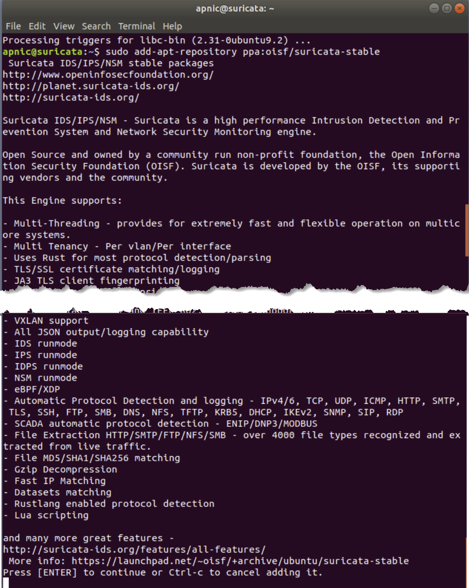

4. Install Suricata. 

		sudo apt-get update
		sudo apt-get install -y suricata
		
	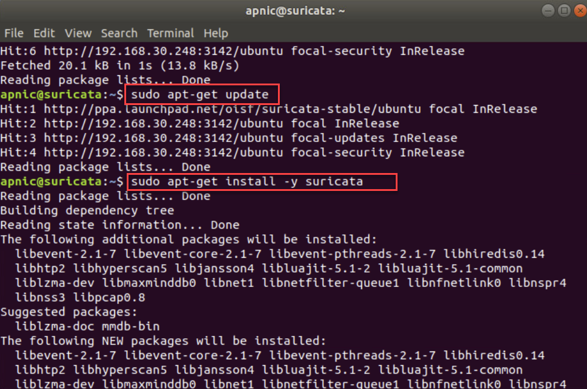
	
5. Install EveBox

		mkdir Downloads
		cd Downloads
		wget https://evebox.org/files/release/0.14.0/evebox_0.14.0_amd64.deb
		sudo dpkg -i evebox_0.14.0_amd64.deb
		
	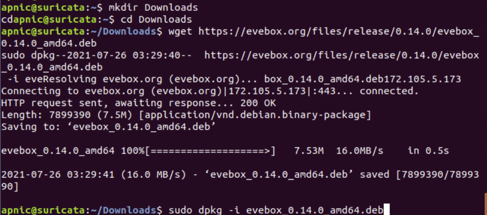
	
	**NOTE**: Refer to the website for the latest version [https://evebox.org/files/release/latest/](https://evebox.org/files/release/latest/)
		
6. Backup the Suricata configuration file.

	```
	sudo cp /etc/suricata/suricata.yaml /etc/suricata/suricata.yaml.bak
	```

7. Update the Suricata signatures/rules used for detection.
	
		sudo suricata-update list-sources
		
	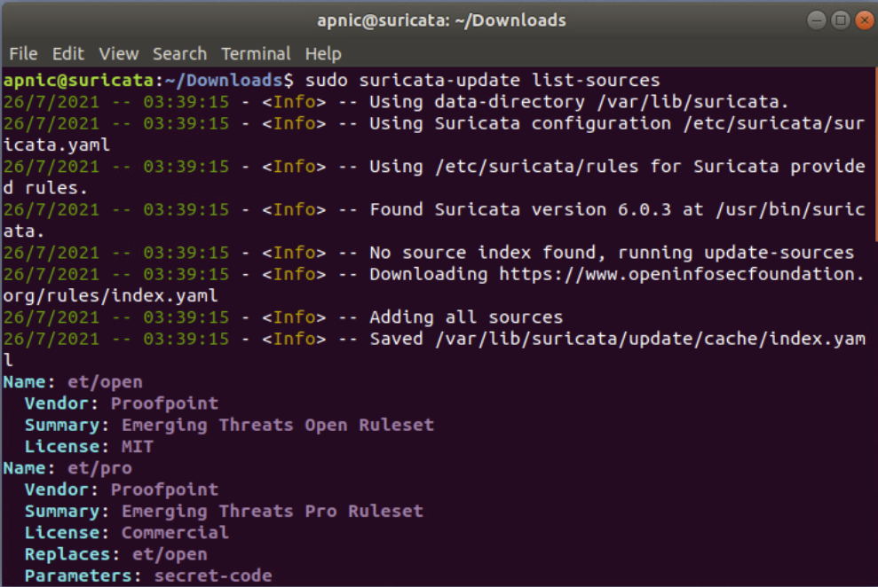

	**NOTE** To see just the name of the listed sources
	
		sudo suricata-update list-sources | grep Name

8. Enable the Suricata rules for identifying and classifying traffic.<br>
   
		sudo suricata-update enable-source oisf/trafficid

9. Enable the Suricata rules for network anomaly detection.

		sudo suricata-update enable-source tgreen/hunting

10. Enable the Suricata SSL Certificate Ruleset to detect and/or block malicious SSL connections based on the SSL certificate fingerprint.

		sudo suricata-update enable-source sslbl/ja3-fingerprints
		
	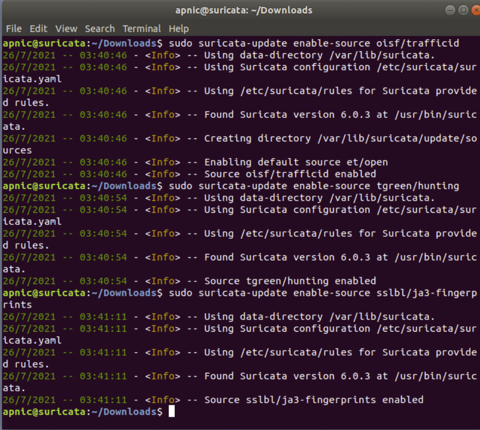

11. List enabled sources for rule updates.

		sudo suricata-update list-enable-sources
		
	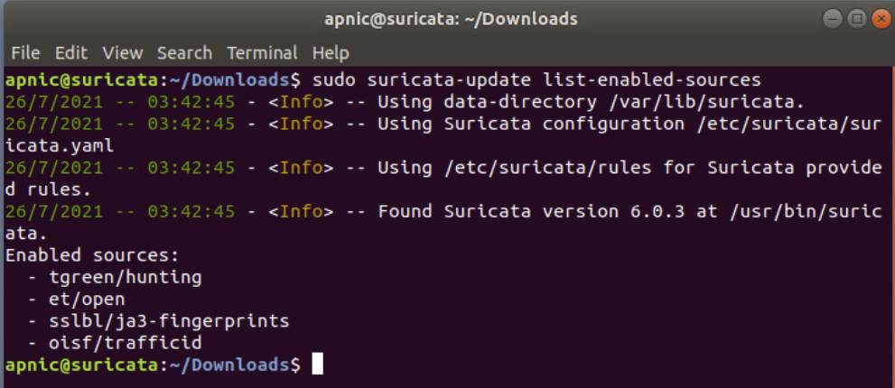 

12. Update the signature/rules.

	```
	sudo suricata-update
	```
	
	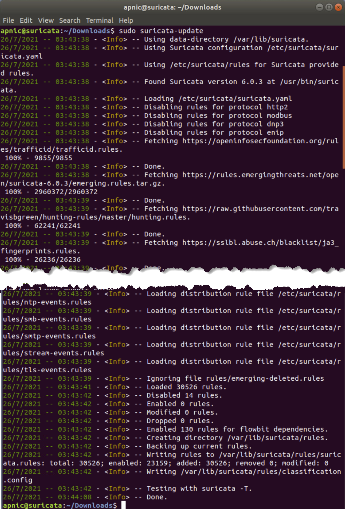

#### Part 2. Review the Suricata configuration

1. To determine the network address used by Suricata, review the variable called **$HOME_NET**	in the **suricata.yaml** file.

		grep -n HOME_NET /etc/suricata/suricata.yaml
		
	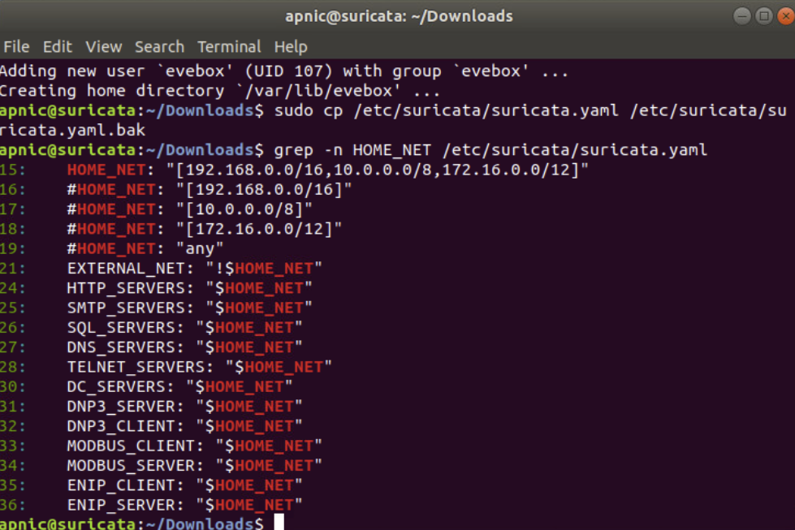
	
2. Review the variable called **default-rule-path** to determine the path where the rules are stored by Suricata.

		grep -A 4 -n 'default-rule-path' /etc/suricata/suricata.yaml

3. Review the variable **af-packet** to determine which interface suricata will listen for traffic.

		grep -A 1 -n 'af-packet' /etc/suricata/suricata.yaml

4. Review the variable **file-store** to see what storage format is used.

		grep -A 2 -n 'file-store' /etc/suricata/suricata.yaml

	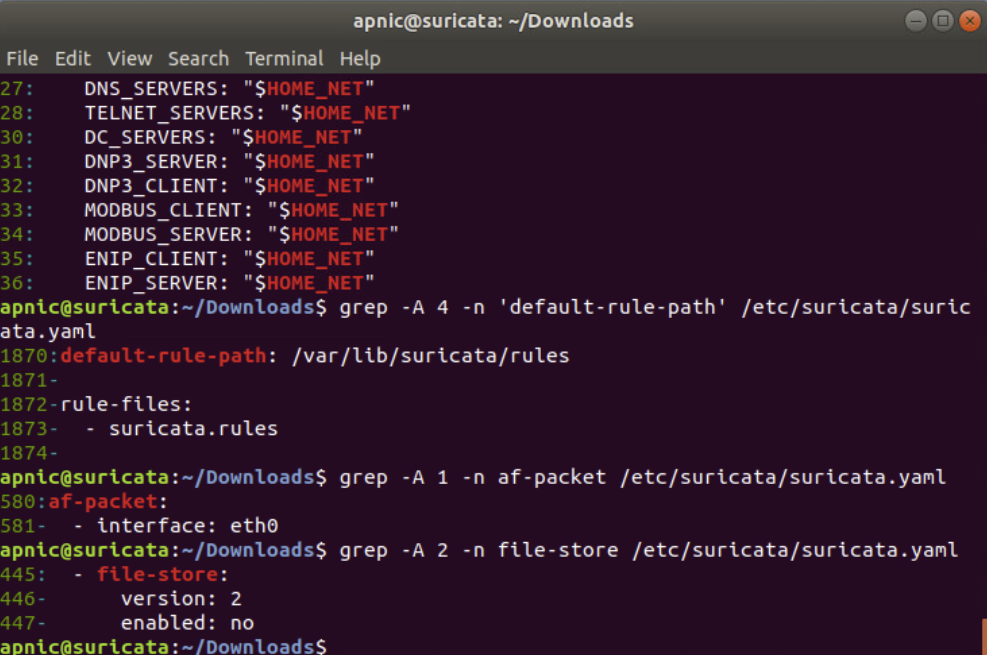

	Refer to the documentation for more detail [https://suricata.readthedocs.io/en/latest/quickstart.html](https://suricata.readthedocs.io/en/latest/quickstart.html)

5. View the downloaded rules.

		sudo ls -lash /var/lib/suricata/rules
		
	Password = `training`
	
6. Display how many rules in the suricata.rules file.

		sudo wc -l /var/lib/suricata/rules/suricata.rules

7. View the first 2 records of the suricata.rules file.

		sudo head -n 2 /var/lib/suricata/rules/suricata.rules
		
	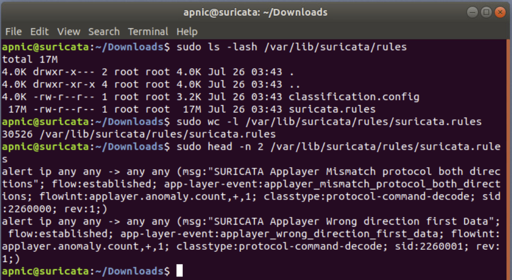
		
8. Count how many rules are for wannacry.

		sudo grep wannacry /var/lib/suricata/rules/suricata.rules | wc -l
		
9. Display the rules for wannacry.

		sudo grep -n wannacry /var/lib/suricata/rules/suricata.rules
		
	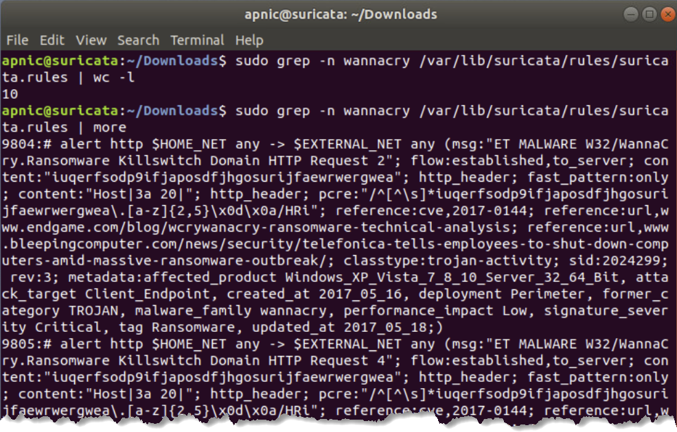

Refer to the online documentation [https://suricata.readthedocs.io/en/suricata-6.0.3/rules/intro.html](https://suricata.readthedocs.io/en/suricata-6.0.3/rules/intro.html)

10. View the classifications for Suricata.

		sudo head -n 2 /var/lib/suricata/rules/classification.config

11. Display how many classifications for Suricata

		sudo wc -l /var/lib/suricata/rules/classification.config

12. Display how many of each severity for the classifications

		sudo cat /var/lib/suricata/rules/classification.config | cut -d "," -f 3 | \
		awk '{$1=$1};1' | sort | uniq -c

	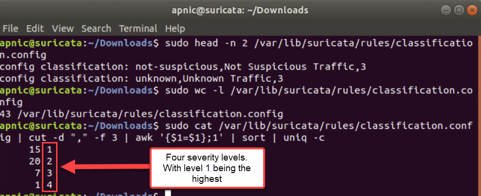

13. Confirm the status of Suricata.

		sudo systemctl status suricata
		
	Password = `training`
	
	**Note**: Press `q` to quit from the status output.
					
***END OF EXERCISE***