# LAB : Packet CAPture (PCAP) Analysis

**Lab Overview**  
In this lab you will be utilising tshark to analyse packet capture (PCAP) files and capture network traffic. Preferably this lab will be done locally on your own machine, but you can access the lab environment during the tutorial.

**Prerequisites**   
Knowledge of Ubuntu, linux commands, and network protocols.

## Lab Tasks
Step 1: Update or install Wireshark software 
Step 2: Use tshark to analyse PCAPs  
Step 3: Use tshark to capture PCAPs  

**Login Details**
 
* Username `apnic` and password `training`.

Login to the server (SSH using the username and password given above), where **Y** is the group number:

	ssh  apnic@192.168.30.Y
	
NOTE: Type `yes` if asked about wanting to continue connecting

Password = `training`

### Part 1. Installation

1. Download the latest version of WireShark.

		https://www.wireshark.org/download.html
			
2. Install WireShark. For Windows or Mac OS, follow the steps in the link: 

	[https://subscription.packtpub.com/book/networking-and-servers/9781788626521/1/ch01lvl1sec9/installation-and-setup](https://subscription.packtpub.com/book/networking-and-servers/9781788626521/1/ch01lvl1sec9/installation-and-setup) 
	
		
3. <b>Optional:</b> How to install WireShark on Ubuntu Linux.

		sudo apt install -y software-properties-common
		sudo add-apt-repository ppa:wireshark-dev/stable
		sudo apt update
		sudo apt install -y wireshark

	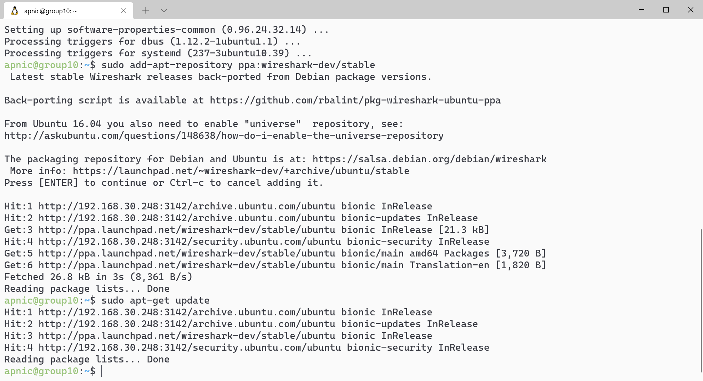  	

	Allow non-superusers to capture packets.

	                 

	Add current user to the WireShark group

		sudo usermod -aG wireshark $(whoami)

	<b>NOTE:</b> Log out and back in to activate the new group membership.

	Confirm the WireShark's version

		wireshark --version

	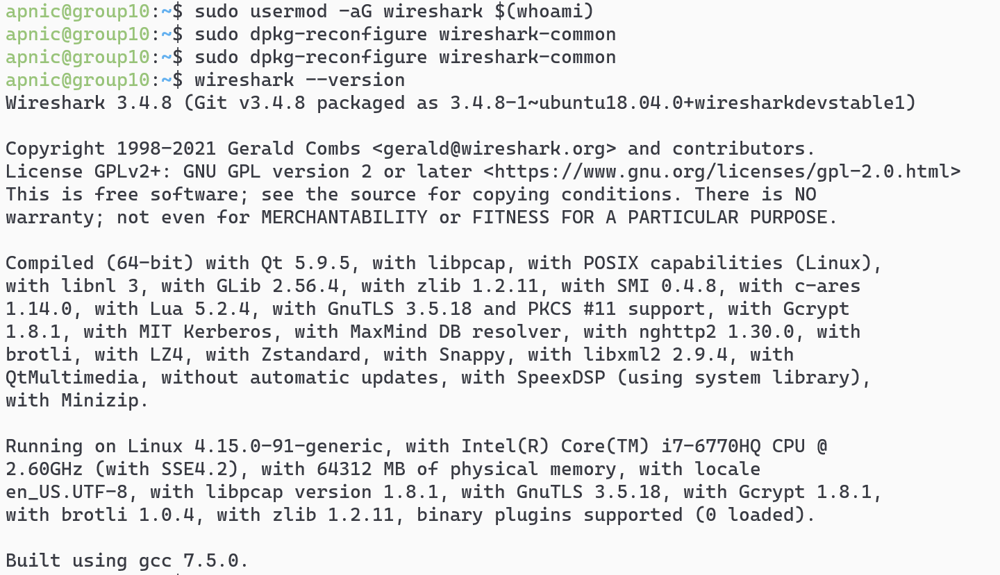

	Install tshark, which is a a terminal version of Wireshark

		sudo apt install -y tshark

#### Part 2. Use tshark to analyse PCAPs

1. Download and extract the exercise pcap files.

		mkdir -p ~/pcaps
		cd ~/pcaps
		wget https://wiki.apnictraining.net/_media/exercise_pcaps.zip
		sudo apt-get install -y unzip
		unzip -j exercise_pcaps.zip
		
	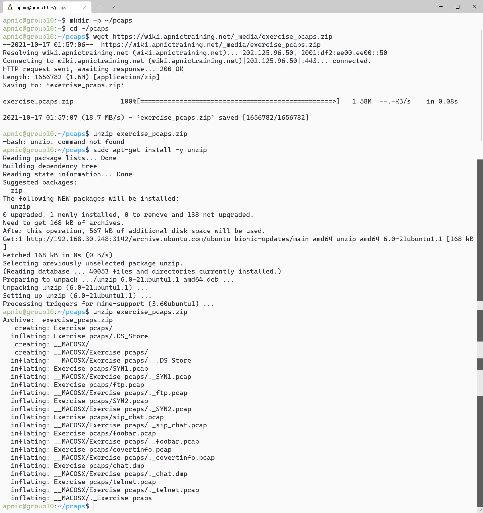
	
2. Review the contents of **telnet.pcap** to determine who logged into 192.168.0.1.

	**Note:** Each command should be on the same line, however because of word wrap, the command may be broken over multiple lines using the `\` (backslash).

	Gather some basic information
	
        tshark -r "telnet.pcap" | head
        tshark -r "telnet.pcap" | wc -l
        tshark -r "telnet.pcap" ip.dst==192.168.0.1 | head
        tshark -r "telnet.pcap" ip.dst==192.168.0.1 | wc -l
        tshark -r telnet.pcap ip.dst==192.168.0.1 and telnet
  
  	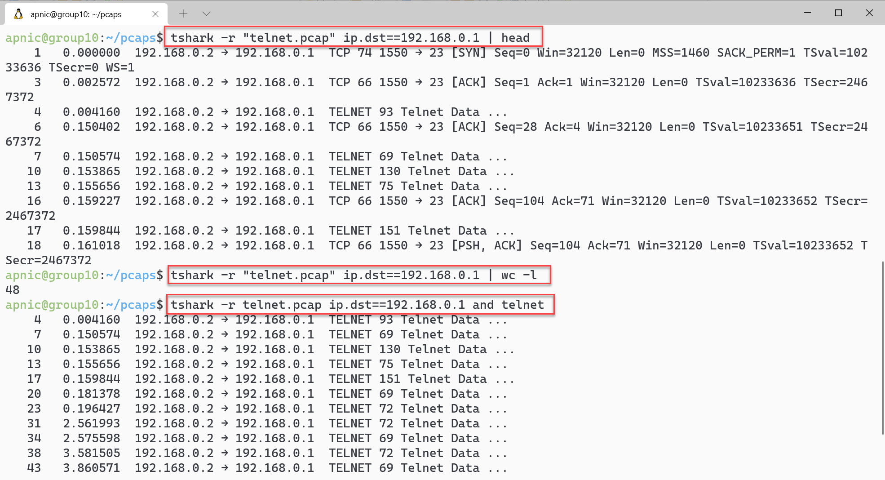
  	
	View the communication between hosts
        
        tshark -r "telnet.pcap" -T fields -e ip.src -e ip.dst | sort | uniq -c
        tshark -r "telnet.pcap" -q -z conv,tcp
        
  	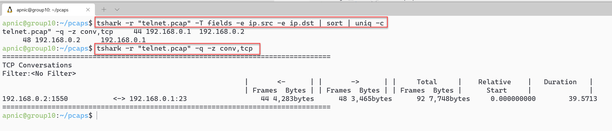        

	Follow the TCP stream
	
        tshark -r "telnet.pcap" -z follow,tcp,ascii,0
        
        # Follow TCP stream, but dont display packets
        tshark -r "telnet.pcap" -qz follow,tcp,ascii,0
        
        # Follow TCP stream, only show Password and Login details
        tshark -r "telnet.pcap" -qz follow,tcp,ascii,0 \
        | grep -Ei -A2 '(^login\:|^pass)'
        
  	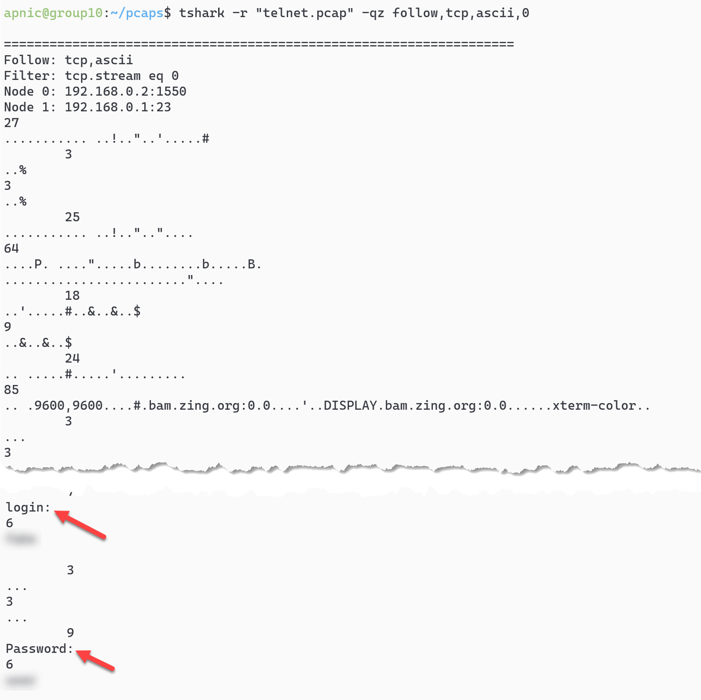        

	<b>Note:</b> Refer to the [manual page for tshark](https://www.wireshark.org/docs/man-pages/tshark.html)

3. Review the contents of **telnet.pcap** to determine what happen after login.

		tshark -r "telnet.pcap" -qz follow,tcp,ascii,0
		tshark -r "telnet.pcap" -qz follow,tcp,ascii,0 | grep -F -A2 '$'
		tshark -r "telnet.pcap" -qz follow,tcp,ascii,0 \
		| awk '/^\$/{print; nr[NR+2]; next}; NR in nr'
		tshark -r "telnet.pcap" -qz follow,tcp,ascii,0 \
		| awk '/^\$/{nr[NR+2]; next}; NR in nr'

4. Review the contents of **covertinfo.pcap** to determine if they are valid icmp packets.

        tshark -r covertinfo.pcap
        # View information about available fields
        tshark -G help
        tshark -G fields | more
        tshark -G fields | grep -i icmp | more

        # A normal icmp packet should be no bigger than 76 bytes. Find any packets with a larger data length
        tshark -r covertinfo.pcap "data.len > 100"

        # View the data in the payload
        tshark -r covertinfo.pcap -T fields -e data

        # But the data is in hex, to view the ASCII 
        tshark -r covertinfo.pcap -x
        tshark -r covertinfo.pcap -T fields -e data | xxd -r -p

5. Review the contents of **ftp.pcap** to determine if there is any suspicious activity.

		tshark -r ftp.pcap | wc -l
		tshark -r ftp.pcap | head
		tshark -r ftp.pcap -T fields -e ip.src -e ip.dst | sort | uniq -c
		tshark -r ftp.pcap -qz conv,tcp | more
		tshark -r ftp.pcap "ftp.response.code==530" | head
		tshark -r ftp.pcap ip.src==10.234.125.254 and ftp.request | head
		tshark -r ftp.pcap | (head -n1 && tail -n1)
		tshark -r ftp.pcap ip.src==10.234.125.254 and ftp.request | grep "USER" 
		tshark -r ftp.pcap ip.src==10.234.125.254 and ftp.request | grep "USER" \
		| (head -n1 && tail -n1)
		tshark -r ftp.pcap ip.src==10.234.125.254 and ftp.request | grep "USER" | wc -l
		tshark -r ftp.pcap ip.src==10.234.125.254 and ftp.request | cut -d ":" -f 2 \
		| grep "USER" | sort | uniq -c
		tshark -r ftp.pcap ip.src==10.234.125.254 and ftp.request | cut -d ":" -f 2 \
		| grep "PASS" | sort | uniq -c
		tshark -r ftp.pcap ip.src==10.234.125.254 and ftp.request | cut -d ":" -f 2 \
		| grep "PASS" | sort | uniq | cut -d " " -f 3
	
6. Review the contents of **chat.dmp** to determine what protocol used and whether the conversation can be viewed.

		tshark -r chat.dmp
		tshark -r chat.dmp | wc -l
		tshark -r chat.dmp -T fields -e frame.protocols | sort | uniq -c
		tshark -r chat.dmp -qz conv,tcp
		tshark -r chat.dmp -Y msnms -T fields -e text
		tshark -r chat.dmp -Y msnms -T fields -e text | grep -i "User\:"
		tshark -r chat.dmp -Y msnms -T fields -e text \
		| grep -i "User\:" | cut -d "," -f 4,5 | \
		cut -d ":" -f 3 | cut -d "\\" -f 1 | sort | uniq
		tshark -r chat.dmp -Y msnms -T fields -e text | grep "Shell"
		tshark -r chat.dmp -Y msnms -T fields -e text | grep "Shell" | cut -d "," -f 7,8

7. Review the contents of **sip_chat.pcap** to determine what protocol used and whether the conversation can be replayed.

		tshark -r sip_chat.pcap -T fields -e frame.protocols | sort | uniq -c
		tshark -r sip_chat.pcap -qz rtp,streams
		tshark -r sip_chat.pcap rtp or sip | head
		tshark -r sip_chat.pcap "sip.CSeq.method eq INVITE"
		tshark -r sip_chat.pcap -qz sip,stat
		tshark -nr sip_chat.pcap -Y rtp -T fields -e rtp.ssrc | sort | uniq -c
		tshark -nr sip_chat.pcap -Y "rtp.ssrc == 0x321efa19" -T fields -e rtp.payload

 	<b>Optional:</b> Try to convert to wav format          

		ssrc=$(tshark -nr sip_chat.pcap -2R rtp -T fields -e rtp.ssrc \
		| sort -u | awk 'FNR ==1 {print}')
		echo $ssrc
		tshark -nr sip_chat.pcap -2R rtp -R "rtp.ssrc == $ssrc" -T fields \
		-e rtp.payload | tee payloads
		tshark -nr sip_chat.pcap -T fields -e rtp.p_type | sort -u
		sudo apt-get install -y sox
		sox -t al -r 8000 -c 1 sip_chat1.raw sip_chat1.wav

	For more detail refer:
	* [How to stream pcap file to RTP/RTCP stream](https://stackoverflow.com/questions/6073868/how-to-stream-pcap-file-to-rtp-rtcp-stream)
	* [SIP + SRTP: Decryption using Tshark, Text2Pcap and Pcap2Wav](https://youtu.be/0LVuJYVjBoE)

	Use a script to convert to wav format

		wget -O pcap2wav.sh https://gist.githubusercontent.com/avimar/d2e9d05e082ce273962d742eb9acac16/raw/a7722d6dbe435f0c694bbcc87c2c2c3ccc04f818/pcap2wav
		cat pcap2wav.sh | more
		chmod +x pcap2wav.sh
		sudo apt-get install -y sox
		./pcap2wav.sh sip_chat.pcap sip_chat.wav

	The play command from the sox package will play any file format supported by sox using the default audio device.

		play sip_chat.wav_mixed.wav

	<b>Note:</b> It will not play on the remote shell. Download the file to attempt to play locally

		scp -o 'ProxyCommand ssh apnic@202.125.97.XX -W %h:%p' apnic@192.168.30.YY:/home/apnic/pcaps/sip*.wav .

	The wav file doesnt play correctly, refer to the WireShark lab guide to be able to play back the conversation.

### Part 2. Use tshark to capture PCAPs
		
1. Install tmux and start split window

		sudo apt-get install -y tmux
		tmux new-session \; split-window -v -p 30 \;
		
	**Note:** Press `ctrl+b` then  (up arrow) to move to the top window
	
	Refer to [https://tmuxcheatsheet.com](https://tmuxcheatsheet.com)
		
2. List the available interfaces in the top window

		tshark -D
		
	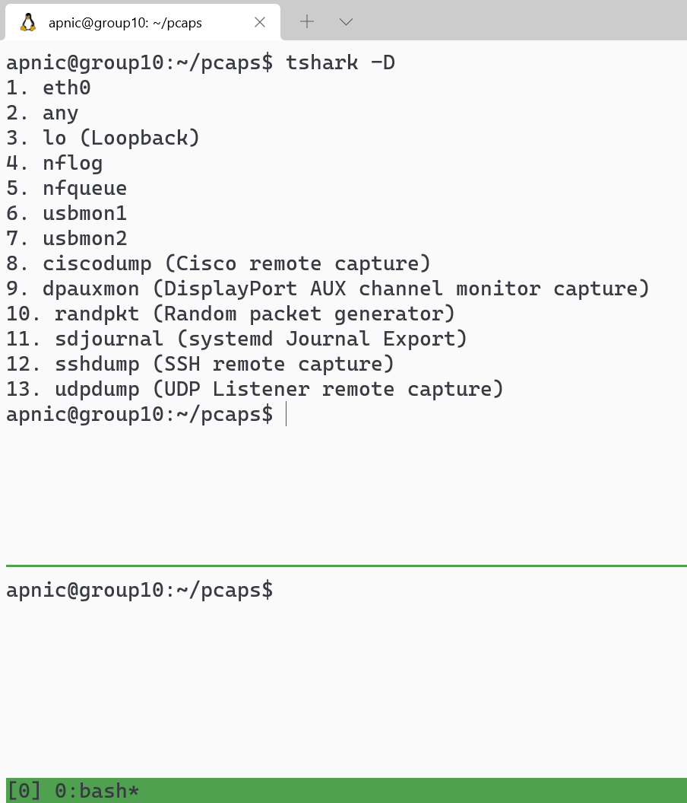
	
3. Capture 10 packets on interface `eth0` using tshark

	Move to the bottom window by pressing `ctrl+b` and  (down arrow). Ping www.google.com to create traffic.
	
		ping www.google.com -c 20
	
	Move to the top window by pressing `ctrl+b` and  (up arrow). Start listening for network traffic on eth0 interface.
	
		tshark -i eth0 -c 10
		
	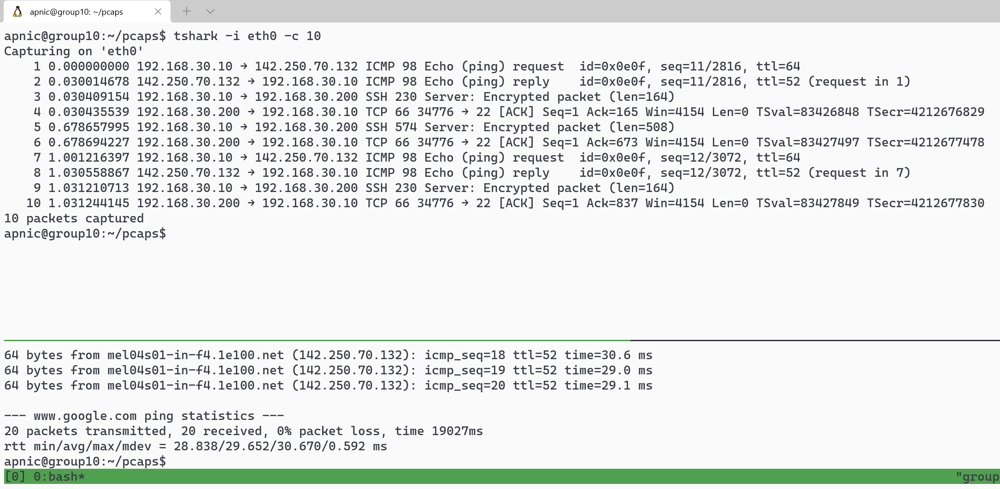
	
	Notice it has captured packets including the icmp, tcp and ssh protocols. 

	**Hint:** To find information about the options use the `--help`.

		tshark --help | grep -E "\-i|\-c|\-f"
		
		# To do an exact match add a space to the start
		tshark --help | grep -E " \-i| \-c| \-f"

	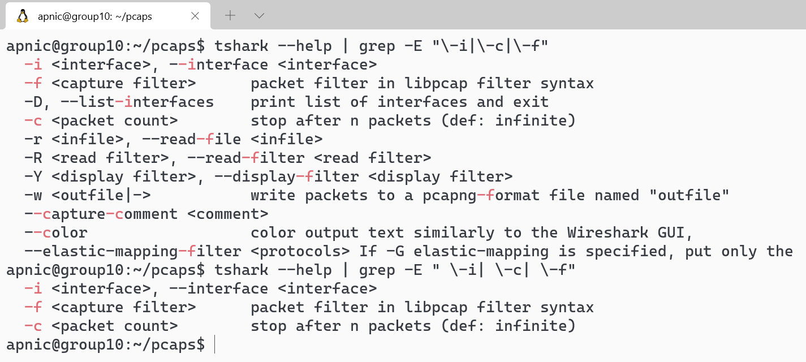

		
4. Capture only specific protocol network packets. For example `icmp`. 

	Capture filters are filters that are applied during data capturing, will make tshark discard network traffic that does not match the filter criteria and avoids the creation of huge capture files. This can be done using the `-f` command-line parameter.

	In the top window, start listening for icmp traffic on eth0 interface.

		tshark -i eth0 -c 10 -f icmp

	**Hint:** If running on a Linux system with gnome desktop, you can add the `--color` options. For example:

		ping 8.8.8.8 -c 4 >/dev/null & tshark --color -c 6 -f icmp

	Move to the bottom window by pressing `ctrl+b` and  (down arrow). Ping www.google.com to create traffic.
	
		ping www.google.com -c 20

	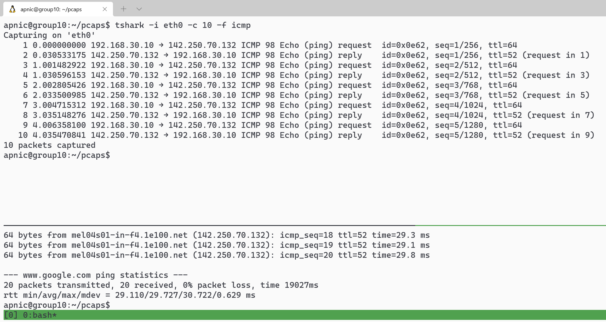

5. Save the network traffic to a file.

	Move to the top window by pressing `ctrl+b` and  (up arrow). Start listening for network traffic on eth0 interface.
	
		tshark -i eth0 -c 10 -f icmp -w ping.pcap

	Move to the bottom window by pressing `ctrl+b` and  (down arrow). Ping www.google.com to create traffic.
	
		ping www.google.com -c 10

	Move to the top window by pressing `ctrl+b` and  (up arrow). Try to view the contents of `ping.pcap`.
	
		head -5 ping.pcap
		file ping.pcap

	PCAP files are not text files, so it is not readable by the linux tools. Try viewing the file using tshark.

		tshark -r ping.pcap | head -2

	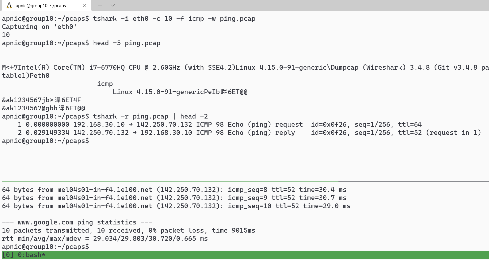		

6. To specify a field, use `-T field` option. Extract the frame number, the relative time of the frame, the source IP address, the destination IP address, the protocol of the packet and the length from the packet capture.

	Move to the top window by pressing `ctrl+b` and  (up arrow). Start listening for network traffic on eth0 interface.
	
		tshark -i eth0 -c 10 -f icmp -T fields -e frame.number -e ip.src -e ip.dst -e frame.len -e ip.len -E header=y

	Move to the bottom window by pressing `ctrl+b` and  (down arrow). Ping www.google.com to create traffic.
	
		ping www.google.com -c 10

	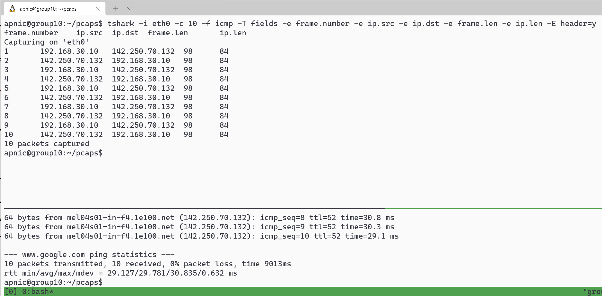	

7. Capture Domain Name System (DNS) protocol network packets.

	In the top window, start listening for dns traffic on eth0 interface.

		tshark -i eth0 -c 6 port 53

	Move to the bottom window by pressing `ctrl+b` and  (down arrow). Ping google.com to create traffic.
	
		ping google.com -c 2

	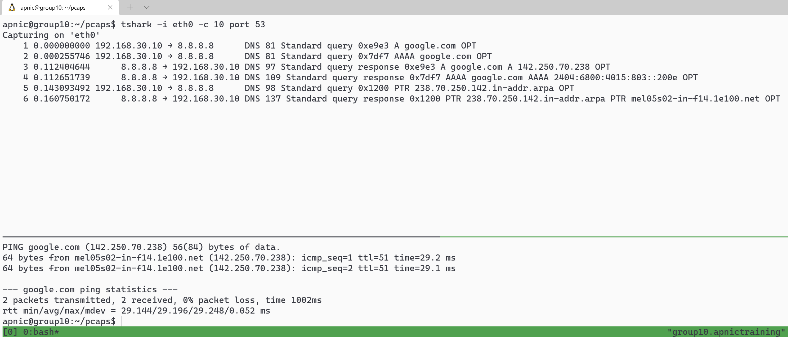

8. View the entire packet.

	In the top window, start listening for icmp traffic on eth0 interface.

		tshark -i eth0 -c 1 -f icmp -V | more

	Move to the bottom window by pressing `ctrl+b` and 	 (down arrow). Ping www.google.com to create traffic.
	
		ping www.google.com -c 1

	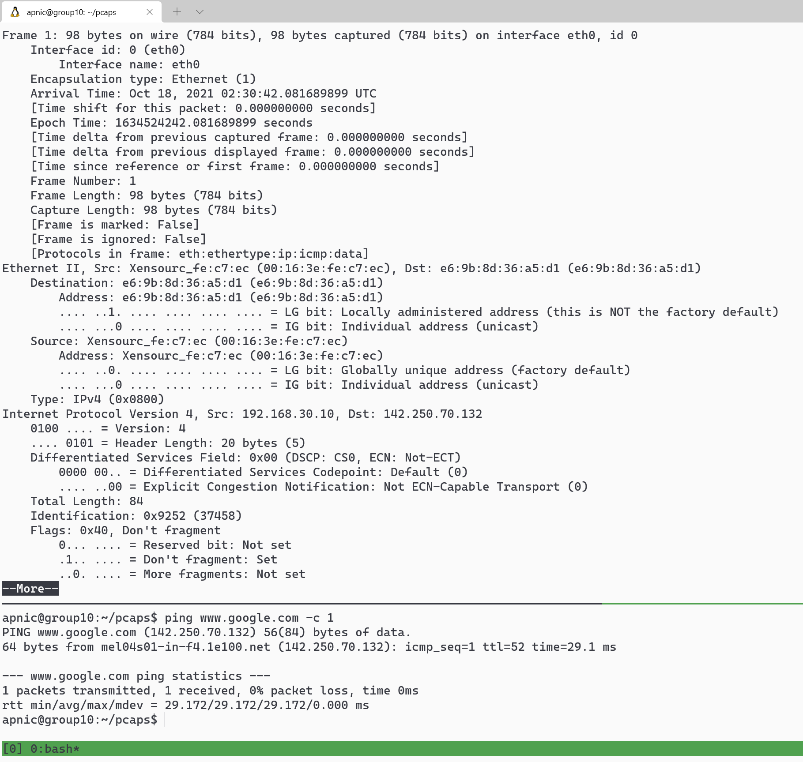

9. Capture HyperText Transfer (HTTP) protocol network packets.

	In the top window, start listening for HTTP traffic on eth0 interface.

		tshark -i eth0 -c 23 port 80

	Move to the bottom window by pressing `ctrl+b` and  (down arrow). Download index page from Apache.org to create traffic.
	
		 wget http://apache.org

	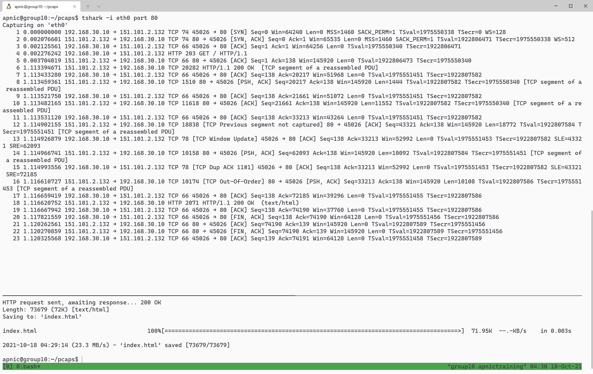	

	Move to the top window by pressing `ctrl+b` and  (up arrow). Start listening for network traffic for 10 seconds on eth0 interface.

		tshark -a duration:10 -i eth0 -Y http

	Move to the bottom window by pressing `ctrl+b` and  (down arrow). Download index page from Apache.org to create traffic.
	
		 wget http://apache.org		

	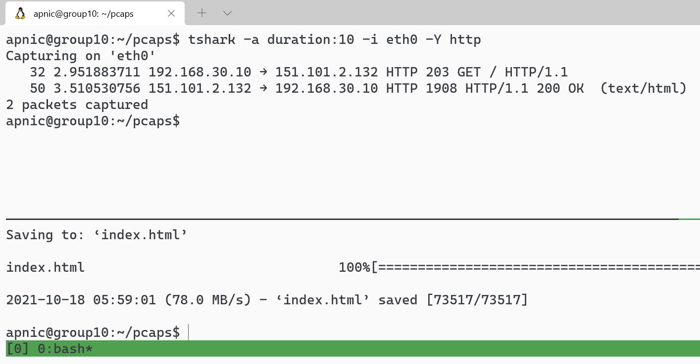			
	
	Move to the top window by pressing `ctrl+b` and  (up arrow). Start listening for network traffic on eth0 interface.

		tshark -i eth0 -Y http.request -T fields -e http.host -e ip.dst -e http.request.full_uri -E header=y

	Move to the bottom window by pressing `ctrl+b` and  (down arrow). Download index page from Apache.org to create traffic.
	
		 wget http://apache.org		

	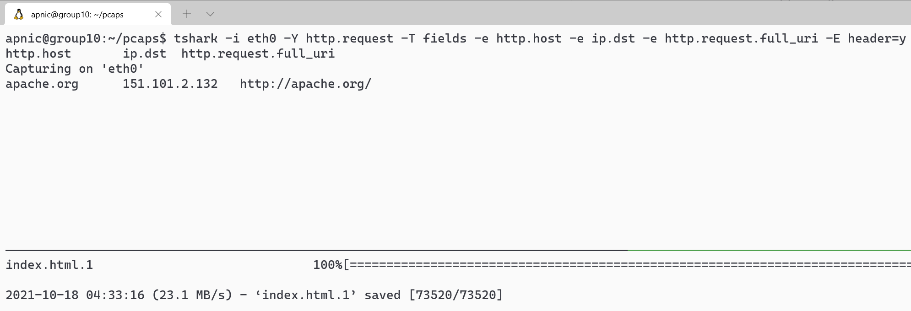			

	**Hint:** To find information about the fields use the `-G` option.

		tshark -G | grep -E "http\.request\."
		tshark -G | grep -E "http\.host"

	Move to the top window by pressing `ctrl+b` and  (up arrow). Start listening for network traffic on eth0 interface.

		tshark -i eth0 -Y http.request -T fields -e http.host -e http.user_agent -E header=y

	Move to the bottom window by pressing `ctrl+b` and  (down arrow). Download index page from Apache.org to create traffic.
	
		 wget http://apache.org		
		 curl http://wiki.apnictraining.net

	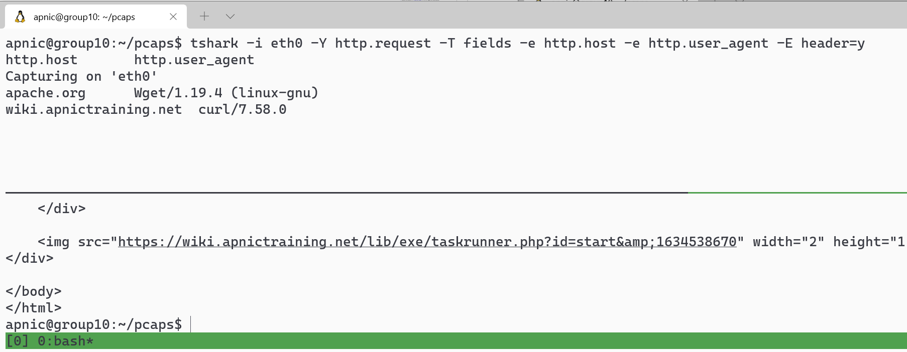				

	To export files use the `--export-objects` option. Move to the top window by pressing `ctrl+b` and  (up arrow). Start listening for network traffic on eth0 interface.

		tshark -a duration:10 -i eth0 -f "port 80" --export-objects http,tmpfolder

	Move to the bottom window by pressing `ctrl+b` and  (down arrow). Download index page from Apache.org to create traffic.
	
		 wget http://apache.org		
		 head -4 tmpfolder/%2f

	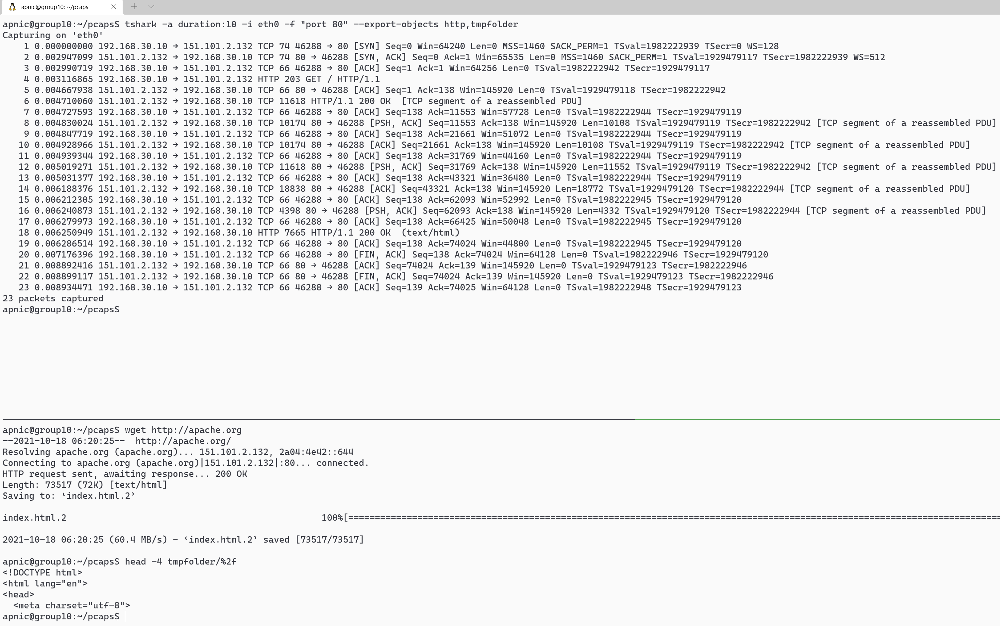		

10. Capture Secure HyperText Transfer (HTTPS) protocol network packets.

	In the top window, start listening for HTTPS traffic on eth0 interface.

		tshark -i eth0 -c 18 port 443

	Move to the bottom window by pressing `ctrl+b` and  (down arrow). Download index page from Apache.org to create traffic.
	
		 wget https://wiki.apnictraining.net

	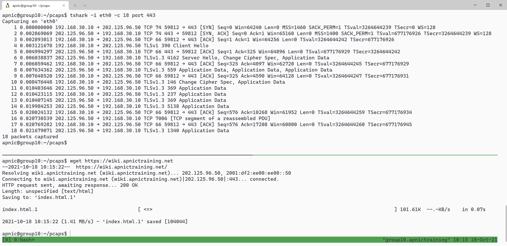		

	Move to the top window by pressing `ctrl+b` and  (up arrow). Type in `exit` and press `enter` to close the top window. Type in `exit` again to close the other tmux session, and return to the normal prompt.
	
	Enable SSL logging to create a file to store the encryption/decryption keys from the client side communication.

		echo "export SSLKEYLOGFILE=~/sslkey.log" >> ~/.bashrc
		source ~/.bashrc
		echo $SSLKEYLOGFILE

	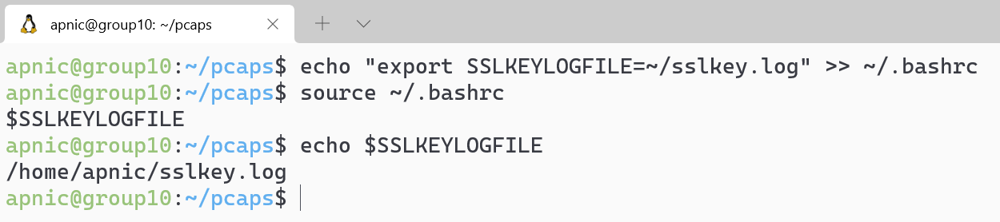			

	Install lynx web browser

		sudo apt-get install -y lynx

	Start listening for network traffic and use lynx to download a file.

		# -Q for suppress output
		tshark -Q -a duration:20 -w https.pcap -f "not port 22" &
		
		# Download file using lynx
		lynx https://wiki.apnictraining.net/_media/evil.sh 

	Answer the prompts. By pressing the following keystrokes:

		#Accept cookies
		y

		#Download file
		d

		# Quit Lynx
		q

		# Confirm exit
		y

	View the sslkey.log file
	
		 head ~/sslkey.log	

	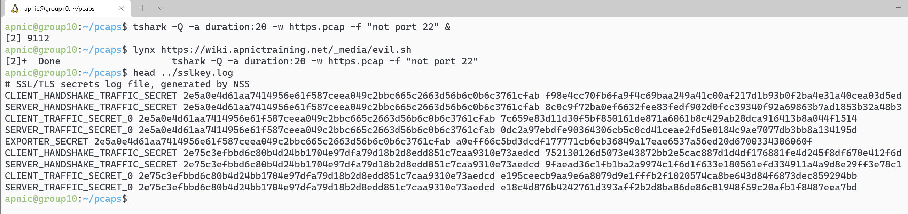		

	View the Protocol Hierarchy Statistics without the tls keys

		tshark -r https.pcap -qz io,phs,tls

	View the Protocol Hierarchy Statistics with the tls keys

		tshark -r https.pcap -qz io,phs,tls -o tls.keylog_file:$SSLKEYLOGFILE

	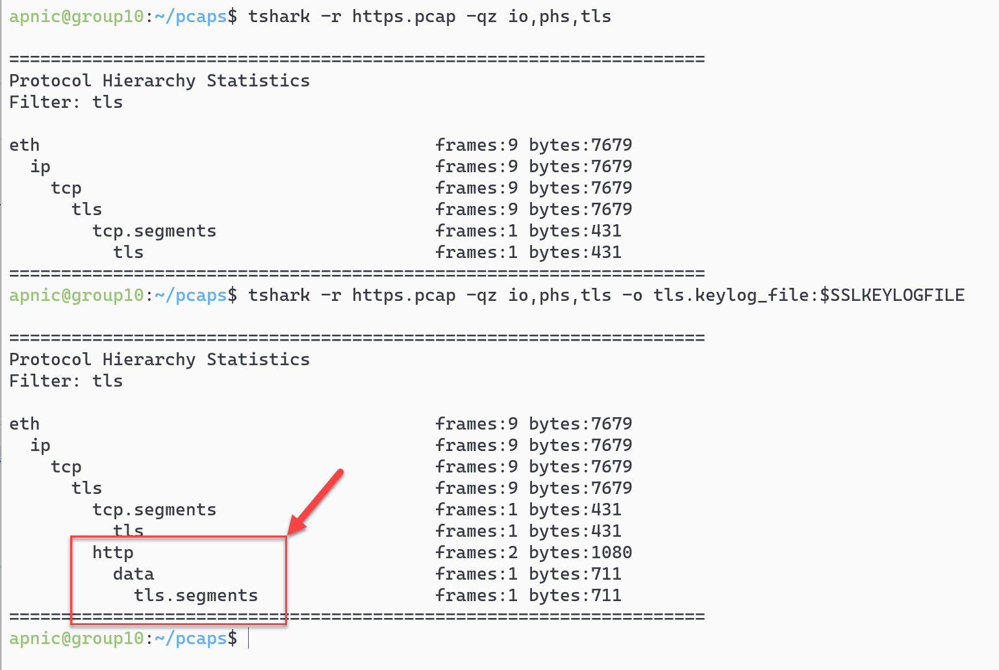		

	**Hint:** Try using `http,tree` instead of `io,phs,tls`

	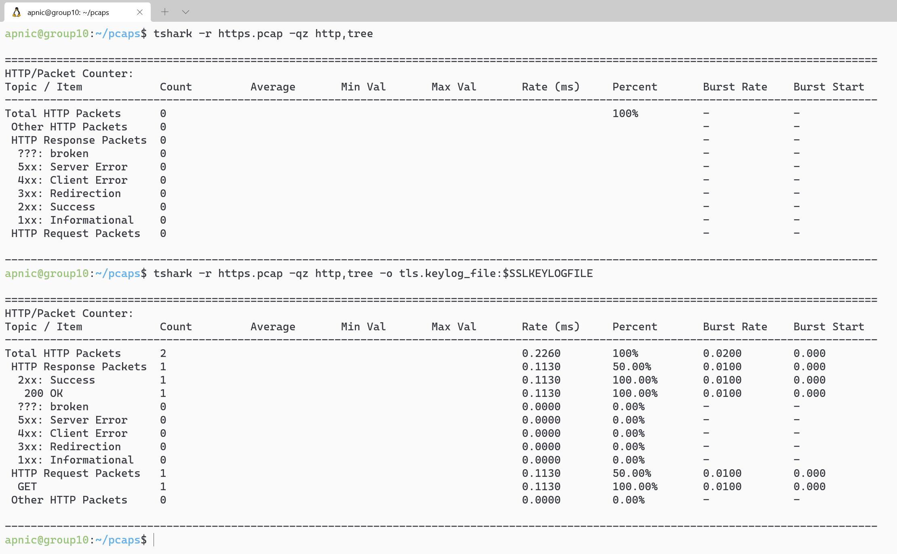			

	View what was requested

		tshark -r https.pcap -o "tls.keylog_file:$SSLKEYLOGFILE" -Y http -T fields -e frame.time -e tcp.stream -e http.request.method -e http.request.uri -e http.response.code	

	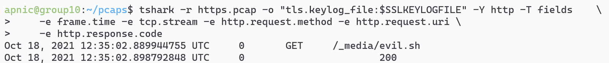			

	Attempt to view the communication without the tls keys

		tshark -r https.pcap -Y tls -z follow,tls,ascii,0

	View the communication with the tls keys

		tshark -r https.pcap -Y tls -z follow,tls,ascii,0 -o tls.keylog_file:$SSLKEYLOGFILE

	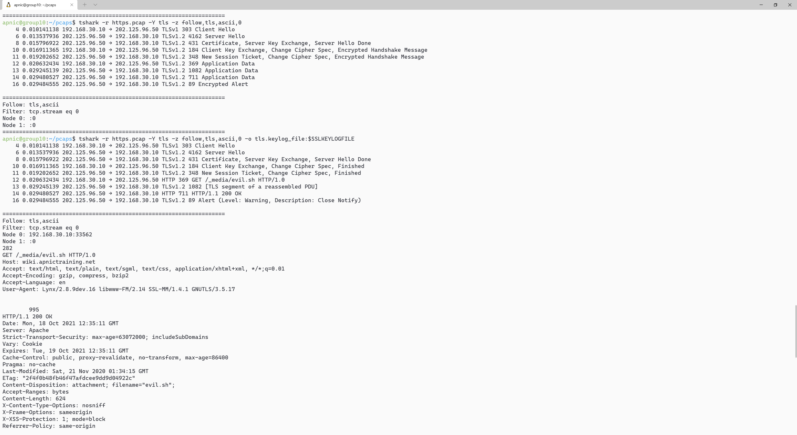			

	Export the encrypted http objects.

		tshark -r https.pcap -Q --export-objects http,export_objects -o tls.keylog_file:$SSLKEYLOGFILE
		ls -lash export_objects/

	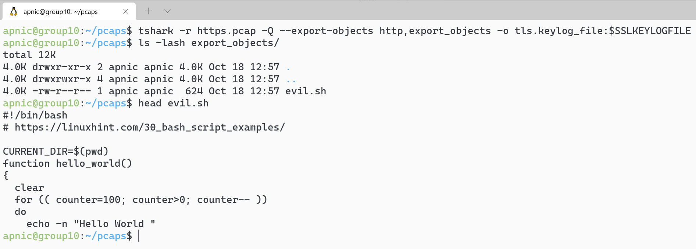			

	Print the X.509 certificate

		tshark -r https.pcap -T fields -R "ssl.handshake.certificate" -e x509sat.printableString -2

		
11. Setup `menushark` and create a capture. Copy the script from [https://gitlab.com/wireshark/wireshark/-/wikis/menushark](https://gitlab.com/wireshark/wireshark/-/wikis/menushark) and paste into a new file.

		nano menushark
		sed -i 's/\/bin\/sh/\bin\/bash/' menushark
		chmod +x menushark
		./menushark

	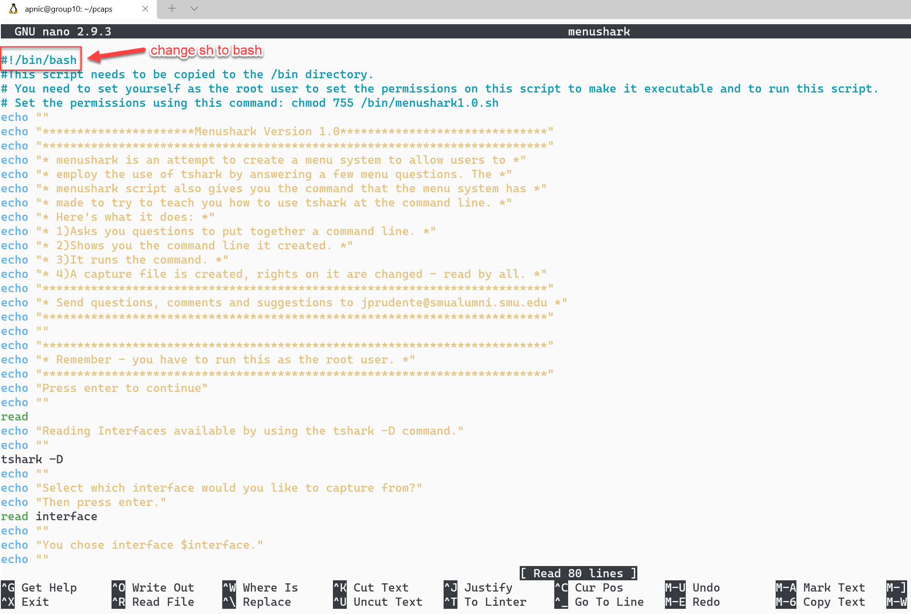	

	**Note:** When the menushark script asks for the pcap filename, use the full path to the file. For example `/home/apnic/pcaps/example.pcap`

12. For intermittent issues, you may need to capture traffic for a specific time before and after the event. To capture TCP traffic continuously use the `-b` option. To capture a rotating set of 5 files each of which will be 1 MB in size, which will be 5 MB in total disk storage. 

		tshark -i eth0 -b filesize:1000 -b files:5 -w continuous.pcap &

		# 100 = 100KB
		# 1000 = 1MB
		# 10000 = 10MB
		# 100000 = 100MB

	**Note:** Depending on network traffic, the duration will be variable. 

	To capture a rotating set of 5 files each of a duration of 1 minute (60 seconds). But the file size will be variable.

		tshark -i eth0 -b duration:60 -b files:5 -w rotate.pcap	&

	Type `pkill tshark` to stop the capture, if running as a background process. Which is what the ampersand (&) means at the end of the command.

Other TShark References:

* [https://hackertarget.com/tshark-tutorial-and-filter-examples/](https://hackertarget.com/tshark-tutorial-and-filter-examples/)
* [https://allabouttesting.org/tshark-basic-tutorial-with-practical-examples/](https://allabouttesting.org/tshark-basic-tutorial-with-practical-examples/)	
* [https://www.hackingarticles.in/beginners-guide-to-tshark-part-1/](https://www.hackingarticles.in/beginners-guide-to-tshark-part-1/)
* [https://iphelix.medium.com/packet-filtering-techniques-84fc3fc2ea3b](https://iphelix.medium.com/packet-filtering-techniques-84fc3fc2ea3b)
* [https://www.activecountermeasures.com/tshark-examples-theory-implementation/](https://www.activecountermeasures.com/tshark-examples-theory-implementation/)
* [https://www.ethicalhacker.net/columns/chappell/tshark-7-tips-on-wiresharks-command-line-packet-capture-tool/](https://www.ethicalhacker.net/columns/chappell/tshark-7-tips-on-wiresharks-command-line-packet-capture-tool/)
* Intro to packet analysis with TShark [https://youtu.be/fu1USvVXQn4](https://youtu.be/fu1USvVXQn4)
* [https://packetlife.net/media/library/13/Wireshark_Display_Filters.pdf](https://packetlife.net/media/library/13/Wireshark_Display_Filters.pdf)

**Hint:** WireShark can be opened using the command line too. Refer to WireShark's dcoumentation 
[https://www.wireshark.org/docs/wsug_html_chunked/ChCustCommandLine.html](https://www.wireshark.org/docs/wsug_html_chunked/ChCustCommandLine.html)

					
***END OF EXERCISE***
