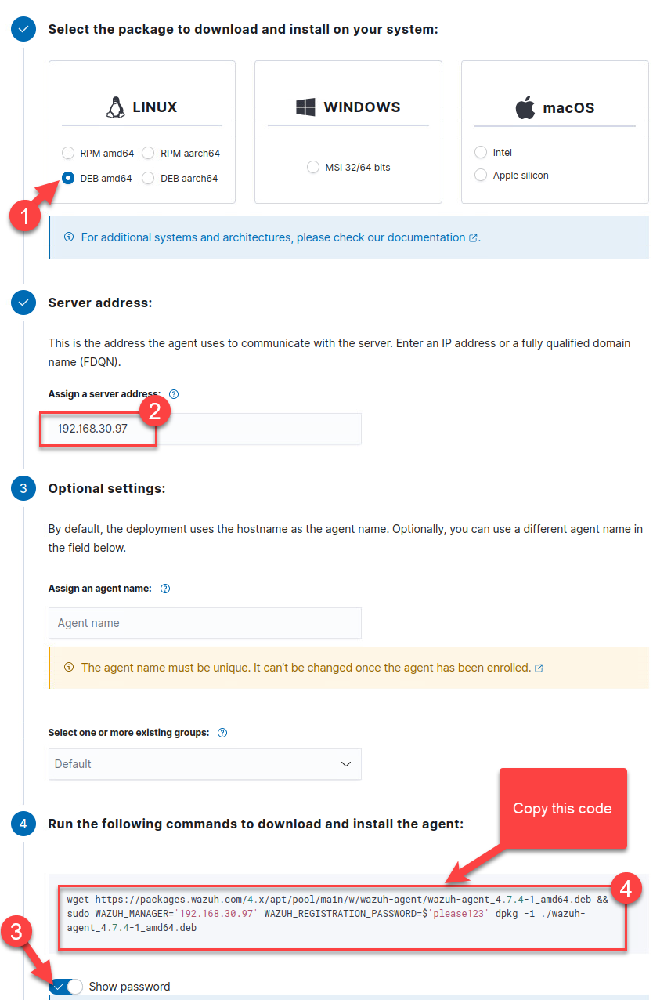

## Lab 2 - Add an Agent ##

In this lab we will add the Wazuh agent on the Ubuntu server (FORT). The server will send alerts to the Wazuh Manager.

The steps to complete this section are:
* Log into the Wazuh Dashboard
* Run the add Agent Wizard
* Log into Client
* Install the Wazuh Agent
* Connect the Wazuh Agent to the Wazuh Manager

### Access the Wazuh Dashboard ###

1. Use Firefox and browse to the Wazuh HTTP server `https://192.168.30.97`

    ```
    https://192.168.30.97
    ```

2. Log into the dashboard using the following credentials:

    * User: `admin`<br>
    * Password: `Training1+`

3. Click on the `Add Agent` hyperlink on the main page, to open the wizard. Or use the following link:

    ```
    https://192.168.30.97/app/wazuh#/agents-preview/
    ```

4. Use the following information to complete the `Deploy new agent` form:

   Package to download: `DEB amd64` <br>
   Server address: `192.168.30.97` <br>
   Leave the `Optional settings` blank <br>
   Display the password

   

   **NOTE:** Copy the code to the clipboard

5. To install the required files open a terminal window and ssh to the server that will be used to install Wazuh Agent.

    ```
    ssh apnic@fort
    ```

    NOTE: Type `yes` if asked about wanting to continue connecting

    Password = `training`


6. Update the software repository.

    ```
    sudo apt-get update 
    ```

    Password = `training`

7. Download, install and connect the Wazuh Agent to the Wazuh Manager.

    ```
    wget https://packages.wazuh.com/4.x/apt/pool/main/w/wazuh-agent/wazuh-agent_4.7.4-1_amd64.deb && sudo WAZUH_MANAGER="192.168.30.97" WAZUH_REGISTRATION_PASSWORD=$"please123" dpkg -i ./wazuh-agent_4.7.4-1_amd64.deb
    ```

    >[!Alert] Make sure to use the correct IP address of the Wazuh Manager.

    View the **authd.pass** file.

    ```
    sudo cat /var/ossec/etc/authd.pass
    ```


8. Enable and start wazuh agent service.

    ```
    sudo systemctl daemon-reload
    sudo systemctl enable wazuh-agent
    ```

9. Start wazuh agent service.

    ```
    sudo systemctl start wazuh-agent
    ```

10. Confirm the status of the agent service.

    ```
    sudo grep status /var/ossec/var/run/wazuh-agentd.state
    ```

    >[!Hint] **Note**: alternatively, you can use run `netstat -nat | grep ESTABLISHED`

11. Go to the Wazuh Dashboard, by returning to FireFox.

12. Refresh the web page that is open in the Firefox browser. It should show 1 Active Agent.

    UserName = `admin`

    Password = `Training1+`

13. Explore the Wazuh Dashboard.

    Go to Wazuh -> Agents (from the menu) you can see details of the agent

    >[!Knowledge] Dicsusson:
    <li>Research how Wazuh works, and describe the backend technology?
    <li>Create a list of advantages and disadvantages for Agentless vs Agent?
    <li>What other alternative software is there for Wazuh?    
