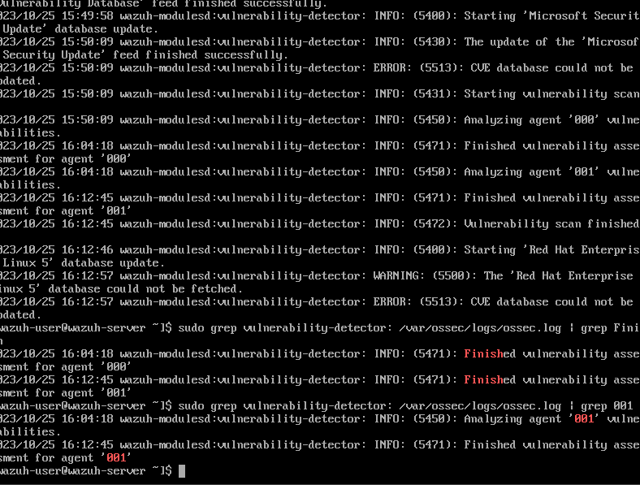
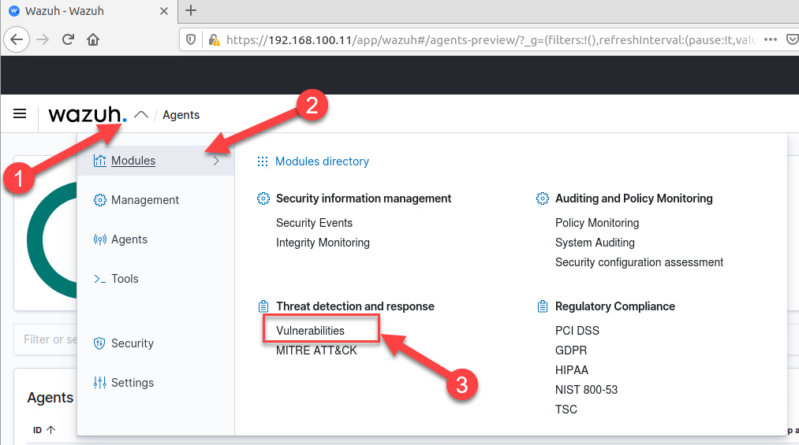
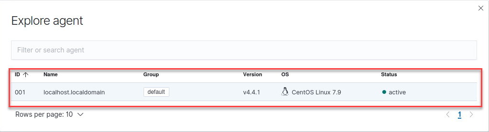
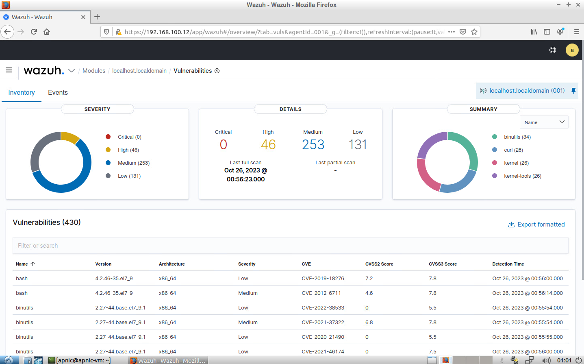

## Lab 5 - Vulnerability Management ##

In this lab, we will setup the client so that Wazuh-manager can assess the systems vulnerability (software wise).

The steps to complete this section are:
* Log into Wazuh Manager 
* Enable Vulnerability Detector
* Review the alerts in Wazuh Manager

1. Open a new terminal window and ssh to the server. Or return to Wazuh Manager server open terminal window. 

    ```
    ssh apnic@192.168.30.97
    ```

    Password = `training`

2. View the supported operating systems for vulnerability detection.

    ```
    sudo grep -in detector -A64 /var/ossec/etc/ossec.conf | grep "vuln"
    ```

    Password = `training`

3. Check if the detecter vulnerabilty scanning is enabled.

    ```
    sudo grep -n detector -A2 /var/ossec/etc/ossec.conf
    ```

4. Enable the detector vulnerabilty scanning.
    
    ```
    sudo sed -i '/<vulnerability\-/{n;s/.*/    \<enabled\>yes\<\/enabled\>/}' /var/ossec/etc/ossec.conf
    ```

5. Confirm the detector vulnerabilty scanning is enabled.

    ```
    sudo grep -n detector -A2 /var/ossec/etc/ossec.conf
    ```

6. Check if Ubuntu OS vulnerabilty scanning is enabled.

    ```
    sudo grep -n Ubuntu -A2 /var/ossec/etc/ossec.conf
    ```

7. Enable the Ubuntu OS vulnerabilty scanning.
    
    ```
    sudo sed -i '/canonical/{n;s/.*/    \<enabled\>yes\<\/enabled\>/}' /var/ossec/etc/ossec.conf
    ```

8. Confirm the RedHat OS vulnerabilty scanning is enabled.

    ```
    sudo grep -n Ubuntu -A2 /var/ossec/etc/ossec.conf
    ```


9. Restart the Wazuh Manger

    ```
    sudo systemctl restart wazuh-manager
    ```

    **HINT:** The vulnerability detector generates logs on the Wazuh Manager and Agent.

10. Confirm the **syscollector** module has started.

    ```
    sudo grep syscollector: /var/ossec/logs/ossec.log
    ```

11. Review the logs for vulnerability detections.

    ```
    sudo grep vulnerability-detector: /var/ossec/logs/ossec.log | more
    ```

    **Hint:** It needs to update the vulnerability database and then finish the scan before it will appear in the dashboard. Repeat this command until it shows "Finish vulnerability assessment ... agent 001: 

    

12. Go to the Wazuh Dashboard, by returning to FireFox.


13. Refresh the web page that is open in the Firefox browser. 

    UserName = `admin`

    Password = `Training1+`

14. Explore the Wazuh Dashboard.

    Go to Wazuh -> Modules -> Threat and Vulnerabilities

       

    Select an Agent.

       

    >[!Alert] It may take some time (approx. 30 minutes) before the vulnerability scan is completed and alerts are created.

    Once completed it should look similar to the following:

       

    ### Dicsusson ###
    <ul>
        <li>Why is vulnerability management important for security monitoring?
        <li>Research what Common Vulnerabilities and Exposures (CVEs) are?
        <li>What impact does Severity have for CVEs?    
    </ul>

    For detail refer to the documentation [https://documentation.wazuh.com/current/user-manual/capabilities/vulnerability-detection/index.html](https://documentation.wazuh.com/current/user-manual/capabilities/vulnerability-detection/index.html)
