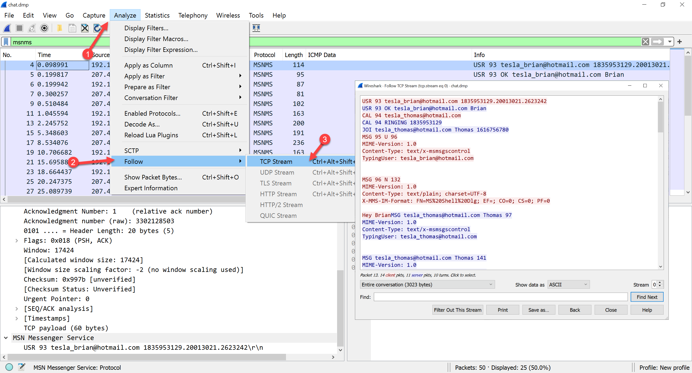

# LAB : Packet CAPture (PCAP) Analysis with WireShark

**Lab Overview**  
In this lab you will be utilising WireShark to analyse packet capture (PCAP) files and capture network traffic. Preferably this lab will be done locally on your own machine.

**Prerequisites**   
Knowledge of Ubuntu, linux commands, and network protocols.

## Lab Tasks
Step 1: Update or install Wireshark software 
Step 2: Use WireShark to analyse PCAPs  
Step 3: Use WireShark to capture PCAPs  

### Part 1. Installation

1. Download the latest version of WireShark.

		https://www.wireshark.org/download.html
			
2. Install WireShark. For Windows or Mac OS, follow the steps in the link: 

	[https://subscription.packtpub.com/book/networking-and-servers/9781788626521/1/ch01lvl1sec9/installation-and-setup](https://subscription.packtpub.com/book/networking-and-servers/9781788626521/1/ch01lvl1sec9/installation-and-setup) 
	
		
3. <b>Optional:</b> How to install WireShark on Ubuntu Linux.

		sudo apt install -y software-properties-common
		sudo add-apt-repository ppa:wireshark-dev/stable
		sudo apt update
		sudo apt install -y wireshark

	  	

	Allow non-superusers to capture packets.

	                 

	Add current user to the WireShark group

		sudo usermod -aG wireshark $(whoami)

	<b>NOTE:</b> Log out and back in to activate the new group membership.

	Confirm the WireShark's version

		wireshark --version

	

	Install tshark, which is a a terminal version of Wireshark

		sudo apt install -y tshark

#### Part 2. Use WireShark to analyse PCAPs

1. Download the PCAP exercise files from https://wiki.apnictraining.net/_media/exercise_pcaps.zip and extract the zip file.

2. Review the contents of **telnet.pcap** to determine who logged into 192.168.0.1. Double-click the **telnet.pcap** file to open in WireShark.

	In the status bar will be details about total packets and displayed packets.
               
  	  

	We are going to change the layout, but to ensure the default profile is not change, create a new profile.

  		

	Change the layout to include the `Packet Diagram` view
  
  	
  	    

	Add a display filter to only display telnet packets related to the IP address `192.168.0.1`. Click in the display filter toolbar and type `ip.dst==192.168.0.1 and telnet` and press enter.  

  	        	

	View the conversations between hosts	

  	  	  

	Follow the TCP stream

  	  	  

	**Note**: The display filter changed to `tcp.stream eq 0`    

	For more detail refer to the [Wiki site for WireShark](https://gitlab.com/wireshark/wireshark/-/wikis/home) or [Capture Passwords using WireShark](https://www.infosecmatter.com/capture-passwords-using-wireshark/)

3. Review the contents of **telnet.pcap** to determine what happen after login.

	View the packets sent from the IP address `192.168.0.2` (client) to `192.168.0.1`

  	

    Try the following display filters:
		
		telnet contains Password
		telnet contains login
		telnet.data and ip.src == 192.168.0.2		  

	Add a column to view the `telnet.data` field after applying the display filter `telnet.data and ip.src == 192.168.0.2`.	  

  		

  			

	**Hint:** The column can be dragged and dropped into position. For more detail about columns refer to 
	[https://blog.packet-foo.com/2018/08/wireshark-column-setup-deepdive/](https://blog.packet-foo.com/2018/08/wireshark-column-setup-deepdive/)

	Remove the display filter by clicking on the X

  		

4. Review the contents of **covertinfo.pcap** to determine if they are valid icmp packets.

    A normal icmp packet should be no bigger than 76 bytes. Find any packets with a larger data length by using a display filter of `data.len > 100`

  		

    Modify the `Telnet Data` column to show the `ICMP data` instead. To do this right mouse click on the **Telnet Data** column and click on edit column. Modify the title and the field `data.data`

  			

	But the data is in hex, to view the ASCII. 

	**Option 1:** Double click on the ICP Data to open the packets detail pane.

  		
	
	**Option 2:** Right mouse click on the ICMP data, click Copy, click `...as Printable Text`. Then paste into notepad or other similar application to view the text.

  	

	**Option 3:** Edit > Preferences > Layout > Pane 3: > check "Packet Bytes"

  	

  	

	Remove the display filter by clicking on the X

5. Review the contents of **ftp.pcap** to determine if there is any suspicious activity.

	View the endpoints

	

	View the conversations

	

	Try the following display filters:
	
		ftp.response.code==530
		ip.src==10.234.125.254 and ftp.request 
		ip.src==10.234.125.254 and ftp.request.command==USER
		ip.src==10.234.125.254 and ftp.request.command==PASS
		frame.number == 1 or frame.number == 19730
		ftp and (frame.number == 4 or frame.number == 16953)
		ip.src==10.234.125.254 and ftp.request and (frame.number == 11 or frame.number == 9862)

	What were the usernames?  
	How many passwords were used?  
	Was type of an attack is this?

	Remove the display filter by clicking on the X
	
6. Review the contents of **chat.dmp** to determine what protocol used and whether the conversation can be viewed.

	View the Protocol Hierarchy

	

	Add a display filter for the MSN Messenger Service protocol

	

	Follow the tcp stream, to view the conversation

		

	What were the email addresses?  
	What was said about the new IT guy?

	Remove the display filter by clicking on the X

7. Review the contents of **sip_chat.pcap** to determine what protocol used and whether the conversation can be replayed.

	View the Protocol Hierarchy

	

	Follow the RTP stream, to listen to the conversation

	

		

		

    Try the following display filters:
		
		rtp or sip
		sip.CSeq.method eq INVITE
		rtp.ssrc == 0x321efa19

	Remove the display filter by clicking on the X	

	**Hint:** Refer to WireShark's man pages on filtering for more examples [https://www.wireshark.org/docs/man-pages/wireshark-filter.html](https://www.wireshark.org/docs/man-pages/wireshark-filter.html)	

### Part 2. Use WireShark to capture PCAPs
		
1. Restart WireShark to view the **Welcome to WireShark** window, where an interface can be selected and filter can be applied.

		
		
	**Hint:** If storage is unlimited, never apply a capture filter as it is used to reduce the size of a raw packet capture and cannot be modified during the capture.
	
	Refer to [https://gitlab.com/wireshark/wireshark/-/wikis/CaptureFilters](https://gitlab.com/wireshark/wireshark/-/wikis/CaptureFilters)

	Try the following display filters:

		icmp
		udp.port==53
		dns or udp.port==53
		http or tcp.port == 80 || udp.port == 80
		http or http2 or http3
		tls or tcp.port==443
		http.request
		http.host
		http.user_agent
		not tcp.port==443 and not arp

	Remove the display filter by clicking on the X			
		
2. View Domain Name System (DNS) protocol network packets.

	To view the dns traffic during a capture. Apply the following display filter `dns or tcp.port==53`

	

	**Hint:** Modify the `ICMP Data` column to show the `DNS Name` instead. To do this right mouse click on the **ICMP Data** column and click on edit column. Modify the title and the field `dns.qry.name`	

	Remove the display filter by clicking on the X		

3. Capture Secure HyperText Transfer (HTTPS) protocol network packets.

	Stop the current capture in WireShark, by clicking on the red square on the toolbar.

	The browser can be made to log the pre-master secret key, which Wireshark uses to decrypt SSL and TLS sessions. The steps required to decrypting SSL and TLS with a pre-master secret key are:
	
	* Set an environment variable
	* Launch the browser
	* Configure Wireshark
	* Capture and decrypt the session keys
	
	To enable SSL logging on windows. Refer to [https://www.comparitech.com/net-admin/decrypt-ssl-with-wireshark/](https://www.comparitech.com/net-admin/decrypt-ssl-with-wireshark/). Open a powershell prompt and type the following:

		cd $HOME\Desktop
		SetX SSLKEYLOGFILE "$(get-location)\sslkey.log"
		Get-ChildItem ENV: | findstr SSLKEYLOGFILE
		rundll32 sysdm.cpl,EditEnvironmentVariables

	

	To enable SSL logging on Linux or Mac environment. Use following commands

		echo "export SSLKEYLOGFILE=~/sslkey.log" >> ~/.bashrc
		source ~/.bashrc
		echo $SSLKEYLOGFILE

	The next time a web browser is opened it should create the file to store the encryption/decryption keys. To add this file to WireShark. Click on Edit > Preferences > Protocols > TLS 

	

	Start to capture traffic, by clicking on the blue shark fin on the toolbar. Open a web browser and download 
	[https://wiki.apnictraining.net/_media/evil.sh](https://wiki.apnictraining.net/_media/evil.sh)

	Stop the current capture in WireShark, by clicking on the red square on the toolbar.

	Add a display filter to display TLS packets related to the IP address `202.125.96.50`. Click in the display filter toolbar and type `ip.addr==202.125.96.50 and tls` and press enter.  

		

	View the Protocol Hierarchy Statistics with the tls keys

				

	View the communication with the tls keys

				

	Export the encrypted http objects.

				

	View the X.509 certificate, by adding a display filter `tls.handshake.certificate and x509ce.dNSName == wiki.apnictraining.net`

		

	**Hint:** Modify the `DNS Name` column to show the `x509sat.printableString` instead. To do this right mouse click on the **DNS Name** column and click on edit column. Modify the title and the field `x509sat.printableString`	

		

	Remove the display filter by clicking on the X	

4. For intermittent issues, you may need to capture traffic for a specific time before and after the event. To capture TCP traffic continuously use the capture options. The example below captures a rotating set of 5 files each of which will be 1 MB in size, which will be 5 MB in total disk storage. 

		

**Hint:** WireShark can be opened using the command line too. Refer to WireShark's dcoumentation 
[https://www.wireshark.org/docs/wsug_html_chunked/ChCustCommandLine.html](https://www.wireshark.org/docs/wsug_html_chunked/ChCustCommandLine.html)

					
***END OF EXERCISE***